# Assembly activity/state documentation

## Diagram
```mermaid
stateDiagram-v2
    state "try_place_building" as buildings_try_place_building
    state "@tp_sel_ok" as buildings__tp_sel_ok
    state "@tp_check_same" as buildings__tp_check_same
    state "@tp_not_water" as buildings__tp_not_water
    state "@tp_not_bridge" as buildings__tp_not_bridge
    state "@tp_upgrade_density" as buildings__tp_upgrade_density
    state "@tp_check_cost" as buildings__tp_check_cost
    state "@tp_cost_bridge" as buildings__tp_cost_bridge
    state "@tp_cost_ready" as buildings__tp_cost_ready
    state "@tp_cant_build" as buildings__tp_cant_build
    state "@tp_max_density" as buildings__tp_max_density
    state "@tp_afford" as buildings__tp_afford
    state "@tp_new_bridge" as buildings__tp_new_bridge
    state "@tp_new_tile" as buildings__tp_new_tile
    state "@tp_place_new" as buildings__tp_place_new
    state "@tp_make_upgrade" as buildings__tp_make_upgrade
    state "@tp_place_tile" as buildings__tp_place_tile
    state "@tp_msg_upgraded" as buildings__tp_msg_upgraded
    state "@tp_show_msg" as buildings__tp_show_msg
    state "try_demolish" as buildings_try_demolish
    state "@td_do_it" as buildings__td_do_it
    state "@td_clear_tile" as buildings__td_clear_tile
    state "@td_clear_empty" as buildings__td_clear_empty
    state "@td_store_clear" as buildings__td_store_clear
    state "@td_place" as buildings__td_place
    state "@td_msg_demo" as buildings__td_msg_demo
    state "@td_show_msg" as buildings__td_show_msg
    state "place_tile_at" as buildings_place_tile_at
    state "@pta_old_road" as buildings__pta_old_road
    state "@pta_old_done" as buildings__pta_old_done
    state "@pta_new_road" as buildings__pta_new_road
    state "@pta_compare" as buildings__pta_compare
    state "@pta_topology_changed" as buildings__pta_topology_changed
    state "@pta_write" as buildings__pta_write
    state "@pta_update_one" as buildings__pta_update_one
    state "@pta_done" as buildings__pta_done
    state "get_tile_density_units" as buildings_get_tile_density_units
    state "increment_count" as buildings_increment_count
    state "@inc_road" as buildings__inc_road
    state "@inc_store_road" as buildings__inc_store_road
    state "@inc1" as buildings__inc1
    state "@inc_store_house" as buildings__inc_store_house
    state "@inc2" as buildings__inc2
    state "@inc_store_factory" as buildings__inc_store_factory
    state "@inc3" as buildings__inc3
    state "@inc_store_park" as buildings__inc_store_park
    state "@inc4" as buildings__inc4
    state "@inc_store_power" as buildings__inc_store_power
    state "@inc5" as buildings__inc5
    state "@inc_store_police" as buildings__inc_store_police
    state "@inc6" as buildings__inc6
    state "@inc_store_fire" as buildings__inc_store_fire
    state "@inc_done" as buildings__inc_done
    state "decrement_count" as buildings_decrement_count
    state "@dec_road" as buildings__dec_road
    state "@dec_store_road" as buildings__dec_store_road
    state "@dec1" as buildings__dec1
    state "@dec_store_house" as buildings__dec_store_house
    state "@dec2" as buildings__dec2
    state "@dec_store_factory" as buildings__dec_store_factory
    state "@dec3" as buildings__dec3
    state "@dec_store_park" as buildings__dec_store_park
    state "@dec4" as buildings__dec4
    state "@dec_store_power" as buildings__dec_store_power
    state "@dec5" as buildings__dec5
    state "@dec_store_police" as buildings__dec_store_police
    state "@dec6" as buildings__dec6
    state "@dec_store_fire" as buildings__dec_store_fire
    state "@dec_done" as buildings__dec_done
    state "show_building_name" as buildings_show_building_name
    state "@sbn_done" as buildings__sbn_done

    [*] --> buildings_try_place_building
    buildings_try_place_building --> buildings__tp_sel_ok : Branch BNE
    buildings__tp_sel_ok --> map_get_tile : Call get_tile
    buildings__tp_sel_ok --> buildings__tp_check_same : Branch BNE
    buildings__tp_sel_ok --> buildings__tp_upgrade_density : Branch BEQ
    buildings__tp_sel_ok --> buildings__tp_check_same : fallthrough
    buildings__tp_check_same --> buildings__tp_upgrade_density : Branch BEQ
    buildings__tp_check_same --> buildings__tp_not_water : Branch BNE
    buildings__tp_check_same --> buildings__tp_cant_build : Branch BNE
    buildings__tp_check_same --> buildings__tp_check_cost : Jmp JMP
    buildings__tp_check_same --> buildings__tp_not_water : fallthrough
    buildings__tp_not_water --> buildings__tp_not_bridge : Branch BNE
    buildings__tp_not_water --> buildings__tp_cant_build : Branch BNE
    buildings__tp_not_water --> buildings__tp_check_cost : Jmp JMP
    buildings__tp_not_water --> buildings__tp_not_bridge : fallthrough
    buildings__tp_not_bridge --> buildings__tp_cant_build : Branch BEQ
    buildings__tp_not_bridge --> buildings__tp_upgrade_density : fallthrough
    buildings__tp_upgrade_density --> buildings__tp_max_density : Branch BEQ
    buildings__tp_upgrade_density --> buildings__tp_check_cost : fallthrough
    buildings__tp_check_cost --> buildings__tp_cost_ready : Branch BNE
    buildings__tp_check_cost --> buildings__tp_cost_bridge : Branch BEQ
    buildings__tp_check_cost --> buildings__tp_cost_ready : Branch BNE
    buildings__tp_check_cost --> buildings__tp_cost_bridge : fallthrough
    buildings__tp_cost_bridge --> buildings__tp_cost_ready : fallthrough
    buildings__tp_cost_ready --> buildings__tp_afford : Branch BPL
    buildings__tp_cost_ready --> ui_print_str_col : Call print_str_col
    buildings__tp_cant_build --> ui_print_str_col : Call print_str_col
    buildings__tp_max_density --> ui_print_str_col : Call print_str_col
    buildings__tp_afford --> buildings__tp_make_upgrade : Branch BEQ
    buildings__tp_afford --> buildings__tp_new_tile : Branch BNE
    buildings__tp_afford --> buildings__tp_new_bridge : Branch BEQ
    buildings__tp_afford --> buildings__tp_new_tile : Branch BNE
    buildings__tp_afford --> buildings__tp_new_bridge : fallthrough
    buildings__tp_new_bridge --> buildings__tp_place_new : Branch BNE
    buildings__tp_new_bridge --> buildings__tp_new_tile : fallthrough
    buildings__tp_new_tile --> buildings__tp_place_new : fallthrough
    buildings__tp_place_new --> buildings__tp_place_tile : Branch BNE
    buildings__tp_place_new --> buildings__tp_make_upgrade : fallthrough
    buildings__tp_make_upgrade --> buildings__tp_place_tile : fallthrough
    buildings__tp_place_tile --> buildings_place_tile_at : Call place_tile_at
    buildings__tp_place_tile --> buildings__tp_msg_upgraded : Branch BNE
    buildings__tp_place_tile --> buildings__tp_show_msg : Branch BNE
    buildings__tp_place_tile --> buildings__tp_msg_upgraded : fallthrough
    buildings__tp_msg_upgraded --> buildings__tp_show_msg : fallthrough
    buildings__tp_show_msg --> ui_print_str_col : Call print_str_col
    buildings_try_demolish --> map_get_tile : Call get_tile
    buildings_try_demolish --> buildings__td_do_it : Branch BNE
    buildings__td_do_it --> buildings__td_clear_tile : Branch BCC
    buildings__td_do_it --> buildings__td_clear_tile : Branch BCS
    buildings__td_do_it --> buildings__td_clear_tile : Branch BEQ
    buildings__td_do_it --> buildings__td_place : Branch BNE
    buildings__td_do_it --> buildings__td_clear_tile : fallthrough
    buildings__td_clear_tile --> buildings__td_clear_empty : Branch BNE
    buildings__td_clear_tile --> buildings__td_store_clear : Branch BNE
    buildings__td_clear_tile --> buildings__td_clear_empty : fallthrough
    buildings__td_clear_empty --> buildings__td_store_clear : fallthrough
    buildings__td_store_clear --> buildings__td_place : fallthrough
    buildings__td_place --> buildings_place_tile_at : Call place_tile_at
    buildings__td_place --> buildings__td_msg_demo : Branch BEQ
    buildings__td_place --> buildings__td_show_msg : Branch BNE
    buildings__td_place --> buildings__td_msg_demo : fallthrough
    buildings__td_msg_demo --> buildings__td_show_msg : fallthrough
    buildings__td_show_msg --> ui_print_str_col : Call print_str_col
    buildings_place_tile_at --> map_get_tile : Call get_tile
    buildings_place_tile_at --> buildings_decrement_count : Call decrement_count
    buildings_place_tile_at --> buildings__pta_old_road : Branch BEQ
    buildings_place_tile_at --> buildings__pta_old_done : Branch BNE
    buildings_place_tile_at --> buildings__pta_old_road : fallthrough
    buildings__pta_old_road --> buildings__pta_old_done : fallthrough
    buildings__pta_old_done --> buildings__pta_new_road : Branch BEQ
    buildings__pta_old_done --> buildings__pta_compare : Branch BNE
    buildings__pta_old_done --> buildings__pta_new_road : fallthrough
    buildings__pta_new_road --> buildings__pta_compare : fallthrough
    buildings__pta_compare --> buildings__pta_topology_changed : Branch BNE
    buildings__pta_compare --> buildings__pta_write : Branch BEQ
    buildings__pta_compare --> buildings__pta_topology_changed : fallthrough
    buildings__pta_topology_changed --> buildings__pta_write : fallthrough
    buildings__pta_write --> map_set_tile : Call set_tile
    buildings__pta_write --> buildings_increment_count : Call increment_count
    buildings__pta_write --> map_render_road_neighborhood : Call render_road_neighborhood
    buildings__pta_write --> buildings__pta_update_one : Branch BEQ
    buildings__pta_write --> simulation_rebuild_road_segments : Call rebuild_road_segments
    buildings__pta_write --> buildings__pta_done : Jmp JMP
    buildings__pta_write --> buildings__pta_update_one : fallthrough
    buildings__pta_update_one --> simulation_update_building_segment_at : Call update_building_segment_at
    buildings__pta_update_one --> buildings__pta_done : fallthrough
    buildings_increment_count --> buildings_get_tile_density_units : Call get_tile_density_units
    buildings_increment_count --> buildings__inc_road : Branch BEQ
    buildings_increment_count --> buildings__inc1 : Branch BNE
    buildings_increment_count --> buildings__inc_road : fallthrough
    buildings__inc_road --> buildings__inc_store_road : Branch BCC
    buildings__inc_road --> buildings__inc_store_road : fallthrough
    buildings__inc1 --> buildings__inc2 : Branch BNE
    buildings__inc1 --> buildings__inc_store_house : Branch BCC
    buildings__inc1 --> buildings__inc_store_house : fallthrough
    buildings__inc2 --> buildings__inc3 : Branch BNE
    buildings__inc2 --> buildings__inc_store_factory : Branch BCC
    buildings__inc2 --> buildings__inc_store_factory : fallthrough
    buildings__inc3 --> buildings__inc4 : Branch BNE
    buildings__inc3 --> buildings__inc_store_park : Branch BCC
    buildings__inc3 --> buildings__inc_store_park : fallthrough
    buildings__inc4 --> buildings__inc5 : Branch BNE
    buildings__inc4 --> buildings__inc_store_power : Branch BCC
    buildings__inc4 --> buildings__inc_store_power : fallthrough
    buildings__inc5 --> buildings__inc6 : Branch BNE
    buildings__inc5 --> buildings__inc_store_police : Branch BCC
    buildings__inc5 --> buildings__inc_store_police : fallthrough
    buildings__inc6 --> buildings__inc_done : Branch BNE
    buildings__inc6 --> buildings__inc_store_fire : Branch BCC
    buildings__inc6 --> buildings__inc_store_fire : fallthrough
    buildings__inc_store_fire --> buildings__inc_done : fallthrough
    buildings_decrement_count --> buildings_get_tile_density_units : Call get_tile_density_units
    buildings_decrement_count --> buildings__dec_road : Branch BEQ
    buildings_decrement_count --> buildings__dec1 : Branch BNE
    buildings_decrement_count --> buildings__dec_road : fallthrough
    buildings__dec_road --> buildings__dec_store_road : Branch BCS
    buildings__dec_road --> buildings__dec_store_road : fallthrough
    buildings__dec1 --> buildings__dec2 : Branch BNE
    buildings__dec1 --> buildings__dec_store_house : Branch BCS
    buildings__dec1 --> buildings__dec_store_house : fallthrough
    buildings__dec2 --> buildings__dec3 : Branch BNE
    buildings__dec2 --> buildings__dec_store_factory : Branch BCS
    buildings__dec2 --> buildings__dec_store_factory : fallthrough
    buildings__dec3 --> buildings__dec4 : Branch BNE
    buildings__dec3 --> buildings__dec_store_park : Branch BCS
    buildings__dec3 --> buildings__dec_store_park : fallthrough
    buildings__dec4 --> buildings__dec5 : Branch BNE
    buildings__dec4 --> buildings__dec_store_power : Branch BCS
    buildings__dec4 --> buildings__dec_store_power : fallthrough
    buildings__dec5 --> buildings__dec6 : Branch BNE
    buildings__dec5 --> buildings__dec_store_police : Branch BCS
    buildings__dec5 --> buildings__dec_store_police : fallthrough
    buildings__dec6 --> buildings__dec_done : Branch BNE
    buildings__dec6 --> buildings__dec_store_fire : Branch BCS
    buildings__dec6 --> buildings__dec_store_fire : fallthrough
    buildings__dec_store_fire --> buildings__dec_done : fallthrough
    buildings_show_building_name --> buildings__sbn_done : Branch BEQ
    buildings_show_building_name --> buildings__sbn_done : Branch BCS
    buildings_show_building_name --> ui_print_str_col : Call print_str_col
    buildings_show_building_name --> buildings__sbn_done : fallthrough
```

## Rendered Mermaid diagram


## State and transition documentation

### State: try_place_building
- Mermaid state id: `buildings_try_place_building`
- Assembly body:
```asm
lda sel_building
bne @tp_sel_ok
rts
```
- Mermaid state:
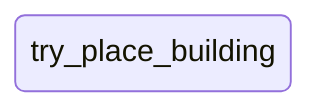
- State transitions:
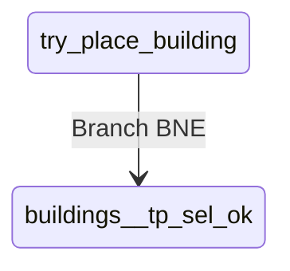

### State: @tp_sel_ok
- Mermaid state id: `buildings__tp_sel_ok`
- Assembly body:
```asm
lda cursor_x
ldx cursor_y
jsr get_tile
sta tmp4
and #TILE_TYPE_MASK
sta tmp3
lda sel_building
cmp #TILE_ROAD
bne @tp_check_same
lda tmp3
cmp #TILE_BRIDGE
beq @tp_upgrade_density
```
- Mermaid state:

- State transitions:
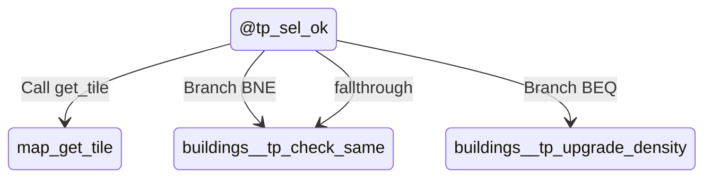

### State: @tp_check_same
- Mermaid state id: `buildings__tp_check_same`
- Assembly body:
```asm
lda tmp3
cmp sel_building
beq @tp_upgrade_density
cmp #TILE_WATER
bne @tp_not_water
lda sel_building
cmp #TILE_ROAD
bne @tp_cant_build
jmp @tp_check_cost
```
- Mermaid state:

- State transitions:
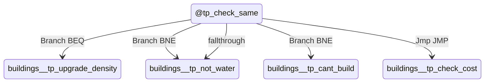

### State: @tp_not_water
- Mermaid state id: `buildings__tp_not_water`
- Assembly body:
```asm
cmp #TILE_BRIDGE
bne @tp_not_bridge
lda sel_building
cmp #TILE_ROAD
bne @tp_cant_build
jmp @tp_check_cost
```
- Mermaid state:
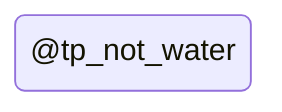
- State transitions:
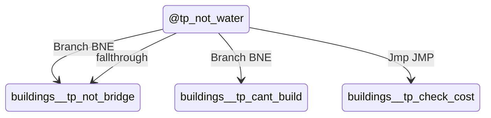

### State: @tp_not_bridge
- Mermaid state id: `buildings__tp_not_bridge`
- Assembly body:
```asm
cmp #TILE_TREE
beq @tp_cant_build
```
- Mermaid state:

- State transitions:
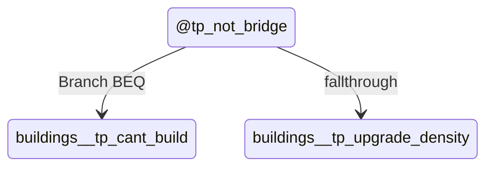

### State: @tp_upgrade_density
- Mermaid state id: `buildings__tp_upgrade_density`
- Assembly body:
```asm
lda tmp4
and #TILE_DENSITY_MASK
cmp #TILE_MAX_DENSITY
beq @tp_max_density
```
- Mermaid state:

- State transitions:
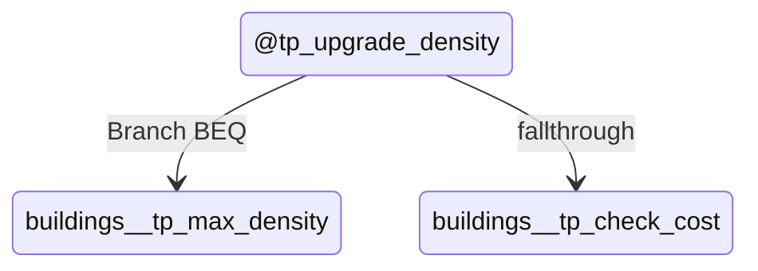

### State: @tp_check_cost
- Mermaid state id: `buildings__tp_check_cost`
- Assembly body:
```asm
lda sel_building
cmp #TILE_ROAD
bne @tp_cost_ready
lda tmp3
cmp #TILE_WATER
beq @tp_cost_bridge
cmp #TILE_BRIDGE
bne @tp_cost_ready
```
- Mermaid state:
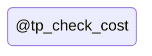
- State transitions:
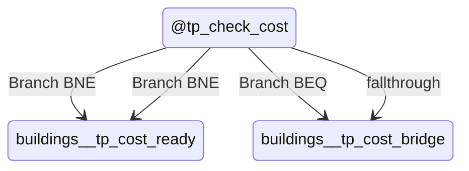

### State: @tp_cost_bridge
- Mermaid state id: `buildings__tp_cost_bridge`
- Assembly body:
```asm
lda #TILE_BRIDGE
```
- Mermaid state:

- State transitions:
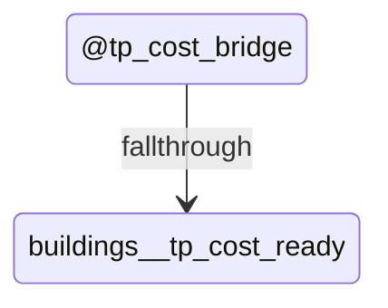

### State: @tp_cost_ready
- Mermaid state id: `buildings__tp_cost_ready`
- Assembly body:
```asm
tax
lda bld_cost_lo,x
sta tmp1
lda bld_cost_hi,x
sta tmp2
lda money_lo
sec
sbc tmp1
sta tmp1
lda money_hi
sbc tmp2
bpl @tp_afford
lda #<str_msg_notenough
sta ptr_lo
lda #>str_msg_notenough
sta ptr_hi
ldx #0
ldy #UI_ROW_MSG
lda #COLOR_LTRED
jsr print_str_col
lda #90
sta msg_timer
lda #1
sta dirty_ui
rts
```
- Mermaid state:

- State transitions:
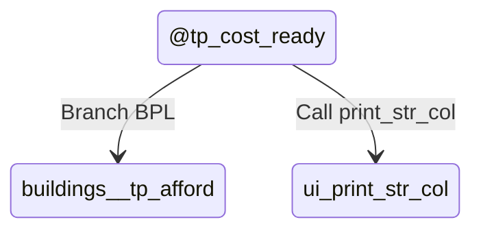

### State: @tp_cant_build
- Mermaid state id: `buildings__tp_cant_build`
- Assembly body:
```asm
lda #<str_msg_cantbuild
sta ptr_lo
lda #>str_msg_cantbuild
sta ptr_hi
ldx #0
ldy #UI_ROW_MSG
lda #COLOR_ORANGE
jsr print_str_col
lda #90
sta msg_timer
lda #1
sta dirty_ui
rts
```
- Mermaid state:
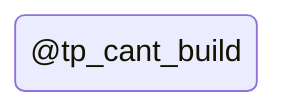
- State transitions:
```mermaid
stateDiagram-v2
    state "@tp_cant_build" as buildings__tp_cant_build
    buildings__tp_cant_build --> ui_print_str_col : Call print_str_col
```

### State: @tp_max_density
- Mermaid state id: `buildings__tp_max_density`
- Assembly body:
```asm
lda #<str_msg_maxdense
sta ptr_lo
lda #>str_msg_maxdense
sta ptr_hi
ldx #0
ldy #UI_ROW_MSG
lda #COLOR_ORANGE
jsr print_str_col
lda #90
sta msg_timer
lda #1
sta dirty_ui
rts
```
- Mermaid state:
```mermaid
stateDiagram-v2
state "@tp_max_density" as buildings__tp_max_density
```
- State transitions:
```mermaid
stateDiagram-v2
    state "@tp_max_density" as buildings__tp_max_density
    buildings__tp_max_density --> ui_print_str_col : Call print_str_col
```

### State: @tp_afford
- Mermaid state id: `buildings__tp_afford`
- Assembly body:
```asm
sta money_hi
lda tmp1
sta money_lo
lda cursor_x
sta tmp1
lda cursor_y
sta tmp2
lda tmp3
cmp sel_building
beq @tp_make_upgrade
lda sel_building
cmp #TILE_ROAD
bne @tp_new_tile
lda tmp3
cmp #TILE_WATER
beq @tp_new_bridge
cmp #TILE_BRIDGE
bne @tp_new_tile
```
- Mermaid state:
```mermaid
stateDiagram-v2
state "@tp_afford" as buildings__tp_afford
```
- State transitions:
```mermaid
stateDiagram-v2
    state "@tp_afford" as buildings__tp_afford
    buildings__tp_afford --> buildings__tp_make_upgrade : Branch BEQ
    buildings__tp_afford --> buildings__tp_new_tile : Branch BNE
    buildings__tp_afford --> buildings__tp_new_bridge : Branch BEQ
    buildings__tp_afford --> buildings__tp_new_tile : Branch BNE
    buildings__tp_afford --> buildings__tp_new_bridge : fallthrough
```

### State: @tp_new_bridge
- Mermaid state id: `buildings__tp_new_bridge`
- Assembly body:
```asm
lda #TILE_BRIDGE
bne @tp_place_new
```
- Mermaid state:
```mermaid
stateDiagram-v2
state "@tp_new_bridge" as buildings__tp_new_bridge
```
- State transitions:
```mermaid
stateDiagram-v2
    state "@tp_new_bridge" as buildings__tp_new_bridge
    buildings__tp_new_bridge --> buildings__tp_place_new : Branch BNE
    buildings__tp_new_bridge --> buildings__tp_new_tile : fallthrough
```

### State: @tp_new_tile
- Mermaid state id: `buildings__tp_new_tile`
- Assembly body:
```asm
lda #0
pha
lda sel_building
```
- Mermaid state:
```mermaid
stateDiagram-v2
state "@tp_new_tile" as buildings__tp_new_tile
```
- State transitions:
```mermaid
stateDiagram-v2
    state "@tp_new_tile" as buildings__tp_new_tile
    buildings__tp_new_tile --> buildings__tp_place_new : fallthrough
```

### State: @tp_place_new
- Mermaid state id: `buildings__tp_place_new`
- Assembly body:
```asm
bne @tp_place_tile
```
- Mermaid state:
```mermaid
stateDiagram-v2
state "@tp_place_new" as buildings__tp_place_new
```
- State transitions:
```mermaid
stateDiagram-v2
    state "@tp_place_new" as buildings__tp_place_new
    buildings__tp_place_new --> buildings__tp_place_tile : Branch BNE
    buildings__tp_place_new --> buildings__tp_make_upgrade : fallthrough
```

### State: @tp_make_upgrade
- Mermaid state id: `buildings__tp_make_upgrade`
- Assembly body:
```asm
lda #1
pha
lda tmp4
clc
adc #TILE_DENSITY_STEP
```
- Mermaid state:
```mermaid
stateDiagram-v2
state "@tp_make_upgrade" as buildings__tp_make_upgrade
```
- State transitions:
```mermaid
stateDiagram-v2
    state "@tp_make_upgrade" as buildings__tp_make_upgrade
    buildings__tp_make_upgrade --> buildings__tp_place_tile : fallthrough
```

### State: @tp_place_tile
- Mermaid state id: `buildings__tp_place_tile`
- Assembly body:
```asm
jsr place_tile_at
pla
bne @tp_msg_upgraded
lda #<str_msg_placed
sta ptr_lo
lda #>str_msg_placed
sta ptr_hi
bne @tp_show_msg
```
- Mermaid state:
```mermaid
stateDiagram-v2
state "@tp_place_tile" as buildings__tp_place_tile
```
- State transitions:
```mermaid
stateDiagram-v2
    state "@tp_place_tile" as buildings__tp_place_tile
    buildings__tp_place_tile --> buildings_place_tile_at : Call place_tile_at
    buildings__tp_place_tile --> buildings__tp_msg_upgraded : Branch BNE
    buildings__tp_place_tile --> buildings__tp_show_msg : Branch BNE
    buildings__tp_place_tile --> buildings__tp_msg_upgraded : fallthrough
```

### State: @tp_msg_upgraded
- Mermaid state id: `buildings__tp_msg_upgraded`
- Assembly body:
```asm
lda #<str_msg_upgraded
sta ptr_lo
lda #>str_msg_upgraded
sta ptr_hi
```
- Mermaid state:
```mermaid
stateDiagram-v2
state "@tp_msg_upgraded" as buildings__tp_msg_upgraded
```
- State transitions:
```mermaid
stateDiagram-v2
    state "@tp_msg_upgraded" as buildings__tp_msg_upgraded
    buildings__tp_msg_upgraded --> buildings__tp_show_msg : fallthrough
```

### State: @tp_show_msg
- Mermaid state id: `buildings__tp_show_msg`
- Assembly body:
```asm
ldx #0
ldy #UI_ROW_MSG
lda #COLOR_LTGREEN
jsr print_str_col
lda #90
sta msg_timer
lda #1
sta dirty_ui
rts
```
- Mermaid state:
```mermaid
stateDiagram-v2
state "@tp_show_msg" as buildings__tp_show_msg
```
- State transitions:
```mermaid
stateDiagram-v2
    state "@tp_show_msg" as buildings__tp_show_msg
    buildings__tp_show_msg --> ui_print_str_col : Call print_str_col
```

### State: try_demolish
- Mermaid state id: `buildings_try_demolish`
- Assembly body:
```asm
lda cursor_x
ldx cursor_y
jsr get_tile
sta tmp4
and #TILE_TYPE_MASK
cmp #TILE_EMPTY
bne @td_do_it
rts
```
- Mermaid state:
```mermaid
stateDiagram-v2
state "try_demolish" as buildings_try_demolish
```
- State transitions:
```mermaid
stateDiagram-v2
    state "try_demolish" as buildings_try_demolish
    buildings_try_demolish --> map_get_tile : Call get_tile
    buildings_try_demolish --> buildings__td_do_it : Branch BNE
```

### State: @td_do_it
- Mermaid state id: `buildings__td_do_it`
- Assembly body:
```asm
lda tmp4
and #TILE_TYPE_MASK
cmp #TILE_ROAD
bcc @td_clear_tile
cmp #TILE_BRIDGE + 1
bcs @td_clear_tile
lda tmp4
and #TILE_DENSITY_MASK
beq @td_clear_tile
lda tmp4
sec
sbc #TILE_DENSITY_STEP
sta tmp3
lda #1
pha
bne @td_place
```
- Mermaid state:
```mermaid
stateDiagram-v2
state "@td_do_it" as buildings__td_do_it
```
- State transitions:
```mermaid
stateDiagram-v2
    state "@td_do_it" as buildings__td_do_it
    buildings__td_do_it --> buildings__td_clear_tile : Branch BCC
    buildings__td_do_it --> buildings__td_clear_tile : Branch BCS
    buildings__td_do_it --> buildings__td_clear_tile : Branch BEQ
    buildings__td_do_it --> buildings__td_place : Branch BNE
    buildings__td_do_it --> buildings__td_clear_tile : fallthrough
```

### State: @td_clear_tile
- Mermaid state id: `buildings__td_clear_tile`
- Assembly body:
```asm
lda tmp4
and #TILE_TYPE_MASK
cmp #TILE_BRIDGE
bne @td_clear_empty
lda #TILE_WATER
bne @td_store_clear
```
- Mermaid state:
```mermaid
stateDiagram-v2
state "@td_clear_tile" as buildings__td_clear_tile
```
- State transitions:
```mermaid
stateDiagram-v2
    state "@td_clear_tile" as buildings__td_clear_tile
    buildings__td_clear_tile --> buildings__td_clear_empty : Branch BNE
    buildings__td_clear_tile --> buildings__td_store_clear : Branch BNE
    buildings__td_clear_tile --> buildings__td_clear_empty : fallthrough
```

### State: @td_clear_empty
- Mermaid state id: `buildings__td_clear_empty`
- Assembly body:
```asm
lda #TILE_EMPTY
```
- Mermaid state:
```mermaid
stateDiagram-v2
state "@td_clear_empty" as buildings__td_clear_empty
```
- State transitions:
```mermaid
stateDiagram-v2
    state "@td_clear_empty" as buildings__td_clear_empty
    buildings__td_clear_empty --> buildings__td_store_clear : fallthrough
```

### State: @td_store_clear
- Mermaid state id: `buildings__td_store_clear`
- Assembly body:
```asm
sta tmp3
lda #0
pha
```
- Mermaid state:
```mermaid
stateDiagram-v2
state "@td_store_clear" as buildings__td_store_clear
```
- State transitions:
```mermaid
stateDiagram-v2
    state "@td_store_clear" as buildings__td_store_clear
    buildings__td_store_clear --> buildings__td_place : fallthrough
```

### State: @td_place
- Mermaid state id: `buildings__td_place`
- Assembly body:
```asm
lda cursor_x
sta tmp1
lda cursor_y
sta tmp2
lda tmp3
jsr place_tile_at
pla
beq @td_msg_demo
lda #<str_msg_downgraded
sta ptr_lo
lda #>str_msg_downgraded
sta ptr_hi
bne @td_show_msg
```
- Mermaid state:
```mermaid
stateDiagram-v2
state "@td_place" as buildings__td_place
```
- State transitions:
```mermaid
stateDiagram-v2
    state "@td_place" as buildings__td_place
    buildings__td_place --> buildings_place_tile_at : Call place_tile_at
    buildings__td_place --> buildings__td_msg_demo : Branch BEQ
    buildings__td_place --> buildings__td_show_msg : Branch BNE
    buildings__td_place --> buildings__td_msg_demo : fallthrough
```

### State: @td_msg_demo
- Mermaid state id: `buildings__td_msg_demo`
- Assembly body:
```asm
lda #<str_msg_demolished
sta ptr_lo
lda #>str_msg_demolished
sta ptr_hi
```
- Mermaid state:
```mermaid
stateDiagram-v2
state "@td_msg_demo" as buildings__td_msg_demo
```
- State transitions:
```mermaid
stateDiagram-v2
    state "@td_msg_demo" as buildings__td_msg_demo
    buildings__td_msg_demo --> buildings__td_show_msg : fallthrough
```

### State: @td_show_msg
- Mermaid state id: `buildings__td_show_msg`
- Assembly body:
```asm
ldx #0
ldy #UI_ROW_MSG
lda #COLOR_MDGRAY
jsr print_str_col
lda #60
sta msg_timer
lda #1
sta dirty_ui
rts
```
- Mermaid state:
```mermaid
stateDiagram-v2
state "@td_show_msg" as buildings__td_show_msg
```
- State transitions:
```mermaid
stateDiagram-v2
    state "@td_show_msg" as buildings__td_show_msg
    buildings__td_show_msg --> ui_print_str_col : Call print_str_col
```

### State: place_tile_at
- Mermaid state id: `buildings_place_tile_at`
- Assembly body:
```asm
pha
lda tmp1
ldx tmp2
jsr get_tile
pha
jsr decrement_count
pla
sta tmp3
pla
sta tmp4
lda #0
sta road_topology_dirty
sta road_mask
lda tmp3
and #TILE_TYPE_MASK
cmp #TILE_ROAD
beq @pta_old_road
cmp #TILE_BRIDGE
bne @pta_old_done
```
- Mermaid state:
```mermaid
stateDiagram-v2
state "place_tile_at" as buildings_place_tile_at
```
- State transitions:
```mermaid
stateDiagram-v2
    state "place_tile_at" as buildings_place_tile_at
    buildings_place_tile_at --> map_get_tile : Call get_tile
    buildings_place_tile_at --> buildings_decrement_count : Call decrement_count
    buildings_place_tile_at --> buildings__pta_old_road : Branch BEQ
    buildings_place_tile_at --> buildings__pta_old_done : Branch BNE
    buildings_place_tile_at --> buildings__pta_old_road : fallthrough
```

### State: @pta_old_road
- Mermaid state id: `buildings__pta_old_road`
- Assembly body:
```asm
lda #1
sta road_topology_dirty
```
- Mermaid state:
```mermaid
stateDiagram-v2
state "@pta_old_road" as buildings__pta_old_road
```
- State transitions:
```mermaid
stateDiagram-v2
    state "@pta_old_road" as buildings__pta_old_road
    buildings__pta_old_road --> buildings__pta_old_done : fallthrough
```

### State: @pta_old_done
- Mermaid state id: `buildings__pta_old_done`
- Assembly body:
```asm
lda tmp4
and #TILE_TYPE_MASK
cmp #TILE_ROAD
beq @pta_new_road
cmp #TILE_BRIDGE
bne @pta_compare
```
- Mermaid state:
```mermaid
stateDiagram-v2
state "@pta_old_done" as buildings__pta_old_done
```
- State transitions:
```mermaid
stateDiagram-v2
    state "@pta_old_done" as buildings__pta_old_done
    buildings__pta_old_done --> buildings__pta_new_road : Branch BEQ
    buildings__pta_old_done --> buildings__pta_compare : Branch BNE
    buildings__pta_old_done --> buildings__pta_new_road : fallthrough
```

### State: @pta_new_road
- Mermaid state id: `buildings__pta_new_road`
- Assembly body:
```asm
lda #1
sta road_mask
```
- Mermaid state:
```mermaid
stateDiagram-v2
state "@pta_new_road" as buildings__pta_new_road
```
- State transitions:
```mermaid
stateDiagram-v2
    state "@pta_new_road" as buildings__pta_new_road
    buildings__pta_new_road --> buildings__pta_compare : fallthrough
```

### State: @pta_compare
- Mermaid state id: `buildings__pta_compare`
- Assembly body:
```asm
lda road_topology_dirty
cmp road_mask
bne @pta_topology_changed
lda #0
sta road_topology_dirty
beq @pta_write
```
- Mermaid state:
```mermaid
stateDiagram-v2
state "@pta_compare" as buildings__pta_compare
```
- State transitions:
```mermaid
stateDiagram-v2
    state "@pta_compare" as buildings__pta_compare
    buildings__pta_compare --> buildings__pta_topology_changed : Branch BNE
    buildings__pta_compare --> buildings__pta_write : Branch BEQ
    buildings__pta_compare --> buildings__pta_topology_changed : fallthrough
```

### State: @pta_topology_changed
- Mermaid state id: `buildings__pta_topology_changed`
- Assembly body:
```asm
lda #1
sta road_topology_dirty
```
- Mermaid state:
```mermaid
stateDiagram-v2
state "@pta_topology_changed" as buildings__pta_topology_changed
```
- State transitions:
```mermaid
stateDiagram-v2
    state "@pta_topology_changed" as buildings__pta_topology_changed
    buildings__pta_topology_changed --> buildings__pta_write : fallthrough
```

### State: @pta_write
- Mermaid state id: `buildings__pta_write`
- Assembly body:
```asm
tay
lda tmp1
ldx tmp2
jsr set_tile
lda tmp4
jsr increment_count
jsr render_road_neighborhood
lda road_topology_dirty
beq @pta_update_one
jsr rebuild_road_segments
jmp @pta_done
```
- Mermaid state:
```mermaid
stateDiagram-v2
state "@pta_write" as buildings__pta_write
```
- State transitions:
```mermaid
stateDiagram-v2
    state "@pta_write" as buildings__pta_write
    buildings__pta_write --> map_set_tile : Call set_tile
    buildings__pta_write --> buildings_increment_count : Call increment_count
    buildings__pta_write --> map_render_road_neighborhood : Call render_road_neighborhood
    buildings__pta_write --> buildings__pta_update_one : Branch BEQ
    buildings__pta_write --> simulation_rebuild_road_segments : Call rebuild_road_segments
    buildings__pta_write --> buildings__pta_done : Jmp JMP
    buildings__pta_write --> buildings__pta_update_one : fallthrough
```

### State: @pta_update_one
- Mermaid state id: `buildings__pta_update_one`
- Assembly body:
```asm
jsr update_building_segment_at
```
- Mermaid state:
```mermaid
stateDiagram-v2
state "@pta_update_one" as buildings__pta_update_one
```
- State transitions:
```mermaid
stateDiagram-v2
    state "@pta_update_one" as buildings__pta_update_one
    buildings__pta_update_one --> simulation_update_building_segment_at : Call update_building_segment_at
    buildings__pta_update_one --> buildings__pta_done : fallthrough
```

### State: @pta_done
- Mermaid state id: `buildings__pta_done`
- Assembly body:
```asm
lda #1
sta dirty_map
rts
```
- Mermaid state:
```mermaid
stateDiagram-v2
state "@pta_done" as buildings__pta_done
```
- State transitions:
```mermaid
stateDiagram-v2
    state "@pta_done" as buildings__pta_done
```

### State: get_tile_density_units
- Mermaid state id: `buildings_get_tile_density_units`
- Assembly body:
```asm
and #TILE_DENSITY_MASK
lsr
lsr
lsr
lsr
clc
adc #1
rts
```
- Mermaid state:
```mermaid
stateDiagram-v2
state "get_tile_density_units" as buildings_get_tile_density_units
```
- State transitions:
```mermaid
stateDiagram-v2
    state "get_tile_density_units" as buildings_get_tile_density_units
```

### State: increment_count
- Mermaid state id: `buildings_increment_count`
- Assembly body:
```asm
sta tmp3
and #TILE_TYPE_MASK
tax
lda tmp3
jsr get_tile_density_units
sta tmp4
txa
cmp #TILE_ROAD
beq @inc_road
cmp #TILE_BRIDGE
bne @inc1
```
- Mermaid state:
```mermaid
stateDiagram-v2
state "increment_count" as buildings_increment_count
```
- State transitions:
```mermaid
stateDiagram-v2
    state "increment_count" as buildings_increment_count
    buildings_increment_count --> buildings_get_tile_density_units : Call get_tile_density_units
    buildings_increment_count --> buildings__inc_road : Branch BEQ
    buildings_increment_count --> buildings__inc1 : Branch BNE
    buildings_increment_count --> buildings__inc_road : fallthrough
```

### State: @inc_road
- Mermaid state id: `buildings__inc_road`
- Assembly body:
```asm
lda cnt_roads
clc
adc tmp4
bcc @inc_store_road
lda #$FF
```
- Mermaid state:
```mermaid
stateDiagram-v2
state "@inc_road" as buildings__inc_road
```
- State transitions:
```mermaid
stateDiagram-v2
    state "@inc_road" as buildings__inc_road
    buildings__inc_road --> buildings__inc_store_road : Branch BCC
    buildings__inc_road --> buildings__inc_store_road : fallthrough
```

### State: @inc_store_road
- Mermaid state id: `buildings__inc_store_road`
- Assembly body:
```asm
sta cnt_roads
rts
```
- Mermaid state:
```mermaid
stateDiagram-v2
state "@inc_store_road" as buildings__inc_store_road
```
- State transitions:
```mermaid
stateDiagram-v2
    state "@inc_store_road" as buildings__inc_store_road
```

### State: @inc1
- Mermaid state id: `buildings__inc1`
- Assembly body:
```asm
cmp #TILE_HOUSE
bne @inc2
lda cnt_houses
clc
adc tmp4
bcc @inc_store_house
lda #$FF
```
- Mermaid state:
```mermaid
stateDiagram-v2
state "@inc1" as buildings__inc1
```
- State transitions:
```mermaid
stateDiagram-v2
    state "@inc1" as buildings__inc1
    buildings__inc1 --> buildings__inc2 : Branch BNE
    buildings__inc1 --> buildings__inc_store_house : Branch BCC
    buildings__inc1 --> buildings__inc_store_house : fallthrough
```

### State: @inc_store_house
- Mermaid state id: `buildings__inc_store_house`
- Assembly body:
```asm
sta cnt_houses
rts
```
- Mermaid state:
```mermaid
stateDiagram-v2
state "@inc_store_house" as buildings__inc_store_house
```
- State transitions:
```mermaid
stateDiagram-v2
    state "@inc_store_house" as buildings__inc_store_house
```

### State: @inc2
- Mermaid state id: `buildings__inc2`
- Assembly body:
```asm
cmp #TILE_FACTORY
bne @inc3
lda cnt_factories
clc
adc tmp4
bcc @inc_store_factory
lda #$FF
```
- Mermaid state:
```mermaid
stateDiagram-v2
state "@inc2" as buildings__inc2
```
- State transitions:
```mermaid
stateDiagram-v2
    state "@inc2" as buildings__inc2
    buildings__inc2 --> buildings__inc3 : Branch BNE
    buildings__inc2 --> buildings__inc_store_factory : Branch BCC
    buildings__inc2 --> buildings__inc_store_factory : fallthrough
```

### State: @inc_store_factory
- Mermaid state id: `buildings__inc_store_factory`
- Assembly body:
```asm
sta cnt_factories
rts
```
- Mermaid state:
```mermaid
stateDiagram-v2
state "@inc_store_factory" as buildings__inc_store_factory
```
- State transitions:
```mermaid
stateDiagram-v2
    state "@inc_store_factory" as buildings__inc_store_factory
```

### State: @inc3
- Mermaid state id: `buildings__inc3`
- Assembly body:
```asm
cmp #TILE_PARK
bne @inc4
lda cnt_parks
clc
adc tmp4
bcc @inc_store_park
lda #$FF
```
- Mermaid state:
```mermaid
stateDiagram-v2
state "@inc3" as buildings__inc3
```
- State transitions:
```mermaid
stateDiagram-v2
    state "@inc3" as buildings__inc3
    buildings__inc3 --> buildings__inc4 : Branch BNE
    buildings__inc3 --> buildings__inc_store_park : Branch BCC
    buildings__inc3 --> buildings__inc_store_park : fallthrough
```

### State: @inc_store_park
- Mermaid state id: `buildings__inc_store_park`
- Assembly body:
```asm
sta cnt_parks
rts
```
- Mermaid state:
```mermaid
stateDiagram-v2
state "@inc_store_park" as buildings__inc_store_park
```
- State transitions:
```mermaid
stateDiagram-v2
    state "@inc_store_park" as buildings__inc_store_park
```

### State: @inc4
- Mermaid state id: `buildings__inc4`
- Assembly body:
```asm
cmp #TILE_POWER
bne @inc5
lda cnt_power
clc
adc tmp4
bcc @inc_store_power
lda #$FF
```
- Mermaid state:
```mermaid
stateDiagram-v2
state "@inc4" as buildings__inc4
```
- State transitions:
```mermaid
stateDiagram-v2
    state "@inc4" as buildings__inc4
    buildings__inc4 --> buildings__inc5 : Branch BNE
    buildings__inc4 --> buildings__inc_store_power : Branch BCC
    buildings__inc4 --> buildings__inc_store_power : fallthrough
```

### State: @inc_store_power
- Mermaid state id: `buildings__inc_store_power`
- Assembly body:
```asm
sta cnt_power
rts
```
- Mermaid state:
```mermaid
stateDiagram-v2
state "@inc_store_power" as buildings__inc_store_power
```
- State transitions:
```mermaid
stateDiagram-v2
    state "@inc_store_power" as buildings__inc_store_power
```

### State: @inc5
- Mermaid state id: `buildings__inc5`
- Assembly body:
```asm
cmp #TILE_POLICE
bne @inc6
lda cnt_police
clc
adc tmp4
bcc @inc_store_police
lda #$FF
```
- Mermaid state:
```mermaid
stateDiagram-v2
state "@inc5" as buildings__inc5
```
- State transitions:
```mermaid
stateDiagram-v2
    state "@inc5" as buildings__inc5
    buildings__inc5 --> buildings__inc6 : Branch BNE
    buildings__inc5 --> buildings__inc_store_police : Branch BCC
    buildings__inc5 --> buildings__inc_store_police : fallthrough
```

### State: @inc_store_police
- Mermaid state id: `buildings__inc_store_police`
- Assembly body:
```asm
sta cnt_police
rts
```
- Mermaid state:
```mermaid
stateDiagram-v2
state "@inc_store_police" as buildings__inc_store_police
```
- State transitions:
```mermaid
stateDiagram-v2
    state "@inc_store_police" as buildings__inc_store_police
```

### State: @inc6
- Mermaid state id: `buildings__inc6`
- Assembly body:
```asm
cmp #TILE_FIRE
bne @inc_done
lda cnt_fire
clc
adc tmp4
bcc @inc_store_fire
lda #$FF
```
- Mermaid state:
```mermaid
stateDiagram-v2
state "@inc6" as buildings__inc6
```
- State transitions:
```mermaid
stateDiagram-v2
    state "@inc6" as buildings__inc6
    buildings__inc6 --> buildings__inc_done : Branch BNE
    buildings__inc6 --> buildings__inc_store_fire : Branch BCC
    buildings__inc6 --> buildings__inc_store_fire : fallthrough
```

### State: @inc_store_fire
- Mermaid state id: `buildings__inc_store_fire`
- Assembly body:
```asm
sta cnt_fire
```
- Mermaid state:
```mermaid
stateDiagram-v2
state "@inc_store_fire" as buildings__inc_store_fire
```
- State transitions:
```mermaid
stateDiagram-v2
    state "@inc_store_fire" as buildings__inc_store_fire
    buildings__inc_store_fire --> buildings__inc_done : fallthrough
```

### State: @inc_done
- Mermaid state id: `buildings__inc_done`
- Assembly body:
```asm
rts
```
- Mermaid state:
```mermaid
stateDiagram-v2
state "@inc_done" as buildings__inc_done
```
- State transitions:
```mermaid
stateDiagram-v2
    state "@inc_done" as buildings__inc_done
```

### State: decrement_count
- Mermaid state id: `buildings_decrement_count`
- Assembly body:
```asm
sta tmp3
and #TILE_TYPE_MASK
tax
lda tmp3
jsr get_tile_density_units
sta tmp4
txa
cmp #TILE_ROAD
beq @dec_road
cmp #TILE_BRIDGE
bne @dec1
```
- Mermaid state:
```mermaid
stateDiagram-v2
state "decrement_count" as buildings_decrement_count
```
- State transitions:
```mermaid
stateDiagram-v2
    state "decrement_count" as buildings_decrement_count
    buildings_decrement_count --> buildings_get_tile_density_units : Call get_tile_density_units
    buildings_decrement_count --> buildings__dec_road : Branch BEQ
    buildings_decrement_count --> buildings__dec1 : Branch BNE
    buildings_decrement_count --> buildings__dec_road : fallthrough
```

### State: @dec_road
- Mermaid state id: `buildings__dec_road`
- Assembly body:
```asm
lda cnt_roads
sec
sbc tmp4
bcs @dec_store_road
lda #0
```
- Mermaid state:
```mermaid
stateDiagram-v2
state "@dec_road" as buildings__dec_road
```
- State transitions:
```mermaid
stateDiagram-v2
    state "@dec_road" as buildings__dec_road
    buildings__dec_road --> buildings__dec_store_road : Branch BCS
    buildings__dec_road --> buildings__dec_store_road : fallthrough
```

### State: @dec_store_road
- Mermaid state id: `buildings__dec_store_road`
- Assembly body:
```asm
sta cnt_roads
rts
```
- Mermaid state:
```mermaid
stateDiagram-v2
state "@dec_store_road" as buildings__dec_store_road
```
- State transitions:
```mermaid
stateDiagram-v2
    state "@dec_store_road" as buildings__dec_store_road
```

### State: @dec1
- Mermaid state id: `buildings__dec1`
- Assembly body:
```asm
cmp #TILE_HOUSE
bne @dec2
lda cnt_houses
sec
sbc tmp4
bcs @dec_store_house
lda #0
```
- Mermaid state:
```mermaid
stateDiagram-v2
state "@dec1" as buildings__dec1
```
- State transitions:
```mermaid
stateDiagram-v2
    state "@dec1" as buildings__dec1
    buildings__dec1 --> buildings__dec2 : Branch BNE
    buildings__dec1 --> buildings__dec_store_house : Branch BCS
    buildings__dec1 --> buildings__dec_store_house : fallthrough
```

### State: @dec_store_house
- Mermaid state id: `buildings__dec_store_house`
- Assembly body:
```asm
sta cnt_houses
rts
```
- Mermaid state:
```mermaid
stateDiagram-v2
state "@dec_store_house" as buildings__dec_store_house
```
- State transitions:
```mermaid
stateDiagram-v2
    state "@dec_store_house" as buildings__dec_store_house
```

### State: @dec2
- Mermaid state id: `buildings__dec2`
- Assembly body:
```asm
cmp #TILE_FACTORY
bne @dec3
lda cnt_factories
sec
sbc tmp4
bcs @dec_store_factory
lda #0
```
- Mermaid state:
```mermaid
stateDiagram-v2
state "@dec2" as buildings__dec2
```
- State transitions:
```mermaid
stateDiagram-v2
    state "@dec2" as buildings__dec2
    buildings__dec2 --> buildings__dec3 : Branch BNE
    buildings__dec2 --> buildings__dec_store_factory : Branch BCS
    buildings__dec2 --> buildings__dec_store_factory : fallthrough
```

### State: @dec_store_factory
- Mermaid state id: `buildings__dec_store_factory`
- Assembly body:
```asm
sta cnt_factories
rts
```
- Mermaid state:
```mermaid
stateDiagram-v2
state "@dec_store_factory" as buildings__dec_store_factory
```
- State transitions:
```mermaid
stateDiagram-v2
    state "@dec_store_factory" as buildings__dec_store_factory
```

### State: @dec3
- Mermaid state id: `buildings__dec3`
- Assembly body:
```asm
cmp #TILE_PARK
bne @dec4
lda cnt_parks
sec
sbc tmp4
bcs @dec_store_park
lda #0
```
- Mermaid state:
```mermaid
stateDiagram-v2
state "@dec3" as buildings__dec3
```
- State transitions:
```mermaid
stateDiagram-v2
    state "@dec3" as buildings__dec3
    buildings__dec3 --> buildings__dec4 : Branch BNE
    buildings__dec3 --> buildings__dec_store_park : Branch BCS
    buildings__dec3 --> buildings__dec_store_park : fallthrough
```

### State: @dec_store_park
- Mermaid state id: `buildings__dec_store_park`
- Assembly body:
```asm
sta cnt_parks
rts
```
- Mermaid state:
```mermaid
stateDiagram-v2
state "@dec_store_park" as buildings__dec_store_park
```
- State transitions:
```mermaid
stateDiagram-v2
    state "@dec_store_park" as buildings__dec_store_park
```

### State: @dec4
- Mermaid state id: `buildings__dec4`
- Assembly body:
```asm
cmp #TILE_POWER
bne @dec5
lda cnt_power
sec
sbc tmp4
bcs @dec_store_power
lda #0
```
- Mermaid state:
```mermaid
stateDiagram-v2
state "@dec4" as buildings__dec4
```
- State transitions:
```mermaid
stateDiagram-v2
    state "@dec4" as buildings__dec4
    buildings__dec4 --> buildings__dec5 : Branch BNE
    buildings__dec4 --> buildings__dec_store_power : Branch BCS
    buildings__dec4 --> buildings__dec_store_power : fallthrough
```

### State: @dec_store_power
- Mermaid state id: `buildings__dec_store_power`
- Assembly body:
```asm
sta cnt_power
rts
```
- Mermaid state:
```mermaid
stateDiagram-v2
state "@dec_store_power" as buildings__dec_store_power
```
- State transitions:
```mermaid
stateDiagram-v2
    state "@dec_store_power" as buildings__dec_store_power
```

### State: @dec5
- Mermaid state id: `buildings__dec5`
- Assembly body:
```asm
cmp #TILE_POLICE
bne @dec6
lda cnt_police
sec
sbc tmp4
bcs @dec_store_police
lda #0
```
- Mermaid state:
```mermaid
stateDiagram-v2
state "@dec5" as buildings__dec5
```
- State transitions:
```mermaid
stateDiagram-v2
    state "@dec5" as buildings__dec5
    buildings__dec5 --> buildings__dec6 : Branch BNE
    buildings__dec5 --> buildings__dec_store_police : Branch BCS
    buildings__dec5 --> buildings__dec_store_police : fallthrough
```

### State: @dec_store_police
- Mermaid state id: `buildings__dec_store_police`
- Assembly body:
```asm
sta cnt_police
rts
```
- Mermaid state:
```mermaid
stateDiagram-v2
state "@dec_store_police" as buildings__dec_store_police
```
- State transitions:
```mermaid
stateDiagram-v2
    state "@dec_store_police" as buildings__dec_store_police
```

### State: @dec6
- Mermaid state id: `buildings__dec6`
- Assembly body:
```asm
cmp #TILE_FIRE
bne @dec_done
lda cnt_fire
sec
sbc tmp4
bcs @dec_store_fire
lda #0
```
- Mermaid state:
```mermaid
stateDiagram-v2
state "@dec6" as buildings__dec6
```
- State transitions:
```mermaid
stateDiagram-v2
    state "@dec6" as buildings__dec6
    buildings__dec6 --> buildings__dec_done : Branch BNE
    buildings__dec6 --> buildings__dec_store_fire : Branch BCS
    buildings__dec6 --> buildings__dec_store_fire : fallthrough
```

### State: @dec_store_fire
- Mermaid state id: `buildings__dec_store_fire`
- Assembly body:
```asm
sta cnt_fire
```
- Mermaid state:
```mermaid
stateDiagram-v2
state "@dec_store_fire" as buildings__dec_store_fire
```
- State transitions:
```mermaid
stateDiagram-v2
    state "@dec_store_fire" as buildings__dec_store_fire
    buildings__dec_store_fire --> buildings__dec_done : fallthrough
```

### State: @dec_done
- Mermaid state id: `buildings__dec_done`
- Assembly body:
```asm
rts
```
- Mermaid state:
```mermaid
stateDiagram-v2
state "@dec_done" as buildings__dec_done
```
- State transitions:
```mermaid
stateDiagram-v2
    state "@dec_done" as buildings__dec_done
```

### State: show_building_name
- Mermaid state id: `buildings_show_building_name`
- Assembly body:
```asm
lda sel_building
beq @sbn_done
cmp #TILE_WATER
bcs @sbn_done
sec
sbc #1
asl
tax
lda bld_names,x
sta ptr_lo
lda bld_names+1,x
sta ptr_hi
ldx #0
ldy #UI_ROW_MSG
lda #COLOR_LTGREEN
jsr print_str_col
lda #60
sta msg_timer
```
- Mermaid state:
```mermaid
stateDiagram-v2
state "show_building_name" as buildings_show_building_name
```
- State transitions:
```mermaid
stateDiagram-v2
    state "show_building_name" as buildings_show_building_name
    buildings_show_building_name --> buildings__sbn_done : Branch BEQ
    buildings_show_building_name --> buildings__sbn_done : Branch BCS
    buildings_show_building_name --> ui_print_str_col : Call print_str_col
    buildings_show_building_name --> buildings__sbn_done : fallthrough
```

### State: @sbn_done
- Mermaid state id: `buildings__sbn_done`
- Assembly body:
```asm
rts
```
- Mermaid state:
```mermaid
stateDiagram-v2
state "@sbn_done" as buildings__sbn_done
```
- State transitions:
```mermaid
stateDiagram-v2
    state "@sbn_done" as buildings__sbn_done
```

