# Assembly activity/state documentation

## Diagram
```mermaid
stateDiagram-v2
    state "mul40_lo" as data_mul40_lo
    state "mul40_hi" as data_mul40_hi
    state "tile_char" as data_tile_char
    state "road_shape_char" as data_road_shape_char
    state "tile_color" as data_tile_color
    state "tile_density_base" as data_tile_density_base
    state "density_color" as data_density_color
    state "tile_mc_color" as data_tile_mc_color
    state "density_mc_color" as data_density_mc_color
    state "house_aoe_radius" as data_house_aoe_radius
    state "factory_aoe_radius" as data_factory_aoe_radius
    state "bld_cost_lo" as data_bld_cost_lo
    state "bld_cost_hi" as data_bld_cost_hi
    state "pow10_lo" as data_pow10_lo
    state "pow10_hi" as data_pow10_hi
    state "cursor_sprite_data" as data_cursor_sprite_data
    state "custom_char_glyphs" as data_custom_char_glyphs
    state "str_menu" as data_str_menu
    state "str_msg_empty" as data_str_msg_empty
    state "str_help" as data_str_help
    state "bld_names" as data_bld_names
    state "hud_tile_names" as data_hud_tile_names
    state "hud_segment_names" as data_hud_segment_names
    state "hud_level_names" as data_hud_level_names

    [*] --> data_mul40_lo
    data_mul40_lo --> data_mul40_hi : fallthrough
    data_mul40_hi --> data_tile_char : fallthrough
    data_tile_char --> data_road_shape_char : fallthrough
    data_road_shape_char --> data_tile_color : fallthrough
    data_tile_color --> data_tile_density_base : fallthrough
    data_tile_density_base --> data_density_color : fallthrough
    data_density_color --> data_tile_mc_color : fallthrough
    data_tile_mc_color --> data_density_mc_color : fallthrough
    data_density_mc_color --> data_house_aoe_radius : fallthrough
    data_house_aoe_radius --> data_factory_aoe_radius : fallthrough
    data_factory_aoe_radius --> data_bld_cost_lo : fallthrough
    data_bld_cost_lo --> data_bld_cost_hi : fallthrough
    data_bld_cost_hi --> data_pow10_lo : fallthrough
    data_pow10_lo --> data_pow10_hi : fallthrough
    data_pow10_hi --> data_cursor_sprite_data : fallthrough
    data_cursor_sprite_data --> data_custom_char_glyphs : fallthrough
    data_custom_char_glyphs --> data_str_menu : fallthrough
    data_str_menu --> data_str_msg_empty : fallthrough
    data_str_msg_empty --> data_str_help : fallthrough
    data_str_help --> data_bld_names : fallthrough
    data_bld_names --> data_hud_tile_names : fallthrough
    data_hud_tile_names --> data_hud_segment_names : fallthrough
    data_hud_segment_names --> data_hud_level_names : fallthrough
```

## Rendered Mermaid diagram


## State and transition documentation

### State: mul40_lo
- Mermaid state id: `data_mul40_lo`
- Assembly body:
```asm
.byte  <( 0*40), <( 1*40), <( 2*40), <( 3*40), <( 4*40)
.byte  <( 5*40), <( 6*40), <( 7*40), <( 8*40), <( 9*40)
.byte  <(10*40), <(11*40), <(12*40), <(13*40), <(14*40)
.byte  <(15*40), <(16*40), <(17*40), <(18*40), <(19*40)
.byte  <(20*40), <(21*40), <(22*40), <(23*40), <(24*40)
```
- Mermaid state:
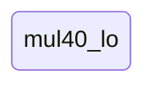
- State transitions:
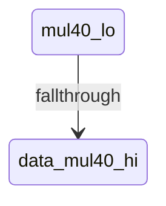

### State: mul40_hi
- Mermaid state id: `data_mul40_hi`
- Assembly body:
```asm
.byte  >(0*40),  >(1*40),  >(2*40),  >(3*40),  >(4*40)
.byte  >(5*40),  >(6*40),  >(7*40),  >(8*40),  >(9*40)
.byte  >(10*40), >(11*40), >(12*40), >(13*40), >(14*40)
.byte  >(15*40), >(16*40), >(17*40), >(18*40), >(19*40)
.byte  >(20*40), >(21*40), >(22*40), >(23*40), >(24*40)
```
- Mermaid state:

- State transitions:
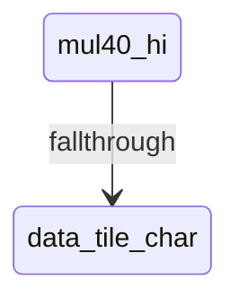

### State: tile_char
- Mermaid state id: `data_tile_char`
- Assembly body:
```asm
.byte MAP_GLYPH_EMPTY
.byte MAP_GLYPH_ROAD_BASE
.byte MAP_GLYPH_HOUSE
.byte MAP_GLYPH_FACTORY
.byte MAP_GLYPH_PARK
.byte MAP_GLYPH_POWER
.byte MAP_GLYPH_POLICE
.byte MAP_GLYPH_FIRE
.byte MAP_GLYPH_ROAD_BASE
.byte MAP_GLYPH_WATER
.byte MAP_GLYPH_TREE
```
- Mermaid state:

- State transitions:
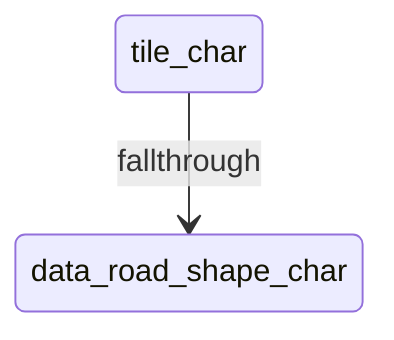

### State: road_shape_char
- Mermaid state id: `data_road_shape_char`
- Assembly body:
```asm
.byte MAP_GLYPH_ROAD_BASE + 0
.byte MAP_GLYPH_ROAD_BASE + 1
.byte MAP_GLYPH_ROAD_BASE + 2
.byte MAP_GLYPH_ROAD_BASE + 3
.byte MAP_GLYPH_ROAD_BASE + 4
.byte MAP_GLYPH_ROAD_BASE + 5
.byte MAP_GLYPH_ROAD_BASE + 6
.byte MAP_GLYPH_ROAD_BASE + 7
.byte MAP_GLYPH_ROAD_BASE + 8
.byte MAP_GLYPH_ROAD_BASE + 9
.byte MAP_GLYPH_ROAD_BASE + 10
.byte MAP_GLYPH_ROAD_BASE + 11
.byte MAP_GLYPH_ROAD_BASE + 12
.byte MAP_GLYPH_ROAD_BASE + 13
.byte MAP_GLYPH_ROAD_BASE + 14
.byte MAP_GLYPH_ROAD_BASE + 15
```
- Mermaid state:

- State transitions:
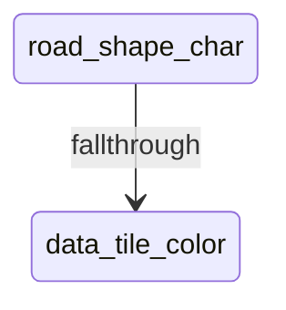

### State: tile_color
- Mermaid state id: `data_tile_color`
- Assembly body:
```asm
.byte COLOR_GREEN
.byte COLOR_MDGRAY
.byte COLOR_YELLOW
.byte COLOR_RED
.byte COLOR_LTGREEN
.byte COLOR_WHITE
.byte COLOR_BLUE
.byte COLOR_LTRED
.byte COLOR_MDGRAY
.byte COLOR_BLUE
.byte COLOR_GREEN
```
- Mermaid state:

- State transitions:
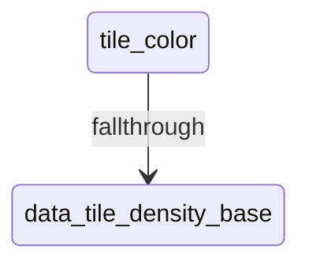

### State: tile_density_base
- Mermaid state id: `data_tile_density_base`
- Assembly body:
```asm
.byte 0
.byte 0
.byte 4
.byte 8
.byte 12
.byte 16
.byte 20
.byte 24
.byte 0
.byte 0
.byte 0
```
- Mermaid state:

- State transitions:
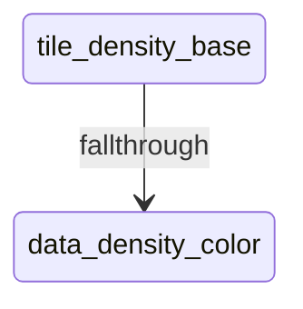

### State: density_color
- Mermaid state id: `data_density_color`
- Assembly body:
```asm
.byte COLOR_DKGRAY, COLOR_MDGRAY, COLOR_LTGRAY,  COLOR_WHITE
.byte COLOR_LTGREEN, COLOR_LTGREEN, COLOR_LTGREEN, COLOR_LTGREEN
.byte COLOR_LTGREEN, COLOR_LTGREEN, COLOR_LTGREEN, COLOR_LTGREEN
.byte COLOR_LTGREEN, COLOR_LTGREEN, COLOR_LTGREEN, COLOR_LTGREEN
.byte COLOR_LTGREEN, COLOR_LTGREEN, COLOR_LTGREEN, COLOR_LTGREEN
.byte COLOR_LTGREEN, COLOR_LTGREEN, COLOR_LTGREEN, COLOR_LTGREEN
.byte COLOR_LTGREEN, COLOR_LTGREEN, COLOR_LTGREEN, COLOR_LTGREEN
```
- Mermaid state:

- State transitions:
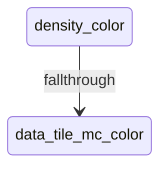

### State: tile_mc_color
- Mermaid state id: `data_tile_mc_color`
- Assembly body:
```asm
.byte MC_CHAR_FLAG + COLOR_GREEN
.byte MC_CHAR_FLAG + COLOR_WHITE
.byte MC_CHAR_FLAG + COLOR_YELLOW
.byte MC_CHAR_FLAG + COLOR_RED
.byte MC_CHAR_FLAG + COLOR_GREEN
.byte MC_CHAR_FLAG + COLOR_CYAN
.byte MC_CHAR_FLAG + COLOR_BLUE
.byte MC_CHAR_FLAG + COLOR_RED
.byte MC_CHAR_FLAG + COLOR_WHITE
.byte MC_CHAR_FLAG + COLOR_BLUE
.byte MC_CHAR_FLAG + COLOR_GREEN
```
- Mermaid state:

- State transitions:
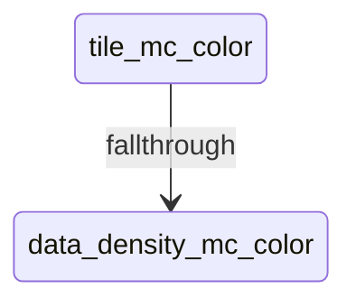

### State: density_mc_color
- Mermaid state id: `data_density_mc_color`
- Assembly body:
```asm
.byte MC_CHAR_FLAG + COLOR_WHITE,  MC_CHAR_FLAG + COLOR_CYAN,   MC_CHAR_FLAG + COLOR_YELLOW, MC_CHAR_FLAG + COLOR_WHITE
.byte MC_CHAR_FLAG + COLOR_YELLOW, MC_CHAR_FLAG + COLOR_RED,    MC_CHAR_FLAG + COLOR_CYAN,   MC_CHAR_FLAG + COLOR_WHITE
.byte MC_CHAR_FLAG + COLOR_RED,    MC_CHAR_FLAG + COLOR_YELLOW, MC_CHAR_FLAG + COLOR_WHITE,  MC_CHAR_FLAG + COLOR_CYAN
.byte MC_CHAR_FLAG + COLOR_GREEN,  MC_CHAR_FLAG + COLOR_CYAN,   MC_CHAR_FLAG + COLOR_YELLOW, MC_CHAR_FLAG + COLOR_WHITE
.byte MC_CHAR_FLAG + COLOR_CYAN,   MC_CHAR_FLAG + COLOR_WHITE,  MC_CHAR_FLAG + COLOR_YELLOW, MC_CHAR_FLAG + COLOR_RED
.byte MC_CHAR_FLAG + COLOR_BLUE,   MC_CHAR_FLAG + COLOR_CYAN,   MC_CHAR_FLAG + COLOR_WHITE,  MC_CHAR_FLAG + COLOR_YELLOW
.byte MC_CHAR_FLAG + COLOR_RED,    MC_CHAR_FLAG + COLOR_YELLOW, MC_CHAR_FLAG + COLOR_WHITE,  MC_CHAR_FLAG + COLOR_CYAN
```
- Mermaid state:

- State transitions:
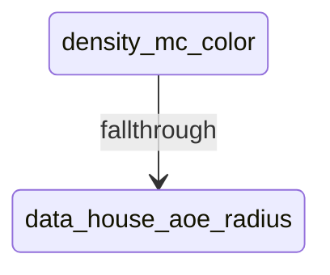

### State: house_aoe_radius
- Mermaid state id: `data_house_aoe_radius`
- Assembly body:
```asm
.byte 0, 2, 4, 7, 11
```
- Mermaid state:
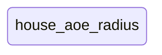
- State transitions:
```mermaid
stateDiagram-v2
    state "house_aoe_radius" as data_house_aoe_radius
    data_house_aoe_radius --> data_factory_aoe_radius : fallthrough
```

### State: factory_aoe_radius
- Mermaid state id: `data_factory_aoe_radius`
- Assembly body:
```asm
.byte 0, 3, 6, 10, 15
```
- Mermaid state:
```mermaid
stateDiagram-v2
state "factory_aoe_radius" as data_factory_aoe_radius
```
- State transitions:
```mermaid
stateDiagram-v2
    state "factory_aoe_radius" as data_factory_aoe_radius
    data_factory_aoe_radius --> data_bld_cost_lo : fallthrough
```

### State: bld_cost_lo
- Mermaid state id: `data_bld_cost_lo`
- Assembly body:
```asm
.byte 0,  COST_ROAD_LO,  COST_HOUSE_LO,  COST_FACTORY_LO
.byte COST_PARK_LO, COST_POWER_LO, COST_POLICE_LO, COST_FIRE_LO
.byte COST_BRIDGE_LO, 0, 0
```
- Mermaid state:
```mermaid
stateDiagram-v2
state "bld_cost_lo" as data_bld_cost_lo
```
- State transitions:
```mermaid
stateDiagram-v2
    state "bld_cost_lo" as data_bld_cost_lo
    data_bld_cost_lo --> data_bld_cost_hi : fallthrough
```

### State: bld_cost_hi
- Mermaid state id: `data_bld_cost_hi`
- Assembly body:
```asm
.byte 0,  COST_ROAD_HI,  COST_HOUSE_HI,  COST_FACTORY_HI
.byte COST_PARK_HI, COST_POWER_HI, COST_POLICE_HI, COST_FIRE_HI
.byte COST_BRIDGE_HI, 0, 0
```
- Mermaid state:
```mermaid
stateDiagram-v2
state "bld_cost_hi" as data_bld_cost_hi
```
- State transitions:
```mermaid
stateDiagram-v2
    state "bld_cost_hi" as data_bld_cost_hi
    data_bld_cost_hi --> data_pow10_lo : fallthrough
```

### State: pow10_lo
- Mermaid state id: `data_pow10_lo`
- Assembly body:
```asm
.byte <10000, <1000, <100, <10, <1
```
- Mermaid state:
```mermaid
stateDiagram-v2
state "pow10_lo" as data_pow10_lo
```
- State transitions:
```mermaid
stateDiagram-v2
    state "pow10_lo" as data_pow10_lo
    data_pow10_lo --> data_pow10_hi : fallthrough
```

### State: pow10_hi
- Mermaid state id: `data_pow10_hi`
- Assembly body:
```asm
.byte >10000, >1000, >100, >10, >1
```
- Mermaid state:
```mermaid
stateDiagram-v2
state "pow10_hi" as data_pow10_hi
```
- State transitions:
```mermaid
stateDiagram-v2
    state "pow10_hi" as data_pow10_hi
    data_pow10_hi --> data_cursor_sprite_data : fallthrough
```

### State: cursor_sprite_data
- Mermaid state id: `data_cursor_sprite_data`
- Assembly body:
```asm
.repeat 6
.byte $00, $00, $00
.endrepeat
.byte $01, $FF, $80
.repeat 8
.byte $01, $00, $80
.endrepeat
.byte $01, $FF, $80
.repeat 5
.byte $00, $00, $00
.endrepeat
.byte $00
MC_BG0 = 0
MC_BG1 = 1
MC_ACC = 2
MC_FG  = 3
.macro MCROW P0, P1, P2, P3
.byte ((P0 << 6) | (P1 << 4) | (P2 << 2) | P3)
.endmacro
.macro GLYPH_EMPTY BG
.repeat 8
MCROW BG, BG, BG, BG
.endrepeat
.endmacro
.macro ROAD_HORIZ BG
MCROW BG, BG, BG, BG
MCROW BG, BG, BG, BG
MCROW BG, BG, BG, BG
MCROW MC_FG, MC_FG, MC_FG, MC_FG
MCROW MC_FG, MC_FG, MC_FG, MC_FG
MCROW BG, BG, BG, BG
MCROW BG, BG, BG, BG
MCROW BG, BG, BG, BG
.endmacro
.macro ROAD_VERT BG
MCROW BG, MC_FG, MC_FG, BG
MCROW BG, MC_FG, MC_FG, BG
MCROW BG, MC_FG, MC_FG, BG
MCROW BG, MC_FG, MC_FG, BG
MCROW BG, MC_FG, MC_FG, BG
MCROW BG, MC_FG, MC_FG, BG
MCROW BG, MC_FG, MC_FG, BG
MCROW BG, MC_FG, MC_FG, BG
.endmacro
.macro ROAD_NE BG
MCROW BG, MC_FG, MC_FG, BG
MCROW BG, MC_FG, MC_FG, BG
MCROW BG, MC_FG, MC_FG, BG
MCROW BG, MC_FG, MC_FG, MC_FG
MCROW BG, MC_FG, MC_FG, MC_FG
MCROW BG, BG, BG, BG
MCROW BG, BG, BG, BG
MCROW BG, BG, BG, BG
.endmacro
.macro ROAD_SE BG
MCROW BG, BG, BG, BG
MCROW BG, BG, BG, BG
MCROW BG, BG, BG, BG
MCROW BG, MC_FG, MC_FG, MC_FG
MCROW BG, MC_FG, MC_FG, MC_FG
MCROW BG, MC_FG, MC_FG, BG
MCROW BG, MC_FG, MC_FG, BG
MCROW BG, MC_FG, MC_FG, BG
.endmacro
.macro ROAD_NW BG
MCROW BG, MC_FG, MC_FG, BG
MCROW BG, MC_FG, MC_FG, BG
MCROW BG, MC_FG, MC_FG, BG
MCROW MC_FG, MC_FG, MC_FG, BG
MCROW MC_FG, MC_FG, MC_FG, BG
MCROW BG, BG, BG, BG
MCROW BG, BG, BG, BG
MCROW BG, BG, BG, BG
.endmacro
.macro ROAD_SW BG
MCROW BG, BG, BG, BG
MCROW BG, BG, BG, BG
MCROW BG, BG, BG, BG
MCROW MC_FG, MC_FG, MC_FG, BG
MCROW MC_FG, MC_FG, MC_FG, BG
MCROW BG, MC_FG, MC_FG, BG
MCROW BG, MC_FG, MC_FG, BG
MCROW BG, MC_FG, MC_FG, BG
.endmacro
.macro ROAD_T_E BG
MCROW BG, MC_FG, MC_FG, BG
MCROW BG, MC_FG, MC_FG, BG
MCROW BG, MC_FG, MC_FG, BG
MCROW BG, MC_FG, MC_FG, MC_FG
MCROW BG, MC_FG, MC_FG, MC_FG
MCROW BG, MC_FG, MC_FG, BG
MCROW BG, MC_FG, MC_FG, BG
MCROW BG, MC_FG, MC_FG, BG
.endmacro
.macro ROAD_T_W BG
MCROW BG, MC_FG, MC_FG, BG
MCROW BG, MC_FG, MC_FG, BG
MCROW BG, MC_FG, MC_FG, BG
MCROW MC_FG, MC_FG, MC_FG, BG
MCROW MC_FG, MC_FG, MC_FG, BG
MCROW BG, MC_FG, MC_FG, BG
MCROW BG, MC_FG, MC_FG, BG
MCROW BG, MC_FG, MC_FG, BG
.endmacro
.macro ROAD_T_N BG
MCROW BG, MC_FG, MC_FG, BG
MCROW BG, MC_FG, MC_FG, BG
MCROW BG, MC_FG, MC_FG, BG
MCROW MC_FG, MC_FG, MC_FG, MC_FG
MCROW MC_FG, MC_FG, MC_FG, MC_FG
MCROW BG, BG, BG, BG
MCROW BG, BG, BG, BG
MCROW BG, BG, BG, BG
.endmacro
.macro ROAD_T_S BG
MCROW BG, BG, BG, BG
MCROW BG, BG, BG, BG
MCROW BG, BG, BG, BG
MCROW MC_FG, MC_FG, MC_FG, MC_FG
MCROW MC_FG, MC_FG, MC_FG, MC_FG
MCROW BG, MC_FG, MC_FG, BG
MCROW BG, MC_FG, MC_FG, BG
MCROW BG, MC_FG, MC_FG, BG
.endmacro
.macro ROAD_CROSS BG
MCROW BG, MC_FG, MC_FG, BG
MCROW BG, MC_FG, MC_FG, BG
MCROW BG, MC_FG, MC_FG, BG
MCROW MC_FG, MC_FG, MC_FG, MC_FG
MCROW MC_FG, MC_FG, MC_FG, MC_FG
MCROW BG, MC_FG, MC_FG, BG
MCROW BG, MC_FG, MC_FG, BG
MCROW BG, MC_FG, MC_FG, BG
.endmacro
.macro GLYPH_HOUSE BG
MCROW BG, BG, MC_ACC, BG
MCROW BG, MC_ACC, MC_ACC, BG
MCROW MC_ACC, MC_ACC, MC_ACC, MC_ACC
MCROW MC_FG, MC_FG, MC_FG, MC_FG
MCROW MC_FG, MC_ACC, BG, MC_FG
MCROW MC_FG, BG, BG, MC_FG
MCROW MC_FG, BG, BG, MC_FG
MCROW MC_FG, MC_FG, MC_FG, MC_FG
.endmacro
.macro GLYPH_FACTORY BG
MCROW BG, MC_FG, BG, BG
MCROW BG, MC_FG, MC_ACC, BG
MCROW MC_FG, MC_FG, MC_FG, BG
MCROW MC_FG, MC_ACC, MC_FG, MC_FG
MCROW MC_FG, MC_FG, MC_FG, MC_FG
MCROW MC_FG, MC_ACC, MC_ACC, MC_FG
MCROW MC_FG, MC_ACC, BG, MC_FG
MCROW MC_FG, MC_FG, MC_FG, MC_FG
.endmacro
.macro GLYPH_PARK BG
MCROW BG, BG, BG, BG
MCROW BG, MC_FG, BG, MC_FG
MCROW MC_FG, MC_FG, MC_FG, MC_FG
MCROW BG, MC_ACC, MC_FG, BG
MCROW MC_FG, MC_FG, MC_FG, MC_FG
MCROW BG, MC_FG, BG, MC_FG
MCROW BG, MC_ACC, MC_ACC, BG
MCROW BG, BG, BG, BG
.endmacro
.macro GLYPH_POWER BG
MCROW BG, BG, MC_FG, BG
MCROW BG, MC_FG, MC_FG, BG
MCROW BG, MC_FG, BG, BG
MCROW MC_FG, MC_FG, MC_FG, BG
MCROW BG, BG, MC_FG, BG
MCROW BG, MC_FG, MC_FG, BG
MCROW BG, MC_FG, BG, BG
MCROW MC_FG, BG, BG, BG
.endmacro
.macro GLYPH_POLICE BG
MCROW BG, MC_ACC, MC_ACC, BG
MCROW MC_ACC, MC_FG, MC_FG, MC_ACC
MCROW MC_FG, MC_FG, MC_FG, MC_FG
MCROW MC_FG, MC_ACC, MC_ACC, MC_FG
MCROW MC_FG, MC_ACC, MC_ACC, MC_FG
MCROW MC_FG, MC_FG, MC_FG, MC_FG
MCROW BG, MC_FG, MC_FG, BG
MCROW BG, BG, MC_FG, BG
.endmacro
.macro GLYPH_FIRE BG
MCROW BG, BG, MC_FG, BG
MCROW BG, MC_FG, MC_ACC, BG
MCROW BG, MC_ACC, MC_FG, BG
MCROW MC_ACC, MC_FG, MC_FG, MC_ACC
MCROW BG, MC_FG, MC_FG, BG
MCROW BG, MC_ACC, MC_FG, BG
MCROW BG, BG, MC_FG, BG
MCROW BG, BG, BG, BG
.endmacro
.macro GLYPH_WATER BG
MCROW BG, BG, BG, BG
MCROW BG, MC_FG, MC_FG, BG
MCROW MC_FG, BG, BG, MC_FG
MCROW MC_FG, MC_FG, BG, BG
MCROW BG, BG, MC_FG, MC_FG
MCROW BG, MC_FG, MC_FG, BG
MCROW MC_FG, BG, BG, MC_FG
MCROW BG, BG, BG, BG
.endmacro
.macro GLYPH_TREE BG
MCROW BG, BG, MC_FG, BG
MCROW BG, MC_FG, MC_FG, MC_FG
MCROW BG, MC_ACC, MC_FG, BG
MCROW MC_FG, MC_FG, MC_FG, MC_FG
MCROW BG, BG, MC_FG, BG
MCROW BG, BG, MC_FG, BG
MCROW BG, MC_ACC, MC_ACC, BG
MCROW BG, BG, BG, BG
.endmacro
```
- Mermaid state:
```mermaid
stateDiagram-v2
state "cursor_sprite_data" as data_cursor_sprite_data
```
- State transitions:
```mermaid
stateDiagram-v2
    state "cursor_sprite_data" as data_cursor_sprite_data
    data_cursor_sprite_data --> data_custom_char_glyphs : fallthrough
```

### State: custom_char_glyphs
- Mermaid state id: `data_custom_char_glyphs`
- Assembly body:
```asm
GLYPH_EMPTY MC_BG0
GLYPH_EMPTY MC_BG1
ROAD_HORIZ MC_BG0
ROAD_VERT  MC_BG0
ROAD_VERT  MC_BG0
ROAD_VERT  MC_BG0
ROAD_HORIZ MC_BG0
ROAD_NE    MC_BG0
ROAD_SE    MC_BG0
ROAD_T_E   MC_BG0
ROAD_HORIZ MC_BG0
ROAD_NW    MC_BG0
ROAD_SW    MC_BG0
ROAD_T_W   MC_BG0
ROAD_HORIZ MC_BG0
ROAD_T_N   MC_BG0
ROAD_T_S   MC_BG0
ROAD_CROSS MC_BG0
ROAD_HORIZ MC_BG1
ROAD_VERT  MC_BG1
ROAD_VERT  MC_BG1
ROAD_VERT  MC_BG1
ROAD_HORIZ MC_BG1
ROAD_NE    MC_BG1
ROAD_SE    MC_BG1
ROAD_T_E   MC_BG1
ROAD_HORIZ MC_BG1
ROAD_NW    MC_BG1
ROAD_SW    MC_BG1
ROAD_T_W   MC_BG1
ROAD_HORIZ MC_BG1
ROAD_T_N   MC_BG1
ROAD_T_S   MC_BG1
ROAD_CROSS MC_BG1
GLYPH_HOUSE   MC_BG0
GLYPH_HOUSE   MC_BG1
GLYPH_FACTORY MC_BG0
GLYPH_FACTORY MC_BG1
GLYPH_PARK    MC_BG0
GLYPH_PARK    MC_BG1
GLYPH_POWER   MC_BG0
GLYPH_POWER   MC_BG1
GLYPH_POLICE  MC_BG0
GLYPH_POLICE  MC_BG1
GLYPH_FIRE    MC_BG0
GLYPH_FIRE    MC_BG1
GLYPH_WATER   MC_BG0
GLYPH_WATER   MC_BG1
GLYPH_TREE    MC_BG0
GLYPH_TREE    MC_BG1
.byte %00011000
.byte %00111100
.byte %00011000
.byte %00011000
.byte %00111100
.byte %00011000
.byte %00110000
.byte %01100000
.byte %00000000
.byte %00111100
.byte %01111110
.byte %01011010
.byte %01011010
.byte %01111110
.byte %00111100
.byte %00000000
.byte %00000000
.byte %01100110
.byte %11111111
.byte %11111111
.byte %11111111
.byte %01111110
.byte %00111100
.byte %00011000
.byte %00000000
.byte %00111100
.byte %01100110
.byte %11000011
.byte %11011011
.byte %01100110
.byte %00111100
.byte %00000000
.byte %00011000
.byte %00111100
.byte %01100110
.byte %01100110
.byte %00111100
.byte %00011000
.byte %00011000
.byte %00111100
.byte %00011000
.byte %00111100
.byte %01111110
.byte %11011011
.byte %11011011
.byte %01111110
.byte %00111100
.byte %00011000
.byte %00011000
.byte %00111100
.byte %01111110
.byte %11011011
.byte %11011011
.byte %01111110
.byte %00111100
.byte %01100110
.byte %00000000
.byte %00011000
.byte %00011000
.byte %11111111
.byte %11111111
.byte %00011000
.byte %00011000
.byte %00000000
.byte %00011000
.byte %00111100
.byte %01111110
.byte %11111111
.byte %11011011
.byte %11000011
.byte %11000011
.byte %11111111
.byte %00000110
.byte %00001110
.byte %00011110
.byte %00111110
.byte %01111110
.byte %01100110
.byte %01100110
.byte %01111110
.byte %00011000
.byte %00111100
.byte %01111110
.byte %00011000
.byte %00111100
.byte %01111110
.byte %00011000
.byte %00000000
.byte %00011000
.byte %00111100
.byte %00011000
.byte %00111100
.byte %01111110
.byte %00011000
.byte %00111100
.byte %00011000
.byte %00011000
.byte %00111100
.byte %01111110
.byte %11111111
.byte %11111111
.byte %01111110
.byte %00111100
.byte %00011000
.byte %00011000
.byte %00111100
.byte %01100110
.byte %00111100
.byte %00011000
.byte %00111100
.byte %00011000
.byte %00000000
.repeat 26, I
.charmap 'A' + I, I + 1
.endrepeat
str_title1:     .byte "C64 CITY BUILDER", $00
str_title2:     .byte "A MODERN CITY BUILDER", $00
str_title3:     .byte "FOR THE COMMODORE 64", $00
str_title4:     .byte "PRESS ANY KEY TO START", $00
str_title_key:  .byte "CONTROLS:", $00
str_title_c1:   .byte "W/A/S/D OR ARROWS - MOVE", $00
str_title_c2:   .byte "1-7  - SELECT BUILDING", $00
str_title_c3:   .byte "RETURN/B  - BUILD OR UPGRADE", $00
str_title_c4:   .byte "X  - REDUCE OR DEMOLISH", $00
str_title_c5:   .byte "Q  - RETURN TO TITLE", $00
str_yr:         .byte HUD_GLYPH_YEAR, $00
str_cash:       .byte HUD_GLYPH_CASH, $00
str_pop:        .byte HUD_GLYPH_POP, $00
str_pwr:        .byte HUD_GLYPH_POWER, $00
str_job:        .byte HUD_GLYPH_JOBS, $00
str_hap:        .byte HUD_GLYPH_HAPPY, $00
str_crm:        .byte HUD_GLYPH_CRIME, $00
```
- Mermaid state:
```mermaid
stateDiagram-v2
state "custom_char_glyphs" as data_custom_char_glyphs
```
- State transitions:
```mermaid
stateDiagram-v2
    state "custom_char_glyphs" as data_custom_char_glyphs
    data_custom_char_glyphs --> data_str_menu : fallthrough
```

### State: str_menu
- Mermaid state id: `data_str_menu`
- Assembly body:
```asm
.byte "1:", MAP_GLYPH_ROAD_BASE, "  2:", MAP_GLYPH_HOUSE, "   3:", MAP_GLYPH_FACTORY, "   4:", MAP_GLYPH_PARK, "   5:", MAP_GLYPH_POWER, "   6:", MAP_GLYPH_POLICE, "   7:", MAP_GLYPH_FIRE, "  ", $00
str_mode_build: .byte "MODE:BUILD ", $00
str_mode_demo:  .byte "MODE:DEMO  ", $00
str_needs_hdr:  .byte "NEEDS:", $00
str_need_ok:    .byte "OK", $00
str_need_pwr:   .byte "PWR", $00
str_need_job:   .byte "JOB", $00
str_need_hse:   .byte "HSE", $00
str_need_prk:   .byte "PRK", $00
str_need_saf:   .byte "SAF", $00
str_lvl_na:     .byte "L-", $00
str_lvl_1:      .byte "L1", $00
str_lvl_2:      .byte "L2", $00
str_lvl_3:      .byte "L3", $00
str_lvl_4:      .byte "L4", $00
str_msg_placed:     .byte "BUILDING PLACED!         ", $00
str_msg_upgraded:   .byte "DENSITY UPGRADED.        ", $00
str_msg_maxdense:   .byte "ALREADY MAX DENSITY.     ", $00
str_msg_notenough:  .byte "NOT ENOUGH CASH!         ", $00
str_msg_demolished: .byte "DEMOLISHED.              ", $00
str_msg_downgraded: .byte "DENSITY REDUCED.         ", $00
str_msg_cantbuild:  .byte "CANNOT BUILD THERE.      ", $00
str_msg_bankrupt:   .byte "*** CITY IS BANKRUPT ***!", $00
```
- Mermaid state:
```mermaid
stateDiagram-v2
state "str_menu" as data_str_menu
```
- State transitions:
```mermaid
stateDiagram-v2
    state "str_menu" as data_str_menu
    data_str_menu --> data_str_msg_empty : fallthrough
```

### State: str_msg_empty
- Mermaid state id: `data_str_msg_empty`
- Assembly body:
```asm
.repeat 29
.byte 32
.endrepeat
.byte $00
```
- Mermaid state:
```mermaid
stateDiagram-v2
state "str_msg_empty" as data_str_msg_empty
```
- State transitions:
```mermaid
stateDiagram-v2
    state "str_msg_empty" as data_str_msg_empty
    data_str_msg_empty --> data_str_help : fallthrough
```

### State: str_help
- Mermaid state id: `data_str_help`
- Assembly body:
```asm
.byte "W/A/S/D:MOVE 1-7:SEL B/RET:+DEN X:-DEN", $00
bld_name_road:    .byte "ROAD       ($10)         ", $00
bld_name_house:   .byte "HOUSE      ($100)        ", $00
bld_name_factory: .byte "FACTORY    ($500)        ", $00
bld_name_park:    .byte "PARK       ($200)        ", $00
bld_name_power:   .byte "POWER PLT  ($1000)       ", $00
bld_name_police:  .byte "POLICE STN ($300)        ", $00
bld_name_fire:    .byte "FIRE STN   ($300)        ", $00
hud_tile_land:    .byte "LAND", $00
hud_tile_road:    .byte "ROAD", $00
hud_tile_home:    .byte "HOME", $00
hud_tile_fact:    .byte "FACT", $00
hud_tile_park:    .byte "PARK", $00
hud_tile_pwr:     .byte "POWR", $00
hud_tile_pol:     .byte "POLC", $00
hud_tile_fire:    .byte "FIRE", $00
hud_tile_brdg:    .byte "BRDG", $00
hud_tile_watr:    .byte "WATR", $00
hud_tile_tree:    .byte "TREE", $00
str_seg_0:        .byte "S0", $00
str_seg_1:        .byte "S1", $00
str_seg_2:        .byte "S2", $00
str_seg_3:        .byte "S3", $00
str_seg_4:        .byte "S4", $00
str_seg_5:        .byte "S5", $00
str_seg_6:        .byte "S6", $00
str_seg_7:        .byte "S7", $00
str_seg_8:        .byte "S8", $00
str_seg_9:        .byte "S9", $00
str_seg_a:        .byte "SA", $00
str_seg_b:        .byte "SB", $00
str_seg_c:        .byte "SC", $00
str_seg_d:        .byte "SD", $00
str_seg_e:        .byte "SE", $00
str_seg_f:        .byte "SF", $00
.repeat 26, I
.charmap 'A' + I, 'A' + I
.endrepeat
```
- Mermaid state:
```mermaid
stateDiagram-v2
state "str_help" as data_str_help
```
- State transitions:
```mermaid
stateDiagram-v2
    state "str_help" as data_str_help
    data_str_help --> data_bld_names : fallthrough
```

### State: bld_names
- Mermaid state id: `data_bld_names`
- Assembly body:
```asm
.word bld_name_road
.word bld_name_house
.word bld_name_factory
.word bld_name_park
.word bld_name_power
.word bld_name_police
.word bld_name_fire
```
- Mermaid state:
```mermaid
stateDiagram-v2
state "bld_names" as data_bld_names
```
- State transitions:
```mermaid
stateDiagram-v2
    state "bld_names" as data_bld_names
    data_bld_names --> data_hud_tile_names : fallthrough
```

### State: hud_tile_names
- Mermaid state id: `data_hud_tile_names`
- Assembly body:
```asm
.word hud_tile_land
.word hud_tile_road
.word hud_tile_home
.word hud_tile_fact
.word hud_tile_park
.word hud_tile_pwr
.word hud_tile_pol
.word hud_tile_fire
.word hud_tile_brdg
.word hud_tile_watr
.word hud_tile_tree
```
- Mermaid state:
```mermaid
stateDiagram-v2
state "hud_tile_names" as data_hud_tile_names
```
- State transitions:
```mermaid
stateDiagram-v2
    state "hud_tile_names" as data_hud_tile_names
    data_hud_tile_names --> data_hud_segment_names : fallthrough
```

### State: hud_segment_names
- Mermaid state id: `data_hud_segment_names`
- Assembly body:
```asm
.word str_seg_0
.word str_seg_1
.word str_seg_2
.word str_seg_3
.word str_seg_4
.word str_seg_5
.word str_seg_6
.word str_seg_7
.word str_seg_8
.word str_seg_9
.word str_seg_a
.word str_seg_b
.word str_seg_c
.word str_seg_d
.word str_seg_e
.word str_seg_f
```
- Mermaid state:
```mermaid
stateDiagram-v2
state "hud_segment_names" as data_hud_segment_names
```
- State transitions:
```mermaid
stateDiagram-v2
    state "hud_segment_names" as data_hud_segment_names
    data_hud_segment_names --> data_hud_level_names : fallthrough
```

### State: hud_level_names
- Mermaid state id: `data_hud_level_names`
- Assembly body:
```asm
.word str_lvl_1
.word str_lvl_2
.word str_lvl_3
.word str_lvl_4
```
- Mermaid state:
```mermaid
stateDiagram-v2
state "hud_level_names" as data_hud_level_names
```
- State transitions:
```mermaid
stateDiagram-v2
    state "hud_level_names" as data_hud_level_names
```

