# Assembly activity/state documentation

## Diagram
```mermaid
stateDiagram-v2
    state "init_system" as init_init_system
    state "init_custom_charset" as init_init_custom_charset
    state "@icc_page" as init__icc_page
    state "@icc_byte" as init__icc_byte
    state "@icc_custom_page" as init__icc_custom_page
    state "@icc_custom" as init__icc_custom
    state "init_cursor_sprite" as init_init_cursor_sprite
    state "@ics_copy" as init__ics_copy
    state "enable_cursor_sprite" as init_enable_cursor_sprite
    state "disable_cursor_sprite" as init_disable_cursor_sprite
    state "init_raster_split" as init_init_raster_split
    state "raster_irq" as init_raster_irq
    state "@lower_phase" as init__lower_phase
    state "@top_phase" as init__top_phase
    state "@irq_done" as init__irq_done
    state "@chain_kernal" as init__chain_kernal
    state "clear_screen" as init_clear_screen
    state "@pg_loop" as init__pg_loop
    state "@byte_loop" as init__byte_loop
    state "@rem_loop" as init__rem_loop
    state "init_map" as init_init_map
    state "@im_pg" as init__im_pg
    state "@im_inner" as init__im_inner
    state "@im_rem" as init__im_rem
    state "@river" as init__river

    [*] --> init_init_system
    init_init_system --> init_init_custom_charset : Call init_custom_charset
    init_init_system --> init_clear_screen : Call clear_screen
    init_init_system --> init_init_cursor_sprite : Call init_cursor_sprite
    init_init_system --> init_init_map : Call init_map
    init_init_system --> simulation_clear_road_segment_state : Call clear_road_segment_state
    init_init_system --> init_init_raster_split : Call init_raster_split
    init_init_custom_charset --> init__icc_page : fallthrough
    init__icc_page --> init__icc_byte : fallthrough
    init__icc_byte --> init__icc_byte : Branch BNE
    init__icc_byte --> init__icc_page : Branch BNE
    init__icc_byte --> init__icc_custom_page : fallthrough
    init__icc_custom_page --> init__icc_custom : fallthrough
    init__icc_custom --> init__icc_custom : Branch BNE
    init__icc_custom --> init__icc_custom_page : Branch BNE
    init_init_cursor_sprite --> init__ics_copy : fallthrough
    init__ics_copy --> init__ics_copy : Branch BNE
    init__ics_copy --> init_disable_cursor_sprite : Call disable_cursor_sprite
    init_enable_cursor_sprite --> map_update_cursor_display : Call update_cursor_display
    init_raster_irq --> init__chain_kernal : Branch BEQ
    init_raster_irq --> init__top_phase : Branch BEQ
    init_raster_irq --> init__lower_phase : fallthrough
    init__lower_phase --> init__irq_done : Jmp JMP
    init__lower_phase --> init__top_phase : fallthrough
    init__top_phase --> init__irq_done : fallthrough
    state "KERNAL_IRQ (external)" as external_KERNAL_IRQ
    init__chain_kernal --> external_KERNAL_IRQ : Jmp JMP
    init__chain_kernal --> init_clear_screen : fallthrough
    init_clear_screen --> init__pg_loop : fallthrough
    init__pg_loop --> init__byte_loop : fallthrough
    init__byte_loop --> init__byte_loop : Branch BNE
    init__byte_loop --> init__pg_loop : Branch BNE
    init__byte_loop --> init__rem_loop : fallthrough
    init__rem_loop --> init__rem_loop : Branch BNE
    init_init_map --> init__im_pg : fallthrough
    init__im_pg --> init__im_inner : fallthrough
    init__im_inner --> init__im_inner : Branch BNE
    init__im_inner --> init__im_pg : Branch BNE
    init__im_inner --> init__im_rem : fallthrough
    init__im_rem --> init__im_rem : Branch BNE
    init__im_rem --> init__river : fallthrough
    init__river --> init__river : Branch BNE
```

## Rendered Mermaid diagram


## State and transition documentation

### State: init_system
- Mermaid state id: `init_init_system`
- Assembly body:
```asm
sei
jsr init_custom_charset
lda #COLOR_BLACK
sta VIC_BORDER_CLR
lda #COLOR_GREEN
sta VIC_BKG_CLR0
sta VIC_BKG_CLR1
lda #COLOR_DKGRAY
sta VIC_BKG_CLR2
lda VIC_CTRL2
ora #$10
sta VIC_CTRL2
jsr clear_screen
jsr init_cursor_sprite
lda #INITIAL_MONEY_LO
sta money_lo
lda #INITIAL_MONEY_HI
sta money_hi
lda #INITIAL_YEAR_LO
sta year_lo
lda #INITIAL_YEAR_HI
sta year_hi
lda #INITIAL_HAPPINESS
sta happiness
lda #INITIAL_CRIME
sta crime
lda #0
sta population
sta power_avail
sta power_needed
sta jobs_total
sta employed_pop
sta rev_lo
sta rev_hi
sta cost_lo
sta cost_hi
sta tick_count
sta cnt_roads
sta cnt_houses
sta cnt_factories
sta cnt_parks
sta cnt_power
sta cnt_police
sta cnt_fire
sta key_last
sta msg_timer
sta blink_state
lda #COLOR_GREEN
sta split_top_bg
lda #0
sta raster_phase
sta cursor_aoe_radius
sta cursor_aoe_active
lda #COLOR_GREEN
sta cursor_aoe_color
lda #MAP_WIDTH / 2
sta cursor_x
lda #MAP_HEIGHT / 2
sta cursor_y
lda #TILE_ROAD
sta sel_building
lda #MODE_BUILD
sta game_mode
lda #1
sta dirty_map
sta dirty_ui
lda #SIM_INTERVAL
sta sim_counter
lda #CURSOR_BLINK_RATE
sta blink_timer
lda JIFFY_LO
sta last_jiffy
jsr init_map
jsr clear_road_segment_state
jsr init_raster_split
cli
rts
```
- Mermaid state:
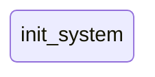
- State transitions:
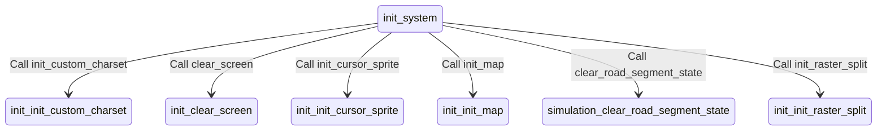

### State: init_custom_charset
- Mermaid state id: `init_init_custom_charset`
- Assembly body:
```asm
lda CIA2_PRA
and #$FC
ora #$02
sta CIA2_PRA
lda CPU_PORT
pha
and #$FB
sta CPU_PORT
lda #<CHARSET_ROM
sta ptr_lo
lda #>CHARSET_ROM
sta ptr_hi
lda #<CHARSET_RAM
sta ptr2_lo
lda #>CHARSET_RAM
sta ptr2_hi
lda #8
sta tmp4
```
- Mermaid state:
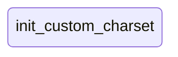
- State transitions:
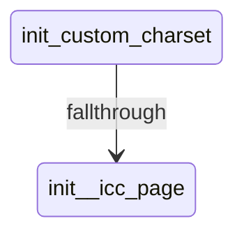

### State: @icc_page
- Mermaid state id: `init__icc_page`
- Assembly body:
```asm
ldy #0
```
- Mermaid state:

- State transitions:
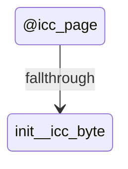

### State: @icc_byte
- Mermaid state id: `init__icc_byte`
- Assembly body:
```asm
lda (ptr_lo),y
sta (ptr2_lo),y
iny
bne @icc_byte
inc ptr_hi
inc ptr2_hi
dec tmp4
bne @icc_page
pla
sta CPU_PORT
lda #<custom_char_glyphs
sta ptr_lo
lda #>custom_char_glyphs
sta ptr_hi
lda #<(CHARSET_RAM + MAP_GLYPH_EMPTY * 8)
sta ptr2_lo
lda #>(CHARSET_RAM + MAP_GLYPH_EMPTY * 8)
sta ptr2_hi
lda #2
sta tmp4
```
- Mermaid state:

- State transitions:
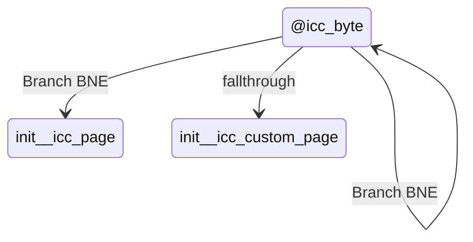

### State: @icc_custom_page
- Mermaid state id: `init__icc_custom_page`
- Assembly body:
```asm
ldy #0
```
- Mermaid state:

- State transitions:
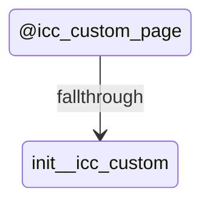

### State: @icc_custom
- Mermaid state id: `init__icc_custom`
- Assembly body:
```asm
lda (ptr_lo),y
sta (ptr2_lo),y
iny
bne @icc_custom
inc ptr_hi
inc ptr2_hi
dec tmp4
bne @icc_custom_page
lda #$AC
sta VIC_VMEM_CTRL
rts
```
- Mermaid state:

- State transitions:
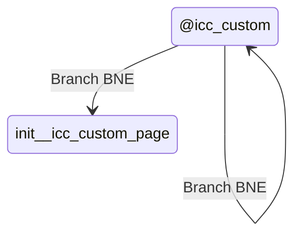

### State: init_cursor_sprite
- Mermaid state id: `init_init_cursor_sprite`
- Assembly body:
```asm
lda #<cursor_sprite_data
sta ptr_lo
lda #>cursor_sprite_data
sta ptr_hi
lda #<SPRITE0_DATA
sta ptr2_lo
lda #>SPRITE0_DATA
sta ptr2_hi
ldy #0
```
- Mermaid state:
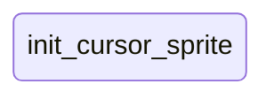
- State transitions:
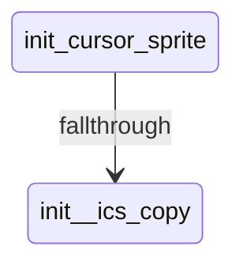

### State: @ics_copy
- Mermaid state id: `init__ics_copy`
- Assembly body:
```asm
lda (ptr_lo),y
sta (ptr2_lo),y
iny
cpy #64
bne @ics_copy
lda #SPRITE0_PTR
sta SPRITE0_PTR_LOC
lda VIC_SPR_X_MSB
and #$FE
sta VIC_SPR_X_MSB
lda VIC_SPR_EXP_X
and #$FE
sta VIC_SPR_EXP_X
lda VIC_SPR_EXP_Y
and #$FE
sta VIC_SPR_EXP_Y
lda VIC_SPR_MC
and #$FE
sta VIC_SPR_MC
lda VIC_SPR_BG_PRIO
and #$FE
sta VIC_SPR_BG_PRIO
lda #CURSOR_COLOR
sta VIC_SPR0_COLOR
jsr disable_cursor_sprite
rts
```
- Mermaid state:

- State transitions:
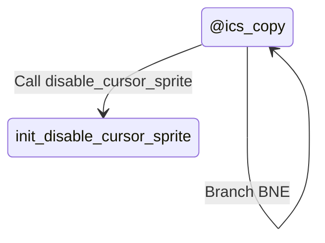

### State: enable_cursor_sprite
- Mermaid state id: `init_enable_cursor_sprite`
- Assembly body:
```asm
jsr update_cursor_display
lda VIC_SPRITE_EN
ora #$01
sta VIC_SPRITE_EN
rts
```
- Mermaid state:

- State transitions:
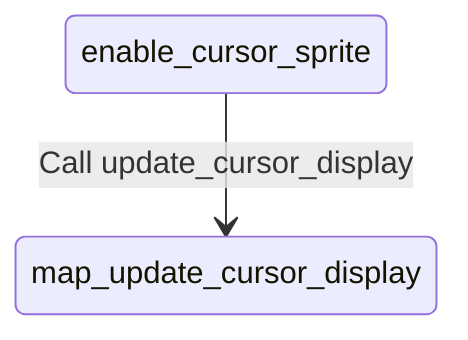

### State: disable_cursor_sprite
- Mermaid state id: `init_disable_cursor_sprite`
- Assembly body:
```asm
lda VIC_SPRITE_EN
and #$FE
sta VIC_SPRITE_EN
rts
```
- Mermaid state:
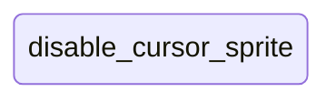
- State transitions:
```mermaid
stateDiagram-v2
    state "disable_cursor_sprite" as init_disable_cursor_sprite
```

### State: init_raster_split
- Mermaid state id: `init_init_raster_split`
- Assembly body:
```asm
lda #<raster_irq
sta IRQ_VECTOR_LO
lda #>raster_irq
sta IRQ_VECTOR_HI
lda #0
sta raster_phase
lda VIC_CTRL1
and #$7F
sta VIC_CTRL1
lda #RASTER_SPLIT_TOP
sta VIC_RASTER
lda #$01
sta VIC_IRQ_STATUS
lda VIC_IRQ_CTRL
ora #$01
sta VIC_IRQ_CTRL
rts
```
- Mermaid state:
```mermaid
stateDiagram-v2
state "init_raster_split" as init_init_raster_split
```
- State transitions:
```mermaid
stateDiagram-v2
    state "init_raster_split" as init_init_raster_split
```

### State: raster_irq
- Mermaid state id: `init_raster_irq`
- Assembly body:
```asm
lda VIC_IRQ_STATUS
and #$01
beq @chain_kernal
lda raster_phase
beq @top_phase
```
- Mermaid state:
```mermaid
stateDiagram-v2
state "raster_irq" as init_raster_irq
```
- State transitions:
```mermaid
stateDiagram-v2
    state "raster_irq" as init_raster_irq
    init_raster_irq --> init__chain_kernal : Branch BEQ
    init_raster_irq --> init__top_phase : Branch BEQ
    init_raster_irq --> init__lower_phase : fallthrough
```

### State: @lower_phase
- Mermaid state id: `init__lower_phase`
- Assembly body:
```asm
lda #COLOR_BLACK
sta VIC_BKG_CLR0
lda VIC_CTRL2
and #$EF
sta VIC_CTRL2
lda #0
sta raster_phase
lda #RASTER_SPLIT_TOP
sta VIC_RASTER
lda VIC_CTRL1
and #$7F
sta VIC_CTRL1
lda #$01
sta VIC_IRQ_STATUS
jmp @irq_done
```
- Mermaid state:
```mermaid
stateDiagram-v2
state "@lower_phase" as init__lower_phase
```
- State transitions:
```mermaid
stateDiagram-v2
    state "@lower_phase" as init__lower_phase
    init__lower_phase --> init__irq_done : Jmp JMP
    init__lower_phase --> init__top_phase : fallthrough
```

### State: @top_phase
- Mermaid state id: `init__top_phase`
- Assembly body:
```asm
lda split_top_bg
sta VIC_BKG_CLR0
lda VIC_CTRL2
ora #$10
sta VIC_CTRL2
lda #1
sta raster_phase
lda #RASTER_SPLIT_LOWER
sta VIC_RASTER
lda VIC_CTRL1
and #$7F
sta VIC_CTRL1
lda #$01
sta VIC_IRQ_STATUS
```
- Mermaid state:
```mermaid
stateDiagram-v2
state "@top_phase" as init__top_phase
```
- State transitions:
```mermaid
stateDiagram-v2
    state "@top_phase" as init__top_phase
    init__top_phase --> init__irq_done : fallthrough
```

### State: @irq_done
- Mermaid state id: `init__irq_done`
- Assembly body:
```asm
pla
tay
pla
tax
pla
rti
```
- Mermaid state:
```mermaid
stateDiagram-v2
state "@irq_done" as init__irq_done
```
- State transitions:
```mermaid
stateDiagram-v2
    state "@irq_done" as init__irq_done
```

### State: @chain_kernal
- Mermaid state id: `init__chain_kernal`
- Assembly body:
```asm
jmp KERNAL_IRQ
```
- Mermaid state:
```mermaid
stateDiagram-v2
state "@chain_kernal" as init__chain_kernal
```
- State transitions:
```mermaid
stateDiagram-v2
    state "@chain_kernal" as init__chain_kernal
    state "KERNAL_IRQ (external)" as external_KERNAL_IRQ
    init__chain_kernal --> external_KERNAL_IRQ : Jmp JMP
    init__chain_kernal --> init_clear_screen : fallthrough
```

### State: clear_screen
- Mermaid state id: `init_clear_screen`
- Assembly body:
```asm
lda #<SCREEN_BASE
sta ptr_lo
lda #>SCREEN_BASE
sta ptr_hi
lda #<COLOR_BASE
sta ptr2_lo
lda #>COLOR_BASE
sta ptr2_hi
ldx #3
```
- Mermaid state:
```mermaid
stateDiagram-v2
state "clear_screen" as init_clear_screen
```
- State transitions:
```mermaid
stateDiagram-v2
    state "clear_screen" as init_clear_screen
    init_clear_screen --> init__pg_loop : fallthrough
```

### State: @pg_loop
- Mermaid state id: `init__pg_loop`
- Assembly body:
```asm
ldy #0
```
- Mermaid state:
```mermaid
stateDiagram-v2
state "@pg_loop" as init__pg_loop
```
- State transitions:
```mermaid
stateDiagram-v2
    state "@pg_loop" as init__pg_loop
    init__pg_loop --> init__byte_loop : fallthrough
```

### State: @byte_loop
- Mermaid state id: `init__byte_loop`
- Assembly body:
```asm
lda #32
sta (ptr_lo),y
lda #COLOR_GREEN
sta (ptr2_lo),y
iny
bne @byte_loop
inc ptr_hi
inc ptr2_hi
dex
bne @pg_loop
ldy #0
```
- Mermaid state:
```mermaid
stateDiagram-v2
state "@byte_loop" as init__byte_loop
```
- State transitions:
```mermaid
stateDiagram-v2
    state "@byte_loop" as init__byte_loop
    init__byte_loop --> init__byte_loop : Branch BNE
    init__byte_loop --> init__pg_loop : Branch BNE
    init__byte_loop --> init__rem_loop : fallthrough
```

### State: @rem_loop
- Mermaid state id: `init__rem_loop`
- Assembly body:
```asm
lda #32
sta (ptr_lo),y
lda #COLOR_GREEN
sta (ptr2_lo),y
iny
cpy #(SCREEN_SIZE - 768)
bne @rem_loop
rts
```
- Mermaid state:
```mermaid
stateDiagram-v2
state "@rem_loop" as init__rem_loop
```
- State transitions:
```mermaid
stateDiagram-v2
    state "@rem_loop" as init__rem_loop
    init__rem_loop --> init__rem_loop : Branch BNE
```

### State: init_map
- Mermaid state id: `init_init_map`
- Assembly body:
```asm
lda #<city_map
sta ptr_lo
lda #>city_map
sta ptr_hi
lda #TILE_EMPTY
ldx #3
```
- Mermaid state:
```mermaid
stateDiagram-v2
state "init_map" as init_init_map
```
- State transitions:
```mermaid
stateDiagram-v2
    state "init_map" as init_init_map
    init_init_map --> init__im_pg : fallthrough
```

### State: @im_pg
- Mermaid state id: `init__im_pg`
- Assembly body:
```asm
ldy #0
```
- Mermaid state:
```mermaid
stateDiagram-v2
state "@im_pg" as init__im_pg
```
- State transitions:
```mermaid
stateDiagram-v2
    state "@im_pg" as init__im_pg
    init__im_pg --> init__im_inner : fallthrough
```

### State: @im_inner
- Mermaid state id: `init__im_inner`
- Assembly body:
```asm
sta (ptr_lo),y
iny
bne @im_inner
inc ptr_hi
dex
bne @im_pg
ldy #0
```
- Mermaid state:
```mermaid
stateDiagram-v2
state "@im_inner" as init__im_inner
```
- State transitions:
```mermaid
stateDiagram-v2
    state "@im_inner" as init__im_inner
    init__im_inner --> init__im_inner : Branch BNE
    init__im_inner --> init__im_pg : Branch BNE
    init__im_inner --> init__im_rem : fallthrough
```

### State: @im_rem
- Mermaid state id: `init__im_rem`
- Assembly body:
```asm
lda #TILE_EMPTY
sta (ptr_lo),y
iny
cpy #(MAP_SIZE - 768)
bne @im_rem
lda #<(city_map + 10 * MAP_WIDTH)
sta ptr_lo
lda #>(city_map + 10 * MAP_WIDTH)
sta ptr_hi
lda #TILE_WATER
ldy #0
```
- Mermaid state:
```mermaid
stateDiagram-v2
state "@im_rem" as init__im_rem
```
- State transitions:
```mermaid
stateDiagram-v2
    state "@im_rem" as init__im_rem
    init__im_rem --> init__im_rem : Branch BNE
    init__im_rem --> init__river : fallthrough
```

### State: @river
- Mermaid state id: `init__river`
- Assembly body:
```asm
sta (ptr_lo),y
iny
cpy #MAP_WIDTH
bne @river
rts
```
- Mermaid state:
```mermaid
stateDiagram-v2
state "@river" as init__river
```
- State transitions:
```mermaid
stateDiagram-v2
    state "@river" as init__river
    init__river --> init__river : Branch BNE
```

