# Assembly activity/state documentation

## Diagram
```mermaid
stateDiagram-v2
    state "read_input" as input_read_input
    state "@ri_process" as input__ri_process
    state "@ri_not_lc" as input__ri_not_lc
    state "@ri_check_w" as input__ri_check_w
    state "@ri_check_down" as input__ri_check_down
    state "@ri_check_s" as input__ri_check_s
    state "@ri_check_left" as input__ri_check_left
    state "@ri_check_a" as input__ri_check_a
    state "@ri_check_right" as input__ri_check_right
    state "@ri_check_d" as input__ri_check_d
    state "@ri_check_1" as input__ri_check_1
    state "@ri_check_2" as input__ri_check_2
    state "@ri_check_3" as input__ri_check_3
    state "@ri_check_4" as input__ri_check_4
    state "@ri_check_5" as input__ri_check_5
    state "@ri_check_6" as input__ri_check_6
    state "@ri_check_7" as input__ri_check_7
    state "@ri_check_action" as input__ri_check_action
    state "@ri_check_b" as input__ri_check_b
    state "@ri_check_x" as input__ri_check_x
    state "@ri_check_q" as input__ri_check_q
    state "@ri_unknown" as input__ri_unknown
    state "@ri_up" as input__ri_up
    state "@ri_up_move" as input__ri_up_move
    state "@ri_down" as input__ri_down
    state "@ri_down_move" as input__ri_down_move
    state "@ri_left" as input__ri_left
    state "@ri_left_move" as input__ri_left_move
    state "@ri_right" as input__ri_right
    state "@ri_right_move" as input__ri_right_move
    state "@ri_moved" as input__ri_moved
    state "@ri_sel1" as input__ri_sel1
    state "@ri_sel2" as input__ri_sel2
    state "@ri_sel3" as input__ri_sel3
    state "@ri_sel4" as input__ri_sel4
    state "@ri_sel5" as input__ri_sel5
    state "@ri_sel6" as input__ri_sel6
    state "@ri_sel7" as input__ri_sel7
    state "@ri_setsel" as input__ri_setsel
    state "@ri_build" as input__ri_build
    state "@ri_demo" as input__ri_demo
    state "@ri_quit" as input__ri_quit
    state "@ri_done" as input__ri_done

    [*] --> input_read_input
    input_read_input --> input__ri_process : Call KERNAL_GETIN
    input_read_input --> input__ri_process : Branch BNE
    input__ri_process --> input__ri_not_lc : Branch BCC
    input__ri_process --> input__ri_not_lc : Branch BCS
    input__ri_process --> input__ri_not_lc : fallthrough
    input__ri_not_lc --> input__ri_check_w : Branch BNE
    input__ri_not_lc --> input__ri_up : Jmp JMP
    input__ri_not_lc --> input__ri_check_w : fallthrough
    input__ri_check_w --> input__ri_check_down : Branch BNE
    input__ri_check_w --> input__ri_up : Jmp JMP
    input__ri_check_w --> input__ri_check_down : fallthrough
    input__ri_check_down --> input__ri_check_s : Branch BNE
    input__ri_check_down --> input__ri_down : Jmp JMP
    input__ri_check_down --> input__ri_check_s : fallthrough
    input__ri_check_s --> input__ri_check_left : Branch BNE
    input__ri_check_s --> input__ri_down : Jmp JMP
    input__ri_check_s --> input__ri_check_left : fallthrough
    input__ri_check_left --> input__ri_check_a : Branch BNE
    input__ri_check_left --> input__ri_left : Jmp JMP
    input__ri_check_left --> input__ri_check_a : fallthrough
    input__ri_check_a --> input__ri_check_right : Branch BNE
    input__ri_check_a --> input__ri_left : Jmp JMP
    input__ri_check_a --> input__ri_check_right : fallthrough
    input__ri_check_right --> input__ri_check_d : Branch BNE
    input__ri_check_right --> input__ri_right : Jmp JMP
    input__ri_check_right --> input__ri_check_d : fallthrough
    input__ri_check_d --> input__ri_check_1 : Branch BNE
    input__ri_check_d --> input__ri_right : Jmp JMP
    input__ri_check_d --> input__ri_check_1 : fallthrough
    input__ri_check_1 --> input__ri_check_2 : Branch BNE
    input__ri_check_1 --> input__ri_sel1 : Jmp JMP
    input__ri_check_1 --> input__ri_check_2 : fallthrough
    input__ri_check_2 --> input__ri_check_3 : Branch BNE
    input__ri_check_2 --> input__ri_sel2 : Jmp JMP
    input__ri_check_2 --> input__ri_check_3 : fallthrough
    input__ri_check_3 --> input__ri_check_4 : Branch BNE
    input__ri_check_3 --> input__ri_sel3 : Jmp JMP
    input__ri_check_3 --> input__ri_check_4 : fallthrough
    input__ri_check_4 --> input__ri_check_5 : Branch BNE
    input__ri_check_4 --> input__ri_sel4 : Jmp JMP
    input__ri_check_4 --> input__ri_check_5 : fallthrough
    input__ri_check_5 --> input__ri_check_6 : Branch BNE
    input__ri_check_5 --> input__ri_sel5 : Jmp JMP
    input__ri_check_5 --> input__ri_check_6 : fallthrough
    input__ri_check_6 --> input__ri_check_7 : Branch BNE
    input__ri_check_6 --> input__ri_sel6 : Jmp JMP
    input__ri_check_6 --> input__ri_check_7 : fallthrough
    input__ri_check_7 --> input__ri_check_action : Branch BNE
    input__ri_check_7 --> input__ri_sel7 : Jmp JMP
    input__ri_check_7 --> input__ri_check_action : fallthrough
    input__ri_check_action --> input__ri_check_b : Branch BNE
    input__ri_check_action --> input__ri_build : Jmp JMP
    input__ri_check_action --> input__ri_check_b : fallthrough
    input__ri_check_b --> input__ri_check_x : Branch BNE
    input__ri_check_b --> input__ri_build : Jmp JMP
    input__ri_check_b --> input__ri_check_x : fallthrough
    input__ri_check_x --> input__ri_check_q : Branch BNE
    input__ri_check_x --> input__ri_demo : Jmp JMP
    input__ri_check_x --> input__ri_check_q : fallthrough
    input__ri_check_q --> input__ri_unknown : Branch BNE
    input__ri_check_q --> input__ri_quit : Jmp JMP
    input__ri_check_q --> input__ri_unknown : fallthrough
    input__ri_up --> map_restore_cursor_color : Call restore_cursor_color
    input__ri_up --> input__ri_up_move : Branch BNE
    input__ri_up --> input__ri_done : Jmp JMP
    input__ri_up --> input__ri_up_move : fallthrough
    input__ri_up_move --> input__ri_moved : Jmp JMP
    input__ri_up_move --> input__ri_down : fallthrough
    input__ri_down --> map_restore_cursor_color : Call restore_cursor_color
    input__ri_down --> input__ri_down_move : Branch BNE
    input__ri_down --> input__ri_done : Jmp JMP
    input__ri_down --> input__ri_down_move : fallthrough
    input__ri_down_move --> input__ri_moved : Jmp JMP
    input__ri_down_move --> input__ri_left : fallthrough
    input__ri_left --> map_restore_cursor_color : Call restore_cursor_color
    input__ri_left --> input__ri_left_move : Branch BNE
    input__ri_left --> input__ri_done : Jmp JMP
    input__ri_left --> input__ri_left_move : fallthrough
    input__ri_left_move --> input__ri_moved : Jmp JMP
    input__ri_left_move --> input__ri_right : fallthrough
    input__ri_right --> map_restore_cursor_color : Call restore_cursor_color
    input__ri_right --> input__ri_right_move : Branch BNE
    input__ri_right --> input__ri_done : Jmp JMP
    input__ri_right --> input__ri_right_move : fallthrough
    input__ri_right_move --> input__ri_moved : fallthrough
    input__ri_sel1 --> input__ri_setsel : Branch BNE
    input__ri_sel1 --> input__ri_sel2 : fallthrough
    input__ri_sel2 --> input__ri_setsel : Branch BNE
    input__ri_sel2 --> input__ri_sel3 : fallthrough
    input__ri_sel3 --> input__ri_setsel : Branch BNE
    input__ri_sel3 --> input__ri_sel4 : fallthrough
    input__ri_sel4 --> input__ri_setsel : Branch BNE
    input__ri_sel4 --> input__ri_sel5 : fallthrough
    input__ri_sel5 --> input__ri_setsel : Branch BNE
    input__ri_sel5 --> input__ri_sel6 : fallthrough
    input__ri_sel6 --> input__ri_setsel : Branch BNE
    input__ri_sel6 --> input__ri_sel7 : fallthrough
    input__ri_sel7 --> input__ri_setsel : fallthrough
    input__ri_setsel --> buildings_show_building_name : Call show_building_name
    input__ri_build --> buildings_try_place_building : Call try_place_building
    input__ri_demo --> buildings_try_demolish : Call try_demolish
    input__ri_quit --> title_show_title : Call show_title
    input__ri_quit --> init_clear_screen : Call clear_screen
    input__ri_quit --> map_render_map : Call render_map
    input__ri_quit --> ui_draw_status_bar : Call draw_status_bar
    input__ri_quit --> init_enable_cursor_sprite : Call enable_cursor_sprite
    input__ri_quit --> input__ri_done : fallthrough
```

## Rendered Mermaid diagram


## State and transition documentation

### State: read_input
- Mermaid state id: `input_read_input`
- Assembly body:
```asm
jsr KERNAL_GETIN
bne @ri_process
rts
```
- Mermaid state:
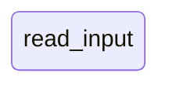
- State transitions:
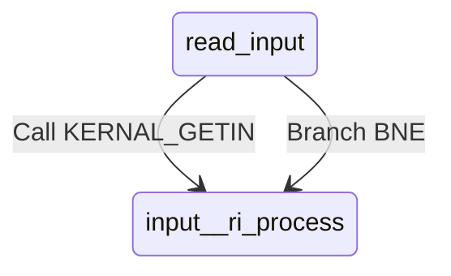

### State: @ri_process
- Mermaid state id: `input__ri_process`
- Assembly body:
```asm
cmp #$61
bcc @ri_not_lc
cmp #$7B
bcs @ri_not_lc
and #$DF
```
- Mermaid state:

- State transitions:
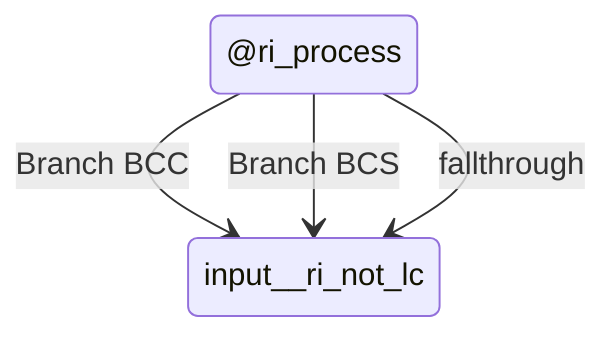

### State: @ri_not_lc
- Mermaid state id: `input__ri_not_lc`
- Assembly body:
```asm
cmp #KEY_CRSR_UP
bne @ri_check_w
jmp @ri_up
```
- Mermaid state:
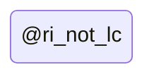
- State transitions:
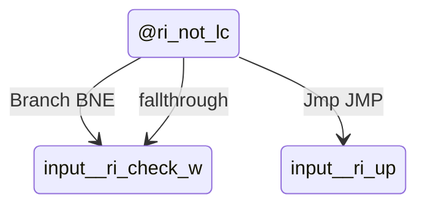

### State: @ri_check_w
- Mermaid state id: `input__ri_check_w`
- Assembly body:
```asm
cmp #KEY_CHR_W
bne @ri_check_down
jmp @ri_up
```
- Mermaid state:
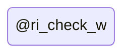
- State transitions:
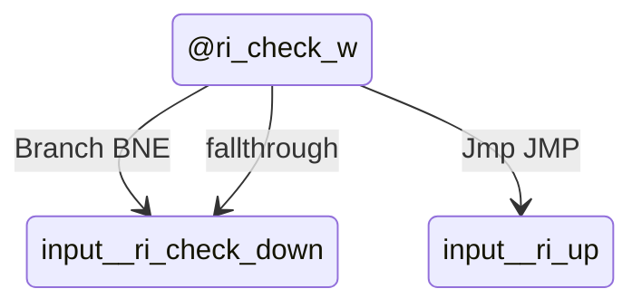

### State: @ri_check_down
- Mermaid state id: `input__ri_check_down`
- Assembly body:
```asm
cmp #KEY_CRSR_DOWN
bne @ri_check_s
jmp @ri_down
```
- Mermaid state:

- State transitions:
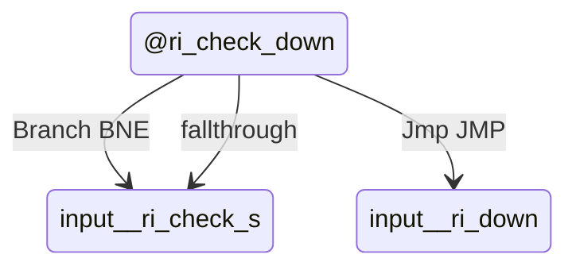

### State: @ri_check_s
- Mermaid state id: `input__ri_check_s`
- Assembly body:
```asm
cmp #KEY_CHR_S
bne @ri_check_left
jmp @ri_down
```
- Mermaid state:

- State transitions:
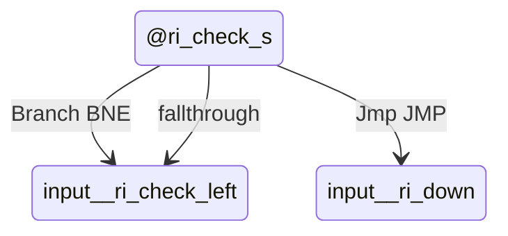

### State: @ri_check_left
- Mermaid state id: `input__ri_check_left`
- Assembly body:
```asm
cmp #KEY_CRSR_LEFT
bne @ri_check_a
jmp @ri_left
```
- Mermaid state:

- State transitions:
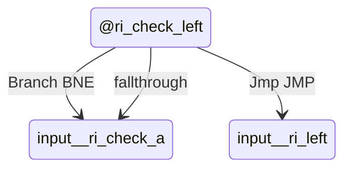

### State: @ri_check_a
- Mermaid state id: `input__ri_check_a`
- Assembly body:
```asm
cmp #KEY_CHR_A
bne @ri_check_right
jmp @ri_left
```
- Mermaid state:
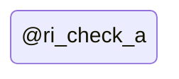
- State transitions:
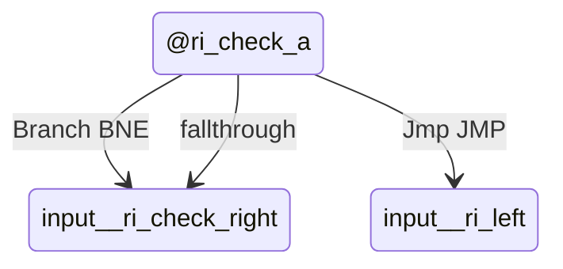

### State: @ri_check_right
- Mermaid state id: `input__ri_check_right`
- Assembly body:
```asm
cmp #KEY_CRSR_RIGHT
bne @ri_check_d
jmp @ri_right
```
- Mermaid state:

- State transitions:
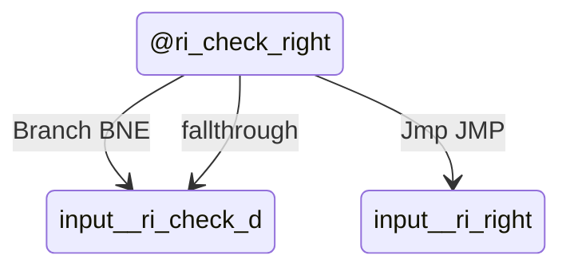

### State: @ri_check_d
- Mermaid state id: `input__ri_check_d`
- Assembly body:
```asm
cmp #KEY_CHR_D
bne @ri_check_1
jmp @ri_right
```
- Mermaid state:
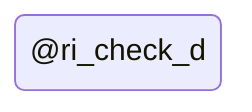
- State transitions:
```mermaid
stateDiagram-v2
    state "@ri_check_d" as input__ri_check_d
    input__ri_check_d --> input__ri_check_1 : Branch BNE
    input__ri_check_d --> input__ri_right : Jmp JMP
    input__ri_check_d --> input__ri_check_1 : fallthrough
```

### State: @ri_check_1
- Mermaid state id: `input__ri_check_1`
- Assembly body:
```asm
cmp #KEY_CHR_1
bne @ri_check_2
jmp @ri_sel1
```
- Mermaid state:
```mermaid
stateDiagram-v2
state "@ri_check_1" as input__ri_check_1
```
- State transitions:
```mermaid
stateDiagram-v2
    state "@ri_check_1" as input__ri_check_1
    input__ri_check_1 --> input__ri_check_2 : Branch BNE
    input__ri_check_1 --> input__ri_sel1 : Jmp JMP
    input__ri_check_1 --> input__ri_check_2 : fallthrough
```

### State: @ri_check_2
- Mermaid state id: `input__ri_check_2`
- Assembly body:
```asm
cmp #KEY_CHR_2
bne @ri_check_3
jmp @ri_sel2
```
- Mermaid state:
```mermaid
stateDiagram-v2
state "@ri_check_2" as input__ri_check_2
```
- State transitions:
```mermaid
stateDiagram-v2
    state "@ri_check_2" as input__ri_check_2
    input__ri_check_2 --> input__ri_check_3 : Branch BNE
    input__ri_check_2 --> input__ri_sel2 : Jmp JMP
    input__ri_check_2 --> input__ri_check_3 : fallthrough
```

### State: @ri_check_3
- Mermaid state id: `input__ri_check_3`
- Assembly body:
```asm
cmp #KEY_CHR_3
bne @ri_check_4
jmp @ri_sel3
```
- Mermaid state:
```mermaid
stateDiagram-v2
state "@ri_check_3" as input__ri_check_3
```
- State transitions:
```mermaid
stateDiagram-v2
    state "@ri_check_3" as input__ri_check_3
    input__ri_check_3 --> input__ri_check_4 : Branch BNE
    input__ri_check_3 --> input__ri_sel3 : Jmp JMP
    input__ri_check_3 --> input__ri_check_4 : fallthrough
```

### State: @ri_check_4
- Mermaid state id: `input__ri_check_4`
- Assembly body:
```asm
cmp #KEY_CHR_4
bne @ri_check_5
jmp @ri_sel4
```
- Mermaid state:
```mermaid
stateDiagram-v2
state "@ri_check_4" as input__ri_check_4
```
- State transitions:
```mermaid
stateDiagram-v2
    state "@ri_check_4" as input__ri_check_4
    input__ri_check_4 --> input__ri_check_5 : Branch BNE
    input__ri_check_4 --> input__ri_sel4 : Jmp JMP
    input__ri_check_4 --> input__ri_check_5 : fallthrough
```

### State: @ri_check_5
- Mermaid state id: `input__ri_check_5`
- Assembly body:
```asm
cmp #KEY_CHR_5
bne @ri_check_6
jmp @ri_sel5
```
- Mermaid state:
```mermaid
stateDiagram-v2
state "@ri_check_5" as input__ri_check_5
```
- State transitions:
```mermaid
stateDiagram-v2
    state "@ri_check_5" as input__ri_check_5
    input__ri_check_5 --> input__ri_check_6 : Branch BNE
    input__ri_check_5 --> input__ri_sel5 : Jmp JMP
    input__ri_check_5 --> input__ri_check_6 : fallthrough
```

### State: @ri_check_6
- Mermaid state id: `input__ri_check_6`
- Assembly body:
```asm
cmp #KEY_CHR_6
bne @ri_check_7
jmp @ri_sel6
```
- Mermaid state:
```mermaid
stateDiagram-v2
state "@ri_check_6" as input__ri_check_6
```
- State transitions:
```mermaid
stateDiagram-v2
    state "@ri_check_6" as input__ri_check_6
    input__ri_check_6 --> input__ri_check_7 : Branch BNE
    input__ri_check_6 --> input__ri_sel6 : Jmp JMP
    input__ri_check_6 --> input__ri_check_7 : fallthrough
```

### State: @ri_check_7
- Mermaid state id: `input__ri_check_7`
- Assembly body:
```asm
cmp #KEY_CHR_7
bne @ri_check_action
jmp @ri_sel7
```
- Mermaid state:
```mermaid
stateDiagram-v2
state "@ri_check_7" as input__ri_check_7
```
- State transitions:
```mermaid
stateDiagram-v2
    state "@ri_check_7" as input__ri_check_7
    input__ri_check_7 --> input__ri_check_action : Branch BNE
    input__ri_check_7 --> input__ri_sel7 : Jmp JMP
    input__ri_check_7 --> input__ri_check_action : fallthrough
```

### State: @ri_check_action
- Mermaid state id: `input__ri_check_action`
- Assembly body:
```asm
cmp #KEY_RETURN
bne @ri_check_b
jmp @ri_build
```
- Mermaid state:
```mermaid
stateDiagram-v2
state "@ri_check_action" as input__ri_check_action
```
- State transitions:
```mermaid
stateDiagram-v2
    state "@ri_check_action" as input__ri_check_action
    input__ri_check_action --> input__ri_check_b : Branch BNE
    input__ri_check_action --> input__ri_build : Jmp JMP
    input__ri_check_action --> input__ri_check_b : fallthrough
```

### State: @ri_check_b
- Mermaid state id: `input__ri_check_b`
- Assembly body:
```asm
cmp #KEY_CHR_B
bne @ri_check_x
jmp @ri_build
```
- Mermaid state:
```mermaid
stateDiagram-v2
state "@ri_check_b" as input__ri_check_b
```
- State transitions:
```mermaid
stateDiagram-v2
    state "@ri_check_b" as input__ri_check_b
    input__ri_check_b --> input__ri_check_x : Branch BNE
    input__ri_check_b --> input__ri_build : Jmp JMP
    input__ri_check_b --> input__ri_check_x : fallthrough
```

### State: @ri_check_x
- Mermaid state id: `input__ri_check_x`
- Assembly body:
```asm
cmp #KEY_CHR_X
bne @ri_check_q
jmp @ri_demo
```
- Mermaid state:
```mermaid
stateDiagram-v2
state "@ri_check_x" as input__ri_check_x
```
- State transitions:
```mermaid
stateDiagram-v2
    state "@ri_check_x" as input__ri_check_x
    input__ri_check_x --> input__ri_check_q : Branch BNE
    input__ri_check_x --> input__ri_demo : Jmp JMP
    input__ri_check_x --> input__ri_check_q : fallthrough
```

### State: @ri_check_q
- Mermaid state id: `input__ri_check_q`
- Assembly body:
```asm
cmp #KEY_CHR_Q
bne @ri_unknown
jmp @ri_quit
```
- Mermaid state:
```mermaid
stateDiagram-v2
state "@ri_check_q" as input__ri_check_q
```
- State transitions:
```mermaid
stateDiagram-v2
    state "@ri_check_q" as input__ri_check_q
    input__ri_check_q --> input__ri_unknown : Branch BNE
    input__ri_check_q --> input__ri_quit : Jmp JMP
    input__ri_check_q --> input__ri_unknown : fallthrough
```

### State: @ri_unknown
- Mermaid state id: `input__ri_unknown`
- Assembly body:
```asm
rts
```
- Mermaid state:
```mermaid
stateDiagram-v2
state "@ri_unknown" as input__ri_unknown
```
- State transitions:
```mermaid
stateDiagram-v2
    state "@ri_unknown" as input__ri_unknown
```

### State: @ri_up
- Mermaid state id: `input__ri_up`
- Assembly body:
```asm
jsr restore_cursor_color
lda cursor_y
bne @ri_up_move
jmp @ri_done
```
- Mermaid state:
```mermaid
stateDiagram-v2
state "@ri_up" as input__ri_up
```
- State transitions:
```mermaid
stateDiagram-v2
    state "@ri_up" as input__ri_up
    input__ri_up --> map_restore_cursor_color : Call restore_cursor_color
    input__ri_up --> input__ri_up_move : Branch BNE
    input__ri_up --> input__ri_done : Jmp JMP
    input__ri_up --> input__ri_up_move : fallthrough
```

### State: @ri_up_move
- Mermaid state id: `input__ri_up_move`
- Assembly body:
```asm
dec cursor_y
jmp @ri_moved
```
- Mermaid state:
```mermaid
stateDiagram-v2
state "@ri_up_move" as input__ri_up_move
```
- State transitions:
```mermaid
stateDiagram-v2
    state "@ri_up_move" as input__ri_up_move
    input__ri_up_move --> input__ri_moved : Jmp JMP
    input__ri_up_move --> input__ri_down : fallthrough
```

### State: @ri_down
- Mermaid state id: `input__ri_down`
- Assembly body:
```asm
jsr restore_cursor_color
lda cursor_y
cmp #MAP_HEIGHT - 1
bne @ri_down_move
jmp @ri_done
```
- Mermaid state:
```mermaid
stateDiagram-v2
state "@ri_down" as input__ri_down
```
- State transitions:
```mermaid
stateDiagram-v2
    state "@ri_down" as input__ri_down
    input__ri_down --> map_restore_cursor_color : Call restore_cursor_color
    input__ri_down --> input__ri_down_move : Branch BNE
    input__ri_down --> input__ri_done : Jmp JMP
    input__ri_down --> input__ri_down_move : fallthrough
```

### State: @ri_down_move
- Mermaid state id: `input__ri_down_move`
- Assembly body:
```asm
inc cursor_y
jmp @ri_moved
```
- Mermaid state:
```mermaid
stateDiagram-v2
state "@ri_down_move" as input__ri_down_move
```
- State transitions:
```mermaid
stateDiagram-v2
    state "@ri_down_move" as input__ri_down_move
    input__ri_down_move --> input__ri_moved : Jmp JMP
    input__ri_down_move --> input__ri_left : fallthrough
```

### State: @ri_left
- Mermaid state id: `input__ri_left`
- Assembly body:
```asm
jsr restore_cursor_color
lda cursor_x
bne @ri_left_move
jmp @ri_done
```
- Mermaid state:
```mermaid
stateDiagram-v2
state "@ri_left" as input__ri_left
```
- State transitions:
```mermaid
stateDiagram-v2
    state "@ri_left" as input__ri_left
    input__ri_left --> map_restore_cursor_color : Call restore_cursor_color
    input__ri_left --> input__ri_left_move : Branch BNE
    input__ri_left --> input__ri_done : Jmp JMP
    input__ri_left --> input__ri_left_move : fallthrough
```

### State: @ri_left_move
- Mermaid state id: `input__ri_left_move`
- Assembly body:
```asm
dec cursor_x
jmp @ri_moved
```
- Mermaid state:
```mermaid
stateDiagram-v2
state "@ri_left_move" as input__ri_left_move
```
- State transitions:
```mermaid
stateDiagram-v2
    state "@ri_left_move" as input__ri_left_move
    input__ri_left_move --> input__ri_moved : Jmp JMP
    input__ri_left_move --> input__ri_right : fallthrough
```

### State: @ri_right
- Mermaid state id: `input__ri_right`
- Assembly body:
```asm
jsr restore_cursor_color
lda cursor_x
cmp #MAP_WIDTH - 1
bne @ri_right_move
jmp @ri_done
```
- Mermaid state:
```mermaid
stateDiagram-v2
state "@ri_right" as input__ri_right
```
- State transitions:
```mermaid
stateDiagram-v2
    state "@ri_right" as input__ri_right
    input__ri_right --> map_restore_cursor_color : Call restore_cursor_color
    input__ri_right --> input__ri_right_move : Branch BNE
    input__ri_right --> input__ri_done : Jmp JMP
    input__ri_right --> input__ri_right_move : fallthrough
```

### State: @ri_right_move
- Mermaid state id: `input__ri_right_move`
- Assembly body:
```asm
inc cursor_x
```
- Mermaid state:
```mermaid
stateDiagram-v2
state "@ri_right_move" as input__ri_right_move
```
- State transitions:
```mermaid
stateDiagram-v2
    state "@ri_right_move" as input__ri_right_move
    input__ri_right_move --> input__ri_moved : fallthrough
```

### State: @ri_moved
- Mermaid state id: `input__ri_moved`
- Assembly body:
```asm
lda #1
sta dirty_map
sta dirty_ui
rts
```
- Mermaid state:
```mermaid
stateDiagram-v2
state "@ri_moved" as input__ri_moved
```
- State transitions:
```mermaid
stateDiagram-v2
    state "@ri_moved" as input__ri_moved
```

### State: @ri_sel1
- Mermaid state id: `input__ri_sel1`
- Assembly body:
```asm
lda #TILE_ROAD
bne @ri_setsel
```
- Mermaid state:
```mermaid
stateDiagram-v2
state "@ri_sel1" as input__ri_sel1
```
- State transitions:
```mermaid
stateDiagram-v2
    state "@ri_sel1" as input__ri_sel1
    input__ri_sel1 --> input__ri_setsel : Branch BNE
    input__ri_sel1 --> input__ri_sel2 : fallthrough
```

### State: @ri_sel2
- Mermaid state id: `input__ri_sel2`
- Assembly body:
```asm
lda #TILE_HOUSE
bne @ri_setsel
```
- Mermaid state:
```mermaid
stateDiagram-v2
state "@ri_sel2" as input__ri_sel2
```
- State transitions:
```mermaid
stateDiagram-v2
    state "@ri_sel2" as input__ri_sel2
    input__ri_sel2 --> input__ri_setsel : Branch BNE
    input__ri_sel2 --> input__ri_sel3 : fallthrough
```

### State: @ri_sel3
- Mermaid state id: `input__ri_sel3`
- Assembly body:
```asm
lda #TILE_FACTORY
bne @ri_setsel
```
- Mermaid state:
```mermaid
stateDiagram-v2
state "@ri_sel3" as input__ri_sel3
```
- State transitions:
```mermaid
stateDiagram-v2
    state "@ri_sel3" as input__ri_sel3
    input__ri_sel3 --> input__ri_setsel : Branch BNE
    input__ri_sel3 --> input__ri_sel4 : fallthrough
```

### State: @ri_sel4
- Mermaid state id: `input__ri_sel4`
- Assembly body:
```asm
lda #TILE_PARK
bne @ri_setsel
```
- Mermaid state:
```mermaid
stateDiagram-v2
state "@ri_sel4" as input__ri_sel4
```
- State transitions:
```mermaid
stateDiagram-v2
    state "@ri_sel4" as input__ri_sel4
    input__ri_sel4 --> input__ri_setsel : Branch BNE
    input__ri_sel4 --> input__ri_sel5 : fallthrough
```

### State: @ri_sel5
- Mermaid state id: `input__ri_sel5`
- Assembly body:
```asm
lda #TILE_POWER
bne @ri_setsel
```
- Mermaid state:
```mermaid
stateDiagram-v2
state "@ri_sel5" as input__ri_sel5
```
- State transitions:
```mermaid
stateDiagram-v2
    state "@ri_sel5" as input__ri_sel5
    input__ri_sel5 --> input__ri_setsel : Branch BNE
    input__ri_sel5 --> input__ri_sel6 : fallthrough
```

### State: @ri_sel6
- Mermaid state id: `input__ri_sel6`
- Assembly body:
```asm
lda #TILE_POLICE
bne @ri_setsel
```
- Mermaid state:
```mermaid
stateDiagram-v2
state "@ri_sel6" as input__ri_sel6
```
- State transitions:
```mermaid
stateDiagram-v2
    state "@ri_sel6" as input__ri_sel6
    input__ri_sel6 --> input__ri_setsel : Branch BNE
    input__ri_sel6 --> input__ri_sel7 : fallthrough
```

### State: @ri_sel7
- Mermaid state id: `input__ri_sel7`
- Assembly body:
```asm
lda #TILE_FIRE
```
- Mermaid state:
```mermaid
stateDiagram-v2
state "@ri_sel7" as input__ri_sel7
```
- State transitions:
```mermaid
stateDiagram-v2
    state "@ri_sel7" as input__ri_sel7
    input__ri_sel7 --> input__ri_setsel : fallthrough
```

### State: @ri_setsel
- Mermaid state id: `input__ri_setsel`
- Assembly body:
```asm
sta sel_building
lda #MODE_BUILD
sta game_mode
lda #1
sta dirty_ui
jsr show_building_name
rts
```
- Mermaid state:
```mermaid
stateDiagram-v2
state "@ri_setsel" as input__ri_setsel
```
- State transitions:
```mermaid
stateDiagram-v2
    state "@ri_setsel" as input__ri_setsel
    input__ri_setsel --> buildings_show_building_name : Call show_building_name
```

### State: @ri_build
- Mermaid state id: `input__ri_build`
- Assembly body:
```asm
lda #MODE_BUILD
sta game_mode
jsr try_place_building
rts
```
- Mermaid state:
```mermaid
stateDiagram-v2
state "@ri_build" as input__ri_build
```
- State transitions:
```mermaid
stateDiagram-v2
    state "@ri_build" as input__ri_build
    input__ri_build --> buildings_try_place_building : Call try_place_building
```

### State: @ri_demo
- Mermaid state id: `input__ri_demo`
- Assembly body:
```asm
lda #MODE_DEMO
sta game_mode
jsr try_demolish
rts
```
- Mermaid state:
```mermaid
stateDiagram-v2
state "@ri_demo" as input__ri_demo
```
- State transitions:
```mermaid
stateDiagram-v2
    state "@ri_demo" as input__ri_demo
    input__ri_demo --> buildings_try_demolish : Call try_demolish
```

### State: @ri_quit
- Mermaid state id: `input__ri_quit`
- Assembly body:
```asm
jsr show_title
jsr clear_screen
jsr render_map
jsr draw_status_bar
jsr enable_cursor_sprite
```
- Mermaid state:
```mermaid
stateDiagram-v2
state "@ri_quit" as input__ri_quit
```
- State transitions:
```mermaid
stateDiagram-v2
    state "@ri_quit" as input__ri_quit
    input__ri_quit --> title_show_title : Call show_title
    input__ri_quit --> init_clear_screen : Call clear_screen
    input__ri_quit --> map_render_map : Call render_map
    input__ri_quit --> ui_draw_status_bar : Call draw_status_bar
    input__ri_quit --> init_enable_cursor_sprite : Call enable_cursor_sprite
    input__ri_quit --> input__ri_done : fallthrough
```

### State: @ri_done
- Mermaid state id: `input__ri_done`
- Assembly body:
```asm
rts
```
- Mermaid state:
```mermaid
stateDiagram-v2
state "@ri_done" as input__ri_done
```
- State transitions:
```mermaid
stateDiagram-v2
    state "@ri_done" as input__ri_done
```

