# Assembly activity/state documentation

## Diagram
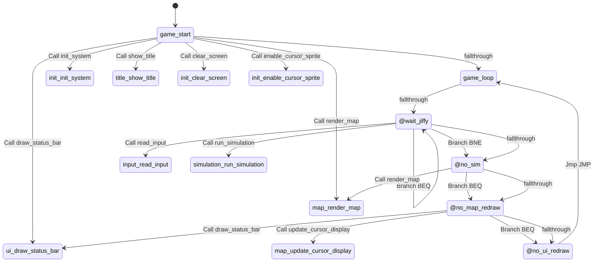

## Rendered Mermaid diagram


## State and transition documentation

### State: game_start
- Mermaid state id: `main_game_start`
- Assembly body:
```asm
jsr init_system
jsr show_title
jsr clear_screen
jsr render_map
jsr draw_status_bar
jsr enable_cursor_sprite
```
- Mermaid state:
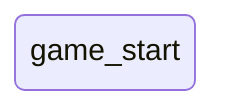
- State transitions:
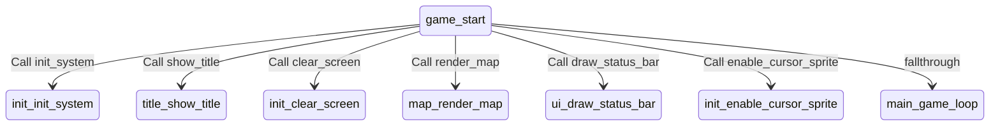

### State: game_loop
- Mermaid state id: `main_game_loop`
- Assembly body:
```asm
; (empty)
```
- Mermaid state:
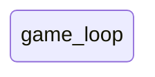
- State transitions:
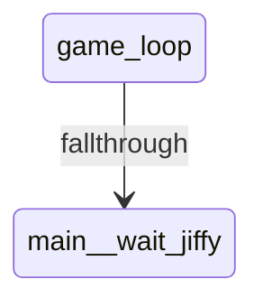

### State: @wait_jiffy
- Mermaid state id: `main__wait_jiffy`
- Assembly body:
```asm
lda JIFFY_LO
cmp last_jiffy
beq @wait_jiffy
sta last_jiffy
jsr read_input
dec sim_counter
bne @no_sim
jsr run_simulation
```
- Mermaid state:
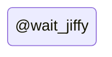
- State transitions:
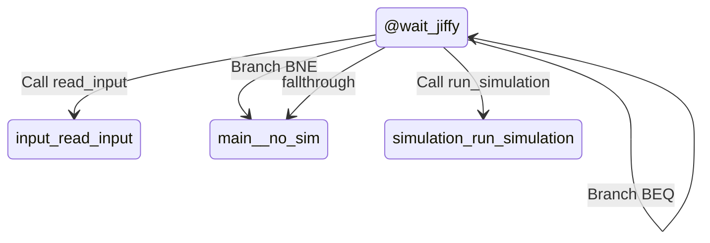

### State: @no_sim
- Mermaid state id: `main__no_sim`
- Assembly body:
```asm
lda dirty_map
beq @no_map_redraw
jsr render_map
```
- Mermaid state:
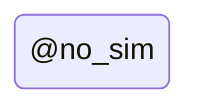
- State transitions:
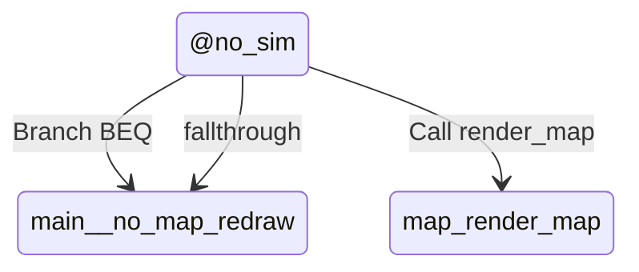

### State: @no_map_redraw
- Mermaid state id: `main__no_map_redraw`
- Assembly body:
```asm
jsr update_cursor_display
lda dirty_ui
beq @no_ui_redraw
jsr draw_status_bar
```
- Mermaid state:
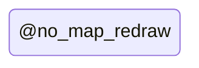
- State transitions:
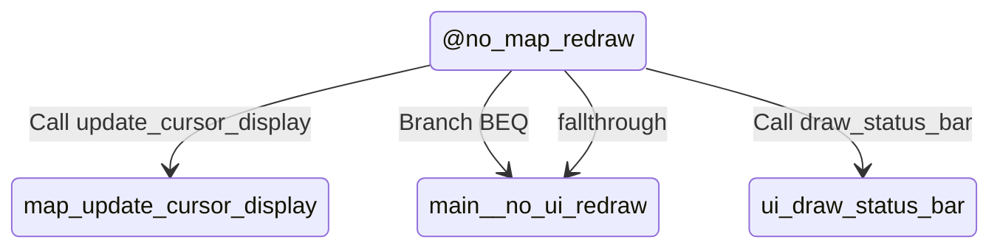

### State: @no_ui_redraw
- Mermaid state id: `main__no_ui_redraw`
- Assembly body:
```asm
jmp game_loop
.include "init.s"
.include "title.s"
.include "input.s"
.include "map.s"
.include "buildings.s"
.include "simulation.s"
.include "ui.s"
.include "data.s"
```
- Mermaid state:
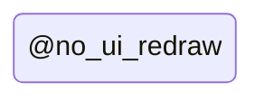
- State transitions:
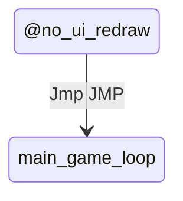

