# Assembly activity/state documentation

## Diagram
```mermaid
stateDiagram-v2
    state "render_map" as map_render_map
    state "@rm_row" as map__rm_row
    state "@rm_col" as map__rm_col
    state "render_tile" as map_render_tile
    state "render_road_neighborhood" as map_render_road_neighborhood
    state "@rrn_render_north" as map__rrn_render_north
    state "@rrn_restore_north" as map__rrn_restore_north
    state "@rrn_south" as map__rrn_south
    state "@rrn_render_south" as map__rrn_render_south
    state "@rrn_restore_south" as map__rrn_restore_south
    state "@rrn_east" as map__rrn_east
    state "@rrn_render_east" as map__rrn_render_east
    state "@rrn_restore_east" as map__rrn_restore_east
    state "@rrn_west" as map__rrn_west
    state "@rrn_render_west" as map__rrn_render_west
    state "@rrn_restore_west" as map__rrn_restore_west
    state "render_road_neighborhood_exit" as map_render_road_neighborhood_exit
    state "@rrn_done" as map__rrn_done
    state "get_tile_screen_char" as map_get_tile_screen_char
    state "@gtsc_base" as map__gtsc_base
    state "@gtsc_road" as map__gtsc_road
    state "get_road_screen_char" as map_get_road_screen_char
    state "@grsc_north_yes" as map__grsc_north_yes
    state "@grsc_south" as map__grsc_south
    state "@grsc_south_yes" as map__grsc_south_yes
    state "@grsc_east" as map__grsc_east
    state "@grsc_east_yes" as map__grsc_east_yes
    state "@grsc_west" as map__grsc_west
    state "@grsc_west_yes" as map__grsc_west_yes
    state "@grsc_lookup" as map__grsc_lookup
    state "get_tile" as map_get_tile
    state "set_tile" as map_set_tile
    state "update_cursor_display" as map_update_cursor_display
    state "@ucd_store_x" as map__ucd_store_x
    state "update_cursor_aoe_state" as map_update_cursor_aoe_state
    state "@ucao_house" as map__ucao_house
    state "@ucao_factory" as map__ucao_factory
    state "@ucao_enable" as map__ucao_enable
    state "@ucao_park" as map__ucao_park
    state "@ucao_police" as map__ucao_police
    state "@ucao_fire" as map__ucao_fire
    state "@ucao_store" as map__ucao_store
    state "tile_in_cursor_aoe" as map_tile_in_cursor_aoe
    state "@tica_dx" as map__tica_dx
    state "@tica_dx_abs" as map__tica_dx_abs
    state "@tica_dy" as map__tica_dy
    state "@tica_dy_abs" as map__tica_dy_abs
    state "@tica_yes" as map__tica_yes
    state "get_tile_draw_color" as map_get_tile_draw_color
    state "@gtdc_base" as map__gtdc_base
    state "get_tile_highlight_color" as map_get_tile_highlight_color
    state "@gthc_base" as map__gthc_base
    state "restore_cursor_color" as map_restore_cursor_color
    state "@rcc_no_carry" as map__rcc_no_carry

    [*] --> map_render_map
    map_render_map --> map__rm_row : fallthrough
    map__rm_row --> map__rm_col : fallthrough
    map__rm_col --> map_render_tile : Call render_tile
    map__rm_col --> map__rm_col : Branch BNE
    map__rm_col --> map__rm_row : Branch BNE
    map_render_tile --> map_update_cursor_aoe_state : Call update_cursor_aoe_state
    map_render_tile --> map_get_tile_screen_char : Call get_tile_screen_char
    map_render_tile --> map_get_tile_draw_color : Call get_tile_draw_color
    map_render_road_neighborhood --> map_render_tile : Call render_tile
    map_render_road_neighborhood --> map__rrn_south : Branch BEQ
    map_render_road_neighborhood --> map_get_tile : Call get_tile
    map_render_road_neighborhood --> map__rrn_render_north : Branch BEQ
    map_render_road_neighborhood --> map__rrn_restore_north : Branch BNE
    map_render_road_neighborhood --> map__rrn_render_north : fallthrough
    map__rrn_render_north --> map_render_tile : Call render_tile
    map__rrn_render_north --> map__rrn_restore_north : fallthrough
    map__rrn_restore_north --> map__rrn_south : fallthrough
    map__rrn_south --> map__rrn_east : Branch BEQ
    map__rrn_south --> map_get_tile : Call get_tile
    map__rrn_south --> map__rrn_render_south : Branch BEQ
    map__rrn_south --> map__rrn_restore_south : Branch BNE
    map__rrn_south --> map__rrn_render_south : fallthrough
    map__rrn_render_south --> map_render_tile : Call render_tile
    map__rrn_render_south --> map__rrn_restore_south : fallthrough
    map__rrn_restore_south --> map__rrn_east : fallthrough
    map__rrn_east --> map__rrn_west : Branch BEQ
    map__rrn_east --> map_get_tile : Call get_tile
    map__rrn_east --> map__rrn_render_east : Branch BEQ
    map__rrn_east --> map__rrn_restore_east : Branch BNE
    map__rrn_east --> map__rrn_render_east : fallthrough
    map__rrn_render_east --> map_render_tile : Call render_tile
    map__rrn_render_east --> map__rrn_restore_east : fallthrough
    map__rrn_restore_east --> map__rrn_west : fallthrough
    map__rrn_west --> map__rrn_done : Branch BEQ
    map__rrn_west --> map_get_tile : Call get_tile
    map__rrn_west --> map__rrn_render_west : Branch BEQ
    map__rrn_west --> map__rrn_restore_west : Branch BNE
    map__rrn_west --> map__rrn_render_west : fallthrough
    map__rrn_render_west --> map_render_tile : Call render_tile
    map__rrn_render_west --> map__rrn_restore_west : fallthrough
    map__rrn_restore_west --> map_render_road_neighborhood_exit : fallthrough
    map_render_road_neighborhood_exit --> map__rrn_done : fallthrough
    map_get_tile_screen_char --> map__gtsc_road : Branch BEQ
    map_get_tile_screen_char --> map__gtsc_road : Branch BEQ
    map_get_tile_screen_char --> map_tile_in_cursor_aoe : Call tile_in_cursor_aoe
    map_get_tile_screen_char --> map__gtsc_base : Branch BEQ
    map__gtsc_road --> map_get_road_screen_char : Call get_road_screen_char
    map__gtsc_road --> map_tile_in_cursor_aoe : Call tile_in_cursor_aoe
    map__gtsc_road --> map__gtsc_base : Branch BEQ
    map_get_road_screen_char --> map__grsc_south : Branch BEQ
    map_get_road_screen_char --> map_get_tile : Call get_tile
    map_get_road_screen_char --> map__grsc_north_yes : Branch BEQ
    map_get_road_screen_char --> map__grsc_south : Branch BNE
    map_get_road_screen_char --> map__grsc_north_yes : fallthrough
    map__grsc_north_yes --> map__grsc_south : fallthrough
    map__grsc_south --> map__grsc_east : Branch BEQ
    map__grsc_south --> map_get_tile : Call get_tile
    map__grsc_south --> map__grsc_south_yes : Branch BEQ
    map__grsc_south --> map__grsc_east : Branch BNE
    map__grsc_south --> map__grsc_south_yes : fallthrough
    map__grsc_south_yes --> map__grsc_east : fallthrough
    map__grsc_east --> map__grsc_west : Branch BEQ
    map__grsc_east --> map_get_tile : Call get_tile
    map__grsc_east --> map__grsc_east_yes : Branch BEQ
    map__grsc_east --> map__grsc_west : Branch BNE
    map__grsc_east --> map__grsc_east_yes : fallthrough
    map__grsc_east_yes --> map__grsc_west : fallthrough
    map__grsc_west --> map__grsc_lookup : Branch BEQ
    map__grsc_west --> map_get_tile : Call get_tile
    map__grsc_west --> map__grsc_west_yes : Branch BEQ
    map__grsc_west --> map__grsc_lookup : Branch BNE
    map__grsc_west --> map__grsc_west_yes : fallthrough
    map__grsc_west_yes --> map__grsc_lookup : fallthrough
    map_update_cursor_display --> map__ucd_store_x : Branch BEQ
    map_update_cursor_display --> map__ucd_store_x : fallthrough
    map_update_cursor_aoe_state --> map_get_tile : Call get_tile
    map_update_cursor_aoe_state --> map_get_tile_highlight_color : Call get_tile_highlight_color
    map_update_cursor_aoe_state --> map__ucao_house : Branch BEQ
    map_update_cursor_aoe_state --> map__ucao_factory : Branch BEQ
    map_update_cursor_aoe_state --> map__ucao_park : Branch BEQ
    map_update_cursor_aoe_state --> map__ucao_police : Branch BEQ
    map_update_cursor_aoe_state --> map__ucao_fire : Branch BEQ
    map__ucao_house --> buildings_get_tile_density_units : Call get_tile_density_units
    map__ucao_house --> map__ucao_enable : Branch BNE
    map__ucao_house --> map__ucao_factory : fallthrough
    map__ucao_factory --> buildings_get_tile_density_units : Call get_tile_density_units
    map__ucao_factory --> map__ucao_enable : fallthrough
    map__ucao_park --> map__ucao_store : Branch BNE
    map__ucao_park --> map__ucao_police : fallthrough
    map__ucao_police --> map__ucao_store : Branch BNE
    map__ucao_police --> map__ucao_fire : fallthrough
    map__ucao_fire --> map__ucao_store : fallthrough
    map_tile_in_cursor_aoe --> map__tica_dx : Branch BNE
    map__tica_dx --> map__tica_dx_abs : Branch BCS
    map__tica_dx --> map__tica_dx_abs : fallthrough
    map__tica_dx_abs --> map__tica_dy : Branch BCC
    map__tica_dx_abs --> map__tica_dy : Branch BEQ
    map__tica_dy --> map__tica_dy_abs : Branch BCS
    map__tica_dy --> map__tica_dy_abs : fallthrough
    map__tica_dy_abs --> map__tica_yes : Branch BCC
    map__tica_dy_abs --> map__tica_yes : Branch BEQ
    map_get_tile_draw_color --> map__gtdc_base : Branch BCC
    map_get_tile_draw_color --> map__gtdc_base : Branch BCS
    map_get_tile_highlight_color --> map__gthc_base : Branch BCC
    map_get_tile_highlight_color --> map__gthc_base : Branch BCS
    map_restore_cursor_color --> map_get_tile : Call get_tile
    map_restore_cursor_color --> map_get_tile_draw_color : Call get_tile_draw_color
    map_restore_cursor_color --> map__rcc_no_carry : Branch BCC
    map_restore_cursor_color --> map__rcc_no_carry : fallthrough
```

## Rendered Mermaid diagram


## State and transition documentation

### State: render_map
- Mermaid state id: `map_render_map`
- Assembly body:
```asm
lda #0
sta tile_row
```
- Mermaid state:
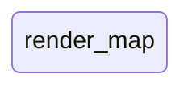
- State transitions:
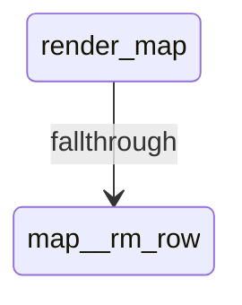

### State: @rm_row
- Mermaid state id: `map__rm_row`
- Assembly body:
```asm
lda #0
sta tile_col
```
- Mermaid state:

- State transitions:
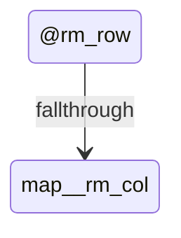

### State: @rm_col
- Mermaid state id: `map__rm_col`
- Assembly body:
```asm
lda tile_col
sta tmp1
lda tile_row
sta tmp2
jsr render_tile
inc tile_col
lda tile_col
cmp #MAP_WIDTH
bne @rm_col
inc tile_row
lda tile_row
cmp #MAP_HEIGHT
bne @rm_row
lda #0
sta dirty_map
rts
```
- Mermaid state:

- State transitions:
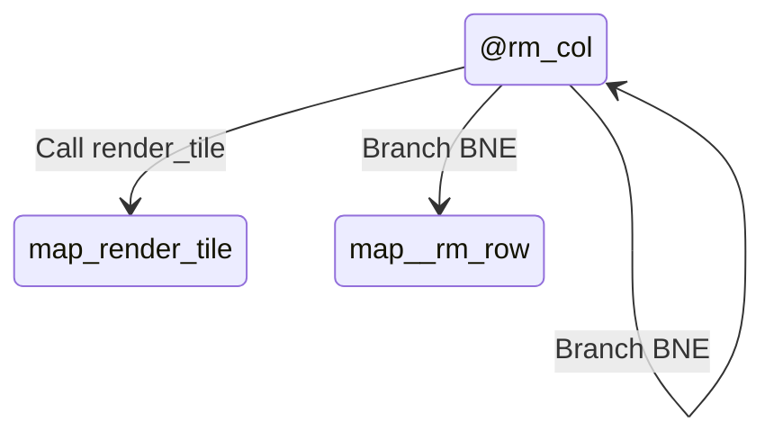

### State: render_tile
- Mermaid state id: `map_render_tile`
- Assembly body:
```asm
sei
jsr update_cursor_aoe_state
lda cursor_aoe_color
sta VIC_BKG_CLR1
ldy tmp2
lda mul40_lo,y
clc
adc tmp1
sta ptr_lo
lda mul40_hi,y
adc #0
sta ptr_hi
lda ptr_lo
clc
adc #<city_map
sta ptr2_lo
lda ptr_hi
adc #>city_map
sta ptr2_hi
ldy #0
lda (ptr2_lo),y
sta tmp3
lda tmp1
sta tile_col
lda tmp2
sta tile_row
lda tmp3
jsr get_tile_screen_char
pha
lda ptr_lo
clc
adc #<(SCREEN_BASE + SCREEN_COLS)
sta ptr2_lo
lda ptr_hi
adc #>(SCREEN_BASE + SCREEN_COLS)
sta ptr2_hi
pla
sta (ptr2_lo),y
lda tmp3
jsr get_tile_draw_color
pha
lda ptr_lo
clc
adc #<(COLOR_BASE + SCREEN_COLS)
sta ptr2_lo
lda ptr_hi
adc #>(COLOR_BASE + SCREEN_COLS)
sta ptr2_hi
pla
sta (ptr2_lo),y
cli
rts
.export render_road_neighborhood
.export render_road_neighborhood_exit
```
- Mermaid state:
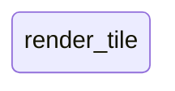
- State transitions:
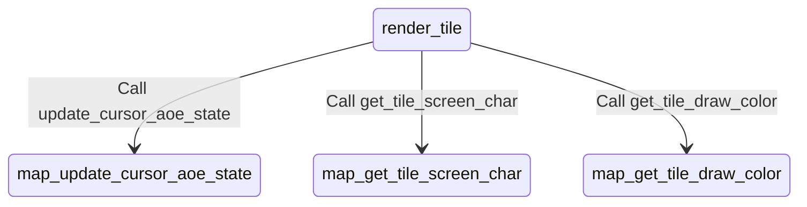

### State: render_road_neighborhood
- Mermaid state id: `map_render_road_neighborhood`
- Assembly body:
```asm
lda tmp1
pha
lda tmp2
pha
jsr render_tile
pla
sta tmp2
pla
sta tmp1
lda tmp2
beq @rrn_south
lda tmp1
pha
lda tmp2
pha
dec tmp2
lda tmp1
ldx tmp2
jsr get_tile
and #TILE_TYPE_MASK
cmp #TILE_ROAD
beq @rrn_render_north
cmp #TILE_BRIDGE
bne @rrn_restore_north
```
- Mermaid state:
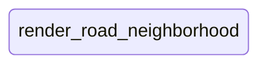
- State transitions:
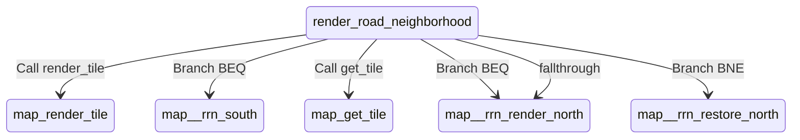

### State: @rrn_render_north
- Mermaid state id: `map__rrn_render_north`
- Assembly body:
```asm
jsr render_tile
```
- Mermaid state:

- State transitions:
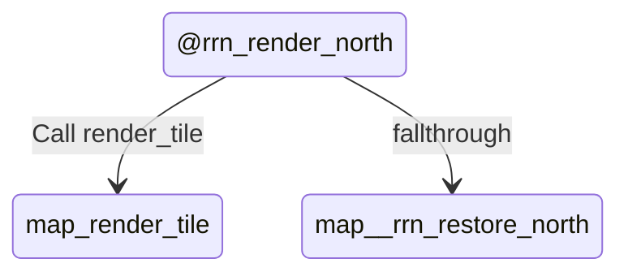

### State: @rrn_restore_north
- Mermaid state id: `map__rrn_restore_north`
- Assembly body:
```asm
pla
sta tmp2
pla
sta tmp1
```
- Mermaid state:

- State transitions:
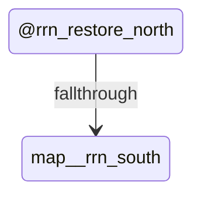

### State: @rrn_south
- Mermaid state id: `map__rrn_south`
- Assembly body:
```asm
lda tmp2
cmp #MAP_HEIGHT - 1
beq @rrn_east
lda tmp1
pha
lda tmp2
pha
inc tmp2
lda tmp1
ldx tmp2
jsr get_tile
and #TILE_TYPE_MASK
cmp #TILE_ROAD
beq @rrn_render_south
cmp #TILE_BRIDGE
bne @rrn_restore_south
```
- Mermaid state:

- State transitions:
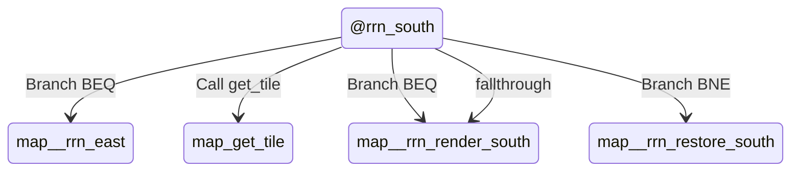

### State: @rrn_render_south
- Mermaid state id: `map__rrn_render_south`
- Assembly body:
```asm
jsr render_tile
```
- Mermaid state:

- State transitions:
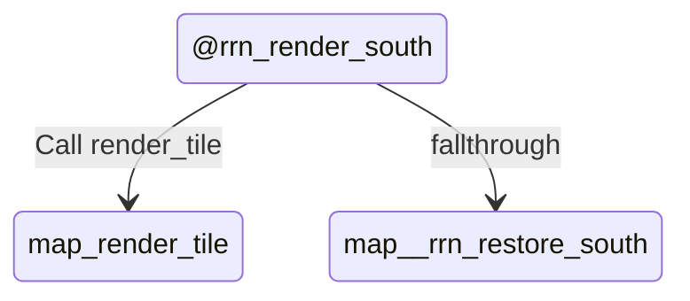

### State: @rrn_restore_south
- Mermaid state id: `map__rrn_restore_south`
- Assembly body:
```asm
pla
sta tmp2
pla
sta tmp1
```
- Mermaid state:

- State transitions:
```mermaid
stateDiagram-v2
    state "@rrn_restore_south" as map__rrn_restore_south
    map__rrn_restore_south --> map__rrn_east : fallthrough
```

### State: @rrn_east
- Mermaid state id: `map__rrn_east`
- Assembly body:
```asm
lda tmp1
cmp #MAP_WIDTH - 1
beq @rrn_west
lda tmp1
pha
lda tmp2
pha
inc tmp1
lda tmp1
ldx tmp2
jsr get_tile
and #TILE_TYPE_MASK
cmp #TILE_ROAD
beq @rrn_render_east
cmp #TILE_BRIDGE
bne @rrn_restore_east
```
- Mermaid state:
```mermaid
stateDiagram-v2
state "@rrn_east" as map__rrn_east
```
- State transitions:
```mermaid
stateDiagram-v2
    state "@rrn_east" as map__rrn_east
    map__rrn_east --> map__rrn_west : Branch BEQ
    map__rrn_east --> map_get_tile : Call get_tile
    map__rrn_east --> map__rrn_render_east : Branch BEQ
    map__rrn_east --> map__rrn_restore_east : Branch BNE
    map__rrn_east --> map__rrn_render_east : fallthrough
```

### State: @rrn_render_east
- Mermaid state id: `map__rrn_render_east`
- Assembly body:
```asm
jsr render_tile
```
- Mermaid state:
```mermaid
stateDiagram-v2
state "@rrn_render_east" as map__rrn_render_east
```
- State transitions:
```mermaid
stateDiagram-v2
    state "@rrn_render_east" as map__rrn_render_east
    map__rrn_render_east --> map_render_tile : Call render_tile
    map__rrn_render_east --> map__rrn_restore_east : fallthrough
```

### State: @rrn_restore_east
- Mermaid state id: `map__rrn_restore_east`
- Assembly body:
```asm
pla
sta tmp2
pla
sta tmp1
```
- Mermaid state:
```mermaid
stateDiagram-v2
state "@rrn_restore_east" as map__rrn_restore_east
```
- State transitions:
```mermaid
stateDiagram-v2
    state "@rrn_restore_east" as map__rrn_restore_east
    map__rrn_restore_east --> map__rrn_west : fallthrough
```

### State: @rrn_west
- Mermaid state id: `map__rrn_west`
- Assembly body:
```asm
lda tmp1
beq @rrn_done
lda tmp1
pha
lda tmp2
pha
dec tmp1
lda tmp1
ldx tmp2
jsr get_tile
and #TILE_TYPE_MASK
cmp #TILE_ROAD
beq @rrn_render_west
cmp #TILE_BRIDGE
bne @rrn_restore_west
```
- Mermaid state:
```mermaid
stateDiagram-v2
state "@rrn_west" as map__rrn_west
```
- State transitions:
```mermaid
stateDiagram-v2
    state "@rrn_west" as map__rrn_west
    map__rrn_west --> map__rrn_done : Branch BEQ
    map__rrn_west --> map_get_tile : Call get_tile
    map__rrn_west --> map__rrn_render_west : Branch BEQ
    map__rrn_west --> map__rrn_restore_west : Branch BNE
    map__rrn_west --> map__rrn_render_west : fallthrough
```

### State: @rrn_render_west
- Mermaid state id: `map__rrn_render_west`
- Assembly body:
```asm
jsr render_tile
```
- Mermaid state:
```mermaid
stateDiagram-v2
state "@rrn_render_west" as map__rrn_render_west
```
- State transitions:
```mermaid
stateDiagram-v2
    state "@rrn_render_west" as map__rrn_render_west
    map__rrn_render_west --> map_render_tile : Call render_tile
    map__rrn_render_west --> map__rrn_restore_west : fallthrough
```

### State: @rrn_restore_west
- Mermaid state id: `map__rrn_restore_west`
- Assembly body:
```asm
pla
sta tmp2
pla
sta tmp1
```
- Mermaid state:
```mermaid
stateDiagram-v2
state "@rrn_restore_west" as map__rrn_restore_west
```
- State transitions:
```mermaid
stateDiagram-v2
    state "@rrn_restore_west" as map__rrn_restore_west
    map__rrn_restore_west --> map_render_road_neighborhood_exit : fallthrough
```

### State: render_road_neighborhood_exit
- Mermaid state id: `map_render_road_neighborhood_exit`
- Assembly body:
```asm
; (empty)
```
- Mermaid state:
```mermaid
stateDiagram-v2
state "render_road_neighborhood_exit" as map_render_road_neighborhood_exit
```
- State transitions:
```mermaid
stateDiagram-v2
    state "render_road_neighborhood_exit" as map_render_road_neighborhood_exit
    map_render_road_neighborhood_exit --> map__rrn_done : fallthrough
```

### State: @rrn_done
- Mermaid state id: `map__rrn_done`
- Assembly body:
```asm
rts
```
- Mermaid state:
```mermaid
stateDiagram-v2
state "@rrn_done" as map__rrn_done
```
- State transitions:
```mermaid
stateDiagram-v2
    state "@rrn_done" as map__rrn_done
```

### State: get_tile_screen_char
- Mermaid state id: `map_get_tile_screen_char`
- Assembly body:
```asm
sta tmp3
and #TILE_TYPE_MASK
cmp #TILE_ROAD
beq @gtsc_road
cmp #TILE_BRIDGE
beq @gtsc_road
tax
lda tile_char,x
sta tmp4
jsr tile_in_cursor_aoe
beq @gtsc_base
lda tmp4
clc
adc #1
rts
```
- Mermaid state:
```mermaid
stateDiagram-v2
state "get_tile_screen_char" as map_get_tile_screen_char
```
- State transitions:
```mermaid
stateDiagram-v2
    state "get_tile_screen_char" as map_get_tile_screen_char
    map_get_tile_screen_char --> map__gtsc_road : Branch BEQ
    map_get_tile_screen_char --> map__gtsc_road : Branch BEQ
    map_get_tile_screen_char --> map_tile_in_cursor_aoe : Call tile_in_cursor_aoe
    map_get_tile_screen_char --> map__gtsc_base : Branch BEQ
```

### State: @gtsc_base
- Mermaid state id: `map__gtsc_base`
- Assembly body:
```asm
lda tmp4
rts
```
- Mermaid state:
```mermaid
stateDiagram-v2
state "@gtsc_base" as map__gtsc_base
```
- State transitions:
```mermaid
stateDiagram-v2
    state "@gtsc_base" as map__gtsc_base
```

### State: @gtsc_road
- Mermaid state id: `map__gtsc_road`
- Assembly body:
```asm
jsr get_road_screen_char
sta tmp4
jsr tile_in_cursor_aoe
beq @gtsc_base
lda tmp4
clc
adc #16
rts
```
- Mermaid state:
```mermaid
stateDiagram-v2
state "@gtsc_road" as map__gtsc_road
```
- State transitions:
```mermaid
stateDiagram-v2
    state "@gtsc_road" as map__gtsc_road
    map__gtsc_road --> map_get_road_screen_char : Call get_road_screen_char
    map__gtsc_road --> map_tile_in_cursor_aoe : Call tile_in_cursor_aoe
    map__gtsc_road --> map__gtsc_base : Branch BEQ
```

### State: get_road_screen_char
- Mermaid state id: `map_get_road_screen_char`
- Assembly body:
```asm
tya
pha
lda ptr_lo
pha
lda ptr_hi
pha
lda tmp3
pha
lda #0
sta road_mask
lda tile_row
beq @grsc_south
lda tile_col
ldx tile_row
dex
jsr get_tile
and #TILE_TYPE_MASK
cmp #TILE_ROAD
beq @grsc_north_yes
cmp #TILE_BRIDGE
bne @grsc_south
```
- Mermaid state:
```mermaid
stateDiagram-v2
state "get_road_screen_char" as map_get_road_screen_char
```
- State transitions:
```mermaid
stateDiagram-v2
    state "get_road_screen_char" as map_get_road_screen_char
    map_get_road_screen_char --> map__grsc_south : Branch BEQ
    map_get_road_screen_char --> map_get_tile : Call get_tile
    map_get_road_screen_char --> map__grsc_north_yes : Branch BEQ
    map_get_road_screen_char --> map__grsc_south : Branch BNE
    map_get_road_screen_char --> map__grsc_north_yes : fallthrough
```

### State: @grsc_north_yes
- Mermaid state id: `map__grsc_north_yes`
- Assembly body:
```asm
lda road_mask
ora #$01
sta road_mask
```
- Mermaid state:
```mermaid
stateDiagram-v2
state "@grsc_north_yes" as map__grsc_north_yes
```
- State transitions:
```mermaid
stateDiagram-v2
    state "@grsc_north_yes" as map__grsc_north_yes
    map__grsc_north_yes --> map__grsc_south : fallthrough
```

### State: @grsc_south
- Mermaid state id: `map__grsc_south`
- Assembly body:
```asm
lda tile_row
cmp #MAP_HEIGHT - 1
beq @grsc_east
lda tile_col
ldx tile_row
inx
jsr get_tile
and #TILE_TYPE_MASK
cmp #TILE_ROAD
beq @grsc_south_yes
cmp #TILE_BRIDGE
bne @grsc_east
```
- Mermaid state:
```mermaid
stateDiagram-v2
state "@grsc_south" as map__grsc_south
```
- State transitions:
```mermaid
stateDiagram-v2
    state "@grsc_south" as map__grsc_south
    map__grsc_south --> map__grsc_east : Branch BEQ
    map__grsc_south --> map_get_tile : Call get_tile
    map__grsc_south --> map__grsc_south_yes : Branch BEQ
    map__grsc_south --> map__grsc_east : Branch BNE
    map__grsc_south --> map__grsc_south_yes : fallthrough
```

### State: @grsc_south_yes
- Mermaid state id: `map__grsc_south_yes`
- Assembly body:
```asm
lda road_mask
ora #$02
sta road_mask
```
- Mermaid state:
```mermaid
stateDiagram-v2
state "@grsc_south_yes" as map__grsc_south_yes
```
- State transitions:
```mermaid
stateDiagram-v2
    state "@grsc_south_yes" as map__grsc_south_yes
    map__grsc_south_yes --> map__grsc_east : fallthrough
```

### State: @grsc_east
- Mermaid state id: `map__grsc_east`
- Assembly body:
```asm
lda tile_col
cmp #MAP_WIDTH - 1
beq @grsc_west
clc
adc #1
ldx tile_row
jsr get_tile
and #TILE_TYPE_MASK
cmp #TILE_ROAD
beq @grsc_east_yes
cmp #TILE_BRIDGE
bne @grsc_west
```
- Mermaid state:
```mermaid
stateDiagram-v2
state "@grsc_east" as map__grsc_east
```
- State transitions:
```mermaid
stateDiagram-v2
    state "@grsc_east" as map__grsc_east
    map__grsc_east --> map__grsc_west : Branch BEQ
    map__grsc_east --> map_get_tile : Call get_tile
    map__grsc_east --> map__grsc_east_yes : Branch BEQ
    map__grsc_east --> map__grsc_west : Branch BNE
    map__grsc_east --> map__grsc_east_yes : fallthrough
```

### State: @grsc_east_yes
- Mermaid state id: `map__grsc_east_yes`
- Assembly body:
```asm
lda road_mask
ora #$04
sta road_mask
```
- Mermaid state:
```mermaid
stateDiagram-v2
state "@grsc_east_yes" as map__grsc_east_yes
```
- State transitions:
```mermaid
stateDiagram-v2
    state "@grsc_east_yes" as map__grsc_east_yes
    map__grsc_east_yes --> map__grsc_west : fallthrough
```

### State: @grsc_west
- Mermaid state id: `map__grsc_west`
- Assembly body:
```asm
lda tile_col
beq @grsc_lookup
sec
sbc #1
ldx tile_row
jsr get_tile
and #TILE_TYPE_MASK
cmp #TILE_ROAD
beq @grsc_west_yes
cmp #TILE_BRIDGE
bne @grsc_lookup
```
- Mermaid state:
```mermaid
stateDiagram-v2
state "@grsc_west" as map__grsc_west
```
- State transitions:
```mermaid
stateDiagram-v2
    state "@grsc_west" as map__grsc_west
    map__grsc_west --> map__grsc_lookup : Branch BEQ
    map__grsc_west --> map_get_tile : Call get_tile
    map__grsc_west --> map__grsc_west_yes : Branch BEQ
    map__grsc_west --> map__grsc_lookup : Branch BNE
    map__grsc_west --> map__grsc_west_yes : fallthrough
```

### State: @grsc_west_yes
- Mermaid state id: `map__grsc_west_yes`
- Assembly body:
```asm
lda road_mask
ora #$08
sta road_mask
```
- Mermaid state:
```mermaid
stateDiagram-v2
state "@grsc_west_yes" as map__grsc_west_yes
```
- State transitions:
```mermaid
stateDiagram-v2
    state "@grsc_west_yes" as map__grsc_west_yes
    map__grsc_west_yes --> map__grsc_lookup : fallthrough
```

### State: @grsc_lookup
- Mermaid state id: `map__grsc_lookup`
- Assembly body:
```asm
ldx road_mask
lda road_shape_char,x
tax
pla
sta tmp3
pla
sta ptr_hi
pla
sta ptr_lo
pla
tay
txa
rts
```
- Mermaid state:
```mermaid
stateDiagram-v2
state "@grsc_lookup" as map__grsc_lookup
```
- State transitions:
```mermaid
stateDiagram-v2
    state "@grsc_lookup" as map__grsc_lookup
```

### State: get_tile
- Mermaid state id: `map_get_tile`
- Assembly body:
```asm
sta tmp3
txa
tay
lda mul40_lo,y
clc
adc tmp3
sta ptr_lo
lda mul40_hi,y
adc #0
sta ptr_hi
lda ptr_lo
clc
adc #<city_map
sta ptr_lo
lda ptr_hi
adc #>city_map
sta ptr_hi
ldy #0
lda (ptr_lo),y
rts
```
- Mermaid state:
```mermaid
stateDiagram-v2
state "get_tile" as map_get_tile
```
- State transitions:
```mermaid
stateDiagram-v2
    state "get_tile" as map_get_tile
```

### State: set_tile
- Mermaid state id: `map_set_tile`
- Assembly body:
```asm
sta tmp3
txa
tax
tya
pha
txa
tay
lda mul40_lo,y
clc
adc tmp3
sta ptr_lo
lda mul40_hi,y
adc #0
sta ptr_hi
lda ptr_lo
clc
adc #<city_map
sta ptr_lo
lda ptr_hi
adc #>city_map
sta ptr_hi
pla
ldy #0
sta (ptr_lo),y
rts
```
- Mermaid state:
```mermaid
stateDiagram-v2
state "set_tile" as map_set_tile
```
- State transitions:
```mermaid
stateDiagram-v2
    state "set_tile" as map_set_tile
```

### State: update_cursor_display
- Mermaid state id: `map_update_cursor_display`
- Assembly body:
```asm
lda #0
sta tmp1
lda cursor_x
asl
rol tmp1
asl
rol tmp1
asl
rol tmp1
clc
adc #CURSOR_SPR_X_BASE
sta VIC_SPR0_X
lda tmp1
adc #0
tax
lda VIC_SPR_X_MSB
and #$FE
cpx #0
beq @ucd_store_x
ora #$01
```
- Mermaid state:
```mermaid
stateDiagram-v2
state "update_cursor_display" as map_update_cursor_display
```
- State transitions:
```mermaid
stateDiagram-v2
    state "update_cursor_display" as map_update_cursor_display
    map_update_cursor_display --> map__ucd_store_x : Branch BEQ
    map_update_cursor_display --> map__ucd_store_x : fallthrough
```

### State: @ucd_store_x
- Mermaid state id: `map__ucd_store_x`
- Assembly body:
```asm
sta VIC_SPR_X_MSB
lda cursor_y
asl
asl
asl
clc
adc #(CURSOR_SPR_Y_BASE + 8)
sta VIC_SPR0_Y
rts
```
- Mermaid state:
```mermaid
stateDiagram-v2
state "@ucd_store_x" as map__ucd_store_x
```
- State transitions:
```mermaid
stateDiagram-v2
    state "@ucd_store_x" as map__ucd_store_x
```

### State: update_cursor_aoe_state
- Mermaid state id: `map_update_cursor_aoe_state`
- Assembly body:
```asm
lda #0
sta cursor_aoe_radius
sta cursor_aoe_active
lda #COLOR_GREEN
sta cursor_aoe_color
lda cursor_x
ldx cursor_y
jsr get_tile
sta tmp4
jsr get_tile_highlight_color
sta cursor_aoe_color
lda tmp4
and #TILE_TYPE_MASK
cmp #TILE_HOUSE
beq @ucao_house
cmp #TILE_FACTORY
beq @ucao_factory
cmp #TILE_PARK
beq @ucao_park
cmp #TILE_POLICE
beq @ucao_police
cmp #TILE_FIRE
beq @ucao_fire
rts
```
- Mermaid state:
```mermaid
stateDiagram-v2
state "update_cursor_aoe_state" as map_update_cursor_aoe_state
```
- State transitions:
```mermaid
stateDiagram-v2
    state "update_cursor_aoe_state" as map_update_cursor_aoe_state
    map_update_cursor_aoe_state --> map_get_tile : Call get_tile
    map_update_cursor_aoe_state --> map_get_tile_highlight_color : Call get_tile_highlight_color
    map_update_cursor_aoe_state --> map__ucao_house : Branch BEQ
    map_update_cursor_aoe_state --> map__ucao_factory : Branch BEQ
    map_update_cursor_aoe_state --> map__ucao_park : Branch BEQ
    map_update_cursor_aoe_state --> map__ucao_police : Branch BEQ
    map_update_cursor_aoe_state --> map__ucao_fire : Branch BEQ
```

### State: @ucao_house
- Mermaid state id: `map__ucao_house`
- Assembly body:
```asm
lda tmp4
jsr get_tile_density_units
tax
lda house_aoe_radius,x
bne @ucao_enable
```
- Mermaid state:
```mermaid
stateDiagram-v2
state "@ucao_house" as map__ucao_house
```
- State transitions:
```mermaid
stateDiagram-v2
    state "@ucao_house" as map__ucao_house
    map__ucao_house --> buildings_get_tile_density_units : Call get_tile_density_units
    map__ucao_house --> map__ucao_enable : Branch BNE
    map__ucao_house --> map__ucao_factory : fallthrough
```

### State: @ucao_factory
- Mermaid state id: `map__ucao_factory`
- Assembly body:
```asm
lda tmp4
jsr get_tile_density_units
tax
lda factory_aoe_radius,x
```
- Mermaid state:
```mermaid
stateDiagram-v2
state "@ucao_factory" as map__ucao_factory
```
- State transitions:
```mermaid
stateDiagram-v2
    state "@ucao_factory" as map__ucao_factory
    map__ucao_factory --> buildings_get_tile_density_units : Call get_tile_density_units
    map__ucao_factory --> map__ucao_enable : fallthrough
```

### State: @ucao_enable
- Mermaid state id: `map__ucao_enable`
- Assembly body:
```asm
sta cursor_aoe_radius
lda #1
sta cursor_aoe_active
rts
```
- Mermaid state:
```mermaid
stateDiagram-v2
state "@ucao_enable" as map__ucao_enable
```
- State transitions:
```mermaid
stateDiagram-v2
    state "@ucao_enable" as map__ucao_enable
```

### State: @ucao_park
- Mermaid state id: `map__ucao_park`
- Assembly body:
```asm
lda #PARK_RADIUS
bne @ucao_store
```
- Mermaid state:
```mermaid
stateDiagram-v2
state "@ucao_park" as map__ucao_park
```
- State transitions:
```mermaid
stateDiagram-v2
    state "@ucao_park" as map__ucao_park
    map__ucao_park --> map__ucao_store : Branch BNE
    map__ucao_park --> map__ucao_police : fallthrough
```

### State: @ucao_police
- Mermaid state id: `map__ucao_police`
- Assembly body:
```asm
lda #POLICE_RADIUS
bne @ucao_store
```
- Mermaid state:
```mermaid
stateDiagram-v2
state "@ucao_police" as map__ucao_police
```
- State transitions:
```mermaid
stateDiagram-v2
    state "@ucao_police" as map__ucao_police
    map__ucao_police --> map__ucao_store : Branch BNE
    map__ucao_police --> map__ucao_fire : fallthrough
```

### State: @ucao_fire
- Mermaid state id: `map__ucao_fire`
- Assembly body:
```asm
lda #FIRE_RADIUS
```
- Mermaid state:
```mermaid
stateDiagram-v2
state "@ucao_fire" as map__ucao_fire
```
- State transitions:
```mermaid
stateDiagram-v2
    state "@ucao_fire" as map__ucao_fire
    map__ucao_fire --> map__ucao_store : fallthrough
```

### State: @ucao_store
- Mermaid state id: `map__ucao_store`
- Assembly body:
```asm
sta cursor_aoe_radius
lda #1
sta cursor_aoe_active
rts
```
- Mermaid state:
```mermaid
stateDiagram-v2
state "@ucao_store" as map__ucao_store
```
- State transitions:
```mermaid
stateDiagram-v2
    state "@ucao_store" as map__ucao_store
```

### State: tile_in_cursor_aoe
- Mermaid state id: `map_tile_in_cursor_aoe`
- Assembly body:
```asm
lda cursor_aoe_active
bne @tica_dx
lda #0
rts
```
- Mermaid state:
```mermaid
stateDiagram-v2
state "tile_in_cursor_aoe" as map_tile_in_cursor_aoe
```
- State transitions:
```mermaid
stateDiagram-v2
    state "tile_in_cursor_aoe" as map_tile_in_cursor_aoe
    map_tile_in_cursor_aoe --> map__tica_dx : Branch BNE
```

### State: @tica_dx
- Mermaid state id: `map__tica_dx`
- Assembly body:
```asm
lda tile_col
sec
sbc cursor_x
bcs @tica_dx_abs
eor #$FF
clc
adc #1
```
- Mermaid state:
```mermaid
stateDiagram-v2
state "@tica_dx" as map__tica_dx
```
- State transitions:
```mermaid
stateDiagram-v2
    state "@tica_dx" as map__tica_dx
    map__tica_dx --> map__tica_dx_abs : Branch BCS
    map__tica_dx --> map__tica_dx_abs : fallthrough
```

### State: @tica_dx_abs
- Mermaid state id: `map__tica_dx_abs`
- Assembly body:
```asm
cmp cursor_aoe_radius
bcc @tica_dy
beq @tica_dy
lda #0
rts
```
- Mermaid state:
```mermaid
stateDiagram-v2
state "@tica_dx_abs" as map__tica_dx_abs
```
- State transitions:
```mermaid
stateDiagram-v2
    state "@tica_dx_abs" as map__tica_dx_abs
    map__tica_dx_abs --> map__tica_dy : Branch BCC
    map__tica_dx_abs --> map__tica_dy : Branch BEQ
```

### State: @tica_dy
- Mermaid state id: `map__tica_dy`
- Assembly body:
```asm
lda tile_row
sec
sbc cursor_y
bcs @tica_dy_abs
eor #$FF
clc
adc #1
```
- Mermaid state:
```mermaid
stateDiagram-v2
state "@tica_dy" as map__tica_dy
```
- State transitions:
```mermaid
stateDiagram-v2
    state "@tica_dy" as map__tica_dy
    map__tica_dy --> map__tica_dy_abs : Branch BCS
    map__tica_dy --> map__tica_dy_abs : fallthrough
```

### State: @tica_dy_abs
- Mermaid state id: `map__tica_dy_abs`
- Assembly body:
```asm
cmp cursor_aoe_radius
bcc @tica_yes
beq @tica_yes
lda #0
rts
```
- Mermaid state:
```mermaid
stateDiagram-v2
state "@tica_dy_abs" as map__tica_dy_abs
```
- State transitions:
```mermaid
stateDiagram-v2
    state "@tica_dy_abs" as map__tica_dy_abs
    map__tica_dy_abs --> map__tica_yes : Branch BCC
    map__tica_dy_abs --> map__tica_yes : Branch BEQ
```

### State: @tica_yes
- Mermaid state id: `map__tica_yes`
- Assembly body:
```asm
lda #1
rts
```
- Mermaid state:
```mermaid
stateDiagram-v2
state "@tica_yes" as map__tica_yes
```
- State transitions:
```mermaid
stateDiagram-v2
    state "@tica_yes" as map__tica_yes
```

### State: get_tile_draw_color
- Mermaid state id: `map_get_tile_draw_color`
- Assembly body:
```asm
sta tmp3
and #TILE_TYPE_MASK
tax
cpx #TILE_ROAD
bcc @gtdc_base
cpx #TILE_BRIDGE + 1
bcs @gtdc_base
lda tmp3
and #TILE_DENSITY_MASK
lsr
lsr
lsr
lsr
clc
adc tile_density_base,x
tax
lda density_mc_color,x
rts
```
- Mermaid state:
```mermaid
stateDiagram-v2
state "get_tile_draw_color" as map_get_tile_draw_color
```
- State transitions:
```mermaid
stateDiagram-v2
    state "get_tile_draw_color" as map_get_tile_draw_color
    map_get_tile_draw_color --> map__gtdc_base : Branch BCC
    map_get_tile_draw_color --> map__gtdc_base : Branch BCS
```

### State: @gtdc_base
- Mermaid state id: `map__gtdc_base`
- Assembly body:
```asm
lda tile_mc_color,x
rts
```
- Mermaid state:
```mermaid
stateDiagram-v2
state "@gtdc_base" as map__gtdc_base
```
- State transitions:
```mermaid
stateDiagram-v2
    state "@gtdc_base" as map__gtdc_base
```

### State: get_tile_highlight_color
- Mermaid state id: `map_get_tile_highlight_color`
- Assembly body:
```asm
sta tmp3
and #TILE_TYPE_MASK
tax
cpx #TILE_ROAD
bcc @gthc_base
cpx #TILE_BRIDGE + 1
bcs @gthc_base
lda tmp3
and #TILE_DENSITY_MASK
lsr
lsr
lsr
lsr
clc
adc tile_density_base,x
tax
lda density_color,x
rts
```
- Mermaid state:
```mermaid
stateDiagram-v2
state "get_tile_highlight_color" as map_get_tile_highlight_color
```
- State transitions:
```mermaid
stateDiagram-v2
    state "get_tile_highlight_color" as map_get_tile_highlight_color
    map_get_tile_highlight_color --> map__gthc_base : Branch BCC
    map_get_tile_highlight_color --> map__gthc_base : Branch BCS
```

### State: @gthc_base
- Mermaid state id: `map__gthc_base`
- Assembly body:
```asm
lda tile_color,x
rts
```
- Mermaid state:
```mermaid
stateDiagram-v2
state "@gthc_base" as map__gthc_base
```
- State transitions:
```mermaid
stateDiagram-v2
    state "@gthc_base" as map__gthc_base
```

### State: restore_cursor_color
- Mermaid state id: `map_restore_cursor_color`
- Assembly body:
```asm
lda cursor_x
ldx cursor_y
jsr get_tile
jsr get_tile_draw_color
sta tmp4
ldy cursor_y
lda mul40_lo,y
clc
adc #<(COLOR_BASE + SCREEN_COLS)
sta ptr_lo
lda mul40_hi,y
adc #>(COLOR_BASE + SCREEN_COLS)
sta ptr_hi
lda cursor_x
clc
adc ptr_lo
sta ptr_lo
bcc @rcc_no_carry
inc ptr_hi
```
- Mermaid state:
```mermaid
stateDiagram-v2
state "restore_cursor_color" as map_restore_cursor_color
```
- State transitions:
```mermaid
stateDiagram-v2
    state "restore_cursor_color" as map_restore_cursor_color
    map_restore_cursor_color --> map_get_tile : Call get_tile
    map_restore_cursor_color --> map_get_tile_draw_color : Call get_tile_draw_color
    map_restore_cursor_color --> map__rcc_no_carry : Branch BCC
    map_restore_cursor_color --> map__rcc_no_carry : fallthrough
```

### State: @rcc_no_carry
- Mermaid state id: `map__rcc_no_carry`
- Assembly body:
```asm
ldy #0
lda tmp4
sta (ptr_lo),y
rts
```
- Mermaid state:
```mermaid
stateDiagram-v2
state "@rcc_no_carry" as map__rcc_no_carry
```
- State transitions:
```mermaid
stateDiagram-v2
    state "@rcc_no_carry" as map__rcc_no_carry
```

