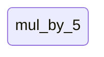
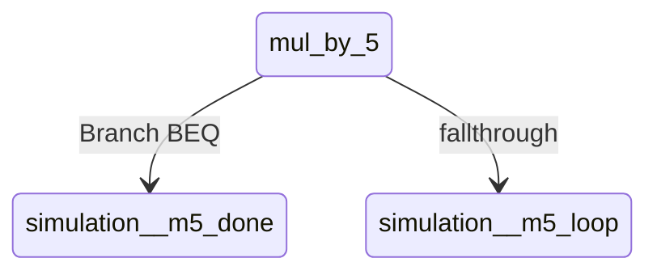
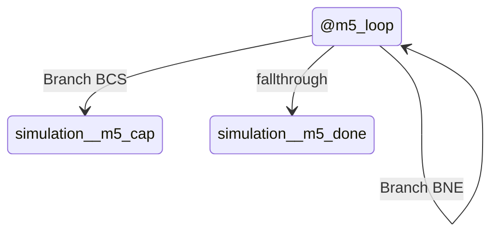
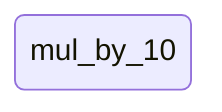
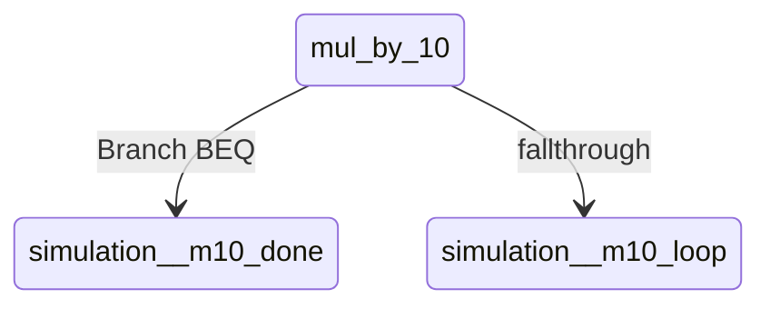
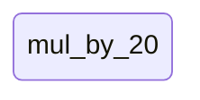
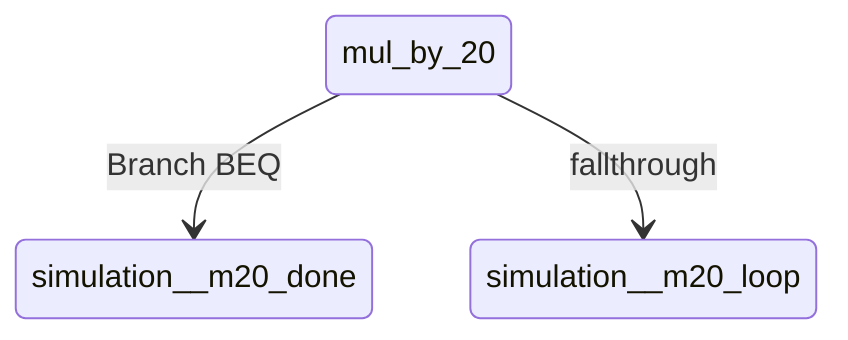
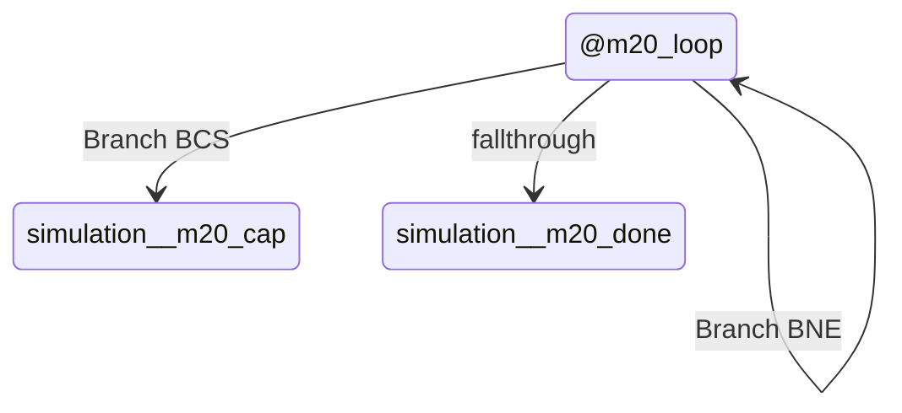

# Assembly activity/state documentation

## Diagram
```mermaid
stateDiagram-v2
    state "mul_by_5" as simulation_mul_by_5
    state "@m5_loop" as simulation__m5_loop
    state "@m5_done" as simulation__m5_done
    state "@m5_cap" as simulation__m5_cap
    state "mul_by_10" as simulation_mul_by_10
    state "@m10_loop" as simulation__m10_loop
    state "@m10_done" as simulation__m10_done
    state "@m10_cap" as simulation__m10_cap
    state "mul_by_20" as simulation_mul_by_20
    state "@m20_loop" as simulation__m20_loop
    state "@m20_done" as simulation__m20_done
    state "@m20_cap" as simulation__m20_cap
    state "mul_by_50" as simulation_mul_by_50
    state "@m50_loop" as simulation__m50_loop
    state "@m50_done" as simulation__m50_done
    state "@m50_cap" as simulation__m50_cap
    state "mul_by_2" as simulation_mul_by_2
    state "@m2_cap" as simulation__m2_cap
    state "mul_by_3" as simulation_mul_by_3
    state "@m3_cap" as simulation__m3_cap
    state "add_to_jobs" as simulation_add_to_jobs
    state "@atj_store" as simulation__atj_store
    state "add_to_revenue" as simulation_add_to_revenue
    state "@atr_done" as simulation__atr_done
    state "add_to_cost" as simulation_add_to_cost
    state "@atc_done" as simulation__atc_done
    state "add_to_land_value" as simulation_add_to_land_value
    state "@atl_done" as simulation__atl_done
    state "add_to_worker_supply" as simulation_add_to_worker_supply
    state "@atw_store" as simulation__atw_store
    state "add_a_to_tmp3" as simulation_add_a_to_tmp3
    state "@a3_store" as simulation__a3_store
    state "clear_map_buffer" as simulation_clear_map_buffer
    state "@cmb_page" as simulation__cmb_page
    state "@cmb_loop" as simulation__cmb_loop
    state "@cmb_rem" as simulation__cmb_rem
    state "clear_sim_maps" as simulation_clear_sim_maps
    state "copy_map_buffer" as simulation_copy_map_buffer
    state "@cpb_page" as simulation__cpb_page
    state "@cpb_loop" as simulation__cpb_loop
    state "@cpb_rem" as simulation__cpb_rem
    state "clear_segment_totals" as simulation_clear_segment_totals
    state "@cst_loop" as simulation__cst_loop
    state "clear_segment_used" as simulation_clear_segment_used
    state "@csu_loop" as simulation__csu_loop
    state "clear_road_segment_state" as simulation_clear_road_segment_state
    state "add_segment_to_pack" as simulation_add_segment_to_pack
    state "@astp_check_high" as simulation__astp_check_high
    state "@astp_store_low" as simulation__astp_store_low
    state "@astp_store_high" as simulation__astp_store_high
    state "@astp_done" as simulation__astp_done
    state "collect_adjacent_segments" as simulation_collect_adjacent_segments
    state "@cas_south" as simulation__cas_south
    state "@cas_east" as simulation__cas_east
    state "@cas_west" as simulation__cas_west
    state "@cas_done" as simulation__cas_done
    state "update_building_segment_at" as simulation_update_building_segment_at
    state "@ubsa_clear" as simulation__ubsa_clear
    state "rebuild_building_segments" as simulation_rebuild_building_segments
    state "@rbs_row" as simulation__rbs_row
    state "@rbs_col" as simulation__rbs_col
    state "@rbs_next_row" as simulation__rbs_next_row
    state "@rbs_done" as simulation__rbs_done
    state "touches_current_segment" as simulation_touches_current_segment
    state "@tcs_south" as simulation__tcs_south
    state "@tcs_east" as simulation__tcs_east
    state "@tcs_west" as simulation__tcs_west
    state "@tcs_no" as simulation__tcs_no
    state "@tcs_yes" as simulation__tcs_yes
    state "expand_temp_segment" as simulation_expand_temp_segment
    state "@ets_pass" as simulation__ets_pass
    state "@ets_row" as simulation__ets_row
    state "@ets_col" as simulation__ets_col
    state "@ets_roadlike" as simulation__ets_roadlike
    state "@ets_next" as simulation__ets_next
    state "@ets_next_row" as simulation__ets_next_row
    state "@ets_pass_done" as simulation__ets_pass_done
    state "choose_segment_id_for_temp" as simulation_choose_segment_id_for_temp
    state "@csit_row" as simulation__csit_row
    state "@csit_col" as simulation__csit_col
    state "@csit_store_old" as simulation__csit_store_old
    state "@csit_next" as simulation__csit_next
    state "@csit_next_row" as simulation__csit_next_row
    state "@csit_choose" as simulation__csit_choose
    state "@csit_find_free" as simulation__csit_find_free
    state "@csit_find_loop" as simulation__csit_find_loop
    state "@csit_use_x" as simulation__csit_use_x
    state "@csit_use" as simulation__csit_use
    state "relabel_temp_segment" as simulation_relabel_temp_segment
    state "@rts_row" as simulation__rts_row
    state "@rts_col" as simulation__rts_col
    state "@rts_next" as simulation__rts_next
    state "@rts_next_row" as simulation__rts_next_row
    state "@rts_done" as simulation__rts_done
    state "rebuild_road_segments" as simulation_rebuild_road_segments
    state "@rrs_row" as simulation__rrs_row
    state "@rrs_col" as simulation__rrs_col
    state "@rrs_roadlike" as simulation__rrs_roadlike
    state "@rrs_next" as simulation__rrs_next
    state "@rrs_next_row" as simulation__rrs_next_row
    state "@rrs_done" as simulation__rrs_done
    state "load_metric_at" as simulation_load_metric_at
    state "store_metric_at" as simulation_store_metric_at
    state "stamp_radius_add" as simulation_stamp_radius_add
    state "@sra_row_lo_ok" as simulation__sra_row_lo_ok
    state "@sra_row_hi_ok" as simulation__sra_row_hi_ok
    state "@sra_col_lo_ok" as simulation__sra_col_lo_ok
    state "@sra_col_hi_ok" as simulation__sra_col_hi_ok
    state "@sra_row_loop" as simulation__sra_row_loop
    state "@sra_ptr_ok" as simulation__sra_ptr_ok
    state "@sra_col_loop" as simulation__sra_col_loop
    state "@sra_store" as simulation__sra_store
    state "region_has_nonzero" as simulation_region_has_nonzero
    state "@rhn_row_lo_ok" as simulation__rhn_row_lo_ok
    state "@rhn_row_hi_ok" as simulation__rhn_row_hi_ok
    state "@rhn_col_lo_ok" as simulation__rhn_col_lo_ok
    state "@rhn_col_hi_ok" as simulation__rhn_col_hi_ok
    state "@rhn_row_loop" as simulation__rhn_row_loop
    state "@rhn_ptr_ok" as simulation__rhn_ptr_ok
    state "@rhn_col_loop" as simulation__rhn_col_loop
    state "@rhn_found" as simulation__rhn_found
    state "build_service_maps" as simulation_build_service_maps
    state "@bsm_row" as simulation__bsm_row
    state "@bsm_col" as simulation__bsm_col
    state "@bsm_police" as simulation__bsm_police
    state "@bsm_fire" as simulation__bsm_fire
    state "@bsm_house" as simulation__bsm_house
    state "@bsm_factory" as simulation__bsm_factory
    state "@bsm_next" as simulation__bsm_next
    state "@bsm_next_row" as simulation__bsm_next_row
    state "@bsm_done" as simulation__bsm_done
    state "apply_neighbor_value_effect" as simulation_apply_neighbor_value_effect
    state "@anv_road" as simulation__anv_road
    state "@anv_house" as simulation__anv_house
    state "@anv_factory" as simulation__anv_factory
    state "@anv_sub_factory" as simulation__anv_sub_factory
    state "@anv_park" as simulation__anv_park
    state "@anv_power" as simulation__anv_power
    state "@anv_sub_power" as simulation__anv_sub_power
    state "@anv_police" as simulation__anv_police
    state "@anv_service" as simulation__anv_service
    state "@anv_done" as simulation__anv_done
    state "compute_tile_value_at" as simulation_compute_tile_value_at
    state "@ctv_road" as simulation__ctv_road
    state "@ctv_house" as simulation__ctv_house
    state "@ctv_factory" as simulation__ctv_factory
    state "@ctv_park" as simulation__ctv_park
    state "@ctv_power" as simulation__ctv_power
    state "@ctv_police" as simulation__ctv_police
    state "@ctv_fire" as simulation__ctv_fire
    state "@ctv_base_done" as simulation__ctv_base_done
    state "@ctv_effects" as simulation__ctv_effects
    state "@ctv_public_safety" as simulation__ctv_public_safety
    state "@ctv_neighbors" as simulation__ctv_neighbors
    state "@ctv_south" as simulation__ctv_south
    state "@ctv_east" as simulation__ctv_east
    state "@ctv_west" as simulation__ctv_west
    state "@ctv_need_road" as simulation__ctv_need_road
    state "@ctv_check_road" as simulation__ctv_check_road
    state "@ctv_sub_no_road" as simulation__ctv_sub_no_road
    state "@ctv_clamp" as simulation__ctv_clamp
    state "@ctv_done" as simulation__ctv_done
    state "analyze_city_tiles" as simulation_analyze_city_tiles
    state "@act_row" as simulation__act_row
    state "@act_col" as simulation__act_col
    state "@act_check_factory" as simulation__act_check_factory
    state "@act_check_police" as simulation__act_check_police
    state "@act_check_fire" as simulation__act_check_fire
    state "@act_other" as simulation__act_other
    state "@act_house" as simulation__act_house
    state "@act_value_loop" as simulation__act_value_loop
    state "@act_store_park" as simulation__act_store_park
    state "@act_police" as simulation__act_police
    state "@act_store_police" as simulation__act_store_police
    state "@act_fire" as simulation__act_fire
    state "@act_store_fire" as simulation__act_store_fire
    state "@act_worker" as simulation__act_worker
    state "@act_factory" as simulation__act_factory
    state "@act_police_jobs" as simulation__act_police_jobs
    state "@act_fire_jobs" as simulation__act_fire_jobs
    state "@act_next" as simulation__act_next
    state "@act_next_row" as simulation__act_next_row
    state "@act_done" as simulation__act_done
    state "add_to_component_jobs" as simulation_add_to_component_jobs
    state "@acj_store" as simulation__acj_store
    state "add_to_component_workers" as simulation_add_to_component_workers
    state "@acw_store" as simulation__acw_store
    state "touches_current_road_component" as simulation_touches_current_road_component
    state "@trc_south" as simulation__trc_south
    state "@trc_east" as simulation__trc_east
    state "@trc_west" as simulation__trc_west
    state "@trc_no" as simulation__trc_no
    state "@trc_yes" as simulation__trc_yes
    state "expand_current_road_component" as simulation_expand_current_road_component
    state "@erc_pass" as simulation__erc_pass
    state "@erc_row" as simulation__erc_row
    state "@erc_col" as simulation__erc_col
    state "@erc_roadlike" as simulation__erc_roadlike
    state "@erc_next" as simulation__erc_next
    state "@erc_next_row" as simulation__erc_next_row
    state "@erc_pass_done" as simulation__erc_pass_done
    state "mark_current_road_component_processed" as simulation_mark_current_road_component_processed
    state "@mrc_row" as simulation__mrc_row
    state "@mrc_col" as simulation__mrc_col
    state "@mrc_next" as simulation__mrc_next
    state "@mrc_next_row" as simulation__mrc_next_row
    state "@mrc_done" as simulation__mrc_done
    state "score_current_road_component" as simulation_score_current_road_component
    state "@src_row" as simulation__src_row
    state "@src_col" as simulation__src_col
    state "@src_not_empty" as simulation__src_not_empty
    state "@src_not_water" as simulation__src_not_water
    state "@src_not_tree" as simulation__src_not_tree
    state "@src_connected" as simulation__src_connected
    state "@src_factory" as simulation__src_factory
    state "@src_police" as simulation__src_police
    state "@src_fire" as simulation__src_fire
    state "@src_next" as simulation__src_next
    state "@src_next_row" as simulation__src_next_row
    state "@src_totals" as simulation__src_totals
    state "@src_use_workers" as simulation__src_use_workers
    state "@src_add_employed" as simulation__src_add_employed
    state "@src_done" as simulation__src_done
    state "analyze_road_networks" as simulation_analyze_road_networks
    state "@arn_row" as simulation__arn_row
    state "@arn_col" as simulation__arn_col
    state "@arn_has_segments" as simulation__arn_has_segments
    state "@arn_check_factory" as simulation__arn_check_factory
    state "@arn_check_police" as simulation__arn_check_police
    state "@arn_check_fire" as simulation__arn_check_fire
    state "@arn_next" as simulation__arn_next
    state "@arn_next_row" as simulation__arn_next_row
    state "@arn_totals" as simulation__arn_totals
    state "@arn_seg_loop" as simulation__arn_seg_loop
    state "@arn_use_workers" as simulation__arn_use_workers
    state "@arn_add_emp" as simulation__arn_add_emp
    state "@arn_seg_next" as simulation__arn_seg_next
    state "@arn_done" as simulation__arn_done
    state "add_workers_for_segments" as simulation_add_workers_for_segments
    state "@awfs_store_low" as simulation__awfs_store_low
    state "@awfs_high" as simulation__awfs_high
    state "@awfs_store_high" as simulation__awfs_store_high
    state "@awfs_done" as simulation__awfs_done
    state "add_jobs_for_segments" as simulation_add_jobs_for_segments
    state "@ajfs_store_low" as simulation__ajfs_store_low
    state "@ajfs_high" as simulation__ajfs_high
    state "@ajfs_store_high" as simulation__ajfs_store_high
    state "@ajfs_done" as simulation__ajfs_done
    state "run_simulation" as simulation_run_simulation
    state "@pwr_police" as simulation__pwr_police
    state "@pwr_fire" as simulation__pwr_fire
    state "@pwr_store" as simulation__pwr_store
    state "@jobs" as simulation__jobs
    state "@jobs_overlap_ready" as simulation__jobs_overlap_ready
    state "@all_employed" as simulation__all_employed
    state "@crime" as simulation__crime
    state "@crime_cap" as simulation__crime_cap
    state "@crime_blackout" as simulation__crime_blackout
    state "@crime_store_blackout" as simulation__crime_store_blackout
    state "@crime_police" as simulation__crime_police
    state "@crime_sub_police" as simulation__crime_sub_police
    state "@crime_fire" as simulation__crime_fire
    state "@crime_sub_fire" as simulation__crime_sub_fire
    state "@crime_parks" as simulation__crime_parks
    state "@crime_sub_parks" as simulation__crime_sub_parks
    state "@crime_done" as simulation__crime_done
    state "@happiness" as simulation__happiness
    state "@hap_store_parks" as simulation__hap_store_parks
    state "@hap_store_police" as simulation__hap_store_police
    state "@hap_store_fire" as simulation__hap_store_fire
    state "@hap_store_value" as simulation__hap_store_value
    state "@hap_sub_unemp" as simulation__hap_sub_unemp
    state "@hap_job_bonus" as simulation__hap_job_bonus
    state "@hap_store_bonus" as simulation__hap_store_bonus
    state "@hap_blackout" as simulation__hap_blackout
    state "@hap_sub_blackout" as simulation__hap_sub_blackout
    state "@hap_crime" as simulation__hap_crime
    state "@hap_sub_crime" as simulation__hap_sub_crime
    state "@economy" as simulation__economy
    state "@apply_net" as simulation__apply_net
    state "@money_floor_ok" as simulation__money_floor_ok
    state "@money_ceil_ok" as simulation__money_ceil_ok
    state "@pop_jobs_ok" as simulation__pop_jobs_ok
    state "@pop_target_ready" as simulation__pop_target_ready
    state "@pop_shrink" as simulation__pop_shrink
    state "@pop_do_shrink" as simulation__pop_do_shrink
    state "@pop_balance" as simulation__pop_balance
    state "@pop_done" as simulation__pop_done
    state "@no_year" as simulation__no_year

    [*] --> simulation_mul_by_5
    simulation_mul_by_5 --> simulation__m5_done : Branch BEQ
    simulation_mul_by_5 --> simulation__m5_loop : fallthrough
    simulation__m5_loop --> simulation__m5_cap : Branch BCS
    simulation__m5_loop --> simulation__m5_loop : Branch BNE
    simulation__m5_loop --> simulation__m5_done : fallthrough
    simulation_mul_by_10 --> simulation__m10_done : Branch BEQ
    simulation_mul_by_10 --> simulation__m10_loop : fallthrough
    simulation__m10_loop --> simulation__m10_cap : Branch BCS
    simulation__m10_loop --> simulation__m10_loop : Branch BNE
    simulation__m10_loop --> simulation__m10_done : fallthrough
    simulation_mul_by_20 --> simulation__m20_done : Branch BEQ
    simulation_mul_by_20 --> simulation__m20_loop : fallthrough
    simulation__m20_loop --> simulation__m20_cap : Branch BCS
    simulation__m20_loop --> simulation__m20_loop : Branch BNE
    simulation__m20_loop --> simulation__m20_done : fallthrough
    simulation_mul_by_50 --> simulation__m50_done : Branch BEQ
    simulation_mul_by_50 --> simulation__m50_loop : fallthrough
    simulation__m50_loop --> simulation__m50_cap : Branch BCS
    simulation__m50_loop --> simulation__m50_loop : Branch BNE
    simulation__m50_loop --> simulation__m50_done : fallthrough
    simulation_mul_by_2 --> simulation__m2_cap : Branch BCS
    simulation_mul_by_3 --> simulation__m3_cap : Branch BCS
    simulation_mul_by_3 --> simulation__m3_cap : Branch BCS
    simulation_add_to_jobs --> simulation__atj_store : Branch BCC
    simulation_add_to_jobs --> simulation__atj_store : fallthrough
    simulation_add_to_revenue --> simulation__atr_done : Branch BCC
    simulation_add_to_revenue --> simulation__atr_done : fallthrough
    simulation_add_to_cost --> simulation__atc_done : Branch BCC
    simulation_add_to_cost --> simulation__atc_done : fallthrough
    simulation_add_to_land_value --> simulation__atl_done : Branch BCC
    simulation_add_to_land_value --> simulation__atl_done : Branch BNE
    simulation_add_to_land_value --> simulation__atl_done : fallthrough
    simulation_add_to_worker_supply --> simulation__atw_store : Branch BCC
    simulation_add_to_worker_supply --> simulation__atw_store : fallthrough
    simulation_add_a_to_tmp3 --> simulation__a3_store : Branch BCC
    simulation_add_a_to_tmp3 --> simulation__a3_store : fallthrough
    simulation_clear_map_buffer --> simulation__cmb_page : fallthrough
    simulation__cmb_page --> simulation__cmb_loop : fallthrough
    simulation__cmb_loop --> simulation__cmb_loop : Branch BNE
    simulation__cmb_loop --> simulation__cmb_page : Branch BNE
    simulation__cmb_loop --> simulation__cmb_rem : fallthrough
    simulation__cmb_rem --> simulation__cmb_rem : Branch BNE
    simulation_clear_sim_maps --> simulation_clear_map_buffer : Call clear_map_buffer
    simulation_clear_sim_maps --> simulation_clear_map_buffer : Call clear_map_buffer
    simulation_clear_sim_maps --> simulation_clear_map_buffer : Call clear_map_buffer
    simulation_clear_sim_maps --> simulation_clear_map_buffer : Call clear_map_buffer
    simulation_clear_sim_maps --> simulation_clear_map_buffer : Call clear_map_buffer
    simulation_clear_sim_maps --> simulation_clear_map_buffer : Call clear_map_buffer
    simulation_copy_map_buffer --> simulation__cpb_page : fallthrough
    simulation__cpb_page --> simulation__cpb_loop : fallthrough
    simulation__cpb_loop --> simulation__cpb_loop : Branch BNE
    simulation__cpb_loop --> simulation__cpb_page : Branch BNE
    simulation__cpb_loop --> simulation__cpb_rem : fallthrough
    simulation__cpb_rem --> simulation__cpb_rem : Branch BNE
    simulation_clear_segment_totals --> simulation__cst_loop : fallthrough
    simulation__cst_loop --> simulation__cst_loop : Branch BPL
    simulation_clear_segment_used --> simulation__csu_loop : fallthrough
    simulation__csu_loop --> simulation__csu_loop : Branch BPL
    simulation_clear_road_segment_state --> simulation_clear_map_buffer : Call clear_map_buffer
    simulation_clear_road_segment_state --> simulation_clear_map_buffer : Call clear_map_buffer
    simulation_clear_road_segment_state --> simulation_clear_map_buffer : Call clear_map_buffer
    simulation_clear_road_segment_state --> simulation_clear_segment_totals : Call clear_segment_totals
    simulation_clear_road_segment_state --> simulation_clear_segment_used : Call clear_segment_used
    simulation_add_segment_to_pack --> simulation__astp_done : Branch BCS
    simulation_add_segment_to_pack --> simulation__astp_done : Branch BEQ
    simulation_add_segment_to_pack --> simulation__astp_store_low : Branch BEQ
    simulation_add_segment_to_pack --> simulation__astp_done : Branch BEQ
    simulation_add_segment_to_pack --> simulation__astp_store_high : Branch BEQ
    simulation_add_segment_to_pack --> simulation__astp_done : Branch BEQ
    simulation_add_segment_to_pack --> simulation__astp_check_high : Branch BCC
    simulation__astp_check_high --> simulation__astp_done : Branch BCC
    simulation__astp_check_high --> simulation__astp_done : Branch BEQ
    simulation__astp_store_high --> simulation__astp_done : fallthrough
    simulation_collect_adjacent_segments --> simulation__cas_south : Branch BEQ
    simulation_collect_adjacent_segments --> simulation_load_metric_at : Call load_metric_at
    simulation_collect_adjacent_segments --> simulation_add_segment_to_pack : Call add_segment_to_pack
    simulation_collect_adjacent_segments --> simulation__cas_south : fallthrough
    simulation__cas_south --> simulation__cas_east : Branch BCS
    simulation__cas_south --> simulation_load_metric_at : Call load_metric_at
    simulation__cas_south --> simulation_add_segment_to_pack : Call add_segment_to_pack
    simulation__cas_south --> simulation__cas_east : fallthrough
    simulation__cas_east --> simulation__cas_west : Branch BCS
    simulation__cas_east --> simulation_load_metric_at : Call load_metric_at
    simulation__cas_east --> simulation_add_segment_to_pack : Call add_segment_to_pack
    simulation__cas_east --> simulation__cas_west : fallthrough
    simulation__cas_west --> simulation__cas_done : Branch BEQ
    simulation__cas_west --> simulation_load_metric_at : Call load_metric_at
    simulation__cas_west --> simulation_add_segment_to_pack : Call add_segment_to_pack
    simulation__cas_west --> simulation__cas_done : fallthrough
    simulation_update_building_segment_at --> map_get_tile : Call get_tile
    simulation_update_building_segment_at --> simulation__ubsa_clear : Branch BCC
    simulation_update_building_segment_at --> simulation__ubsa_clear : Branch BCS
    simulation_update_building_segment_at --> simulation_collect_adjacent_segments : Call collect_adjacent_segments
    simulation_update_building_segment_at --> simulation_store_metric_at : Jmp JMP
    simulation_update_building_segment_at --> simulation__ubsa_clear : fallthrough
    simulation__ubsa_clear --> simulation_store_metric_at : Jmp JMP
    simulation__ubsa_clear --> simulation_rebuild_building_segments : fallthrough
    simulation_rebuild_building_segments --> simulation__rbs_row : fallthrough
    simulation__rbs_row --> simulation__rbs_col : fallthrough
    simulation__rbs_col --> simulation_update_building_segment_at : Call update_building_segment_at
    simulation__rbs_col --> simulation__rbs_next_row : Branch BEQ
    simulation__rbs_col --> simulation__rbs_col : Jmp JMP
    simulation__rbs_col --> simulation__rbs_next_row : fallthrough
    simulation__rbs_next_row --> simulation__rbs_done : Branch BEQ
    simulation__rbs_next_row --> simulation__rbs_row : Jmp JMP
    simulation__rbs_next_row --> simulation__rbs_done : fallthrough
    simulation_touches_current_segment --> simulation__tcs_south : Branch BEQ
    simulation_touches_current_segment --> simulation_load_metric_at : Call load_metric_at
    simulation_touches_current_segment --> simulation__tcs_yes : Branch BEQ
    simulation_touches_current_segment --> simulation__tcs_south : fallthrough
    simulation__tcs_south --> simulation__tcs_east : Branch BCS
    simulation__tcs_south --> simulation_load_metric_at : Call load_metric_at
    simulation__tcs_south --> simulation__tcs_yes : Branch BEQ
    simulation__tcs_south --> simulation__tcs_east : fallthrough
    simulation__tcs_east --> simulation__tcs_west : Branch BCS
    simulation__tcs_east --> simulation_load_metric_at : Call load_metric_at
    simulation__tcs_east --> simulation__tcs_yes : Branch BEQ
    simulation__tcs_east --> simulation__tcs_west : fallthrough
    simulation__tcs_west --> simulation__tcs_no : Branch BEQ
    simulation__tcs_west --> simulation_load_metric_at : Call load_metric_at
    simulation__tcs_west --> simulation__tcs_yes : Branch BEQ
    simulation__tcs_west --> simulation__tcs_no : fallthrough
    simulation_expand_temp_segment --> simulation__ets_pass : fallthrough
    simulation__ets_pass --> simulation__ets_row : fallthrough
    simulation__ets_row --> simulation__ets_col : fallthrough
    simulation__ets_col --> map_get_tile : Call get_tile
    simulation__ets_col --> simulation__ets_roadlike : Branch BEQ
    simulation__ets_col --> simulation__ets_next : Branch BNE
    simulation__ets_col --> simulation__ets_roadlike : fallthrough
    simulation__ets_roadlike --> simulation_load_metric_at : Call load_metric_at
    simulation__ets_roadlike --> simulation__ets_next : Branch BNE
    simulation__ets_roadlike --> simulation_touches_current_segment : Call touches_current_segment
    simulation__ets_roadlike --> simulation__ets_next : Branch BEQ
    simulation__ets_roadlike --> simulation_store_metric_at : Call store_metric_at
    simulation__ets_roadlike --> simulation__ets_next : fallthrough
    simulation__ets_next --> simulation__ets_next_row : Branch BEQ
    simulation__ets_next --> simulation__ets_col : Jmp JMP
    simulation__ets_next --> simulation__ets_next_row : fallthrough
    simulation__ets_next_row --> simulation__ets_pass_done : Branch BEQ
    simulation__ets_next_row --> simulation__ets_row : Jmp JMP
    simulation__ets_next_row --> simulation__ets_pass_done : fallthrough
    simulation__ets_pass_done --> simulation__ets_pass : Branch BNE
    simulation_choose_segment_id_for_temp --> simulation__csit_row : fallthrough
    simulation__csit_row --> simulation__csit_col : fallthrough
    simulation__csit_col --> simulation_load_metric_at : Call load_metric_at
    simulation__csit_col --> simulation__csit_next : Branch BNE
    simulation__csit_col --> simulation_load_metric_at : Call load_metric_at
    simulation__csit_col --> simulation__csit_next : Branch BEQ
    simulation__csit_col --> simulation__csit_next : Branch BCS
    simulation__csit_col --> simulation__csit_store_old : Branch BEQ
    simulation__csit_col --> simulation__csit_store_old : Branch BCS
    simulation__csit_col --> simulation__csit_store_old : Branch BEQ
    simulation__csit_col --> simulation__csit_next : Branch BCS
    simulation__csit_col --> simulation__csit_store_old : fallthrough
    simulation__csit_store_old --> simulation__csit_next : fallthrough
    simulation__csit_next --> simulation__csit_next_row : Branch BEQ
    simulation__csit_next --> simulation__csit_col : Jmp JMP
    simulation__csit_next --> simulation__csit_next_row : fallthrough
    simulation__csit_next_row --> simulation__csit_choose : Branch BEQ
    simulation__csit_next_row --> simulation__csit_row : Jmp JMP
    simulation__csit_next_row --> simulation__csit_choose : fallthrough
    simulation__csit_choose --> simulation__csit_find_free : Branch BEQ
    simulation__csit_choose --> simulation__csit_find_free : Branch BNE
    simulation__csit_choose --> simulation__csit_use : Branch BNE
    simulation__csit_choose --> simulation__csit_find_free : fallthrough
    simulation__csit_find_free --> simulation__csit_find_loop : fallthrough
    simulation__csit_find_loop --> simulation__csit_use_x : Branch BEQ
    simulation__csit_find_loop --> simulation__csit_find_loop : Branch BNE
    simulation__csit_use_x --> simulation__csit_use : fallthrough
    simulation_relabel_temp_segment --> simulation__rts_row : fallthrough
    simulation__rts_row --> simulation__rts_col : fallthrough
    simulation__rts_col --> simulation_load_metric_at : Call load_metric_at
    simulation__rts_col --> simulation__rts_next : Branch BNE
    simulation__rts_col --> simulation_store_metric_at : Call store_metric_at
    simulation__rts_col --> simulation__rts_next : fallthrough
    simulation__rts_next --> simulation__rts_next_row : Branch BEQ
    simulation__rts_next --> simulation__rts_col : Jmp JMP
    simulation__rts_next --> simulation__rts_next_row : fallthrough
    simulation__rts_next_row --> simulation__rts_done : Branch BEQ
    simulation__rts_next_row --> simulation__rts_row : Jmp JMP
    simulation__rts_next_row --> simulation__rts_done : fallthrough
    simulation_rebuild_road_segments --> simulation_copy_map_buffer : Call copy_map_buffer
    simulation_rebuild_road_segments --> simulation_clear_map_buffer : Call clear_map_buffer
    simulation_rebuild_road_segments --> simulation_clear_segment_used : Call clear_segment_used
    simulation_rebuild_road_segments --> simulation__rrs_row : fallthrough
    simulation__rrs_row --> simulation__rrs_col : fallthrough
    simulation__rrs_col --> map_get_tile : Call get_tile
    simulation__rrs_col --> simulation__rrs_roadlike : Branch BEQ
    simulation__rrs_col --> simulation__rrs_next : Branch BNE
    simulation__rrs_col --> simulation__rrs_roadlike : fallthrough
    simulation__rrs_roadlike --> simulation_load_metric_at : Call load_metric_at
    simulation__rrs_roadlike --> simulation__rrs_next : Branch BNE
    simulation__rrs_roadlike --> simulation_store_metric_at : Call store_metric_at
    simulation__rrs_roadlike --> simulation_expand_temp_segment : Call expand_temp_segment
    simulation__rrs_roadlike --> simulation_choose_segment_id_for_temp : Call choose_segment_id_for_temp
    simulation__rrs_roadlike --> simulation_relabel_temp_segment : Call relabel_temp_segment
    simulation__rrs_roadlike --> simulation__rrs_next : fallthrough
    simulation__rrs_next --> simulation__rrs_next_row : Branch BEQ
    simulation__rrs_next --> simulation__rrs_col : Jmp JMP
    simulation__rrs_next --> simulation__rrs_next_row : fallthrough
    simulation__rrs_next_row --> simulation__rrs_done : Branch BEQ
    simulation__rrs_next_row --> simulation__rrs_row : Jmp JMP
    simulation__rrs_next_row --> simulation__rrs_done : fallthrough
    simulation__rrs_done --> simulation_rebuild_building_segments : Call rebuild_building_segments
    simulation_stamp_radius_add --> simulation__sra_row_lo_ok : Branch BCS
    simulation_stamp_radius_add --> simulation__sra_row_lo_ok : fallthrough
    simulation__sra_row_lo_ok --> simulation__sra_row_hi_ok : Branch BCC
    simulation__sra_row_lo_ok --> simulation__sra_row_hi_ok : fallthrough
    simulation__sra_row_hi_ok --> simulation__sra_col_lo_ok : Branch BCS
    simulation__sra_row_hi_ok --> simulation__sra_col_lo_ok : fallthrough
    simulation__sra_col_lo_ok --> simulation__sra_col_hi_ok : Branch BCC
    simulation__sra_col_lo_ok --> simulation__sra_col_hi_ok : fallthrough
    simulation__sra_col_hi_ok --> simulation__sra_row_loop : fallthrough
    simulation__sra_row_loop --> simulation__sra_ptr_ok : Branch BCC
    simulation__sra_row_loop --> simulation__sra_ptr_ok : fallthrough
    simulation__sra_ptr_ok --> simulation__sra_col_loop : fallthrough
    simulation__sra_col_loop --> simulation__sra_store : Branch BCC
    simulation__sra_col_loop --> simulation__sra_store : fallthrough
    simulation__sra_store --> simulation__sra_col_loop : Branch BNE
    simulation__sra_store --> simulation__sra_row_loop : Branch BCS
    simulation_region_has_nonzero --> simulation__rhn_row_lo_ok : Branch BCS
    simulation_region_has_nonzero --> simulation__rhn_row_lo_ok : fallthrough
    simulation__rhn_row_lo_ok --> simulation__rhn_row_hi_ok : Branch BCC
    simulation__rhn_row_lo_ok --> simulation__rhn_row_hi_ok : fallthrough
    simulation__rhn_row_hi_ok --> simulation__rhn_col_lo_ok : Branch BCS
    simulation__rhn_row_hi_ok --> simulation__rhn_col_lo_ok : fallthrough
    simulation__rhn_col_lo_ok --> simulation__rhn_col_hi_ok : Branch BCC
    simulation__rhn_col_lo_ok --> simulation__rhn_col_hi_ok : fallthrough
    simulation__rhn_col_hi_ok --> simulation__rhn_row_loop : fallthrough
    simulation__rhn_row_loop --> simulation__rhn_ptr_ok : Branch BCC
    simulation__rhn_row_loop --> simulation__rhn_ptr_ok : fallthrough
    simulation__rhn_ptr_ok --> simulation__rhn_col_loop : fallthrough
    simulation__rhn_col_loop --> simulation__rhn_found : Branch BNE
    simulation__rhn_col_loop --> simulation__rhn_col_loop : Branch BNE
    simulation__rhn_col_loop --> simulation__rhn_row_loop : Branch BCS
    simulation_build_service_maps --> simulation_clear_sim_maps : Call clear_sim_maps
    simulation_build_service_maps --> simulation__bsm_row : fallthrough
    simulation__bsm_row --> simulation__bsm_col : fallthrough
    simulation__bsm_col --> map_get_tile : Call get_tile
    simulation__bsm_col --> simulation__bsm_police : Branch BNE
    simulation__bsm_col --> buildings_get_tile_density_units : Call get_tile_density_units
    simulation__bsm_col --> simulation_mul_by_3 : Call mul_by_3
    simulation__bsm_col --> simulation_stamp_radius_add : Call stamp_radius_add
    simulation__bsm_col --> simulation__bsm_next : Jmp JMP
    simulation__bsm_col --> simulation__bsm_police : fallthrough
    simulation__bsm_police --> simulation__bsm_fire : Branch BNE
    simulation__bsm_police --> buildings_get_tile_density_units : Call get_tile_density_units
    simulation__bsm_police --> simulation_mul_by_2 : Call mul_by_2
    simulation__bsm_police --> simulation_stamp_radius_add : Call stamp_radius_add
    simulation__bsm_police --> simulation__bsm_next : Jmp JMP
    simulation__bsm_police --> simulation__bsm_fire : fallthrough
    simulation__bsm_fire --> simulation__bsm_house : Branch BNE
    simulation__bsm_fire --> buildings_get_tile_density_units : Call get_tile_density_units
    simulation__bsm_fire --> simulation_mul_by_2 : Call mul_by_2
    simulation__bsm_fire --> simulation_stamp_radius_add : Call stamp_radius_add
    simulation__bsm_fire --> simulation__bsm_next : Jmp JMP
    simulation__bsm_fire --> simulation__bsm_house : fallthrough
    simulation__bsm_house --> simulation__bsm_factory : Branch BNE
    simulation__bsm_house --> buildings_get_tile_density_units : Call get_tile_density_units
    simulation__bsm_house --> simulation_stamp_radius_add : Call stamp_radius_add
    simulation__bsm_house --> simulation__bsm_next : Jmp JMP
    simulation__bsm_house --> simulation__bsm_factory : fallthrough
    simulation__bsm_factory --> simulation__bsm_next : Branch BNE
    simulation__bsm_factory --> buildings_get_tile_density_units : Call get_tile_density_units
    simulation__bsm_factory --> simulation_stamp_radius_add : Call stamp_radius_add
    simulation__bsm_factory --> simulation__bsm_next : fallthrough
    simulation__bsm_next --> simulation__bsm_next_row : Branch BEQ
    simulation__bsm_next --> simulation__bsm_col : Jmp JMP
    simulation__bsm_next --> simulation__bsm_next_row : fallthrough
    simulation__bsm_next_row --> simulation__bsm_done : Branch BEQ
    simulation__bsm_next_row --> simulation__bsm_row : Jmp JMP
    simulation__bsm_next_row --> simulation__bsm_done : fallthrough
    simulation_apply_neighbor_value_effect --> simulation__anv_road : Branch BEQ
    simulation_apply_neighbor_value_effect --> simulation__anv_house : Branch BNE
    simulation_apply_neighbor_value_effect --> simulation__anv_road : fallthrough
    simulation__anv_road --> simulation_add_a_to_tmp3 : Jmp JMP
    simulation__anv_road --> simulation__anv_house : fallthrough
    simulation__anv_house --> simulation__anv_factory : Branch BNE
    simulation__anv_house --> simulation_add_a_to_tmp3 : Jmp JMP
    simulation__anv_house --> simulation__anv_factory : fallthrough
    simulation__anv_factory --> simulation__anv_park : Branch BNE
    simulation__anv_factory --> simulation__anv_sub_factory : Branch BCS
    simulation__anv_park --> simulation__anv_power : Branch BNE
    simulation__anv_park --> simulation_add_a_to_tmp3 : Jmp JMP
    simulation__anv_park --> simulation__anv_power : fallthrough
    simulation__anv_power --> simulation__anv_police : Branch BNE
    simulation__anv_power --> simulation__anv_sub_power : Branch BCS
    simulation__anv_police --> simulation__anv_service : Branch BEQ
    simulation__anv_police --> simulation__anv_done : Branch BNE
    simulation__anv_police --> simulation__anv_service : fallthrough
    simulation__anv_service --> simulation_add_a_to_tmp3 : Jmp JMP
    simulation__anv_service --> simulation__anv_done : fallthrough
    simulation_compute_tile_value_at --> map_get_tile : Call get_tile
    simulation_compute_tile_value_at --> simulation__ctv_road : Branch BEQ
    simulation_compute_tile_value_at --> simulation__ctv_house : Branch BNE
    simulation_compute_tile_value_at --> simulation__ctv_road : fallthrough
    simulation__ctv_road --> simulation__ctv_base_done : Branch BNE
    simulation__ctv_road --> simulation__ctv_house : fallthrough
    simulation__ctv_house --> simulation__ctv_factory : Branch BNE
    simulation__ctv_house --> simulation__ctv_base_done : Branch BNE
    simulation__ctv_house --> simulation__ctv_factory : fallthrough
    simulation__ctv_factory --> simulation__ctv_park : Branch BNE
    simulation__ctv_factory --> simulation__ctv_base_done : Branch BNE
    simulation__ctv_factory --> simulation__ctv_park : fallthrough
    simulation__ctv_park --> simulation__ctv_power : Branch BNE
    simulation__ctv_park --> simulation__ctv_base_done : Branch BNE
    simulation__ctv_park --> simulation__ctv_power : fallthrough
    simulation__ctv_power --> simulation__ctv_police : Branch BNE
    simulation__ctv_power --> simulation__ctv_base_done : Branch BNE
    simulation__ctv_power --> simulation__ctv_police : fallthrough
    simulation__ctv_police --> simulation__ctv_fire : Branch BNE
    simulation__ctv_police --> simulation__ctv_base_done : Branch BNE
    simulation__ctv_police --> simulation__ctv_fire : fallthrough
    simulation__ctv_fire --> simulation__ctv_base_done : Branch BNE
    simulation__ctv_fire --> simulation__ctv_base_done : fallthrough
    simulation__ctv_base_done --> simulation__ctv_effects : Branch BEQ
    simulation__ctv_base_done --> simulation__ctv_effects : Branch BCS
    simulation__ctv_base_done --> buildings_get_tile_density_units : Call get_tile_density_units
    simulation__ctv_base_done --> simulation_add_a_to_tmp3 : Call add_a_to_tmp3
    simulation__ctv_base_done --> simulation__ctv_effects : fallthrough
    simulation__ctv_effects --> simulation_load_metric_at : Call load_metric_at
    simulation__ctv_effects --> simulation_add_a_to_tmp3 : Call add_a_to_tmp3
    simulation__ctv_effects --> simulation__ctv_public_safety : Branch BEQ
    simulation__ctv_effects --> simulation__ctv_public_safety : Branch BEQ
    simulation__ctv_effects --> simulation__ctv_neighbors : Jmp JMP
    simulation__ctv_effects --> simulation__ctv_public_safety : fallthrough
    simulation__ctv_public_safety --> simulation_load_metric_at : Call load_metric_at
    simulation__ctv_public_safety --> simulation_add_a_to_tmp3 : Call add_a_to_tmp3
    simulation__ctv_public_safety --> simulation_load_metric_at : Call load_metric_at
    simulation__ctv_public_safety --> simulation_add_a_to_tmp3 : Call add_a_to_tmp3
    simulation__ctv_public_safety --> simulation__ctv_neighbors : fallthrough
    simulation__ctv_neighbors --> simulation__ctv_south : Branch BEQ
    simulation__ctv_neighbors --> map_get_tile : Call get_tile
    simulation__ctv_neighbors --> simulation_apply_neighbor_value_effect : Call apply_neighbor_value_effect
    simulation__ctv_neighbors --> simulation__ctv_south : fallthrough
    simulation__ctv_south --> simulation__ctv_east : Branch BCS
    simulation__ctv_south --> map_get_tile : Call get_tile
    simulation__ctv_south --> simulation_apply_neighbor_value_effect : Call apply_neighbor_value_effect
    simulation__ctv_south --> simulation__ctv_east : fallthrough
    simulation__ctv_east --> simulation__ctv_west : Branch BCS
    simulation__ctv_east --> map_get_tile : Call get_tile
    simulation__ctv_east --> simulation_apply_neighbor_value_effect : Call apply_neighbor_value_effect
    simulation__ctv_east --> simulation__ctv_west : fallthrough
    simulation__ctv_west --> simulation__ctv_need_road : Branch BEQ
    simulation__ctv_west --> map_get_tile : Call get_tile
    simulation__ctv_west --> simulation_apply_neighbor_value_effect : Call apply_neighbor_value_effect
    simulation__ctv_west --> simulation__ctv_need_road : fallthrough
    simulation__ctv_need_road --> simulation__ctv_check_road : Branch BEQ
    simulation__ctv_need_road --> simulation__ctv_clamp : Branch BNE
    simulation__ctv_need_road --> simulation__ctv_check_road : fallthrough
    simulation__ctv_check_road --> simulation__ctv_clamp : Branch BNE
    simulation__ctv_check_road --> simulation__ctv_sub_no_road : Branch BCS
    simulation__ctv_check_road --> simulation__ctv_clamp : Branch BEQ
    simulation__ctv_check_road --> simulation__ctv_sub_no_road : fallthrough
    simulation__ctv_sub_no_road --> simulation__ctv_clamp : fallthrough
    simulation__ctv_clamp --> simulation__ctv_done : Branch BCC
    simulation__ctv_clamp --> simulation__ctv_done : fallthrough
    simulation_analyze_city_tiles --> simulation__act_row : fallthrough
    simulation__act_row --> simulation__act_col : fallthrough
    simulation__act_col --> simulation_compute_tile_value_at : Call compute_tile_value_at
    simulation__act_col --> simulation_store_metric_at : Call store_metric_at
    simulation__act_col --> simulation__act_check_factory : Branch BNE
    simulation__act_col --> simulation__act_house : Jmp JMP
    simulation__act_col --> simulation__act_check_factory : fallthrough
    simulation__act_check_factory --> simulation__act_check_police : Branch BNE
    simulation__act_check_factory --> simulation__act_factory : Jmp JMP
    simulation__act_check_factory --> simulation__act_check_police : fallthrough
    simulation__act_check_police --> simulation__act_check_fire : Branch BNE
    simulation__act_check_police --> simulation__act_police_jobs : Jmp JMP
    simulation__act_check_police --> simulation__act_check_fire : fallthrough
    simulation__act_check_fire --> simulation__act_other : Branch BNE
    simulation__act_check_fire --> simulation__act_fire_jobs : Jmp JMP
    simulation__act_check_fire --> simulation__act_other : fallthrough
    simulation__act_other --> simulation__act_next : Jmp JMP
    simulation__act_other --> simulation__act_house : fallthrough
    simulation__act_house --> buildings_get_tile_density_units : Call get_tile_density_units
    simulation__act_house --> simulation__act_value_loop : fallthrough
    simulation__act_value_loop --> simulation_add_to_land_value : Call add_to_land_value
    simulation__act_value_loop --> simulation__act_value_loop : Branch BNE
    simulation__act_value_loop --> simulation_load_metric_at : Call load_metric_at
    simulation__act_value_loop --> simulation__act_police : Branch BEQ
    simulation__act_value_loop --> simulation__act_store_park : Branch BCC
    simulation__act_value_loop --> simulation__act_store_park : fallthrough
    simulation__act_store_park --> simulation__act_police : fallthrough
    simulation__act_police --> simulation_load_metric_at : Call load_metric_at
    simulation__act_police --> simulation__act_fire : Branch BEQ
    simulation__act_police --> simulation__act_store_police : Branch BCC
    simulation__act_police --> simulation__act_store_police : fallthrough
    simulation__act_store_police --> simulation__act_fire : fallthrough
    simulation__act_fire --> simulation_load_metric_at : Call load_metric_at
    simulation__act_fire --> simulation__act_worker : Branch BEQ
    simulation__act_fire --> simulation__act_store_fire : Branch BCC
    simulation__act_fire --> simulation__act_store_fire : fallthrough
    simulation__act_store_fire --> simulation__act_worker : fallthrough
    simulation__act_worker --> simulation_mul_by_10 : Call mul_by_10
    simulation__act_worker --> simulation_add_to_worker_supply : Call add_to_worker_supply
    simulation__act_worker --> simulation__act_next : Jmp JMP
    simulation__act_worker --> simulation__act_factory : fallthrough
    simulation__act_factory --> buildings_get_tile_density_units : Call get_tile_density_units
    simulation__act_factory --> simulation_region_has_nonzero : Call region_has_nonzero
    simulation__act_factory --> simulation__act_next : Branch BEQ
    simulation__act_factory --> simulation_mul_by_10 : Call mul_by_10
    simulation__act_factory --> simulation_add_to_jobs : Call add_to_jobs
    simulation__act_factory --> simulation__act_next : Jmp JMP
    simulation__act_factory --> simulation__act_police_jobs : fallthrough
    simulation__act_police_jobs --> simulation_load_metric_at : Call load_metric_at
    simulation__act_police_jobs --> simulation__act_next : Branch BEQ
    simulation__act_police_jobs --> buildings_get_tile_density_units : Call get_tile_density_units
    simulation__act_police_jobs --> simulation_mul_by_2 : Call mul_by_2
    simulation__act_police_jobs --> simulation_add_to_jobs : Call add_to_jobs
    simulation__act_police_jobs --> simulation__act_next : Jmp JMP
    simulation__act_police_jobs --> simulation__act_fire_jobs : fallthrough
    simulation__act_fire_jobs --> simulation_load_metric_at : Call load_metric_at
    simulation__act_fire_jobs --> simulation__act_next : Branch BEQ
    simulation__act_fire_jobs --> buildings_get_tile_density_units : Call get_tile_density_units
    simulation__act_fire_jobs --> simulation_mul_by_2 : Call mul_by_2
    simulation__act_fire_jobs --> simulation_add_to_jobs : Call add_to_jobs
    simulation__act_fire_jobs --> simulation__act_next : fallthrough
    simulation__act_next --> simulation__act_next_row : Branch BEQ
    simulation__act_next --> simulation__act_col : Jmp JMP
    simulation__act_next --> simulation__act_next_row : fallthrough
    simulation__act_next_row --> simulation__act_done : Branch BEQ
    simulation__act_next_row --> simulation__act_row : Jmp JMP
    simulation__act_next_row --> simulation__act_done : fallthrough
    simulation_add_to_component_jobs --> simulation__acj_store : Branch BCC
    simulation_add_to_component_jobs --> simulation__acj_store : fallthrough
    simulation_add_to_component_workers --> simulation__acw_store : Branch BCC
    simulation_add_to_component_workers --> simulation__acw_store : fallthrough
    simulation_touches_current_road_component --> simulation__trc_south : Branch BEQ
    simulation_touches_current_road_component --> simulation_load_metric_at : Call load_metric_at
    simulation_touches_current_road_component --> simulation__trc_yes : Branch BEQ
    simulation_touches_current_road_component --> simulation__trc_south : fallthrough
    simulation__trc_south --> simulation__trc_east : Branch BCS
    simulation__trc_south --> simulation_load_metric_at : Call load_metric_at
    simulation__trc_south --> simulation__trc_yes : Branch BEQ
    simulation__trc_south --> simulation__trc_east : fallthrough
    simulation__trc_east --> simulation__trc_west : Branch BCS
    simulation__trc_east --> simulation_load_metric_at : Call load_metric_at
    simulation__trc_east --> simulation__trc_yes : Branch BEQ
    simulation__trc_east --> simulation__trc_west : fallthrough
    simulation__trc_west --> simulation__trc_no : Branch BEQ
    simulation__trc_west --> simulation_load_metric_at : Call load_metric_at
    simulation__trc_west --> simulation__trc_yes : Branch BEQ
    simulation__trc_west --> simulation__trc_no : fallthrough
    simulation_expand_current_road_component --> simulation__erc_pass : fallthrough
    simulation__erc_pass --> simulation__erc_row : fallthrough
    simulation__erc_row --> simulation__erc_col : fallthrough
    simulation__erc_col --> map_get_tile : Call get_tile
    simulation__erc_col --> simulation__erc_roadlike : Branch BEQ
    simulation__erc_col --> simulation__erc_next : Branch BNE
    simulation__erc_col --> simulation__erc_roadlike : fallthrough
    simulation__erc_roadlike --> simulation_load_metric_at : Call load_metric_at
    simulation__erc_roadlike --> simulation__erc_next : Branch BNE
    simulation__erc_roadlike --> simulation_touches_current_road_component : Call touches_current_road_component
    simulation__erc_roadlike --> simulation__erc_next : Branch BEQ
    simulation__erc_roadlike --> simulation_store_metric_at : Call store_metric_at
    simulation__erc_roadlike --> simulation__erc_next : fallthrough
    simulation__erc_next --> simulation__erc_next_row : Branch BEQ
    simulation__erc_next --> simulation__erc_col : Jmp JMP
    simulation__erc_next --> simulation__erc_next_row : fallthrough
    simulation__erc_next_row --> simulation__erc_pass_done : Branch BEQ
    simulation__erc_next_row --> simulation__erc_row : Jmp JMP
    simulation__erc_next_row --> simulation__erc_pass_done : fallthrough
    simulation__erc_pass_done --> simulation__erc_pass : Branch BNE
    simulation_mark_current_road_component_processed --> simulation__mrc_row : fallthrough
    simulation__mrc_row --> simulation__mrc_col : fallthrough
    simulation__mrc_col --> simulation_load_metric_at : Call load_metric_at
    simulation__mrc_col --> simulation__mrc_next : Branch BNE
    simulation__mrc_col --> simulation_store_metric_at : Call store_metric_at
    simulation__mrc_col --> simulation__mrc_next : fallthrough
    simulation__mrc_next --> simulation__mrc_next_row : Branch BEQ
    simulation__mrc_next --> simulation__mrc_col : Jmp JMP
    simulation__mrc_next --> simulation__mrc_next_row : fallthrough
    simulation__mrc_next_row --> simulation__mrc_done : Branch BEQ
    simulation__mrc_next_row --> simulation__mrc_row : Jmp JMP
    simulation__mrc_next_row --> simulation__mrc_done : fallthrough
    simulation_score_current_road_component --> simulation__src_row : fallthrough
    simulation__src_row --> simulation__src_col : fallthrough
    simulation__src_col --> map_get_tile : Call get_tile
    simulation__src_col --> simulation__src_not_empty : Branch BNE
    simulation__src_col --> simulation__src_next : Jmp JMP
    simulation__src_col --> simulation__src_not_empty : fallthrough
    simulation__src_not_empty --> simulation__src_not_water : Branch BNE
    simulation__src_not_empty --> simulation__src_next : Jmp JMP
    simulation__src_not_empty --> simulation__src_not_water : fallthrough
    simulation__src_not_water --> simulation__src_not_tree : Branch BNE
    simulation__src_not_water --> simulation__src_next : Jmp JMP
    simulation__src_not_water --> simulation__src_not_tree : fallthrough
    simulation__src_not_tree --> simulation_touches_current_road_component : Call touches_current_road_component
    simulation__src_not_tree --> simulation__src_connected : Branch BNE
    simulation__src_not_tree --> simulation__src_next : Jmp JMP
    simulation__src_not_tree --> simulation__src_connected : fallthrough
    simulation__src_connected --> simulation__src_factory : Branch BNE
    simulation__src_connected --> buildings_get_tile_density_units : Call get_tile_density_units
    simulation__src_connected --> simulation_mul_by_10 : Call mul_by_10
    simulation__src_connected --> simulation_add_to_component_workers : Call add_to_component_workers
    simulation__src_connected --> simulation__src_next : Jmp JMP
    simulation__src_connected --> simulation__src_factory : fallthrough
    simulation__src_factory --> simulation__src_police : Branch BNE
    simulation__src_factory --> buildings_get_tile_density_units : Call get_tile_density_units
    simulation__src_factory --> simulation_region_has_nonzero : Call region_has_nonzero
    simulation__src_factory --> simulation__src_next : Branch BEQ
    simulation__src_factory --> buildings_get_tile_density_units : Call get_tile_density_units
    simulation__src_factory --> simulation_mul_by_10 : Call mul_by_10
    simulation__src_factory --> simulation_add_to_component_jobs : Call add_to_component_jobs
    simulation__src_factory --> simulation__src_next : Jmp JMP
    simulation__src_factory --> simulation__src_police : fallthrough
    simulation__src_police --> simulation__src_fire : Branch BNE
    simulation__src_police --> simulation_load_metric_at : Call load_metric_at
    simulation__src_police --> simulation__src_next : Branch BEQ
    simulation__src_police --> buildings_get_tile_density_units : Call get_tile_density_units
    simulation__src_police --> simulation_mul_by_2 : Call mul_by_2
    simulation__src_police --> simulation_add_to_component_jobs : Call add_to_component_jobs
    simulation__src_police --> simulation__src_next : Jmp JMP
    simulation__src_police --> simulation__src_fire : fallthrough
    simulation__src_fire --> simulation__src_next : Branch BNE
    simulation__src_fire --> simulation_load_metric_at : Call load_metric_at
    simulation__src_fire --> simulation__src_next : Branch BEQ
    simulation__src_fire --> buildings_get_tile_density_units : Call get_tile_density_units
    simulation__src_fire --> simulation_mul_by_2 : Call mul_by_2
    simulation__src_fire --> simulation_add_to_component_jobs : Call add_to_component_jobs
    simulation__src_fire --> simulation__src_next : fallthrough
    simulation__src_next --> simulation__src_next_row : Branch BEQ
    simulation__src_next --> simulation__src_col : Jmp JMP
    simulation__src_next --> simulation__src_next_row : fallthrough
    simulation__src_next_row --> simulation__src_totals : Branch BEQ
    simulation__src_next_row --> simulation__src_row : Jmp JMP
    simulation__src_next_row --> simulation__src_totals : fallthrough
    simulation__src_totals --> simulation__src_done : Branch BEQ
    simulation__src_totals --> simulation__src_done : Branch BEQ
    simulation__src_totals --> simulation_add_to_jobs : Call add_to_jobs
    simulation__src_totals --> simulation__src_use_workers : Branch BCC
    simulation__src_totals --> simulation__src_add_employed : Jmp JMP
    simulation__src_totals --> simulation__src_use_workers : fallthrough
    simulation__src_use_workers --> simulation__src_add_employed : fallthrough
    simulation__src_add_employed --> simulation_add_to_worker_supply : Call add_to_worker_supply
    simulation__src_add_employed --> simulation__src_done : fallthrough
    simulation_analyze_road_networks --> simulation_clear_segment_totals : Call clear_segment_totals
    simulation_analyze_road_networks --> simulation__arn_row : fallthrough
    simulation__arn_row --> simulation__arn_col : fallthrough
    simulation__arn_col --> simulation_load_metric_at : Call load_metric_at
    simulation__arn_col --> simulation__arn_has_segments : Branch BNE
    simulation__arn_col --> simulation__arn_next : Jmp JMP
    simulation__arn_col --> simulation__arn_has_segments : fallthrough
    simulation__arn_has_segments --> map_get_tile : Call get_tile
    simulation__arn_has_segments --> simulation__arn_check_factory : Branch BNE
    simulation__arn_has_segments --> buildings_get_tile_density_units : Call get_tile_density_units
    simulation__arn_has_segments --> simulation_mul_by_10 : Call mul_by_10
    simulation__arn_has_segments --> simulation_add_workers_for_segments : Call add_workers_for_segments
    simulation__arn_has_segments --> simulation__arn_next : Jmp JMP
    simulation__arn_has_segments --> simulation__arn_check_factory : fallthrough
    simulation__arn_check_factory --> simulation__arn_check_police : Branch BNE
    simulation__arn_check_factory --> buildings_get_tile_density_units : Call get_tile_density_units
    simulation__arn_check_factory --> simulation_region_has_nonzero : Call region_has_nonzero
    simulation__arn_check_factory --> simulation__arn_next : Branch BEQ
    simulation__arn_check_factory --> buildings_get_tile_density_units : Call get_tile_density_units
    simulation__arn_check_factory --> simulation_mul_by_10 : Call mul_by_10
    simulation__arn_check_factory --> simulation_add_jobs_for_segments : Call add_jobs_for_segments
    simulation__arn_check_factory --> simulation__arn_next : Jmp JMP
    simulation__arn_check_factory --> simulation__arn_check_police : fallthrough
    simulation__arn_check_police --> simulation__arn_check_fire : Branch BNE
    simulation__arn_check_police --> simulation_load_metric_at : Call load_metric_at
    simulation__arn_check_police --> simulation__arn_next : Branch BEQ
    simulation__arn_check_police --> buildings_get_tile_density_units : Call get_tile_density_units
    simulation__arn_check_police --> simulation_mul_by_2 : Call mul_by_2
    simulation__arn_check_police --> simulation_add_jobs_for_segments : Call add_jobs_for_segments
    simulation__arn_check_police --> simulation__arn_next : Jmp JMP
    simulation__arn_check_police --> simulation__arn_check_fire : fallthrough
    simulation__arn_check_fire --> simulation__arn_next : Branch BNE
    simulation__arn_check_fire --> simulation_load_metric_at : Call load_metric_at
    simulation__arn_check_fire --> simulation__arn_next : Branch BEQ
    simulation__arn_check_fire --> buildings_get_tile_density_units : Call get_tile_density_units
    simulation__arn_check_fire --> simulation_mul_by_2 : Call mul_by_2
    simulation__arn_check_fire --> simulation_add_jobs_for_segments : Call add_jobs_for_segments
    simulation__arn_check_fire --> simulation__arn_next : fallthrough
    simulation__arn_next --> simulation__arn_next_row : Branch BEQ
    simulation__arn_next --> simulation__arn_col : Jmp JMP
    simulation__arn_next --> simulation__arn_next_row : fallthrough
    simulation__arn_next_row --> simulation__arn_totals : Branch BEQ
    simulation__arn_next_row --> simulation__arn_row : Jmp JMP
    simulation__arn_next_row --> simulation__arn_totals : fallthrough
    simulation__arn_totals --> simulation__arn_seg_loop : fallthrough
    simulation__arn_seg_loop --> simulation_add_to_jobs : Call add_to_jobs
    simulation__arn_seg_loop --> simulation__arn_seg_next : Branch BEQ
    simulation__arn_seg_loop --> simulation__arn_use_workers : Branch BCC
    simulation__arn_seg_loop --> simulation__arn_add_emp : Jmp JMP
    simulation__arn_seg_loop --> simulation__arn_use_workers : fallthrough
    simulation__arn_use_workers --> simulation__arn_add_emp : fallthrough
    simulation__arn_add_emp --> simulation_add_to_worker_supply : Call add_to_worker_supply
    simulation__arn_add_emp --> simulation__arn_seg_next : fallthrough
    simulation__arn_seg_next --> simulation__arn_seg_loop : Branch BNE
    simulation__arn_seg_next --> simulation__arn_done : fallthrough
    simulation_add_workers_for_segments --> simulation__awfs_high : Branch BEQ
    simulation_add_workers_for_segments --> simulation__awfs_store_low : Branch BCC
    simulation_add_workers_for_segments --> simulation__awfs_store_low : fallthrough
    simulation__awfs_store_low --> simulation__awfs_high : fallthrough
    simulation__awfs_high --> simulation__awfs_done : Branch BEQ
    simulation__awfs_high --> simulation__awfs_store_high : Branch BCC
    simulation__awfs_high --> simulation__awfs_store_high : fallthrough
    simulation__awfs_store_high --> simulation__awfs_done : fallthrough
    simulation_add_jobs_for_segments --> simulation__ajfs_high : Branch BEQ
    simulation_add_jobs_for_segments --> simulation__ajfs_store_low : Branch BCC
    simulation_add_jobs_for_segments --> simulation__ajfs_store_low : fallthrough
    simulation__ajfs_store_low --> simulation__ajfs_high : fallthrough
    simulation__ajfs_high --> simulation__ajfs_done : Branch BEQ
    simulation__ajfs_high --> simulation__ajfs_store_high : Branch BCC
    simulation__ajfs_high --> simulation__ajfs_store_high : fallthrough
    simulation__ajfs_store_high --> simulation__ajfs_done : fallthrough
    simulation_run_simulation --> simulation_mul_by_50 : Call mul_by_50
    simulation_run_simulation --> simulation_mul_by_5 : Call mul_by_5
    simulation_run_simulation --> simulation_mul_by_20 : Call mul_by_20
    simulation_run_simulation --> simulation__pwr_police : Branch BCC
    simulation_run_simulation --> simulation__pwr_police : fallthrough
    simulation__pwr_police --> simulation_mul_by_2 : Call mul_by_2
    simulation__pwr_police --> simulation__pwr_fire : Branch BCC
    simulation__pwr_police --> simulation__pwr_fire : fallthrough
    simulation__pwr_fire --> simulation_mul_by_2 : Call mul_by_2
    simulation__pwr_fire --> simulation__pwr_store : Branch BCC
    simulation__pwr_fire --> simulation__pwr_store : fallthrough
    simulation__pwr_store --> simulation__jobs : Branch BCS
    simulation__pwr_store --> simulation__jobs : fallthrough
    simulation__jobs --> simulation_build_service_maps : Call build_service_maps
    simulation__jobs --> simulation_analyze_city_tiles : Call analyze_city_tiles
    simulation__jobs --> simulation_analyze_road_networks : Call analyze_road_networks
    simulation__jobs --> simulation__jobs_overlap_ready : Branch BCC
    simulation__jobs --> simulation__jobs_overlap_ready : fallthrough
    simulation__jobs_overlap_ready --> simulation__all_employed : Branch BCC
    simulation__jobs_overlap_ready --> simulation__all_employed : Branch BEQ
    simulation__jobs_overlap_ready --> simulation__crime : Branch BNE
    simulation__jobs_overlap_ready --> simulation__all_employed : fallthrough
    simulation__all_employed --> simulation__crime : fallthrough
    simulation__crime --> simulation_mul_by_2 : Call mul_by_2
    simulation__crime --> simulation__crime_cap : Branch BCS
    simulation__crime --> simulation__crime_blackout : Branch BCC
    simulation__crime --> simulation__crime_cap : fallthrough
    simulation__crime_cap --> simulation__crime_blackout : fallthrough
    simulation__crime_blackout --> simulation__crime_police : Branch BEQ
    simulation__crime_blackout --> simulation__crime_store_blackout : Branch BCC
    simulation__crime_blackout --> simulation__crime_store_blackout : fallthrough
    simulation__crime_store_blackout --> simulation__crime_police : fallthrough
    simulation__crime_police --> simulation__crime_sub_police : Branch BCS
    simulation__crime_police --> simulation__crime_fire : Branch BEQ
    simulation__crime_police --> simulation__crime_sub_police : fallthrough
    simulation__crime_sub_police --> simulation__crime_fire : fallthrough
    simulation__crime_fire --> simulation__crime_sub_fire : Branch BCS
    simulation__crime_fire --> simulation__crime_parks : Branch BEQ
    simulation__crime_fire --> simulation__crime_sub_fire : fallthrough
    simulation__crime_sub_fire --> simulation__crime_parks : fallthrough
    simulation__crime_parks --> simulation__crime_sub_parks : Branch BCS
    simulation__crime_parks --> simulation__happiness : Branch BEQ
    simulation__crime_parks --> simulation__crime_sub_parks : fallthrough
    simulation__crime_sub_parks --> simulation__crime_done : fallthrough
    simulation__crime_done --> simulation__happiness : fallthrough
    simulation__happiness --> simulation__hap_store_parks : Branch BCC
    simulation__happiness --> simulation__hap_store_parks : fallthrough
    simulation__hap_store_parks --> simulation__hap_store_police : Branch BCC
    simulation__hap_store_parks --> simulation__hap_store_police : fallthrough
    simulation__hap_store_police --> simulation__hap_store_fire : Branch BCC
    simulation__hap_store_police --> simulation__hap_store_fire : fallthrough
    simulation__hap_store_fire --> simulation__hap_store_value : Branch BCC
    simulation__hap_store_fire --> simulation__hap_store_value : fallthrough
    simulation__hap_store_value --> simulation__hap_job_bonus : Branch BEQ
    simulation__hap_store_value --> simulation_mul_by_2 : Call mul_by_2
    simulation__hap_store_value --> simulation__hap_sub_unemp : Branch BCS
    simulation__hap_store_value --> simulation__hap_blackout : Branch BEQ
    simulation__hap_store_value --> simulation__hap_sub_unemp : fallthrough
    simulation__hap_sub_unemp --> simulation__hap_job_bonus : fallthrough
    simulation__hap_job_bonus --> simulation__hap_blackout : Branch BEQ
    simulation__hap_job_bonus --> simulation__hap_blackout : Branch BNE
    simulation__hap_job_bonus --> simulation__hap_store_bonus : Branch BCC
    simulation__hap_job_bonus --> simulation__hap_store_bonus : fallthrough
    simulation__hap_store_bonus --> simulation__hap_blackout : fallthrough
    simulation__hap_blackout --> simulation__hap_crime : Branch BEQ
    simulation__hap_blackout --> simulation__hap_sub_blackout : Branch BCS
    simulation__hap_blackout --> simulation__hap_crime : Branch BEQ
    simulation__hap_blackout --> simulation__hap_sub_blackout : fallthrough
    simulation__hap_sub_blackout --> simulation__hap_crime : fallthrough
    simulation__hap_crime --> simulation__hap_sub_crime : Branch BCS
    simulation__hap_crime --> simulation__economy : Branch BEQ
    simulation__hap_crime --> simulation__hap_sub_crime : fallthrough
    simulation__hap_sub_crime --> simulation__economy : fallthrough
    simulation__economy --> simulation_mul_by_2 : Call mul_by_2
    simulation__economy --> simulation_add_to_revenue : Call add_to_revenue
    simulation__economy --> simulation_mul_by_2 : Call mul_by_2
    simulation__economy --> simulation_add_to_revenue : Call add_to_revenue
    simulation__economy --> simulation_add_to_revenue : Call add_to_revenue
    simulation__economy --> simulation_add_to_revenue : Call add_to_revenue
    simulation__economy --> simulation_mul_by_20 : Call mul_by_20
    simulation__economy --> simulation_add_to_revenue : Call add_to_revenue
    simulation__economy --> simulation_add_to_cost : Call add_to_cost
    simulation__economy --> simulation_add_to_cost : Call add_to_cost
    simulation__economy --> simulation_mul_by_5 : Call mul_by_5
    simulation__economy --> simulation_add_to_cost : Call add_to_cost
    simulation__economy --> simulation_mul_by_5 : Call mul_by_5
    simulation__economy --> simulation_add_to_cost : Call add_to_cost
    simulation__economy --> simulation_mul_by_20 : Call mul_by_20
    simulation__economy --> simulation_add_to_cost : Call add_to_cost
    simulation__economy --> simulation_mul_by_10 : Call mul_by_10
    simulation__economy --> simulation_add_to_cost : Call add_to_cost
    simulation__economy --> simulation_mul_by_10 : Call mul_by_10
    simulation__economy --> simulation_add_to_cost : Call add_to_cost
    simulation__economy --> simulation_mul_by_2 : Call mul_by_2
    simulation__economy --> simulation_add_to_cost : Call add_to_cost
    simulation__economy --> simulation__apply_net : Branch BEQ
    simulation__economy --> simulation_add_to_cost : Call add_to_cost
    simulation__economy --> simulation__apply_net : fallthrough
    simulation__apply_net --> simulation__money_floor_ok : Branch BPL
    simulation__apply_net --> ui_print_str_col : Call print_str_col
    simulation__apply_net --> simulation__money_floor_ok : fallthrough
    simulation__money_floor_ok --> simulation__money_ceil_ok : Branch BPL
    simulation__money_floor_ok --> simulation__money_ceil_ok : fallthrough
    simulation__money_ceil_ok --> simulation_mul_by_10 : Call mul_by_10
    simulation__money_ceil_ok --> simulation__pop_jobs_ok : Branch BCC
    simulation__money_ceil_ok --> simulation__pop_jobs_ok : fallthrough
    simulation__pop_jobs_ok --> simulation__pop_target_ready : Branch BCC
    simulation__pop_jobs_ok --> simulation__pop_target_ready : fallthrough
    simulation__pop_target_ready --> simulation__pop_balance : Branch BEQ
    simulation__pop_target_ready --> simulation__pop_shrink : Branch BCS
    simulation__pop_target_ready --> simulation__pop_done : Branch BCC
    simulation__pop_target_ready --> simulation__pop_done : Branch BNE
    simulation__pop_target_ready --> simulation__pop_shrink : fallthrough
    simulation__pop_shrink --> simulation__pop_do_shrink : Branch BCC
    simulation__pop_shrink --> simulation__pop_done : Branch BEQ
    simulation__pop_shrink --> simulation__pop_do_shrink : fallthrough
    simulation__pop_do_shrink --> simulation__pop_done : Branch BEQ
    simulation__pop_do_shrink --> simulation__pop_done : Branch BNE
    simulation__pop_do_shrink --> simulation__pop_balance : fallthrough
    simulation__pop_balance --> simulation__pop_done : Branch BCS
    simulation__pop_balance --> simulation__pop_done : Branch BEQ
    simulation__pop_balance --> simulation__pop_done : fallthrough
    simulation__pop_done --> simulation__no_year : Branch BNE
    simulation__pop_done --> simulation__no_year : Branch BNE
    simulation__pop_done --> simulation__no_year : fallthrough
```

## Rendered Mermaid diagram


## State and transition documentation

### State: mul_by_5
- Mermaid state id: `simulation_mul_by_5`
- Assembly body:
```asm
sta tmp4
beq @m5_done
lda #0
ldx tmp4
```
- Mermaid state:

- State transitions:


### State: @m5_loop
- Mermaid state id: `simulation__m5_loop`
- Assembly body:
```asm
clc
adc #5
bcs @m5_cap
dex
bne @m5_loop
```
- Mermaid state:

- State transitions:


### State: @m5_done
- Mermaid state id: `simulation__m5_done`
- Assembly body:
```asm
rts
```
- Mermaid state:

- State transitions:


### State: @m5_cap
- Mermaid state id: `simulation__m5_cap`
- Assembly body:
```asm
lda #$FF
rts
```
- Mermaid state:

- State transitions:


### State: mul_by_10
- Mermaid state id: `simulation_mul_by_10`
- Assembly body:
```asm
sta tmp4
beq @m10_done
lda #0
ldx tmp4
```
- Mermaid state:

- State transitions:


### State: @m10_loop
- Mermaid state id: `simulation__m10_loop`
- Assembly body:
```asm
clc
adc #10
bcs @m10_cap
dex
bne @m10_loop
```
- Mermaid state:

- State transitions:


### State: @m10_done
- Mermaid state id: `simulation__m10_done`
- Assembly body:
```asm
rts
```
- Mermaid state:

- State transitions:


### State: @m10_cap
- Mermaid state id: `simulation__m10_cap`
- Assembly body:
```asm
lda #$FF
rts
```
- Mermaid state:

- State transitions:


### State: mul_by_20
- Mermaid state id: `simulation_mul_by_20`
- Assembly body:
```asm
sta tmp4
beq @m20_done
lda #0
ldx tmp4
```
- Mermaid state:

- State transitions:


### State: @m20_loop
- Mermaid state id: `simulation__m20_loop`
- Assembly body:
```asm
clc
adc #20
bcs @m20_cap
dex
bne @m20_loop
```
- Mermaid state:

- State transitions:


### State: @m20_done
- Mermaid state id: `simulation__m20_done`
- Assembly body:
```asm
rts
```
- Mermaid state:
```mermaid
stateDiagram-v2
state "@m20_done" as simulation__m20_done
```
- State transitions:
```mermaid
stateDiagram-v2
    state "@m20_done" as simulation__m20_done
```

### State: @m20_cap
- Mermaid state id: `simulation__m20_cap`
- Assembly body:
```asm
lda #$FF
rts
```
- Mermaid state:
```mermaid
stateDiagram-v2
state "@m20_cap" as simulation__m20_cap
```
- State transitions:
```mermaid
stateDiagram-v2
    state "@m20_cap" as simulation__m20_cap
```

### State: mul_by_50
- Mermaid state id: `simulation_mul_by_50`
- Assembly body:
```asm
sta tmp4
beq @m50_done
lda #0
ldx tmp4
```
- Mermaid state:
```mermaid
stateDiagram-v2
state "mul_by_50" as simulation_mul_by_50
```
- State transitions:
```mermaid
stateDiagram-v2
    state "mul_by_50" as simulation_mul_by_50
    simulation_mul_by_50 --> simulation__m50_done : Branch BEQ
    simulation_mul_by_50 --> simulation__m50_loop : fallthrough
```

### State: @m50_loop
- Mermaid state id: `simulation__m50_loop`
- Assembly body:
```asm
clc
adc #50
bcs @m50_cap
dex
bne @m50_loop
```
- Mermaid state:
```mermaid
stateDiagram-v2
state "@m50_loop" as simulation__m50_loop
```
- State transitions:
```mermaid
stateDiagram-v2
    state "@m50_loop" as simulation__m50_loop
    simulation__m50_loop --> simulation__m50_cap : Branch BCS
    simulation__m50_loop --> simulation__m50_loop : Branch BNE
    simulation__m50_loop --> simulation__m50_done : fallthrough
```

### State: @m50_done
- Mermaid state id: `simulation__m50_done`
- Assembly body:
```asm
rts
```
- Mermaid state:
```mermaid
stateDiagram-v2
state "@m50_done" as simulation__m50_done
```
- State transitions:
```mermaid
stateDiagram-v2
    state "@m50_done" as simulation__m50_done
```

### State: @m50_cap
- Mermaid state id: `simulation__m50_cap`
- Assembly body:
```asm
lda #$FF
rts
```
- Mermaid state:
```mermaid
stateDiagram-v2
state "@m50_cap" as simulation__m50_cap
```
- State transitions:
```mermaid
stateDiagram-v2
    state "@m50_cap" as simulation__m50_cap
```

### State: mul_by_2
- Mermaid state id: `simulation_mul_by_2`
- Assembly body:
```asm
asl
bcs @m2_cap
rts
```
- Mermaid state:
```mermaid
stateDiagram-v2
state "mul_by_2" as simulation_mul_by_2
```
- State transitions:
```mermaid
stateDiagram-v2
    state "mul_by_2" as simulation_mul_by_2
    simulation_mul_by_2 --> simulation__m2_cap : Branch BCS
```

### State: @m2_cap
- Mermaid state id: `simulation__m2_cap`
- Assembly body:
```asm
lda #$FF
rts
```
- Mermaid state:
```mermaid
stateDiagram-v2
state "@m2_cap" as simulation__m2_cap
```
- State transitions:
```mermaid
stateDiagram-v2
    state "@m2_cap" as simulation__m2_cap
```

### State: mul_by_3
- Mermaid state id: `simulation_mul_by_3`
- Assembly body:
```asm
sta tmp4
asl
bcs @m3_cap
clc
adc tmp4
bcs @m3_cap
rts
```
- Mermaid state:
```mermaid
stateDiagram-v2
state "mul_by_3" as simulation_mul_by_3
```
- State transitions:
```mermaid
stateDiagram-v2
    state "mul_by_3" as simulation_mul_by_3
    simulation_mul_by_3 --> simulation__m3_cap : Branch BCS
    simulation_mul_by_3 --> simulation__m3_cap : Branch BCS
```

### State: @m3_cap
- Mermaid state id: `simulation__m3_cap`
- Assembly body:
```asm
lda #$FF
rts
```
- Mermaid state:
```mermaid
stateDiagram-v2
state "@m3_cap" as simulation__m3_cap
```
- State transitions:
```mermaid
stateDiagram-v2
    state "@m3_cap" as simulation__m3_cap
```

### State: add_to_jobs
- Mermaid state id: `simulation_add_to_jobs`
- Assembly body:
```asm
clc
adc jobs_total
bcc @atj_store
lda #$FF
```
- Mermaid state:
```mermaid
stateDiagram-v2
state "add_to_jobs" as simulation_add_to_jobs
```
- State transitions:
```mermaid
stateDiagram-v2
    state "add_to_jobs" as simulation_add_to_jobs
    simulation_add_to_jobs --> simulation__atj_store : Branch BCC
    simulation_add_to_jobs --> simulation__atj_store : fallthrough
```

### State: @atj_store
- Mermaid state id: `simulation__atj_store`
- Assembly body:
```asm
sta jobs_total
rts
```
- Mermaid state:
```mermaid
stateDiagram-v2
state "@atj_store" as simulation__atj_store
```
- State transitions:
```mermaid
stateDiagram-v2
    state "@atj_store" as simulation__atj_store
```

### State: add_to_revenue
- Mermaid state id: `simulation_add_to_revenue`
- Assembly body:
```asm
clc
adc rev_lo
sta rev_lo
bcc @atr_done
inc rev_hi
```
- Mermaid state:
```mermaid
stateDiagram-v2
state "add_to_revenue" as simulation_add_to_revenue
```
- State transitions:
```mermaid
stateDiagram-v2
    state "add_to_revenue" as simulation_add_to_revenue
    simulation_add_to_revenue --> simulation__atr_done : Branch BCC
    simulation_add_to_revenue --> simulation__atr_done : fallthrough
```

### State: @atr_done
- Mermaid state id: `simulation__atr_done`
- Assembly body:
```asm
rts
```
- Mermaid state:
```mermaid
stateDiagram-v2
state "@atr_done" as simulation__atr_done
```
- State transitions:
```mermaid
stateDiagram-v2
    state "@atr_done" as simulation__atr_done
```

### State: add_to_cost
- Mermaid state id: `simulation_add_to_cost`
- Assembly body:
```asm
clc
adc cost_lo
sta cost_lo
bcc @atc_done
inc cost_hi
```
- Mermaid state:
```mermaid
stateDiagram-v2
state "add_to_cost" as simulation_add_to_cost
```
- State transitions:
```mermaid
stateDiagram-v2
    state "add_to_cost" as simulation_add_to_cost
    simulation_add_to_cost --> simulation__atc_done : Branch BCC
    simulation_add_to_cost --> simulation__atc_done : fallthrough
```

### State: @atc_done
- Mermaid state id: `simulation__atc_done`
- Assembly body:
```asm
rts
```
- Mermaid state:
```mermaid
stateDiagram-v2
state "@atc_done" as simulation__atc_done
```
- State transitions:
```mermaid
stateDiagram-v2
    state "@atc_done" as simulation__atc_done
```

### State: add_to_land_value
- Mermaid state id: `simulation_add_to_land_value`
- Assembly body:
```asm
clc
adc land_value_lo
sta land_value_lo
bcc @atl_done
inc land_value_hi
bne @atl_done
lda #$FF
sta land_value_lo
sta land_value_hi
```
- Mermaid state:
```mermaid
stateDiagram-v2
state "add_to_land_value" as simulation_add_to_land_value
```
- State transitions:
```mermaid
stateDiagram-v2
    state "add_to_land_value" as simulation_add_to_land_value
    simulation_add_to_land_value --> simulation__atl_done : Branch BCC
    simulation_add_to_land_value --> simulation__atl_done : Branch BNE
    simulation_add_to_land_value --> simulation__atl_done : fallthrough
```

### State: @atl_done
- Mermaid state id: `simulation__atl_done`
- Assembly body:
```asm
rts
```
- Mermaid state:
```mermaid
stateDiagram-v2
state "@atl_done" as simulation__atl_done
```
- State transitions:
```mermaid
stateDiagram-v2
    state "@atl_done" as simulation__atl_done
```

### State: add_to_worker_supply
- Mermaid state id: `simulation_add_to_worker_supply`
- Assembly body:
```asm
clc
adc employed_pop
bcc @atw_store
lda #$FF
```
- Mermaid state:
```mermaid
stateDiagram-v2
state "add_to_worker_supply" as simulation_add_to_worker_supply
```
- State transitions:
```mermaid
stateDiagram-v2
    state "add_to_worker_supply" as simulation_add_to_worker_supply
    simulation_add_to_worker_supply --> simulation__atw_store : Branch BCC
    simulation_add_to_worker_supply --> simulation__atw_store : fallthrough
```

### State: @atw_store
- Mermaid state id: `simulation__atw_store`
- Assembly body:
```asm
sta employed_pop
rts
```
- Mermaid state:
```mermaid
stateDiagram-v2
state "@atw_store" as simulation__atw_store
```
- State transitions:
```mermaid
stateDiagram-v2
    state "@atw_store" as simulation__atw_store
```

### State: add_a_to_tmp3
- Mermaid state id: `simulation_add_a_to_tmp3`
- Assembly body:
```asm
clc
adc tmp3
bcc @a3_store
lda #$FF
```
- Mermaid state:
```mermaid
stateDiagram-v2
state "add_a_to_tmp3" as simulation_add_a_to_tmp3
```
- State transitions:
```mermaid
stateDiagram-v2
    state "add_a_to_tmp3" as simulation_add_a_to_tmp3
    simulation_add_a_to_tmp3 --> simulation__a3_store : Branch BCC
    simulation_add_a_to_tmp3 --> simulation__a3_store : fallthrough
```

### State: @a3_store
- Mermaid state id: `simulation__a3_store`
- Assembly body:
```asm
sta tmp3
rts
```
- Mermaid state:
```mermaid
stateDiagram-v2
state "@a3_store" as simulation__a3_store
```
- State transitions:
```mermaid
stateDiagram-v2
    state "@a3_store" as simulation__a3_store
```

### State: clear_map_buffer
- Mermaid state id: `simulation_clear_map_buffer`
- Assembly body:
```asm
lda ptr2_lo
sta ptr_lo
lda ptr2_hi
sta ptr_hi
lda #0
ldx #3
```
- Mermaid state:
```mermaid
stateDiagram-v2
state "clear_map_buffer" as simulation_clear_map_buffer
```
- State transitions:
```mermaid
stateDiagram-v2
    state "clear_map_buffer" as simulation_clear_map_buffer
    simulation_clear_map_buffer --> simulation__cmb_page : fallthrough
```

### State: @cmb_page
- Mermaid state id: `simulation__cmb_page`
- Assembly body:
```asm
ldy #0
```
- Mermaid state:
```mermaid
stateDiagram-v2
state "@cmb_page" as simulation__cmb_page
```
- State transitions:
```mermaid
stateDiagram-v2
    state "@cmb_page" as simulation__cmb_page
    simulation__cmb_page --> simulation__cmb_loop : fallthrough
```

### State: @cmb_loop
- Mermaid state id: `simulation__cmb_loop`
- Assembly body:
```asm
sta (ptr_lo),y
iny
bne @cmb_loop
inc ptr_hi
dex
bne @cmb_page
ldy #0
```
- Mermaid state:
```mermaid
stateDiagram-v2
state "@cmb_loop" as simulation__cmb_loop
```
- State transitions:
```mermaid
stateDiagram-v2
    state "@cmb_loop" as simulation__cmb_loop
    simulation__cmb_loop --> simulation__cmb_loop : Branch BNE
    simulation__cmb_loop --> simulation__cmb_page : Branch BNE
    simulation__cmb_loop --> simulation__cmb_rem : fallthrough
```

### State: @cmb_rem
- Mermaid state id: `simulation__cmb_rem`
- Assembly body:
```asm
sta (ptr_lo),y
iny
cpy #(MAP_SIZE - 768)
bne @cmb_rem
rts
```
- Mermaid state:
```mermaid
stateDiagram-v2
state "@cmb_rem" as simulation__cmb_rem
```
- State transitions:
```mermaid
stateDiagram-v2
    state "@cmb_rem" as simulation__cmb_rem
    simulation__cmb_rem --> simulation__cmb_rem : Branch BNE
```

### State: clear_sim_maps
- Mermaid state id: `simulation_clear_sim_maps`
- Assembly body:
```asm
lda #<park_effect_map
sta ptr2_lo
lda #>park_effect_map
sta ptr2_hi
jsr clear_map_buffer
lda #<police_effect_map
sta ptr2_lo
lda #>police_effect_map
sta ptr2_hi
jsr clear_map_buffer
lda #<fire_effect_map
sta ptr2_lo
lda #>fire_effect_map
sta ptr2_hi
jsr clear_map_buffer
lda #<house_zone_map
sta ptr2_lo
lda #>house_zone_map
sta ptr2_hi
jsr clear_map_buffer
lda #<factory_zone_map
sta ptr2_lo
lda #>factory_zone_map
sta ptr2_hi
jsr clear_map_buffer
lda #<tile_value_map
sta ptr2_lo
lda #>tile_value_map
sta ptr2_hi
jsr clear_map_buffer
rts
```
- Mermaid state:
```mermaid
stateDiagram-v2
state "clear_sim_maps" as simulation_clear_sim_maps
```
- State transitions:
```mermaid
stateDiagram-v2
    state "clear_sim_maps" as simulation_clear_sim_maps
    simulation_clear_sim_maps --> simulation_clear_map_buffer : Call clear_map_buffer
    simulation_clear_sim_maps --> simulation_clear_map_buffer : Call clear_map_buffer
    simulation_clear_sim_maps --> simulation_clear_map_buffer : Call clear_map_buffer
    simulation_clear_sim_maps --> simulation_clear_map_buffer : Call clear_map_buffer
    simulation_clear_sim_maps --> simulation_clear_map_buffer : Call clear_map_buffer
    simulation_clear_sim_maps --> simulation_clear_map_buffer : Call clear_map_buffer
```

### State: copy_map_buffer
- Mermaid state id: `simulation_copy_map_buffer`
- Assembly body:
```asm
ldx #3
```
- Mermaid state:
```mermaid
stateDiagram-v2
state "copy_map_buffer" as simulation_copy_map_buffer
```
- State transitions:
```mermaid
stateDiagram-v2
    state "copy_map_buffer" as simulation_copy_map_buffer
    simulation_copy_map_buffer --> simulation__cpb_page : fallthrough
```

### State: @cpb_page
- Mermaid state id: `simulation__cpb_page`
- Assembly body:
```asm
ldy #0
```
- Mermaid state:
```mermaid
stateDiagram-v2
state "@cpb_page" as simulation__cpb_page
```
- State transitions:
```mermaid
stateDiagram-v2
    state "@cpb_page" as simulation__cpb_page
    simulation__cpb_page --> simulation__cpb_loop : fallthrough
```

### State: @cpb_loop
- Mermaid state id: `simulation__cpb_loop`
- Assembly body:
```asm
lda (ptr_lo),y
sta (ptr2_lo),y
iny
bne @cpb_loop
inc ptr_hi
inc ptr2_hi
dex
bne @cpb_page
ldy #0
```
- Mermaid state:
```mermaid
stateDiagram-v2
state "@cpb_loop" as simulation__cpb_loop
```
- State transitions:
```mermaid
stateDiagram-v2
    state "@cpb_loop" as simulation__cpb_loop
    simulation__cpb_loop --> simulation__cpb_loop : Branch BNE
    simulation__cpb_loop --> simulation__cpb_page : Branch BNE
    simulation__cpb_loop --> simulation__cpb_rem : fallthrough
```

### State: @cpb_rem
- Mermaid state id: `simulation__cpb_rem`
- Assembly body:
```asm
lda (ptr_lo),y
sta (ptr2_lo),y
iny
cpy #(MAP_SIZE - 768)
bne @cpb_rem
rts
```
- Mermaid state:
```mermaid
stateDiagram-v2
state "@cpb_rem" as simulation__cpb_rem
```
- State transitions:
```mermaid
stateDiagram-v2
    state "@cpb_rem" as simulation__cpb_rem
    simulation__cpb_rem --> simulation__cpb_rem : Branch BNE
```

### State: clear_segment_totals
- Mermaid state id: `simulation_clear_segment_totals`
- Assembly body:
```asm
lda #0
ldx #15
```
- Mermaid state:
```mermaid
stateDiagram-v2
state "clear_segment_totals" as simulation_clear_segment_totals
```
- State transitions:
```mermaid
stateDiagram-v2
    state "clear_segment_totals" as simulation_clear_segment_totals
    simulation_clear_segment_totals --> simulation__cst_loop : fallthrough
```

### State: @cst_loop
- Mermaid state id: `simulation__cst_loop`
- Assembly body:
```asm
sta segment_jobs,x
sta segment_workers,x
dex
bpl @cst_loop
rts
```
- Mermaid state:
```mermaid
stateDiagram-v2
state "@cst_loop" as simulation__cst_loop
```
- State transitions:
```mermaid
stateDiagram-v2
    state "@cst_loop" as simulation__cst_loop
    simulation__cst_loop --> simulation__cst_loop : Branch BPL
```

### State: clear_segment_used
- Mermaid state id: `simulation_clear_segment_used`
- Assembly body:
```asm
lda #0
ldx #15
```
- Mermaid state:
```mermaid
stateDiagram-v2
state "clear_segment_used" as simulation_clear_segment_used
```
- State transitions:
```mermaid
stateDiagram-v2
    state "clear_segment_used" as simulation_clear_segment_used
    simulation_clear_segment_used --> simulation__csu_loop : fallthrough
```

### State: @csu_loop
- Mermaid state id: `simulation__csu_loop`
- Assembly body:
```asm
sta segment_used,x
dex
bpl @csu_loop
rts
```
- Mermaid state:
```mermaid
stateDiagram-v2
state "@csu_loop" as simulation__csu_loop
```
- State transitions:
```mermaid
stateDiagram-v2
    state "@csu_loop" as simulation__csu_loop
    simulation__csu_loop --> simulation__csu_loop : Branch BPL
```

### State: clear_road_segment_state
- Mermaid state id: `simulation_clear_road_segment_state`
- Assembly body:
```asm
lda #<road_component_map
sta ptr2_lo
lda #>road_component_map
sta ptr2_hi
jsr clear_map_buffer
lda #<old_road_component_map
sta ptr2_lo
lda #>old_road_component_map
sta ptr2_hi
jsr clear_map_buffer
lda #<building_segment_map
sta ptr2_lo
lda #>building_segment_map
sta ptr2_hi
jsr clear_map_buffer
lda #0
sta road_topology_dirty
sta current_segment_id
sta current_segment_min_old
jsr clear_segment_totals
jsr clear_segment_used
rts
```
- Mermaid state:
```mermaid
stateDiagram-v2
state "clear_road_segment_state" as simulation_clear_road_segment_state
```
- State transitions:
```mermaid
stateDiagram-v2
    state "clear_road_segment_state" as simulation_clear_road_segment_state
    simulation_clear_road_segment_state --> simulation_clear_map_buffer : Call clear_map_buffer
    simulation_clear_road_segment_state --> simulation_clear_map_buffer : Call clear_map_buffer
    simulation_clear_road_segment_state --> simulation_clear_map_buffer : Call clear_map_buffer
    simulation_clear_road_segment_state --> simulation_clear_segment_totals : Call clear_segment_totals
    simulation_clear_road_segment_state --> simulation_clear_segment_used : Call clear_segment_used
```

### State: add_segment_to_pack
- Mermaid state id: `simulation_add_segment_to_pack`
- Assembly body:
```asm
cmp #16
bcs @astp_done
sta tmp4
beq @astp_done
lda tmp3
and #$0F
beq @astp_store_low
cmp tmp4
beq @astp_done
tax
lda tmp3
and #$F0
beq @astp_store_high
lsr
lsr
lsr
lsr
sta road_mask
cmp tmp4
beq @astp_done
txa
cmp tmp4
bcc @astp_check_high
asl
asl
asl
asl
ora tmp4
sta tmp3
rts
```
- Mermaid state:
```mermaid
stateDiagram-v2
state "add_segment_to_pack" as simulation_add_segment_to_pack
```
- State transitions:
```mermaid
stateDiagram-v2
    state "add_segment_to_pack" as simulation_add_segment_to_pack
    simulation_add_segment_to_pack --> simulation__astp_done : Branch BCS
    simulation_add_segment_to_pack --> simulation__astp_done : Branch BEQ
    simulation_add_segment_to_pack --> simulation__astp_store_low : Branch BEQ
    simulation_add_segment_to_pack --> simulation__astp_done : Branch BEQ
    simulation_add_segment_to_pack --> simulation__astp_store_high : Branch BEQ
    simulation_add_segment_to_pack --> simulation__astp_done : Branch BEQ
    simulation_add_segment_to_pack --> simulation__astp_check_high : Branch BCC
```

### State: @astp_check_high
- Mermaid state id: `simulation__astp_check_high`
- Assembly body:
```asm
lda road_mask
cmp tmp4
bcc @astp_done
beq @astp_done
lda tmp4
asl
asl
asl
asl
sta tmp4
txa
ora tmp4
sta tmp3
rts
```
- Mermaid state:
```mermaid
stateDiagram-v2
state "@astp_check_high" as simulation__astp_check_high
```
- State transitions:
```mermaid
stateDiagram-v2
    state "@astp_check_high" as simulation__astp_check_high
    simulation__astp_check_high --> simulation__astp_done : Branch BCC
    simulation__astp_check_high --> simulation__astp_done : Branch BEQ
```

### State: @astp_store_low
- Mermaid state id: `simulation__astp_store_low`
- Assembly body:
```asm
lda tmp4
sta tmp3
rts
```
- Mermaid state:
```mermaid
stateDiagram-v2
state "@astp_store_low" as simulation__astp_store_low
```
- State transitions:
```mermaid
stateDiagram-v2
    state "@astp_store_low" as simulation__astp_store_low
```

### State: @astp_store_high
- Mermaid state id: `simulation__astp_store_high`
- Assembly body:
```asm
lda tmp4
asl
asl
asl
asl
ora tmp3
sta tmp3
```
- Mermaid state:
```mermaid
stateDiagram-v2
state "@astp_store_high" as simulation__astp_store_high
```
- State transitions:
```mermaid
stateDiagram-v2
    state "@astp_store_high" as simulation__astp_store_high
    simulation__astp_store_high --> simulation__astp_done : fallthrough
```

### State: @astp_done
- Mermaid state id: `simulation__astp_done`
- Assembly body:
```asm
rts
```
- Mermaid state:
```mermaid
stateDiagram-v2
state "@astp_done" as simulation__astp_done
```
- State transitions:
```mermaid
stateDiagram-v2
    state "@astp_done" as simulation__astp_done
```

### State: collect_adjacent_segments
- Mermaid state id: `simulation_collect_adjacent_segments`
- Assembly body:
```asm
lda tmp1
sta np_val_lo
lda tmp2
sta np_val_hi
lda #<road_component_map
sta ptr2_lo
lda #>road_component_map
sta ptr2_hi
lda #0
sta tmp3
lda np_val_hi
beq @cas_south
dec tmp2
jsr load_metric_at
jsr add_segment_to_pack
inc tmp2
```
- Mermaid state:
```mermaid
stateDiagram-v2
state "collect_adjacent_segments" as simulation_collect_adjacent_segments
```
- State transitions:
```mermaid
stateDiagram-v2
    state "collect_adjacent_segments" as simulation_collect_adjacent_segments
    simulation_collect_adjacent_segments --> simulation__cas_south : Branch BEQ
    simulation_collect_adjacent_segments --> simulation_load_metric_at : Call load_metric_at
    simulation_collect_adjacent_segments --> simulation_add_segment_to_pack : Call add_segment_to_pack
    simulation_collect_adjacent_segments --> simulation__cas_south : fallthrough
```

### State: @cas_south
- Mermaid state id: `simulation__cas_south`
- Assembly body:
```asm
lda np_val_hi
cmp #(MAP_HEIGHT - 1)
bcs @cas_east
inc tmp2
jsr load_metric_at
jsr add_segment_to_pack
dec tmp2
```
- Mermaid state:
```mermaid
stateDiagram-v2
state "@cas_south" as simulation__cas_south
```
- State transitions:
```mermaid
stateDiagram-v2
    state "@cas_south" as simulation__cas_south
    simulation__cas_south --> simulation__cas_east : Branch BCS
    simulation__cas_south --> simulation_load_metric_at : Call load_metric_at
    simulation__cas_south --> simulation_add_segment_to_pack : Call add_segment_to_pack
    simulation__cas_south --> simulation__cas_east : fallthrough
```

### State: @cas_east
- Mermaid state id: `simulation__cas_east`
- Assembly body:
```asm
lda np_val_lo
cmp #(MAP_WIDTH - 1)
bcs @cas_west
inc tmp1
jsr load_metric_at
jsr add_segment_to_pack
dec tmp1
```
- Mermaid state:
```mermaid
stateDiagram-v2
state "@cas_east" as simulation__cas_east
```
- State transitions:
```mermaid
stateDiagram-v2
    state "@cas_east" as simulation__cas_east
    simulation__cas_east --> simulation__cas_west : Branch BCS
    simulation__cas_east --> simulation_load_metric_at : Call load_metric_at
    simulation__cas_east --> simulation_add_segment_to_pack : Call add_segment_to_pack
    simulation__cas_east --> simulation__cas_west : fallthrough
```

### State: @cas_west
- Mermaid state id: `simulation__cas_west`
- Assembly body:
```asm
lda np_val_lo
beq @cas_done
dec tmp1
jsr load_metric_at
jsr add_segment_to_pack
inc tmp1
```
- Mermaid state:
```mermaid
stateDiagram-v2
state "@cas_west" as simulation__cas_west
```
- State transitions:
```mermaid
stateDiagram-v2
    state "@cas_west" as simulation__cas_west
    simulation__cas_west --> simulation__cas_done : Branch BEQ
    simulation__cas_west --> simulation_load_metric_at : Call load_metric_at
    simulation__cas_west --> simulation_add_segment_to_pack : Call add_segment_to_pack
    simulation__cas_west --> simulation__cas_done : fallthrough
```

### State: @cas_done
- Mermaid state id: `simulation__cas_done`
- Assembly body:
```asm
lda np_val_lo
sta tmp1
lda np_val_hi
sta tmp2
lda tmp3
rts
```
- Mermaid state:
```mermaid
stateDiagram-v2
state "@cas_done" as simulation__cas_done
```
- State transitions:
```mermaid
stateDiagram-v2
    state "@cas_done" as simulation__cas_done
```

### State: update_building_segment_at
- Mermaid state id: `simulation_update_building_segment_at`
- Assembly body:
```asm
lda #<building_segment_map
sta ptr2_lo
lda #>building_segment_map
sta ptr2_hi
lda tmp1
ldx tmp2
jsr get_tile
and #TILE_TYPE_MASK
cmp #TILE_HOUSE
bcc @ubsa_clear
cmp #(TILE_FIRE + 1)
bcs @ubsa_clear
jsr collect_adjacent_segments
jmp store_metric_at
```
- Mermaid state:
```mermaid
stateDiagram-v2
state "update_building_segment_at" as simulation_update_building_segment_at
```
- State transitions:
```mermaid
stateDiagram-v2
    state "update_building_segment_at" as simulation_update_building_segment_at
    simulation_update_building_segment_at --> map_get_tile : Call get_tile
    simulation_update_building_segment_at --> simulation__ubsa_clear : Branch BCC
    simulation_update_building_segment_at --> simulation__ubsa_clear : Branch BCS
    simulation_update_building_segment_at --> simulation_collect_adjacent_segments : Call collect_adjacent_segments
    simulation_update_building_segment_at --> simulation_store_metric_at : Jmp JMP
    simulation_update_building_segment_at --> simulation__ubsa_clear : fallthrough
```

### State: @ubsa_clear
- Mermaid state id: `simulation__ubsa_clear`
- Assembly body:
```asm
lda #0
jmp store_metric_at
```
- Mermaid state:
```mermaid
stateDiagram-v2
state "@ubsa_clear" as simulation__ubsa_clear
```
- State transitions:
```mermaid
stateDiagram-v2
    state "@ubsa_clear" as simulation__ubsa_clear
    simulation__ubsa_clear --> simulation_store_metric_at : Jmp JMP
    simulation__ubsa_clear --> simulation_rebuild_building_segments : fallthrough
```

### State: rebuild_building_segments
- Mermaid state id: `simulation_rebuild_building_segments`
- Assembly body:
```asm
lda #0
sta tmp2
```
- Mermaid state:
```mermaid
stateDiagram-v2
state "rebuild_building_segments" as simulation_rebuild_building_segments
```
- State transitions:
```mermaid
stateDiagram-v2
    state "rebuild_building_segments" as simulation_rebuild_building_segments
    simulation_rebuild_building_segments --> simulation__rbs_row : fallthrough
```

### State: @rbs_row
- Mermaid state id: `simulation__rbs_row`
- Assembly body:
```asm
lda #0
sta tmp1
```
- Mermaid state:
```mermaid
stateDiagram-v2
state "@rbs_row" as simulation__rbs_row
```
- State transitions:
```mermaid
stateDiagram-v2
    state "@rbs_row" as simulation__rbs_row
    simulation__rbs_row --> simulation__rbs_col : fallthrough
```

### State: @rbs_col
- Mermaid state id: `simulation__rbs_col`
- Assembly body:
```asm
jsr update_building_segment_at
inc tmp1
lda tmp1
cmp #MAP_WIDTH
beq @rbs_next_row
jmp @rbs_col
```
- Mermaid state:
```mermaid
stateDiagram-v2
state "@rbs_col" as simulation__rbs_col
```
- State transitions:
```mermaid
stateDiagram-v2
    state "@rbs_col" as simulation__rbs_col
    simulation__rbs_col --> simulation_update_building_segment_at : Call update_building_segment_at
    simulation__rbs_col --> simulation__rbs_next_row : Branch BEQ
    simulation__rbs_col --> simulation__rbs_col : Jmp JMP
    simulation__rbs_col --> simulation__rbs_next_row : fallthrough
```

### State: @rbs_next_row
- Mermaid state id: `simulation__rbs_next_row`
- Assembly body:
```asm
inc tmp2
lda tmp2
cmp #MAP_HEIGHT
beq @rbs_done
jmp @rbs_row
```
- Mermaid state:
```mermaid
stateDiagram-v2
state "@rbs_next_row" as simulation__rbs_next_row
```
- State transitions:
```mermaid
stateDiagram-v2
    state "@rbs_next_row" as simulation__rbs_next_row
    simulation__rbs_next_row --> simulation__rbs_done : Branch BEQ
    simulation__rbs_next_row --> simulation__rbs_row : Jmp JMP
    simulation__rbs_next_row --> simulation__rbs_done : fallthrough
```

### State: @rbs_done
- Mermaid state id: `simulation__rbs_done`
- Assembly body:
```asm
rts
```
- Mermaid state:
```mermaid
stateDiagram-v2
state "@rbs_done" as simulation__rbs_done
```
- State transitions:
```mermaid
stateDiagram-v2
    state "@rbs_done" as simulation__rbs_done
```

### State: touches_current_segment
- Mermaid state id: `simulation_touches_current_segment`
- Assembly body:
```asm
lda tmp1
sta np_val_lo
lda tmp2
sta np_val_hi
lda #<road_component_map
sta ptr2_lo
lda #>road_component_map
sta ptr2_hi
lda np_val_hi
beq @tcs_south
lda np_val_lo
sta tmp1
lda np_val_hi
sec
sbc #1
sta tmp2
jsr load_metric_at
cmp current_segment_id
beq @tcs_yes
```
- Mermaid state:
```mermaid
stateDiagram-v2
state "touches_current_segment" as simulation_touches_current_segment
```
- State transitions:
```mermaid
stateDiagram-v2
    state "touches_current_segment" as simulation_touches_current_segment
    simulation_touches_current_segment --> simulation__tcs_south : Branch BEQ
    simulation_touches_current_segment --> simulation_load_metric_at : Call load_metric_at
    simulation_touches_current_segment --> simulation__tcs_yes : Branch BEQ
    simulation_touches_current_segment --> simulation__tcs_south : fallthrough
```

### State: @tcs_south
- Mermaid state id: `simulation__tcs_south`
- Assembly body:
```asm
lda np_val_hi
cmp #(MAP_HEIGHT - 1)
bcs @tcs_east
lda np_val_lo
sta tmp1
lda np_val_hi
clc
adc #1
sta tmp2
jsr load_metric_at
cmp current_segment_id
beq @tcs_yes
```
- Mermaid state:
```mermaid
stateDiagram-v2
state "@tcs_south" as simulation__tcs_south
```
- State transitions:
```mermaid
stateDiagram-v2
    state "@tcs_south" as simulation__tcs_south
    simulation__tcs_south --> simulation__tcs_east : Branch BCS
    simulation__tcs_south --> simulation_load_metric_at : Call load_metric_at
    simulation__tcs_south --> simulation__tcs_yes : Branch BEQ
    simulation__tcs_south --> simulation__tcs_east : fallthrough
```

### State: @tcs_east
- Mermaid state id: `simulation__tcs_east`
- Assembly body:
```asm
lda np_val_lo
cmp #(MAP_WIDTH - 1)
bcs @tcs_west
clc
adc #1
sta tmp1
lda np_val_hi
sta tmp2
jsr load_metric_at
cmp current_segment_id
beq @tcs_yes
```
- Mermaid state:
```mermaid
stateDiagram-v2
state "@tcs_east" as simulation__tcs_east
```
- State transitions:
```mermaid
stateDiagram-v2
    state "@tcs_east" as simulation__tcs_east
    simulation__tcs_east --> simulation__tcs_west : Branch BCS
    simulation__tcs_east --> simulation_load_metric_at : Call load_metric_at
    simulation__tcs_east --> simulation__tcs_yes : Branch BEQ
    simulation__tcs_east --> simulation__tcs_west : fallthrough
```

### State: @tcs_west
- Mermaid state id: `simulation__tcs_west`
- Assembly body:
```asm
lda np_val_lo
beq @tcs_no
sec
sbc #1
sta tmp1
lda np_val_hi
sta tmp2
jsr load_metric_at
cmp current_segment_id
beq @tcs_yes
```
- Mermaid state:
```mermaid
stateDiagram-v2
state "@tcs_west" as simulation__tcs_west
```
- State transitions:
```mermaid
stateDiagram-v2
    state "@tcs_west" as simulation__tcs_west
    simulation__tcs_west --> simulation__tcs_no : Branch BEQ
    simulation__tcs_west --> simulation_load_metric_at : Call load_metric_at
    simulation__tcs_west --> simulation__tcs_yes : Branch BEQ
    simulation__tcs_west --> simulation__tcs_no : fallthrough
```

### State: @tcs_no
- Mermaid state id: `simulation__tcs_no`
- Assembly body:
```asm
lda np_val_lo
sta tmp1
lda np_val_hi
sta tmp2
lda #0
rts
```
- Mermaid state:
```mermaid
stateDiagram-v2
state "@tcs_no" as simulation__tcs_no
```
- State transitions:
```mermaid
stateDiagram-v2
    state "@tcs_no" as simulation__tcs_no
```

### State: @tcs_yes
- Mermaid state id: `simulation__tcs_yes`
- Assembly body:
```asm
lda np_val_lo
sta tmp1
lda np_val_hi
sta tmp2
lda #1
rts
```
- Mermaid state:
```mermaid
stateDiagram-v2
state "@tcs_yes" as simulation__tcs_yes
```
- State transitions:
```mermaid
stateDiagram-v2
    state "@tcs_yes" as simulation__tcs_yes
```

### State: expand_temp_segment
- Mermaid state id: `simulation_expand_temp_segment`
- Assembly body:
```asm
lda #16
sta current_segment_id
```
- Mermaid state:
```mermaid
stateDiagram-v2
state "expand_temp_segment" as simulation_expand_temp_segment
```
- State transitions:
```mermaid
stateDiagram-v2
    state "expand_temp_segment" as simulation_expand_temp_segment
    simulation_expand_temp_segment --> simulation__ets_pass : fallthrough
```

### State: @ets_pass
- Mermaid state id: `simulation__ets_pass`
- Assembly body:
```asm
lda #0
sta component_changed
sta tmp2
```
- Mermaid state:
```mermaid
stateDiagram-v2
state "@ets_pass" as simulation__ets_pass
```
- State transitions:
```mermaid
stateDiagram-v2
    state "@ets_pass" as simulation__ets_pass
    simulation__ets_pass --> simulation__ets_row : fallthrough
```

### State: @ets_row
- Mermaid state id: `simulation__ets_row`
- Assembly body:
```asm
lda #0
sta tmp1
```
- Mermaid state:
```mermaid
stateDiagram-v2
state "@ets_row" as simulation__ets_row
```
- State transitions:
```mermaid
stateDiagram-v2
    state "@ets_row" as simulation__ets_row
    simulation__ets_row --> simulation__ets_col : fallthrough
```

### State: @ets_col
- Mermaid state id: `simulation__ets_col`
- Assembly body:
```asm
lda tmp1
ldx tmp2
jsr get_tile
and #TILE_TYPE_MASK
cmp #TILE_ROAD
beq @ets_roadlike
cmp #TILE_BRIDGE
bne @ets_next
```
- Mermaid state:
```mermaid
stateDiagram-v2
state "@ets_col" as simulation__ets_col
```
- State transitions:
```mermaid
stateDiagram-v2
    state "@ets_col" as simulation__ets_col
    simulation__ets_col --> map_get_tile : Call get_tile
    simulation__ets_col --> simulation__ets_roadlike : Branch BEQ
    simulation__ets_col --> simulation__ets_next : Branch BNE
    simulation__ets_col --> simulation__ets_roadlike : fallthrough
```

### State: @ets_roadlike
- Mermaid state id: `simulation__ets_roadlike`
- Assembly body:
```asm
lda #<road_component_map
sta ptr2_lo
lda #>road_component_map
sta ptr2_hi
jsr load_metric_at
bne @ets_next
jsr touches_current_segment
beq @ets_next
lda #<road_component_map
sta ptr2_lo
lda #>road_component_map
sta ptr2_hi
lda #16
jsr store_metric_at
lda #1
sta component_changed
```
- Mermaid state:
```mermaid
stateDiagram-v2
state "@ets_roadlike" as simulation__ets_roadlike
```
- State transitions:
```mermaid
stateDiagram-v2
    state "@ets_roadlike" as simulation__ets_roadlike
    simulation__ets_roadlike --> simulation_load_metric_at : Call load_metric_at
    simulation__ets_roadlike --> simulation__ets_next : Branch BNE
    simulation__ets_roadlike --> simulation_touches_current_segment : Call touches_current_segment
    simulation__ets_roadlike --> simulation__ets_next : Branch BEQ
    simulation__ets_roadlike --> simulation_store_metric_at : Call store_metric_at
    simulation__ets_roadlike --> simulation__ets_next : fallthrough
```

### State: @ets_next
- Mermaid state id: `simulation__ets_next`
- Assembly body:
```asm
inc tmp1
lda tmp1
cmp #MAP_WIDTH
beq @ets_next_row
jmp @ets_col
```
- Mermaid state:
```mermaid
stateDiagram-v2
state "@ets_next" as simulation__ets_next
```
- State transitions:
```mermaid
stateDiagram-v2
    state "@ets_next" as simulation__ets_next
    simulation__ets_next --> simulation__ets_next_row : Branch BEQ
    simulation__ets_next --> simulation__ets_col : Jmp JMP
    simulation__ets_next --> simulation__ets_next_row : fallthrough
```

### State: @ets_next_row
- Mermaid state id: `simulation__ets_next_row`
- Assembly body:
```asm
inc tmp2
lda tmp2
cmp #MAP_HEIGHT
beq @ets_pass_done
jmp @ets_row
```
- Mermaid state:
```mermaid
stateDiagram-v2
state "@ets_next_row" as simulation__ets_next_row
```
- State transitions:
```mermaid
stateDiagram-v2
    state "@ets_next_row" as simulation__ets_next_row
    simulation__ets_next_row --> simulation__ets_pass_done : Branch BEQ
    simulation__ets_next_row --> simulation__ets_row : Jmp JMP
    simulation__ets_next_row --> simulation__ets_pass_done : fallthrough
```

### State: @ets_pass_done
- Mermaid state id: `simulation__ets_pass_done`
- Assembly body:
```asm
lda component_changed
bne @ets_pass
rts
```
- Mermaid state:
```mermaid
stateDiagram-v2
state "@ets_pass_done" as simulation__ets_pass_done
```
- State transitions:
```mermaid
stateDiagram-v2
    state "@ets_pass_done" as simulation__ets_pass_done
    simulation__ets_pass_done --> simulation__ets_pass : Branch BNE
```

### State: choose_segment_id_for_temp
- Mermaid state id: `simulation_choose_segment_id_for_temp`
- Assembly body:
```asm
lda #0
sta current_segment_min_old
sta tmp2
```
- Mermaid state:
```mermaid
stateDiagram-v2
state "choose_segment_id_for_temp" as simulation_choose_segment_id_for_temp
```
- State transitions:
```mermaid
stateDiagram-v2
    state "choose_segment_id_for_temp" as simulation_choose_segment_id_for_temp
    simulation_choose_segment_id_for_temp --> simulation__csit_row : fallthrough
```

### State: @csit_row
- Mermaid state id: `simulation__csit_row`
- Assembly body:
```asm
lda #0
sta tmp1
```
- Mermaid state:
```mermaid
stateDiagram-v2
state "@csit_row" as simulation__csit_row
```
- State transitions:
```mermaid
stateDiagram-v2
    state "@csit_row" as simulation__csit_row
    simulation__csit_row --> simulation__csit_col : fallthrough
```

### State: @csit_col
- Mermaid state id: `simulation__csit_col`
- Assembly body:
```asm
lda #<road_component_map
sta ptr2_lo
lda #>road_component_map
sta ptr2_hi
jsr load_metric_at
cmp #16
bne @csit_next
lda #<old_road_component_map
sta ptr2_lo
lda #>old_road_component_map
sta ptr2_hi
jsr load_metric_at
beq @csit_next
cmp #16
bcs @csit_next
ldx current_segment_min_old
beq @csit_store_old
cpx #16
bcs @csit_store_old
cpx #$FF
beq @csit_store_old
cmp current_segment_min_old
bcs @csit_next
```
- Mermaid state:
```mermaid
stateDiagram-v2
state "@csit_col" as simulation__csit_col
```
- State transitions:
```mermaid
stateDiagram-v2
    state "@csit_col" as simulation__csit_col
    simulation__csit_col --> simulation_load_metric_at : Call load_metric_at
    simulation__csit_col --> simulation__csit_next : Branch BNE
    simulation__csit_col --> simulation_load_metric_at : Call load_metric_at
    simulation__csit_col --> simulation__csit_next : Branch BEQ
    simulation__csit_col --> simulation__csit_next : Branch BCS
    simulation__csit_col --> simulation__csit_store_old : Branch BEQ
    simulation__csit_col --> simulation__csit_store_old : Branch BCS
    simulation__csit_col --> simulation__csit_store_old : Branch BEQ
    simulation__csit_col --> simulation__csit_next : Branch BCS
    simulation__csit_col --> simulation__csit_store_old : fallthrough
```

### State: @csit_store_old
- Mermaid state id: `simulation__csit_store_old`
- Assembly body:
```asm
sta current_segment_min_old
```
- Mermaid state:
```mermaid
stateDiagram-v2
state "@csit_store_old" as simulation__csit_store_old
```
- State transitions:
```mermaid
stateDiagram-v2
    state "@csit_store_old" as simulation__csit_store_old
    simulation__csit_store_old --> simulation__csit_next : fallthrough
```

### State: @csit_next
- Mermaid state id: `simulation__csit_next`
- Assembly body:
```asm
inc tmp1
lda tmp1
cmp #MAP_WIDTH
beq @csit_next_row
jmp @csit_col
```
- Mermaid state:
```mermaid
stateDiagram-v2
state "@csit_next" as simulation__csit_next
```
- State transitions:
```mermaid
stateDiagram-v2
    state "@csit_next" as simulation__csit_next
    simulation__csit_next --> simulation__csit_next_row : Branch BEQ
    simulation__csit_next --> simulation__csit_col : Jmp JMP
    simulation__csit_next --> simulation__csit_next_row : fallthrough
```

### State: @csit_next_row
- Mermaid state id: `simulation__csit_next_row`
- Assembly body:
```asm
inc tmp2
lda tmp2
cmp #MAP_HEIGHT
beq @csit_choose
jmp @csit_row
```
- Mermaid state:
```mermaid
stateDiagram-v2
state "@csit_next_row" as simulation__csit_next_row
```
- State transitions:
```mermaid
stateDiagram-v2
    state "@csit_next_row" as simulation__csit_next_row
    simulation__csit_next_row --> simulation__csit_choose : Branch BEQ
    simulation__csit_next_row --> simulation__csit_row : Jmp JMP
    simulation__csit_next_row --> simulation__csit_choose : fallthrough
```

### State: @csit_choose
- Mermaid state id: `simulation__csit_choose`
- Assembly body:
```asm
lda current_segment_min_old
beq @csit_find_free
tax
lda segment_used,x
bne @csit_find_free
txa
bne @csit_use
```
- Mermaid state:
```mermaid
stateDiagram-v2
state "@csit_choose" as simulation__csit_choose
```
- State transitions:
```mermaid
stateDiagram-v2
    state "@csit_choose" as simulation__csit_choose
    simulation__csit_choose --> simulation__csit_find_free : Branch BEQ
    simulation__csit_choose --> simulation__csit_find_free : Branch BNE
    simulation__csit_choose --> simulation__csit_use : Branch BNE
    simulation__csit_choose --> simulation__csit_find_free : fallthrough
```

### State: @csit_find_free
- Mermaid state id: `simulation__csit_find_free`
- Assembly body:
```asm
ldx #1
```
- Mermaid state:
```mermaid
stateDiagram-v2
state "@csit_find_free" as simulation__csit_find_free
```
- State transitions:
```mermaid
stateDiagram-v2
    state "@csit_find_free" as simulation__csit_find_free
    simulation__csit_find_free --> simulation__csit_find_loop : fallthrough
```

### State: @csit_find_loop
- Mermaid state id: `simulation__csit_find_loop`
- Assembly body:
```asm
lda segment_used,x
beq @csit_use_x
inx
cpx #16
bne @csit_find_loop
lda #$FF
sta current_segment_id
rts
```
- Mermaid state:
```mermaid
stateDiagram-v2
state "@csit_find_loop" as simulation__csit_find_loop
```
- State transitions:
```mermaid
stateDiagram-v2
    state "@csit_find_loop" as simulation__csit_find_loop
    simulation__csit_find_loop --> simulation__csit_use_x : Branch BEQ
    simulation__csit_find_loop --> simulation__csit_find_loop : Branch BNE
```

### State: @csit_use_x
- Mermaid state id: `simulation__csit_use_x`
- Assembly body:
```asm
txa
```
- Mermaid state:
```mermaid
stateDiagram-v2
state "@csit_use_x" as simulation__csit_use_x
```
- State transitions:
```mermaid
stateDiagram-v2
    state "@csit_use_x" as simulation__csit_use_x
    simulation__csit_use_x --> simulation__csit_use : fallthrough
```

### State: @csit_use
- Mermaid state id: `simulation__csit_use`
- Assembly body:
```asm
sta current_segment_id
tax
lda #1
sta segment_used,x
rts
```
- Mermaid state:
```mermaid
stateDiagram-v2
state "@csit_use" as simulation__csit_use
```
- State transitions:
```mermaid
stateDiagram-v2
    state "@csit_use" as simulation__csit_use
```

### State: relabel_temp_segment
- Mermaid state id: `simulation_relabel_temp_segment`
- Assembly body:
```asm
lda #0
sta tmp2
```
- Mermaid state:
```mermaid
stateDiagram-v2
state "relabel_temp_segment" as simulation_relabel_temp_segment
```
- State transitions:
```mermaid
stateDiagram-v2
    state "relabel_temp_segment" as simulation_relabel_temp_segment
    simulation_relabel_temp_segment --> simulation__rts_row : fallthrough
```

### State: @rts_row
- Mermaid state id: `simulation__rts_row`
- Assembly body:
```asm
lda #0
sta tmp1
```
- Mermaid state:
```mermaid
stateDiagram-v2
state "@rts_row" as simulation__rts_row
```
- State transitions:
```mermaid
stateDiagram-v2
    state "@rts_row" as simulation__rts_row
    simulation__rts_row --> simulation__rts_col : fallthrough
```

### State: @rts_col
- Mermaid state id: `simulation__rts_col`
- Assembly body:
```asm
lda #<road_component_map
sta ptr2_lo
lda #>road_component_map
sta ptr2_hi
jsr load_metric_at
cmp #16
bne @rts_next
lda #<road_component_map
sta ptr2_lo
lda #>road_component_map
sta ptr2_hi
lda current_segment_id
jsr store_metric_at
```
- Mermaid state:
```mermaid
stateDiagram-v2
state "@rts_col" as simulation__rts_col
```
- State transitions:
```mermaid
stateDiagram-v2
    state "@rts_col" as simulation__rts_col
    simulation__rts_col --> simulation_load_metric_at : Call load_metric_at
    simulation__rts_col --> simulation__rts_next : Branch BNE
    simulation__rts_col --> simulation_store_metric_at : Call store_metric_at
    simulation__rts_col --> simulation__rts_next : fallthrough
```

### State: @rts_next
- Mermaid state id: `simulation__rts_next`
- Assembly body:
```asm
inc tmp1
lda tmp1
cmp #MAP_WIDTH
beq @rts_next_row
jmp @rts_col
```
- Mermaid state:
```mermaid
stateDiagram-v2
state "@rts_next" as simulation__rts_next
```
- State transitions:
```mermaid
stateDiagram-v2
    state "@rts_next" as simulation__rts_next
    simulation__rts_next --> simulation__rts_next_row : Branch BEQ
    simulation__rts_next --> simulation__rts_col : Jmp JMP
    simulation__rts_next --> simulation__rts_next_row : fallthrough
```

### State: @rts_next_row
- Mermaid state id: `simulation__rts_next_row`
- Assembly body:
```asm
inc tmp2
lda tmp2
cmp #MAP_HEIGHT
beq @rts_done
jmp @rts_row
```
- Mermaid state:
```mermaid
stateDiagram-v2
state "@rts_next_row" as simulation__rts_next_row
```
- State transitions:
```mermaid
stateDiagram-v2
    state "@rts_next_row" as simulation__rts_next_row
    simulation__rts_next_row --> simulation__rts_done : Branch BEQ
    simulation__rts_next_row --> simulation__rts_row : Jmp JMP
    simulation__rts_next_row --> simulation__rts_done : fallthrough
```

### State: @rts_done
- Mermaid state id: `simulation__rts_done`
- Assembly body:
```asm
rts
```
- Mermaid state:
```mermaid
stateDiagram-v2
state "@rts_done" as simulation__rts_done
```
- State transitions:
```mermaid
stateDiagram-v2
    state "@rts_done" as simulation__rts_done
```

### State: rebuild_road_segments
- Mermaid state id: `simulation_rebuild_road_segments`
- Assembly body:
```asm
lda #<road_component_map
sta ptr_lo
lda #>road_component_map
sta ptr_hi
lda #<old_road_component_map
sta ptr2_lo
lda #>old_road_component_map
sta ptr2_hi
jsr copy_map_buffer
lda #<road_component_map
sta ptr2_lo
lda #>road_component_map
sta ptr2_hi
jsr clear_map_buffer
jsr clear_segment_used
lda #0
sta tmp2
```
- Mermaid state:
```mermaid
stateDiagram-v2
state "rebuild_road_segments" as simulation_rebuild_road_segments
```
- State transitions:
```mermaid
stateDiagram-v2
    state "rebuild_road_segments" as simulation_rebuild_road_segments
    simulation_rebuild_road_segments --> simulation_copy_map_buffer : Call copy_map_buffer
    simulation_rebuild_road_segments --> simulation_clear_map_buffer : Call clear_map_buffer
    simulation_rebuild_road_segments --> simulation_clear_segment_used : Call clear_segment_used
    simulation_rebuild_road_segments --> simulation__rrs_row : fallthrough
```

### State: @rrs_row
- Mermaid state id: `simulation__rrs_row`
- Assembly body:
```asm
lda #0
sta tmp1
```
- Mermaid state:
```mermaid
stateDiagram-v2
state "@rrs_row" as simulation__rrs_row
```
- State transitions:
```mermaid
stateDiagram-v2
    state "@rrs_row" as simulation__rrs_row
    simulation__rrs_row --> simulation__rrs_col : fallthrough
```

### State: @rrs_col
- Mermaid state id: `simulation__rrs_col`
- Assembly body:
```asm
lda tmp1
ldx tmp2
jsr get_tile
and #TILE_TYPE_MASK
cmp #TILE_ROAD
beq @rrs_roadlike
cmp #TILE_BRIDGE
bne @rrs_next
```
- Mermaid state:
```mermaid
stateDiagram-v2
state "@rrs_col" as simulation__rrs_col
```
- State transitions:
```mermaid
stateDiagram-v2
    state "@rrs_col" as simulation__rrs_col
    simulation__rrs_col --> map_get_tile : Call get_tile
    simulation__rrs_col --> simulation__rrs_roadlike : Branch BEQ
    simulation__rrs_col --> simulation__rrs_next : Branch BNE
    simulation__rrs_col --> simulation__rrs_roadlike : fallthrough
```

### State: @rrs_roadlike
- Mermaid state id: `simulation__rrs_roadlike`
- Assembly body:
```asm
lda #<road_component_map
sta ptr2_lo
lda #>road_component_map
sta ptr2_hi
jsr load_metric_at
bne @rrs_next
lda #<road_component_map
sta ptr2_lo
lda #>road_component_map
sta ptr2_hi
lda #16
jsr store_metric_at
jsr expand_temp_segment
jsr choose_segment_id_for_temp
jsr relabel_temp_segment
```
- Mermaid state:
```mermaid
stateDiagram-v2
state "@rrs_roadlike" as simulation__rrs_roadlike
```
- State transitions:
```mermaid
stateDiagram-v2
    state "@rrs_roadlike" as simulation__rrs_roadlike
    simulation__rrs_roadlike --> simulation_load_metric_at : Call load_metric_at
    simulation__rrs_roadlike --> simulation__rrs_next : Branch BNE
    simulation__rrs_roadlike --> simulation_store_metric_at : Call store_metric_at
    simulation__rrs_roadlike --> simulation_expand_temp_segment : Call expand_temp_segment
    simulation__rrs_roadlike --> simulation_choose_segment_id_for_temp : Call choose_segment_id_for_temp
    simulation__rrs_roadlike --> simulation_relabel_temp_segment : Call relabel_temp_segment
    simulation__rrs_roadlike --> simulation__rrs_next : fallthrough
```

### State: @rrs_next
- Mermaid state id: `simulation__rrs_next`
- Assembly body:
```asm
inc tmp1
lda tmp1
cmp #MAP_WIDTH
beq @rrs_next_row
jmp @rrs_col
```
- Mermaid state:
```mermaid
stateDiagram-v2
state "@rrs_next" as simulation__rrs_next
```
- State transitions:
```mermaid
stateDiagram-v2
    state "@rrs_next" as simulation__rrs_next
    simulation__rrs_next --> simulation__rrs_next_row : Branch BEQ
    simulation__rrs_next --> simulation__rrs_col : Jmp JMP
    simulation__rrs_next --> simulation__rrs_next_row : fallthrough
```

### State: @rrs_next_row
- Mermaid state id: `simulation__rrs_next_row`
- Assembly body:
```asm
inc tmp2
lda tmp2
cmp #MAP_HEIGHT
beq @rrs_done
jmp @rrs_row
```
- Mermaid state:
```mermaid
stateDiagram-v2
state "@rrs_next_row" as simulation__rrs_next_row
```
- State transitions:
```mermaid
stateDiagram-v2
    state "@rrs_next_row" as simulation__rrs_next_row
    simulation__rrs_next_row --> simulation__rrs_done : Branch BEQ
    simulation__rrs_next_row --> simulation__rrs_row : Jmp JMP
    simulation__rrs_next_row --> simulation__rrs_done : fallthrough
```

### State: @rrs_done
- Mermaid state id: `simulation__rrs_done`
- Assembly body:
```asm
jsr rebuild_building_segments
lda #0
sta road_topology_dirty
rts
```
- Mermaid state:
```mermaid
stateDiagram-v2
state "@rrs_done" as simulation__rrs_done
```
- State transitions:
```mermaid
stateDiagram-v2
    state "@rrs_done" as simulation__rrs_done
    simulation__rrs_done --> simulation_rebuild_building_segments : Call rebuild_building_segments
```

### State: load_metric_at
- Mermaid state id: `simulation_load_metric_at`
- Assembly body:
```asm
ldy tmp2
lda mul40_lo,y
clc
adc tmp1
sta ptr_lo
lda mul40_hi,y
adc #0
sta ptr_hi
lda ptr_lo
clc
adc ptr2_lo
sta ptr_lo
lda ptr_hi
adc ptr2_hi
sta ptr_hi
ldy #0
lda (ptr_lo),y
rts
```
- Mermaid state:
```mermaid
stateDiagram-v2
state "load_metric_at" as simulation_load_metric_at
```
- State transitions:
```mermaid
stateDiagram-v2
    state "load_metric_at" as simulation_load_metric_at
```

### State: store_metric_at
- Mermaid state id: `simulation_store_metric_at`
- Assembly body:
```asm
pha
ldy tmp2
lda mul40_lo,y
clc
adc tmp1
sta ptr_lo
lda mul40_hi,y
adc #0
sta ptr_hi
lda ptr_lo
clc
adc ptr2_lo
sta ptr_lo
lda ptr_hi
adc ptr2_hi
sta ptr_hi
pla
ldy #0
sta (ptr_lo),y
rts
```
- Mermaid state:
```mermaid
stateDiagram-v2
state "store_metric_at" as simulation_store_metric_at
```
- State transitions:
```mermaid
stateDiagram-v2
    state "store_metric_at" as simulation_store_metric_at
```

### State: stamp_radius_add
- Mermaid state id: `simulation_stamp_radius_add`
- Assembly body:
```asm
lda tmp2
sec
sbc tmp3
bcs @sra_row_lo_ok
lda #0
```
- Mermaid state:
```mermaid
stateDiagram-v2
state "stamp_radius_add" as simulation_stamp_radius_add
```
- State transitions:
```mermaid
stateDiagram-v2
    state "stamp_radius_add" as simulation_stamp_radius_add
    simulation_stamp_radius_add --> simulation__sra_row_lo_ok : Branch BCS
    simulation_stamp_radius_add --> simulation__sra_row_lo_ok : fallthrough
```

### State: @sra_row_lo_ok
- Mermaid state id: `simulation__sra_row_lo_ok`
- Assembly body:
```asm
sta np_val_lo
lda tmp2
clc
adc tmp3
cmp #MAP_HEIGHT
bcc @sra_row_hi_ok
lda #(MAP_HEIGHT - 1)
```
- Mermaid state:
```mermaid
stateDiagram-v2
state "@sra_row_lo_ok" as simulation__sra_row_lo_ok
```
- State transitions:
```mermaid
stateDiagram-v2
    state "@sra_row_lo_ok" as simulation__sra_row_lo_ok
    simulation__sra_row_lo_ok --> simulation__sra_row_hi_ok : Branch BCC
    simulation__sra_row_lo_ok --> simulation__sra_row_hi_ok : fallthrough
```

### State: @sra_row_hi_ok
- Mermaid state id: `simulation__sra_row_hi_ok`
- Assembly body:
```asm
sta np_val_hi
lda tmp1
sec
sbc tmp3
bcs @sra_col_lo_ok
lda #0
```
- Mermaid state:
```mermaid
stateDiagram-v2
state "@sra_row_hi_ok" as simulation__sra_row_hi_ok
```
- State transitions:
```mermaid
stateDiagram-v2
    state "@sra_row_hi_ok" as simulation__sra_row_hi_ok
    simulation__sra_row_hi_ok --> simulation__sra_col_lo_ok : Branch BCS
    simulation__sra_row_hi_ok --> simulation__sra_col_lo_ok : fallthrough
```

### State: @sra_col_lo_ok
- Mermaid state id: `simulation__sra_col_lo_ok`
- Assembly body:
```asm
sta np_div_lo
lda tmp1
clc
adc tmp3
cmp #MAP_WIDTH
bcc @sra_col_hi_ok
lda #(MAP_WIDTH - 1)
```
- Mermaid state:
```mermaid
stateDiagram-v2
state "@sra_col_lo_ok" as simulation__sra_col_lo_ok
```
- State transitions:
```mermaid
stateDiagram-v2
    state "@sra_col_lo_ok" as simulation__sra_col_lo_ok
    simulation__sra_col_lo_ok --> simulation__sra_col_hi_ok : Branch BCC
    simulation__sra_col_lo_ok --> simulation__sra_col_hi_ok : fallthrough
```

### State: @sra_col_hi_ok
- Mermaid state id: `simulation__sra_col_hi_ok`
- Assembly body:
```asm
sec
sbc np_div_lo
clc
adc #1
sta np_div_hi
```
- Mermaid state:
```mermaid
stateDiagram-v2
state "@sra_col_hi_ok" as simulation__sra_col_hi_ok
```
- State transitions:
```mermaid
stateDiagram-v2
    state "@sra_col_hi_ok" as simulation__sra_col_hi_ok
    simulation__sra_col_hi_ok --> simulation__sra_row_loop : fallthrough
```

### State: @sra_row_loop
- Mermaid state id: `simulation__sra_row_loop`
- Assembly body:
```asm
ldy np_val_lo
lda mul40_lo,y
clc
adc ptr2_lo
sta ptr_lo
lda mul40_hi,y
adc ptr2_hi
sta ptr_hi
lda np_div_lo
clc
adc ptr_lo
sta ptr_lo
bcc @sra_ptr_ok
inc ptr_hi
```
- Mermaid state:
```mermaid
stateDiagram-v2
state "@sra_row_loop" as simulation__sra_row_loop
```
- State transitions:
```mermaid
stateDiagram-v2
    state "@sra_row_loop" as simulation__sra_row_loop
    simulation__sra_row_loop --> simulation__sra_ptr_ok : Branch BCC
    simulation__sra_row_loop --> simulation__sra_ptr_ok : fallthrough
```

### State: @sra_ptr_ok
- Mermaid state id: `simulation__sra_ptr_ok`
- Assembly body:
```asm
ldy #0
```
- Mermaid state:
```mermaid
stateDiagram-v2
state "@sra_ptr_ok" as simulation__sra_ptr_ok
```
- State transitions:
```mermaid
stateDiagram-v2
    state "@sra_ptr_ok" as simulation__sra_ptr_ok
    simulation__sra_ptr_ok --> simulation__sra_col_loop : fallthrough
```

### State: @sra_col_loop
- Mermaid state id: `simulation__sra_col_loop`
- Assembly body:
```asm
lda (ptr_lo),y
clc
adc tmp4
bcc @sra_store
lda #$FF
```
- Mermaid state:
```mermaid
stateDiagram-v2
state "@sra_col_loop" as simulation__sra_col_loop
```
- State transitions:
```mermaid
stateDiagram-v2
    state "@sra_col_loop" as simulation__sra_col_loop
    simulation__sra_col_loop --> simulation__sra_store : Branch BCC
    simulation__sra_col_loop --> simulation__sra_store : fallthrough
```

### State: @sra_store
- Mermaid state id: `simulation__sra_store`
- Assembly body:
```asm
sta (ptr_lo),y
iny
cpy np_div_hi
bne @sra_col_loop
inc np_val_lo
lda np_val_hi
cmp np_val_lo
bcs @sra_row_loop
rts
```
- Mermaid state:
```mermaid
stateDiagram-v2
state "@sra_store" as simulation__sra_store
```
- State transitions:
```mermaid
stateDiagram-v2
    state "@sra_store" as simulation__sra_store
    simulation__sra_store --> simulation__sra_col_loop : Branch BNE
    simulation__sra_store --> simulation__sra_row_loop : Branch BCS
```

### State: region_has_nonzero
- Mermaid state id: `simulation_region_has_nonzero`
- Assembly body:
```asm
lda tmp2
sec
sbc tmp3
bcs @rhn_row_lo_ok
lda #0
```
- Mermaid state:
```mermaid
stateDiagram-v2
state "region_has_nonzero" as simulation_region_has_nonzero
```
- State transitions:
```mermaid
stateDiagram-v2
    state "region_has_nonzero" as simulation_region_has_nonzero
    simulation_region_has_nonzero --> simulation__rhn_row_lo_ok : Branch BCS
    simulation_region_has_nonzero --> simulation__rhn_row_lo_ok : fallthrough
```

### State: @rhn_row_lo_ok
- Mermaid state id: `simulation__rhn_row_lo_ok`
- Assembly body:
```asm
sta np_val_lo
lda tmp2
clc
adc tmp3
cmp #MAP_HEIGHT
bcc @rhn_row_hi_ok
lda #(MAP_HEIGHT - 1)
```
- Mermaid state:
```mermaid
stateDiagram-v2
state "@rhn_row_lo_ok" as simulation__rhn_row_lo_ok
```
- State transitions:
```mermaid
stateDiagram-v2
    state "@rhn_row_lo_ok" as simulation__rhn_row_lo_ok
    simulation__rhn_row_lo_ok --> simulation__rhn_row_hi_ok : Branch BCC
    simulation__rhn_row_lo_ok --> simulation__rhn_row_hi_ok : fallthrough
```

### State: @rhn_row_hi_ok
- Mermaid state id: `simulation__rhn_row_hi_ok`
- Assembly body:
```asm
sta np_val_hi
lda tmp1
sec
sbc tmp3
bcs @rhn_col_lo_ok
lda #0
```
- Mermaid state:
```mermaid
stateDiagram-v2
state "@rhn_row_hi_ok" as simulation__rhn_row_hi_ok
```
- State transitions:
```mermaid
stateDiagram-v2
    state "@rhn_row_hi_ok" as simulation__rhn_row_hi_ok
    simulation__rhn_row_hi_ok --> simulation__rhn_col_lo_ok : Branch BCS
    simulation__rhn_row_hi_ok --> simulation__rhn_col_lo_ok : fallthrough
```

### State: @rhn_col_lo_ok
- Mermaid state id: `simulation__rhn_col_lo_ok`
- Assembly body:
```asm
sta np_div_lo
lda tmp1
clc
adc tmp3
cmp #MAP_WIDTH
bcc @rhn_col_hi_ok
lda #(MAP_WIDTH - 1)
```
- Mermaid state:
```mermaid
stateDiagram-v2
state "@rhn_col_lo_ok" as simulation__rhn_col_lo_ok
```
- State transitions:
```mermaid
stateDiagram-v2
    state "@rhn_col_lo_ok" as simulation__rhn_col_lo_ok
    simulation__rhn_col_lo_ok --> simulation__rhn_col_hi_ok : Branch BCC
    simulation__rhn_col_lo_ok --> simulation__rhn_col_hi_ok : fallthrough
```

### State: @rhn_col_hi_ok
- Mermaid state id: `simulation__rhn_col_hi_ok`
- Assembly body:
```asm
sec
sbc np_div_lo
clc
adc #1
sta np_div_hi
```
- Mermaid state:
```mermaid
stateDiagram-v2
state "@rhn_col_hi_ok" as simulation__rhn_col_hi_ok
```
- State transitions:
```mermaid
stateDiagram-v2
    state "@rhn_col_hi_ok" as simulation__rhn_col_hi_ok
    simulation__rhn_col_hi_ok --> simulation__rhn_row_loop : fallthrough
```

### State: @rhn_row_loop
- Mermaid state id: `simulation__rhn_row_loop`
- Assembly body:
```asm
ldy np_val_lo
lda mul40_lo,y
clc
adc ptr2_lo
sta ptr_lo
lda mul40_hi,y
adc ptr2_hi
sta ptr_hi
lda np_div_lo
clc
adc ptr_lo
sta ptr_lo
bcc @rhn_ptr_ok
inc ptr_hi
```
- Mermaid state:
```mermaid
stateDiagram-v2
state "@rhn_row_loop" as simulation__rhn_row_loop
```
- State transitions:
```mermaid
stateDiagram-v2
    state "@rhn_row_loop" as simulation__rhn_row_loop
    simulation__rhn_row_loop --> simulation__rhn_ptr_ok : Branch BCC
    simulation__rhn_row_loop --> simulation__rhn_ptr_ok : fallthrough
```

### State: @rhn_ptr_ok
- Mermaid state id: `simulation__rhn_ptr_ok`
- Assembly body:
```asm
ldy #0
```
- Mermaid state:
```mermaid
stateDiagram-v2
state "@rhn_ptr_ok" as simulation__rhn_ptr_ok
```
- State transitions:
```mermaid
stateDiagram-v2
    state "@rhn_ptr_ok" as simulation__rhn_ptr_ok
    simulation__rhn_ptr_ok --> simulation__rhn_col_loop : fallthrough
```

### State: @rhn_col_loop
- Mermaid state id: `simulation__rhn_col_loop`
- Assembly body:
```asm
lda (ptr_lo),y
bne @rhn_found
iny
cpy np_div_hi
bne @rhn_col_loop
inc np_val_lo
lda np_val_hi
cmp np_val_lo
bcs @rhn_row_loop
lda #0
rts
```
- Mermaid state:
```mermaid
stateDiagram-v2
state "@rhn_col_loop" as simulation__rhn_col_loop
```
- State transitions:
```mermaid
stateDiagram-v2
    state "@rhn_col_loop" as simulation__rhn_col_loop
    simulation__rhn_col_loop --> simulation__rhn_found : Branch BNE
    simulation__rhn_col_loop --> simulation__rhn_col_loop : Branch BNE
    simulation__rhn_col_loop --> simulation__rhn_row_loop : Branch BCS
```

### State: @rhn_found
- Mermaid state id: `simulation__rhn_found`
- Assembly body:
```asm
lda #1
rts
```
- Mermaid state:
```mermaid
stateDiagram-v2
state "@rhn_found" as simulation__rhn_found
```
- State transitions:
```mermaid
stateDiagram-v2
    state "@rhn_found" as simulation__rhn_found
```

### State: build_service_maps
- Mermaid state id: `simulation_build_service_maps`
- Assembly body:
```asm
jsr clear_sim_maps
lda #0
sta tmp2
```
- Mermaid state:
```mermaid
stateDiagram-v2
state "build_service_maps" as simulation_build_service_maps
```
- State transitions:
```mermaid
stateDiagram-v2
    state "build_service_maps" as simulation_build_service_maps
    simulation_build_service_maps --> simulation_clear_sim_maps : Call clear_sim_maps
    simulation_build_service_maps --> simulation__bsm_row : fallthrough
```

### State: @bsm_row
- Mermaid state id: `simulation__bsm_row`
- Assembly body:
```asm
lda #0
sta tmp1
```
- Mermaid state:
```mermaid
stateDiagram-v2
state "@bsm_row" as simulation__bsm_row
```
- State transitions:
```mermaid
stateDiagram-v2
    state "@bsm_row" as simulation__bsm_row
    simulation__bsm_row --> simulation__bsm_col : fallthrough
```

### State: @bsm_col
- Mermaid state id: `simulation__bsm_col`
- Assembly body:
```asm
lda tmp1
ldx tmp2
jsr get_tile
sta tmp4
and #TILE_TYPE_MASK
cmp #TILE_PARK
bne @bsm_police
lda #<park_effect_map
sta ptr2_lo
lda #>park_effect_map
sta ptr2_hi
lda tmp4
jsr get_tile_density_units
jsr mul_by_3
sta tmp4
lda #PARK_RADIUS
sta tmp3
jsr stamp_radius_add
jmp @bsm_next
```
- Mermaid state:
```mermaid
stateDiagram-v2
state "@bsm_col" as simulation__bsm_col
```
- State transitions:
```mermaid
stateDiagram-v2
    state "@bsm_col" as simulation__bsm_col
    simulation__bsm_col --> map_get_tile : Call get_tile
    simulation__bsm_col --> simulation__bsm_police : Branch BNE
    simulation__bsm_col --> buildings_get_tile_density_units : Call get_tile_density_units
    simulation__bsm_col --> simulation_mul_by_3 : Call mul_by_3
    simulation__bsm_col --> simulation_stamp_radius_add : Call stamp_radius_add
    simulation__bsm_col --> simulation__bsm_next : Jmp JMP
    simulation__bsm_col --> simulation__bsm_police : fallthrough
```

### State: @bsm_police
- Mermaid state id: `simulation__bsm_police`
- Assembly body:
```asm
cmp #TILE_POLICE
bne @bsm_fire
lda #<police_effect_map
sta ptr2_lo
lda #>police_effect_map
sta ptr2_hi
lda tmp4
jsr get_tile_density_units
jsr mul_by_2
sta tmp4
lda #POLICE_RADIUS
sta tmp3
jsr stamp_radius_add
jmp @bsm_next
```
- Mermaid state:
```mermaid
stateDiagram-v2
state "@bsm_police" as simulation__bsm_police
```
- State transitions:
```mermaid
stateDiagram-v2
    state "@bsm_police" as simulation__bsm_police
    simulation__bsm_police --> simulation__bsm_fire : Branch BNE
    simulation__bsm_police --> buildings_get_tile_density_units : Call get_tile_density_units
    simulation__bsm_police --> simulation_mul_by_2 : Call mul_by_2
    simulation__bsm_police --> simulation_stamp_radius_add : Call stamp_radius_add
    simulation__bsm_police --> simulation__bsm_next : Jmp JMP
    simulation__bsm_police --> simulation__bsm_fire : fallthrough
```

### State: @bsm_fire
- Mermaid state id: `simulation__bsm_fire`
- Assembly body:
```asm
cmp #TILE_FIRE
bne @bsm_house
lda #<fire_effect_map
sta ptr2_lo
lda #>fire_effect_map
sta ptr2_hi
lda tmp4
jsr get_tile_density_units
jsr mul_by_2
sta tmp4
lda #FIRE_RADIUS
sta tmp3
jsr stamp_radius_add
jmp @bsm_next
```
- Mermaid state:
```mermaid
stateDiagram-v2
state "@bsm_fire" as simulation__bsm_fire
```
- State transitions:
```mermaid
stateDiagram-v2
    state "@bsm_fire" as simulation__bsm_fire
    simulation__bsm_fire --> simulation__bsm_house : Branch BNE
    simulation__bsm_fire --> buildings_get_tile_density_units : Call get_tile_density_units
    simulation__bsm_fire --> simulation_mul_by_2 : Call mul_by_2
    simulation__bsm_fire --> simulation_stamp_radius_add : Call stamp_radius_add
    simulation__bsm_fire --> simulation__bsm_next : Jmp JMP
    simulation__bsm_fire --> simulation__bsm_house : fallthrough
```

### State: @bsm_house
- Mermaid state id: `simulation__bsm_house`
- Assembly body:
```asm
cmp #TILE_HOUSE
bne @bsm_factory
lda #<house_zone_map
sta ptr2_lo
lda #>house_zone_map
sta ptr2_hi
lda tmp4
jsr get_tile_density_units
tax
lda house_aoe_radius,x
sta tmp3
lda #1
sta tmp4
jsr stamp_radius_add
jmp @bsm_next
```
- Mermaid state:
```mermaid
stateDiagram-v2
state "@bsm_house" as simulation__bsm_house
```
- State transitions:
```mermaid
stateDiagram-v2
    state "@bsm_house" as simulation__bsm_house
    simulation__bsm_house --> simulation__bsm_factory : Branch BNE
    simulation__bsm_house --> buildings_get_tile_density_units : Call get_tile_density_units
    simulation__bsm_house --> simulation_stamp_radius_add : Call stamp_radius_add
    simulation__bsm_house --> simulation__bsm_next : Jmp JMP
    simulation__bsm_house --> simulation__bsm_factory : fallthrough
```

### State: @bsm_factory
- Mermaid state id: `simulation__bsm_factory`
- Assembly body:
```asm
cmp #TILE_FACTORY
bne @bsm_next
lda #<factory_zone_map
sta ptr2_lo
lda #>factory_zone_map
sta ptr2_hi
lda tmp4
jsr get_tile_density_units
tax
lda factory_aoe_radius,x
sta tmp3
lda #1
sta tmp4
jsr stamp_radius_add
```
- Mermaid state:
```mermaid
stateDiagram-v2
state "@bsm_factory" as simulation__bsm_factory
```
- State transitions:
```mermaid
stateDiagram-v2
    state "@bsm_factory" as simulation__bsm_factory
    simulation__bsm_factory --> simulation__bsm_next : Branch BNE
    simulation__bsm_factory --> buildings_get_tile_density_units : Call get_tile_density_units
    simulation__bsm_factory --> simulation_stamp_radius_add : Call stamp_radius_add
    simulation__bsm_factory --> simulation__bsm_next : fallthrough
```

### State: @bsm_next
- Mermaid state id: `simulation__bsm_next`
- Assembly body:
```asm
inc tmp1
lda tmp1
cmp #MAP_WIDTH
beq @bsm_next_row
jmp @bsm_col
```
- Mermaid state:
```mermaid
stateDiagram-v2
state "@bsm_next" as simulation__bsm_next
```
- State transitions:
```mermaid
stateDiagram-v2
    state "@bsm_next" as simulation__bsm_next
    simulation__bsm_next --> simulation__bsm_next_row : Branch BEQ
    simulation__bsm_next --> simulation__bsm_col : Jmp JMP
    simulation__bsm_next --> simulation__bsm_next_row : fallthrough
```

### State: @bsm_next_row
- Mermaid state id: `simulation__bsm_next_row`
- Assembly body:
```asm
inc tmp2
lda tmp2
cmp #MAP_HEIGHT
beq @bsm_done
jmp @bsm_row
```
- Mermaid state:
```mermaid
stateDiagram-v2
state "@bsm_next_row" as simulation__bsm_next_row
```
- State transitions:
```mermaid
stateDiagram-v2
    state "@bsm_next_row" as simulation__bsm_next_row
    simulation__bsm_next_row --> simulation__bsm_done : Branch BEQ
    simulation__bsm_next_row --> simulation__bsm_row : Jmp JMP
    simulation__bsm_next_row --> simulation__bsm_done : fallthrough
```

### State: @bsm_done
- Mermaid state id: `simulation__bsm_done`
- Assembly body:
```asm
rts
```
- Mermaid state:
```mermaid
stateDiagram-v2
state "@bsm_done" as simulation__bsm_done
```
- State transitions:
```mermaid
stateDiagram-v2
    state "@bsm_done" as simulation__bsm_done
```

### State: apply_neighbor_value_effect
- Mermaid state id: `simulation_apply_neighbor_value_effect`
- Assembly body:
```asm
and #TILE_TYPE_MASK
cmp #TILE_ROAD
beq @anv_road
cmp #TILE_BRIDGE
bne @anv_house
```
- Mermaid state:
```mermaid
stateDiagram-v2
state "apply_neighbor_value_effect" as simulation_apply_neighbor_value_effect
```
- State transitions:
```mermaid
stateDiagram-v2
    state "apply_neighbor_value_effect" as simulation_apply_neighbor_value_effect
    simulation_apply_neighbor_value_effect --> simulation__anv_road : Branch BEQ
    simulation_apply_neighbor_value_effect --> simulation__anv_house : Branch BNE
    simulation_apply_neighbor_value_effect --> simulation__anv_road : fallthrough
```

### State: @anv_road
- Mermaid state id: `simulation__anv_road`
- Assembly body:
```asm
lda #1
sta road_mask
lda #VALUE_BONUS_ROAD
jmp add_a_to_tmp3
```
- Mermaid state:
```mermaid
stateDiagram-v2
state "@anv_road" as simulation__anv_road
```
- State transitions:
```mermaid
stateDiagram-v2
    state "@anv_road" as simulation__anv_road
    simulation__anv_road --> simulation_add_a_to_tmp3 : Jmp JMP
    simulation__anv_road --> simulation__anv_house : fallthrough
```

### State: @anv_house
- Mermaid state id: `simulation__anv_house`
- Assembly body:
```asm
cmp #TILE_HOUSE
bne @anv_factory
lda #VALUE_BONUS_HOUSE
jmp add_a_to_tmp3
```
- Mermaid state:
```mermaid
stateDiagram-v2
state "@anv_house" as simulation__anv_house
```
- State transitions:
```mermaid
stateDiagram-v2
    state "@anv_house" as simulation__anv_house
    simulation__anv_house --> simulation__anv_factory : Branch BNE
    simulation__anv_house --> simulation_add_a_to_tmp3 : Jmp JMP
    simulation__anv_house --> simulation__anv_factory : fallthrough
```

### State: @anv_factory
- Mermaid state id: `simulation__anv_factory`
- Assembly body:
```asm
cmp #TILE_FACTORY
bne @anv_park
lda tmp3
cmp #VALUE_PENALTY_FACTORY
bcs @anv_sub_factory
lda #0
sta tmp3
rts
```
- Mermaid state:
```mermaid
stateDiagram-v2
state "@anv_factory" as simulation__anv_factory
```
- State transitions:
```mermaid
stateDiagram-v2
    state "@anv_factory" as simulation__anv_factory
    simulation__anv_factory --> simulation__anv_park : Branch BNE
    simulation__anv_factory --> simulation__anv_sub_factory : Branch BCS
```

### State: @anv_sub_factory
- Mermaid state id: `simulation__anv_sub_factory`
- Assembly body:
```asm
sec
sbc #VALUE_PENALTY_FACTORY
sta tmp3
rts
```
- Mermaid state:
```mermaid
stateDiagram-v2
state "@anv_sub_factory" as simulation__anv_sub_factory
```
- State transitions:
```mermaid
stateDiagram-v2
    state "@anv_sub_factory" as simulation__anv_sub_factory
```

### State: @anv_park
- Mermaid state id: `simulation__anv_park`
- Assembly body:
```asm
cmp #TILE_PARK
bne @anv_power
lda #VALUE_BONUS_PARK
jmp add_a_to_tmp3
```
- Mermaid state:
```mermaid
stateDiagram-v2
state "@anv_park" as simulation__anv_park
```
- State transitions:
```mermaid
stateDiagram-v2
    state "@anv_park" as simulation__anv_park
    simulation__anv_park --> simulation__anv_power : Branch BNE
    simulation__anv_park --> simulation_add_a_to_tmp3 : Jmp JMP
    simulation__anv_park --> simulation__anv_power : fallthrough
```

### State: @anv_power
- Mermaid state id: `simulation__anv_power`
- Assembly body:
```asm
cmp #TILE_POWER
bne @anv_police
lda tmp3
cmp #VALUE_PENALTY_POWER
bcs @anv_sub_power
lda #0
sta tmp3
rts
```
- Mermaid state:
```mermaid
stateDiagram-v2
state "@anv_power" as simulation__anv_power
```
- State transitions:
```mermaid
stateDiagram-v2
    state "@anv_power" as simulation__anv_power
    simulation__anv_power --> simulation__anv_police : Branch BNE
    simulation__anv_power --> simulation__anv_sub_power : Branch BCS
```

### State: @anv_sub_power
- Mermaid state id: `simulation__anv_sub_power`
- Assembly body:
```asm
sec
sbc #VALUE_PENALTY_POWER
sta tmp3
rts
```
- Mermaid state:
```mermaid
stateDiagram-v2
state "@anv_sub_power" as simulation__anv_sub_power
```
- State transitions:
```mermaid
stateDiagram-v2
    state "@anv_sub_power" as simulation__anv_sub_power
```

### State: @anv_police
- Mermaid state id: `simulation__anv_police`
- Assembly body:
```asm
cmp #TILE_POLICE
beq @anv_service
cmp #TILE_FIRE
bne @anv_done
```
- Mermaid state:
```mermaid
stateDiagram-v2
state "@anv_police" as simulation__anv_police
```
- State transitions:
```mermaid
stateDiagram-v2
    state "@anv_police" as simulation__anv_police
    simulation__anv_police --> simulation__anv_service : Branch BEQ
    simulation__anv_police --> simulation__anv_done : Branch BNE
    simulation__anv_police --> simulation__anv_service : fallthrough
```

### State: @anv_service
- Mermaid state id: `simulation__anv_service`
- Assembly body:
```asm
lda #VALUE_BONUS_SERVICE
jmp add_a_to_tmp3
```
- Mermaid state:
```mermaid
stateDiagram-v2
state "@anv_service" as simulation__anv_service
```
- State transitions:
```mermaid
stateDiagram-v2
    state "@anv_service" as simulation__anv_service
    simulation__anv_service --> simulation_add_a_to_tmp3 : Jmp JMP
    simulation__anv_service --> simulation__anv_done : fallthrough
```

### State: @anv_done
- Mermaid state id: `simulation__anv_done`
- Assembly body:
```asm
rts
```
- Mermaid state:
```mermaid
stateDiagram-v2
state "@anv_done" as simulation__anv_done
```
- State transitions:
```mermaid
stateDiagram-v2
    state "@anv_done" as simulation__anv_done
```

### State: compute_tile_value_at
- Mermaid state id: `simulation_compute_tile_value_at`
- Assembly body:
```asm
lda tmp1
ldx tmp2
jsr get_tile
sta tmp4
and #TILE_TYPE_MASK
tax
lda #0
cpx #TILE_ROAD
beq @ctv_road
cpx #TILE_BRIDGE
bne @ctv_house
```
- Mermaid state:
```mermaid
stateDiagram-v2
state "compute_tile_value_at" as simulation_compute_tile_value_at
```
- State transitions:
```mermaid
stateDiagram-v2
    state "compute_tile_value_at" as simulation_compute_tile_value_at
    simulation_compute_tile_value_at --> map_get_tile : Call get_tile
    simulation_compute_tile_value_at --> simulation__ctv_road : Branch BEQ
    simulation_compute_tile_value_at --> simulation__ctv_house : Branch BNE
    simulation_compute_tile_value_at --> simulation__ctv_road : fallthrough
```

### State: @ctv_road
- Mermaid state id: `simulation__ctv_road`
- Assembly body:
```asm
lda #VALUE_BASE_ROAD
bne @ctv_base_done
```
- Mermaid state:
```mermaid
stateDiagram-v2
state "@ctv_road" as simulation__ctv_road
```
- State transitions:
```mermaid
stateDiagram-v2
    state "@ctv_road" as simulation__ctv_road
    simulation__ctv_road --> simulation__ctv_base_done : Branch BNE
    simulation__ctv_road --> simulation__ctv_house : fallthrough
```

### State: @ctv_house
- Mermaid state id: `simulation__ctv_house`
- Assembly body:
```asm
cpx #TILE_HOUSE
bne @ctv_factory
lda #VALUE_BASE_HOUSE
bne @ctv_base_done
```
- Mermaid state:
```mermaid
stateDiagram-v2
state "@ctv_house" as simulation__ctv_house
```
- State transitions:
```mermaid
stateDiagram-v2
    state "@ctv_house" as simulation__ctv_house
    simulation__ctv_house --> simulation__ctv_factory : Branch BNE
    simulation__ctv_house --> simulation__ctv_base_done : Branch BNE
    simulation__ctv_house --> simulation__ctv_factory : fallthrough
```

### State: @ctv_factory
- Mermaid state id: `simulation__ctv_factory`
- Assembly body:
```asm
cpx #TILE_FACTORY
bne @ctv_park
lda #VALUE_BASE_FACTORY
bne @ctv_base_done
```
- Mermaid state:
```mermaid
stateDiagram-v2
state "@ctv_factory" as simulation__ctv_factory
```
- State transitions:
```mermaid
stateDiagram-v2
    state "@ctv_factory" as simulation__ctv_factory
    simulation__ctv_factory --> simulation__ctv_park : Branch BNE
    simulation__ctv_factory --> simulation__ctv_base_done : Branch BNE
    simulation__ctv_factory --> simulation__ctv_park : fallthrough
```

### State: @ctv_park
- Mermaid state id: `simulation__ctv_park`
- Assembly body:
```asm
cpx #TILE_PARK
bne @ctv_power
lda #VALUE_BASE_PARK
bne @ctv_base_done
```
- Mermaid state:
```mermaid
stateDiagram-v2
state "@ctv_park" as simulation__ctv_park
```
- State transitions:
```mermaid
stateDiagram-v2
    state "@ctv_park" as simulation__ctv_park
    simulation__ctv_park --> simulation__ctv_power : Branch BNE
    simulation__ctv_park --> simulation__ctv_base_done : Branch BNE
    simulation__ctv_park --> simulation__ctv_power : fallthrough
```

### State: @ctv_power
- Mermaid state id: `simulation__ctv_power`
- Assembly body:
```asm
cpx #TILE_POWER
bne @ctv_police
lda #VALUE_BASE_POWER
bne @ctv_base_done
```
- Mermaid state:
```mermaid
stateDiagram-v2
state "@ctv_power" as simulation__ctv_power
```
- State transitions:
```mermaid
stateDiagram-v2
    state "@ctv_power" as simulation__ctv_power
    simulation__ctv_power --> simulation__ctv_police : Branch BNE
    simulation__ctv_power --> simulation__ctv_base_done : Branch BNE
    simulation__ctv_power --> simulation__ctv_police : fallthrough
```

### State: @ctv_police
- Mermaid state id: `simulation__ctv_police`
- Assembly body:
```asm
cpx #TILE_POLICE
bne @ctv_fire
lda #VALUE_BASE_POLICE
bne @ctv_base_done
```
- Mermaid state:
```mermaid
stateDiagram-v2
state "@ctv_police" as simulation__ctv_police
```
- State transitions:
```mermaid
stateDiagram-v2
    state "@ctv_police" as simulation__ctv_police
    simulation__ctv_police --> simulation__ctv_fire : Branch BNE
    simulation__ctv_police --> simulation__ctv_base_done : Branch BNE
    simulation__ctv_police --> simulation__ctv_fire : fallthrough
```

### State: @ctv_fire
- Mermaid state id: `simulation__ctv_fire`
- Assembly body:
```asm
cpx #TILE_FIRE
bne @ctv_base_done
lda #VALUE_BASE_FIRE
```
- Mermaid state:
```mermaid
stateDiagram-v2
state "@ctv_fire" as simulation__ctv_fire
```
- State transitions:
```mermaid
stateDiagram-v2
    state "@ctv_fire" as simulation__ctv_fire
    simulation__ctv_fire --> simulation__ctv_base_done : Branch BNE
    simulation__ctv_fire --> simulation__ctv_base_done : fallthrough
```

### State: @ctv_base_done
- Mermaid state id: `simulation__ctv_base_done`
- Assembly body:
```asm
sta tmp3
lda tmp4
and #TILE_TYPE_MASK
beq @ctv_effects
cmp #(TILE_BRIDGE + 1)
bcs @ctv_effects
lda tmp4
jsr get_tile_density_units
asl
asl
jsr add_a_to_tmp3
```
- Mermaid state:
```mermaid
stateDiagram-v2
state "@ctv_base_done" as simulation__ctv_base_done
```
- State transitions:
```mermaid
stateDiagram-v2
    state "@ctv_base_done" as simulation__ctv_base_done
    simulation__ctv_base_done --> simulation__ctv_effects : Branch BEQ
    simulation__ctv_base_done --> simulation__ctv_effects : Branch BCS
    simulation__ctv_base_done --> buildings_get_tile_density_units : Call get_tile_density_units
    simulation__ctv_base_done --> simulation_add_a_to_tmp3 : Call add_a_to_tmp3
    simulation__ctv_base_done --> simulation__ctv_effects : fallthrough
```

### State: @ctv_effects
- Mermaid state id: `simulation__ctv_effects`
- Assembly body:
```asm
lda #<park_effect_map
sta ptr2_lo
lda #>park_effect_map
sta ptr2_hi
jsr load_metric_at
jsr add_a_to_tmp3
lda tmp4
and #TILE_TYPE_MASK
cmp #TILE_HOUSE
beq @ctv_public_safety
cmp #TILE_FACTORY
beq @ctv_public_safety
jmp @ctv_neighbors
```
- Mermaid state:
```mermaid
stateDiagram-v2
state "@ctv_effects" as simulation__ctv_effects
```
- State transitions:
```mermaid
stateDiagram-v2
    state "@ctv_effects" as simulation__ctv_effects
    simulation__ctv_effects --> simulation_load_metric_at : Call load_metric_at
    simulation__ctv_effects --> simulation_add_a_to_tmp3 : Call add_a_to_tmp3
    simulation__ctv_effects --> simulation__ctv_public_safety : Branch BEQ
    simulation__ctv_effects --> simulation__ctv_public_safety : Branch BEQ
    simulation__ctv_effects --> simulation__ctv_neighbors : Jmp JMP
    simulation__ctv_effects --> simulation__ctv_public_safety : fallthrough
```

### State: @ctv_public_safety
- Mermaid state id: `simulation__ctv_public_safety`
- Assembly body:
```asm
lda #<police_effect_map
sta ptr2_lo
lda #>police_effect_map
sta ptr2_hi
jsr load_metric_at
jsr add_a_to_tmp3
lda #<fire_effect_map
sta ptr2_lo
lda #>fire_effect_map
sta ptr2_hi
jsr load_metric_at
jsr add_a_to_tmp3
```
- Mermaid state:
```mermaid
stateDiagram-v2
state "@ctv_public_safety" as simulation__ctv_public_safety
```
- State transitions:
```mermaid
stateDiagram-v2
    state "@ctv_public_safety" as simulation__ctv_public_safety
    simulation__ctv_public_safety --> simulation_load_metric_at : Call load_metric_at
    simulation__ctv_public_safety --> simulation_add_a_to_tmp3 : Call add_a_to_tmp3
    simulation__ctv_public_safety --> simulation_load_metric_at : Call load_metric_at
    simulation__ctv_public_safety --> simulation_add_a_to_tmp3 : Call add_a_to_tmp3
    simulation__ctv_public_safety --> simulation__ctv_neighbors : fallthrough
```

### State: @ctv_neighbors
- Mermaid state id: `simulation__ctv_neighbors`
- Assembly body:
```asm
lda #0
sta road_mask
lda tmp2
beq @ctv_south
lda tmp1
ldx tmp2
dex
jsr get_tile
jsr apply_neighbor_value_effect
```
- Mermaid state:
```mermaid
stateDiagram-v2
state "@ctv_neighbors" as simulation__ctv_neighbors
```
- State transitions:
```mermaid
stateDiagram-v2
    state "@ctv_neighbors" as simulation__ctv_neighbors
    simulation__ctv_neighbors --> simulation__ctv_south : Branch BEQ
    simulation__ctv_neighbors --> map_get_tile : Call get_tile
    simulation__ctv_neighbors --> simulation_apply_neighbor_value_effect : Call apply_neighbor_value_effect
    simulation__ctv_neighbors --> simulation__ctv_south : fallthrough
```

### State: @ctv_south
- Mermaid state id: `simulation__ctv_south`
- Assembly body:
```asm
lda tmp2
cmp #(MAP_HEIGHT - 1)
bcs @ctv_east
lda tmp1
ldx tmp2
inx
jsr get_tile
jsr apply_neighbor_value_effect
```
- Mermaid state:
```mermaid
stateDiagram-v2
state "@ctv_south" as simulation__ctv_south
```
- State transitions:
```mermaid
stateDiagram-v2
    state "@ctv_south" as simulation__ctv_south
    simulation__ctv_south --> simulation__ctv_east : Branch BCS
    simulation__ctv_south --> map_get_tile : Call get_tile
    simulation__ctv_south --> simulation_apply_neighbor_value_effect : Call apply_neighbor_value_effect
    simulation__ctv_south --> simulation__ctv_east : fallthrough
```

### State: @ctv_east
- Mermaid state id: `simulation__ctv_east`
- Assembly body:
```asm
lda tmp1
cmp #(MAP_WIDTH - 1)
bcs @ctv_west
lda tmp1
clc
adc #1
ldx tmp2
jsr get_tile
jsr apply_neighbor_value_effect
```
- Mermaid state:
```mermaid
stateDiagram-v2
state "@ctv_east" as simulation__ctv_east
```
- State transitions:
```mermaid
stateDiagram-v2
    state "@ctv_east" as simulation__ctv_east
    simulation__ctv_east --> simulation__ctv_west : Branch BCS
    simulation__ctv_east --> map_get_tile : Call get_tile
    simulation__ctv_east --> simulation_apply_neighbor_value_effect : Call apply_neighbor_value_effect
    simulation__ctv_east --> simulation__ctv_west : fallthrough
```

### State: @ctv_west
- Mermaid state id: `simulation__ctv_west`
- Assembly body:
```asm
lda tmp1
beq @ctv_need_road
lda tmp1
sec
sbc #1
ldx tmp2
jsr get_tile
jsr apply_neighbor_value_effect
```
- Mermaid state:
```mermaid
stateDiagram-v2
state "@ctv_west" as simulation__ctv_west
```
- State transitions:
```mermaid
stateDiagram-v2
    state "@ctv_west" as simulation__ctv_west
    simulation__ctv_west --> simulation__ctv_need_road : Branch BEQ
    simulation__ctv_west --> map_get_tile : Call get_tile
    simulation__ctv_west --> simulation_apply_neighbor_value_effect : Call apply_neighbor_value_effect
    simulation__ctv_west --> simulation__ctv_need_road : fallthrough
```

### State: @ctv_need_road
- Mermaid state id: `simulation__ctv_need_road`
- Assembly body:
```asm
lda tmp4
and #TILE_TYPE_MASK
cmp #TILE_HOUSE
beq @ctv_check_road
cmp #TILE_FACTORY
bne @ctv_clamp
```
- Mermaid state:
```mermaid
stateDiagram-v2
state "@ctv_need_road" as simulation__ctv_need_road
```
- State transitions:
```mermaid
stateDiagram-v2
    state "@ctv_need_road" as simulation__ctv_need_road
    simulation__ctv_need_road --> simulation__ctv_check_road : Branch BEQ
    simulation__ctv_need_road --> simulation__ctv_clamp : Branch BNE
    simulation__ctv_need_road --> simulation__ctv_check_road : fallthrough
```

### State: @ctv_check_road
- Mermaid state id: `simulation__ctv_check_road`
- Assembly body:
```asm
lda road_mask
bne @ctv_clamp
lda tmp3
cmp #VALUE_PENALTY_NO_ROAD
bcs @ctv_sub_no_road
lda #0
sta tmp3
beq @ctv_clamp
```
- Mermaid state:
```mermaid
stateDiagram-v2
state "@ctv_check_road" as simulation__ctv_check_road
```
- State transitions:
```mermaid
stateDiagram-v2
    state "@ctv_check_road" as simulation__ctv_check_road
    simulation__ctv_check_road --> simulation__ctv_clamp : Branch BNE
    simulation__ctv_check_road --> simulation__ctv_sub_no_road : Branch BCS
    simulation__ctv_check_road --> simulation__ctv_clamp : Branch BEQ
    simulation__ctv_check_road --> simulation__ctv_sub_no_road : fallthrough
```

### State: @ctv_sub_no_road
- Mermaid state id: `simulation__ctv_sub_no_road`
- Assembly body:
```asm
sec
sbc #VALUE_PENALTY_NO_ROAD
sta tmp3
```
- Mermaid state:
```mermaid
stateDiagram-v2
state "@ctv_sub_no_road" as simulation__ctv_sub_no_road
```
- State transitions:
```mermaid
stateDiagram-v2
    state "@ctv_sub_no_road" as simulation__ctv_sub_no_road
    simulation__ctv_sub_no_road --> simulation__ctv_clamp : fallthrough
```

### State: @ctv_clamp
- Mermaid state id: `simulation__ctv_clamp`
- Assembly body:
```asm
lda tmp3
cmp #(VALUE_CAP + 1)
bcc @ctv_done
lda #VALUE_CAP
```
- Mermaid state:
```mermaid
stateDiagram-v2
state "@ctv_clamp" as simulation__ctv_clamp
```
- State transitions:
```mermaid
stateDiagram-v2
    state "@ctv_clamp" as simulation__ctv_clamp
    simulation__ctv_clamp --> simulation__ctv_done : Branch BCC
    simulation__ctv_clamp --> simulation__ctv_done : fallthrough
```

### State: @ctv_done
- Mermaid state id: `simulation__ctv_done`
- Assembly body:
```asm
rts
```
- Mermaid state:
```mermaid
stateDiagram-v2
state "@ctv_done" as simulation__ctv_done
```
- State transitions:
```mermaid
stateDiagram-v2
    state "@ctv_done" as simulation__ctv_done
```

### State: analyze_city_tiles
- Mermaid state id: `simulation_analyze_city_tiles`
- Assembly body:
```asm
lda #0
sta park_coverage
sta police_coverage
sta fire_coverage
sta land_value_lo
sta land_value_hi
sta jobs_total
sta employed_pop
sta tmp2
```
- Mermaid state:
```mermaid
stateDiagram-v2
state "analyze_city_tiles" as simulation_analyze_city_tiles
```
- State transitions:
```mermaid
stateDiagram-v2
    state "analyze_city_tiles" as simulation_analyze_city_tiles
    simulation_analyze_city_tiles --> simulation__act_row : fallthrough
```

### State: @act_row
- Mermaid state id: `simulation__act_row`
- Assembly body:
```asm
lda #0
sta tmp1
```
- Mermaid state:
```mermaid
stateDiagram-v2
state "@act_row" as simulation__act_row
```
- State transitions:
```mermaid
stateDiagram-v2
    state "@act_row" as simulation__act_row
    simulation__act_row --> simulation__act_col : fallthrough
```

### State: @act_col
- Mermaid state id: `simulation__act_col`
- Assembly body:
```asm
jsr compute_tile_value_at
sta tmp3
lda #<tile_value_map
sta ptr2_lo
lda #>tile_value_map
sta ptr2_hi
lda tmp3
jsr store_metric_at
lda tmp4
and #TILE_TYPE_MASK
cmp #TILE_HOUSE
bne @act_check_factory
jmp @act_house
```
- Mermaid state:
```mermaid
stateDiagram-v2
state "@act_col" as simulation__act_col
```
- State transitions:
```mermaid
stateDiagram-v2
    state "@act_col" as simulation__act_col
    simulation__act_col --> simulation_compute_tile_value_at : Call compute_tile_value_at
    simulation__act_col --> simulation_store_metric_at : Call store_metric_at
    simulation__act_col --> simulation__act_check_factory : Branch BNE
    simulation__act_col --> simulation__act_house : Jmp JMP
    simulation__act_col --> simulation__act_check_factory : fallthrough
```

### State: @act_check_factory
- Mermaid state id: `simulation__act_check_factory`
- Assembly body:
```asm
cmp #TILE_FACTORY
bne @act_check_police
jmp @act_factory
```
- Mermaid state:
```mermaid
stateDiagram-v2
state "@act_check_factory" as simulation__act_check_factory
```
- State transitions:
```mermaid
stateDiagram-v2
    state "@act_check_factory" as simulation__act_check_factory
    simulation__act_check_factory --> simulation__act_check_police : Branch BNE
    simulation__act_check_factory --> simulation__act_factory : Jmp JMP
    simulation__act_check_factory --> simulation__act_check_police : fallthrough
```

### State: @act_check_police
- Mermaid state id: `simulation__act_check_police`
- Assembly body:
```asm
cmp #TILE_POLICE
bne @act_check_fire
jmp @act_police_jobs
```
- Mermaid state:
```mermaid
stateDiagram-v2
state "@act_check_police" as simulation__act_check_police
```
- State transitions:
```mermaid
stateDiagram-v2
    state "@act_check_police" as simulation__act_check_police
    simulation__act_check_police --> simulation__act_check_fire : Branch BNE
    simulation__act_check_police --> simulation__act_police_jobs : Jmp JMP
    simulation__act_check_police --> simulation__act_check_fire : fallthrough
```

### State: @act_check_fire
- Mermaid state id: `simulation__act_check_fire`
- Assembly body:
```asm
cmp #TILE_FIRE
bne @act_other
jmp @act_fire_jobs
```
- Mermaid state:
```mermaid
stateDiagram-v2
state "@act_check_fire" as simulation__act_check_fire
```
- State transitions:
```mermaid
stateDiagram-v2
    state "@act_check_fire" as simulation__act_check_fire
    simulation__act_check_fire --> simulation__act_other : Branch BNE
    simulation__act_check_fire --> simulation__act_fire_jobs : Jmp JMP
    simulation__act_check_fire --> simulation__act_other : fallthrough
```

### State: @act_other
- Mermaid state id: `simulation__act_other`
- Assembly body:
```asm
jmp @act_next
```
- Mermaid state:
```mermaid
stateDiagram-v2
state "@act_other" as simulation__act_other
```
- State transitions:
```mermaid
stateDiagram-v2
    state "@act_other" as simulation__act_other
    simulation__act_other --> simulation__act_next : Jmp JMP
    simulation__act_other --> simulation__act_house : fallthrough
```

### State: @act_house
- Mermaid state id: `simulation__act_house`
- Assembly body:
```asm
lda tmp4
jsr get_tile_density_units
sta road_mask
ldx road_mask
```
- Mermaid state:
```mermaid
stateDiagram-v2
state "@act_house" as simulation__act_house
```
- State transitions:
```mermaid
stateDiagram-v2
    state "@act_house" as simulation__act_house
    simulation__act_house --> buildings_get_tile_density_units : Call get_tile_density_units
    simulation__act_house --> simulation__act_value_loop : fallthrough
```

### State: @act_value_loop
- Mermaid state id: `simulation__act_value_loop`
- Assembly body:
```asm
lda tmp3
jsr add_to_land_value
dex
bne @act_value_loop
lda #<park_effect_map
sta ptr2_lo
lda #>park_effect_map
sta ptr2_hi
jsr load_metric_at
beq @act_police
lda park_coverage
clc
adc road_mask
bcc @act_store_park
lda #$FF
```
- Mermaid state:
```mermaid
stateDiagram-v2
state "@act_value_loop" as simulation__act_value_loop
```
- State transitions:
```mermaid
stateDiagram-v2
    state "@act_value_loop" as simulation__act_value_loop
    simulation__act_value_loop --> simulation_add_to_land_value : Call add_to_land_value
    simulation__act_value_loop --> simulation__act_value_loop : Branch BNE
    simulation__act_value_loop --> simulation_load_metric_at : Call load_metric_at
    simulation__act_value_loop --> simulation__act_police : Branch BEQ
    simulation__act_value_loop --> simulation__act_store_park : Branch BCC
    simulation__act_value_loop --> simulation__act_store_park : fallthrough
```

### State: @act_store_park
- Mermaid state id: `simulation__act_store_park`
- Assembly body:
```asm
sta park_coverage
```
- Mermaid state:
```mermaid
stateDiagram-v2
state "@act_store_park" as simulation__act_store_park
```
- State transitions:
```mermaid
stateDiagram-v2
    state "@act_store_park" as simulation__act_store_park
    simulation__act_store_park --> simulation__act_police : fallthrough
```

### State: @act_police
- Mermaid state id: `simulation__act_police`
- Assembly body:
```asm
lda #<police_effect_map
sta ptr2_lo
lda #>police_effect_map
sta ptr2_hi
jsr load_metric_at
beq @act_fire
lda police_coverage
clc
adc road_mask
bcc @act_store_police
lda #$FF
```
- Mermaid state:
```mermaid
stateDiagram-v2
state "@act_police" as simulation__act_police
```
- State transitions:
```mermaid
stateDiagram-v2
    state "@act_police" as simulation__act_police
    simulation__act_police --> simulation_load_metric_at : Call load_metric_at
    simulation__act_police --> simulation__act_fire : Branch BEQ
    simulation__act_police --> simulation__act_store_police : Branch BCC
    simulation__act_police --> simulation__act_store_police : fallthrough
```

### State: @act_store_police
- Mermaid state id: `simulation__act_store_police`
- Assembly body:
```asm
sta police_coverage
```
- Mermaid state:
```mermaid
stateDiagram-v2
state "@act_store_police" as simulation__act_store_police
```
- State transitions:
```mermaid
stateDiagram-v2
    state "@act_store_police" as simulation__act_store_police
    simulation__act_store_police --> simulation__act_fire : fallthrough
```

### State: @act_fire
- Mermaid state id: `simulation__act_fire`
- Assembly body:
```asm
lda #<fire_effect_map
sta ptr2_lo
lda #>fire_effect_map
sta ptr2_hi
jsr load_metric_at
beq @act_worker
lda fire_coverage
clc
adc road_mask
bcc @act_store_fire
lda #$FF
```
- Mermaid state:
```mermaid
stateDiagram-v2
state "@act_fire" as simulation__act_fire
```
- State transitions:
```mermaid
stateDiagram-v2
    state "@act_fire" as simulation__act_fire
    simulation__act_fire --> simulation_load_metric_at : Call load_metric_at
    simulation__act_fire --> simulation__act_worker : Branch BEQ
    simulation__act_fire --> simulation__act_store_fire : Branch BCC
    simulation__act_fire --> simulation__act_store_fire : fallthrough
```

### State: @act_store_fire
- Mermaid state id: `simulation__act_store_fire`
- Assembly body:
```asm
sta fire_coverage
```
- Mermaid state:
```mermaid
stateDiagram-v2
state "@act_store_fire" as simulation__act_store_fire
```
- State transitions:
```mermaid
stateDiagram-v2
    state "@act_store_fire" as simulation__act_store_fire
    simulation__act_store_fire --> simulation__act_worker : fallthrough
```

### State: @act_worker
- Mermaid state id: `simulation__act_worker`
- Assembly body:
```asm
lda road_mask
jsr mul_by_10
jsr add_to_worker_supply
jmp @act_next
```
- Mermaid state:
```mermaid
stateDiagram-v2
state "@act_worker" as simulation__act_worker
```
- State transitions:
```mermaid
stateDiagram-v2
    state "@act_worker" as simulation__act_worker
    simulation__act_worker --> simulation_mul_by_10 : Call mul_by_10
    simulation__act_worker --> simulation_add_to_worker_supply : Call add_to_worker_supply
    simulation__act_worker --> simulation__act_next : Jmp JMP
    simulation__act_worker --> simulation__act_factory : fallthrough
```

### State: @act_factory
- Mermaid state id: `simulation__act_factory`
- Assembly body:
```asm
lda tmp4
jsr get_tile_density_units
sta road_mask
sta tmp3
lda #<house_zone_map
sta ptr2_lo
lda #>house_zone_map
sta ptr2_hi
jsr region_has_nonzero
beq @act_next
lda road_mask
jsr mul_by_10
jsr add_to_jobs
jmp @act_next
```
- Mermaid state:
```mermaid
stateDiagram-v2
state "@act_factory" as simulation__act_factory
```
- State transitions:
```mermaid
stateDiagram-v2
    state "@act_factory" as simulation__act_factory
    simulation__act_factory --> buildings_get_tile_density_units : Call get_tile_density_units
    simulation__act_factory --> simulation_region_has_nonzero : Call region_has_nonzero
    simulation__act_factory --> simulation__act_next : Branch BEQ
    simulation__act_factory --> simulation_mul_by_10 : Call mul_by_10
    simulation__act_factory --> simulation_add_to_jobs : Call add_to_jobs
    simulation__act_factory --> simulation__act_next : Jmp JMP
    simulation__act_factory --> simulation__act_police_jobs : fallthrough
```

### State: @act_police_jobs
- Mermaid state id: `simulation__act_police_jobs`
- Assembly body:
```asm
lda #<house_zone_map
sta ptr2_lo
lda #>house_zone_map
sta ptr2_hi
jsr load_metric_at
beq @act_next
lda tmp4
jsr get_tile_density_units
jsr mul_by_2
jsr add_to_jobs
jmp @act_next
```
- Mermaid state:
```mermaid
stateDiagram-v2
state "@act_police_jobs" as simulation__act_police_jobs
```
- State transitions:
```mermaid
stateDiagram-v2
    state "@act_police_jobs" as simulation__act_police_jobs
    simulation__act_police_jobs --> simulation_load_metric_at : Call load_metric_at
    simulation__act_police_jobs --> simulation__act_next : Branch BEQ
    simulation__act_police_jobs --> buildings_get_tile_density_units : Call get_tile_density_units
    simulation__act_police_jobs --> simulation_mul_by_2 : Call mul_by_2
    simulation__act_police_jobs --> simulation_add_to_jobs : Call add_to_jobs
    simulation__act_police_jobs --> simulation__act_next : Jmp JMP
    simulation__act_police_jobs --> simulation__act_fire_jobs : fallthrough
```

### State: @act_fire_jobs
- Mermaid state id: `simulation__act_fire_jobs`
- Assembly body:
```asm
lda #<house_zone_map
sta ptr2_lo
lda #>house_zone_map
sta ptr2_hi
jsr load_metric_at
beq @act_next
lda tmp4
jsr get_tile_density_units
jsr mul_by_2
jsr add_to_jobs
```
- Mermaid state:
```mermaid
stateDiagram-v2
state "@act_fire_jobs" as simulation__act_fire_jobs
```
- State transitions:
```mermaid
stateDiagram-v2
    state "@act_fire_jobs" as simulation__act_fire_jobs
    simulation__act_fire_jobs --> simulation_load_metric_at : Call load_metric_at
    simulation__act_fire_jobs --> simulation__act_next : Branch BEQ
    simulation__act_fire_jobs --> buildings_get_tile_density_units : Call get_tile_density_units
    simulation__act_fire_jobs --> simulation_mul_by_2 : Call mul_by_2
    simulation__act_fire_jobs --> simulation_add_to_jobs : Call add_to_jobs
    simulation__act_fire_jobs --> simulation__act_next : fallthrough
```

### State: @act_next
- Mermaid state id: `simulation__act_next`
- Assembly body:
```asm
inc tmp1
lda tmp1
cmp #MAP_WIDTH
beq @act_next_row
jmp @act_col
```
- Mermaid state:
```mermaid
stateDiagram-v2
state "@act_next" as simulation__act_next
```
- State transitions:
```mermaid
stateDiagram-v2
    state "@act_next" as simulation__act_next
    simulation__act_next --> simulation__act_next_row : Branch BEQ
    simulation__act_next --> simulation__act_col : Jmp JMP
    simulation__act_next --> simulation__act_next_row : fallthrough
```

### State: @act_next_row
- Mermaid state id: `simulation__act_next_row`
- Assembly body:
```asm
inc tmp2
lda tmp2
cmp #MAP_HEIGHT
beq @act_done
jmp @act_row
```
- Mermaid state:
```mermaid
stateDiagram-v2
state "@act_next_row" as simulation__act_next_row
```
- State transitions:
```mermaid
stateDiagram-v2
    state "@act_next_row" as simulation__act_next_row
    simulation__act_next_row --> simulation__act_done : Branch BEQ
    simulation__act_next_row --> simulation__act_row : Jmp JMP
    simulation__act_next_row --> simulation__act_done : fallthrough
```

### State: @act_done
- Mermaid state id: `simulation__act_done`
- Assembly body:
```asm
rts
```
- Mermaid state:
```mermaid
stateDiagram-v2
state "@act_done" as simulation__act_done
```
- State transitions:
```mermaid
stateDiagram-v2
    state "@act_done" as simulation__act_done
```

### State: add_to_component_jobs
- Mermaid state id: `simulation_add_to_component_jobs`
- Assembly body:
```asm
clc
adc component_jobs
bcc @acj_store
lda #$FF
```
- Mermaid state:
```mermaid
stateDiagram-v2
state "add_to_component_jobs" as simulation_add_to_component_jobs
```
- State transitions:
```mermaid
stateDiagram-v2
    state "add_to_component_jobs" as simulation_add_to_component_jobs
    simulation_add_to_component_jobs --> simulation__acj_store : Branch BCC
    simulation_add_to_component_jobs --> simulation__acj_store : fallthrough
```

### State: @acj_store
- Mermaid state id: `simulation__acj_store`
- Assembly body:
```asm
sta component_jobs
rts
```
- Mermaid state:
```mermaid
stateDiagram-v2
state "@acj_store" as simulation__acj_store
```
- State transitions:
```mermaid
stateDiagram-v2
    state "@acj_store" as simulation__acj_store
```

### State: add_to_component_workers
- Mermaid state id: `simulation_add_to_component_workers`
- Assembly body:
```asm
clc
adc component_workers
bcc @acw_store
lda #$FF
```
- Mermaid state:
```mermaid
stateDiagram-v2
state "add_to_component_workers" as simulation_add_to_component_workers
```
- State transitions:
```mermaid
stateDiagram-v2
    state "add_to_component_workers" as simulation_add_to_component_workers
    simulation_add_to_component_workers --> simulation__acw_store : Branch BCC
    simulation_add_to_component_workers --> simulation__acw_store : fallthrough
```

### State: @acw_store
- Mermaid state id: `simulation__acw_store`
- Assembly body:
```asm
sta component_workers
rts
```
- Mermaid state:
```mermaid
stateDiagram-v2
state "@acw_store" as simulation__acw_store
```
- State transitions:
```mermaid
stateDiagram-v2
    state "@acw_store" as simulation__acw_store
```

### State: touches_current_road_component
- Mermaid state id: `simulation_touches_current_road_component`
- Assembly body:
```asm
lda tmp1
sta road_mask
lda tmp2
sta np_val_lo
lda #<road_component_map
sta ptr2_lo
lda #>road_component_map
sta ptr2_hi
lda np_val_lo
beq @trc_south
lda road_mask
sta tmp1
lda np_val_lo
sec
sbc #1
sta tmp2
jsr load_metric_at
cmp #1
beq @trc_yes
```
- Mermaid state:
```mermaid
stateDiagram-v2
state "touches_current_road_component" as simulation_touches_current_road_component
```
- State transitions:
```mermaid
stateDiagram-v2
    state "touches_current_road_component" as simulation_touches_current_road_component
    simulation_touches_current_road_component --> simulation__trc_south : Branch BEQ
    simulation_touches_current_road_component --> simulation_load_metric_at : Call load_metric_at
    simulation_touches_current_road_component --> simulation__trc_yes : Branch BEQ
    simulation_touches_current_road_component --> simulation__trc_south : fallthrough
```

### State: @trc_south
- Mermaid state id: `simulation__trc_south`
- Assembly body:
```asm
lda np_val_lo
cmp #(MAP_HEIGHT - 1)
bcs @trc_east
lda road_mask
sta tmp1
lda np_val_lo
clc
adc #1
sta tmp2
jsr load_metric_at
cmp #1
beq @trc_yes
```
- Mermaid state:
```mermaid
stateDiagram-v2
state "@trc_south" as simulation__trc_south
```
- State transitions:
```mermaid
stateDiagram-v2
    state "@trc_south" as simulation__trc_south
    simulation__trc_south --> simulation__trc_east : Branch BCS
    simulation__trc_south --> simulation_load_metric_at : Call load_metric_at
    simulation__trc_south --> simulation__trc_yes : Branch BEQ
    simulation__trc_south --> simulation__trc_east : fallthrough
```

### State: @trc_east
- Mermaid state id: `simulation__trc_east`
- Assembly body:
```asm
lda road_mask
cmp #(MAP_WIDTH - 1)
bcs @trc_west
clc
adc #1
sta tmp1
lda np_val_lo
sta tmp2
jsr load_metric_at
cmp #1
beq @trc_yes
```
- Mermaid state:
```mermaid
stateDiagram-v2
state "@trc_east" as simulation__trc_east
```
- State transitions:
```mermaid
stateDiagram-v2
    state "@trc_east" as simulation__trc_east
    simulation__trc_east --> simulation__trc_west : Branch BCS
    simulation__trc_east --> simulation_load_metric_at : Call load_metric_at
    simulation__trc_east --> simulation__trc_yes : Branch BEQ
    simulation__trc_east --> simulation__trc_west : fallthrough
```

### State: @trc_west
- Mermaid state id: `simulation__trc_west`
- Assembly body:
```asm
lda road_mask
beq @trc_no
sec
sbc #1
sta tmp1
lda np_val_lo
sta tmp2
jsr load_metric_at
cmp #1
beq @trc_yes
```
- Mermaid state:
```mermaid
stateDiagram-v2
state "@trc_west" as simulation__trc_west
```
- State transitions:
```mermaid
stateDiagram-v2
    state "@trc_west" as simulation__trc_west
    simulation__trc_west --> simulation__trc_no : Branch BEQ
    simulation__trc_west --> simulation_load_metric_at : Call load_metric_at
    simulation__trc_west --> simulation__trc_yes : Branch BEQ
    simulation__trc_west --> simulation__trc_no : fallthrough
```

### State: @trc_no
- Mermaid state id: `simulation__trc_no`
- Assembly body:
```asm
lda road_mask
sta tmp1
lda np_val_lo
sta tmp2
lda #0
rts
```
- Mermaid state:
```mermaid
stateDiagram-v2
state "@trc_no" as simulation__trc_no
```
- State transitions:
```mermaid
stateDiagram-v2
    state "@trc_no" as simulation__trc_no
```

### State: @trc_yes
- Mermaid state id: `simulation__trc_yes`
- Assembly body:
```asm
lda road_mask
sta tmp1
lda np_val_lo
sta tmp2
lda #1
rts
```
- Mermaid state:
```mermaid
stateDiagram-v2
state "@trc_yes" as simulation__trc_yes
```
- State transitions:
```mermaid
stateDiagram-v2
    state "@trc_yes" as simulation__trc_yes
```

### State: expand_current_road_component
- Mermaid state id: `simulation_expand_current_road_component`
- Assembly body:
```asm
; (empty)
```
- Mermaid state:
```mermaid
stateDiagram-v2
state "expand_current_road_component" as simulation_expand_current_road_component
```
- State transitions:
```mermaid
stateDiagram-v2
    state "expand_current_road_component" as simulation_expand_current_road_component
    simulation_expand_current_road_component --> simulation__erc_pass : fallthrough
```

### State: @erc_pass
- Mermaid state id: `simulation__erc_pass`
- Assembly body:
```asm
lda #0
sta component_changed
sta tmp2
```
- Mermaid state:
```mermaid
stateDiagram-v2
state "@erc_pass" as simulation__erc_pass
```
- State transitions:
```mermaid
stateDiagram-v2
    state "@erc_pass" as simulation__erc_pass
    simulation__erc_pass --> simulation__erc_row : fallthrough
```

### State: @erc_row
- Mermaid state id: `simulation__erc_row`
- Assembly body:
```asm
lda #0
sta tmp1
```
- Mermaid state:
```mermaid
stateDiagram-v2
state "@erc_row" as simulation__erc_row
```
- State transitions:
```mermaid
stateDiagram-v2
    state "@erc_row" as simulation__erc_row
    simulation__erc_row --> simulation__erc_col : fallthrough
```

### State: @erc_col
- Mermaid state id: `simulation__erc_col`
- Assembly body:
```asm
lda tmp1
ldx tmp2
jsr get_tile
and #TILE_TYPE_MASK
cmp #TILE_ROAD
beq @erc_roadlike
cmp #TILE_BRIDGE
bne @erc_next
```
- Mermaid state:
```mermaid
stateDiagram-v2
state "@erc_col" as simulation__erc_col
```
- State transitions:
```mermaid
stateDiagram-v2
    state "@erc_col" as simulation__erc_col
    simulation__erc_col --> map_get_tile : Call get_tile
    simulation__erc_col --> simulation__erc_roadlike : Branch BEQ
    simulation__erc_col --> simulation__erc_next : Branch BNE
    simulation__erc_col --> simulation__erc_roadlike : fallthrough
```

### State: @erc_roadlike
- Mermaid state id: `simulation__erc_roadlike`
- Assembly body:
```asm
lda #<road_component_map
sta ptr2_lo
lda #>road_component_map
sta ptr2_hi
jsr load_metric_at
bne @erc_next
jsr touches_current_road_component
beq @erc_next
lda #<road_component_map
sta ptr2_lo
lda #>road_component_map
sta ptr2_hi
lda #1
jsr store_metric_at
lda #1
sta component_changed
```
- Mermaid state:
```mermaid
stateDiagram-v2
state "@erc_roadlike" as simulation__erc_roadlike
```
- State transitions:
```mermaid
stateDiagram-v2
    state "@erc_roadlike" as simulation__erc_roadlike
    simulation__erc_roadlike --> simulation_load_metric_at : Call load_metric_at
    simulation__erc_roadlike --> simulation__erc_next : Branch BNE
    simulation__erc_roadlike --> simulation_touches_current_road_component : Call touches_current_road_component
    simulation__erc_roadlike --> simulation__erc_next : Branch BEQ
    simulation__erc_roadlike --> simulation_store_metric_at : Call store_metric_at
    simulation__erc_roadlike --> simulation__erc_next : fallthrough
```

### State: @erc_next
- Mermaid state id: `simulation__erc_next`
- Assembly body:
```asm
inc tmp1
lda tmp1
cmp #MAP_WIDTH
beq @erc_next_row
jmp @erc_col
```
- Mermaid state:
```mermaid
stateDiagram-v2
state "@erc_next" as simulation__erc_next
```
- State transitions:
```mermaid
stateDiagram-v2
    state "@erc_next" as simulation__erc_next
    simulation__erc_next --> simulation__erc_next_row : Branch BEQ
    simulation__erc_next --> simulation__erc_col : Jmp JMP
    simulation__erc_next --> simulation__erc_next_row : fallthrough
```

### State: @erc_next_row
- Mermaid state id: `simulation__erc_next_row`
- Assembly body:
```asm
inc tmp2
lda tmp2
cmp #MAP_HEIGHT
beq @erc_pass_done
jmp @erc_row
```
- Mermaid state:
```mermaid
stateDiagram-v2
state "@erc_next_row" as simulation__erc_next_row
```
- State transitions:
```mermaid
stateDiagram-v2
    state "@erc_next_row" as simulation__erc_next_row
    simulation__erc_next_row --> simulation__erc_pass_done : Branch BEQ
    simulation__erc_next_row --> simulation__erc_row : Jmp JMP
    simulation__erc_next_row --> simulation__erc_pass_done : fallthrough
```

### State: @erc_pass_done
- Mermaid state id: `simulation__erc_pass_done`
- Assembly body:
```asm
lda component_changed
bne @erc_pass
rts
```
- Mermaid state:
```mermaid
stateDiagram-v2
state "@erc_pass_done" as simulation__erc_pass_done
```
- State transitions:
```mermaid
stateDiagram-v2
    state "@erc_pass_done" as simulation__erc_pass_done
    simulation__erc_pass_done --> simulation__erc_pass : Branch BNE
```

### State: mark_current_road_component_processed
- Mermaid state id: `simulation_mark_current_road_component_processed`
- Assembly body:
```asm
lda #0
sta tmp2
```
- Mermaid state:
```mermaid
stateDiagram-v2
state "mark_current_road_component_processed" as simulation_mark_current_road_component_processed
```
- State transitions:
```mermaid
stateDiagram-v2
    state "mark_current_road_component_processed" as simulation_mark_current_road_component_processed
    simulation_mark_current_road_component_processed --> simulation__mrc_row : fallthrough
```

### State: @mrc_row
- Mermaid state id: `simulation__mrc_row`
- Assembly body:
```asm
lda #0
sta tmp1
```
- Mermaid state:
```mermaid
stateDiagram-v2
state "@mrc_row" as simulation__mrc_row
```
- State transitions:
```mermaid
stateDiagram-v2
    state "@mrc_row" as simulation__mrc_row
    simulation__mrc_row --> simulation__mrc_col : fallthrough
```

### State: @mrc_col
- Mermaid state id: `simulation__mrc_col`
- Assembly body:
```asm
lda #<road_component_map
sta ptr2_lo
lda #>road_component_map
sta ptr2_hi
jsr load_metric_at
cmp #1
bne @mrc_next
lda #<road_component_map
sta ptr2_lo
lda #>road_component_map
sta ptr2_hi
lda #2
jsr store_metric_at
```
- Mermaid state:
```mermaid
stateDiagram-v2
state "@mrc_col" as simulation__mrc_col
```
- State transitions:
```mermaid
stateDiagram-v2
    state "@mrc_col" as simulation__mrc_col
    simulation__mrc_col --> simulation_load_metric_at : Call load_metric_at
    simulation__mrc_col --> simulation__mrc_next : Branch BNE
    simulation__mrc_col --> simulation_store_metric_at : Call store_metric_at
    simulation__mrc_col --> simulation__mrc_next : fallthrough
```

### State: @mrc_next
- Mermaid state id: `simulation__mrc_next`
- Assembly body:
```asm
inc tmp1
lda tmp1
cmp #MAP_WIDTH
beq @mrc_next_row
jmp @mrc_col
```
- Mermaid state:
```mermaid
stateDiagram-v2
state "@mrc_next" as simulation__mrc_next
```
- State transitions:
```mermaid
stateDiagram-v2
    state "@mrc_next" as simulation__mrc_next
    simulation__mrc_next --> simulation__mrc_next_row : Branch BEQ
    simulation__mrc_next --> simulation__mrc_col : Jmp JMP
    simulation__mrc_next --> simulation__mrc_next_row : fallthrough
```

### State: @mrc_next_row
- Mermaid state id: `simulation__mrc_next_row`
- Assembly body:
```asm
inc tmp2
lda tmp2
cmp #MAP_HEIGHT
beq @mrc_done
jmp @mrc_row
```
- Mermaid state:
```mermaid
stateDiagram-v2
state "@mrc_next_row" as simulation__mrc_next_row
```
- State transitions:
```mermaid
stateDiagram-v2
    state "@mrc_next_row" as simulation__mrc_next_row
    simulation__mrc_next_row --> simulation__mrc_done : Branch BEQ
    simulation__mrc_next_row --> simulation__mrc_row : Jmp JMP
    simulation__mrc_next_row --> simulation__mrc_done : fallthrough
```

### State: @mrc_done
- Mermaid state id: `simulation__mrc_done`
- Assembly body:
```asm
rts
```
- Mermaid state:
```mermaid
stateDiagram-v2
state "@mrc_done" as simulation__mrc_done
```
- State transitions:
```mermaid
stateDiagram-v2
    state "@mrc_done" as simulation__mrc_done
```

### State: score_current_road_component
- Mermaid state id: `simulation_score_current_road_component`
- Assembly body:
```asm
lda #0
sta component_jobs
sta component_workers
sta tmp2
```
- Mermaid state:
```mermaid
stateDiagram-v2
state "score_current_road_component" as simulation_score_current_road_component
```
- State transitions:
```mermaid
stateDiagram-v2
    state "score_current_road_component" as simulation_score_current_road_component
    simulation_score_current_road_component --> simulation__src_row : fallthrough
```

### State: @src_row
- Mermaid state id: `simulation__src_row`
- Assembly body:
```asm
lda #0
sta tmp1
```
- Mermaid state:
```mermaid
stateDiagram-v2
state "@src_row" as simulation__src_row
```
- State transitions:
```mermaid
stateDiagram-v2
    state "@src_row" as simulation__src_row
    simulation__src_row --> simulation__src_col : fallthrough
```

### State: @src_col
- Mermaid state id: `simulation__src_col`
- Assembly body:
```asm
lda tmp1
ldx tmp2
jsr get_tile
sta tmp4
and #TILE_TYPE_MASK
bne @src_not_empty
jmp @src_next
```
- Mermaid state:
```mermaid
stateDiagram-v2
state "@src_col" as simulation__src_col
```
- State transitions:
```mermaid
stateDiagram-v2
    state "@src_col" as simulation__src_col
    simulation__src_col --> map_get_tile : Call get_tile
    simulation__src_col --> simulation__src_not_empty : Branch BNE
    simulation__src_col --> simulation__src_next : Jmp JMP
    simulation__src_col --> simulation__src_not_empty : fallthrough
```

### State: @src_not_empty
- Mermaid state id: `simulation__src_not_empty`
- Assembly body:
```asm
cmp #TILE_WATER
bne @src_not_water
jmp @src_next
```
- Mermaid state:
```mermaid
stateDiagram-v2
state "@src_not_empty" as simulation__src_not_empty
```
- State transitions:
```mermaid
stateDiagram-v2
    state "@src_not_empty" as simulation__src_not_empty
    simulation__src_not_empty --> simulation__src_not_water : Branch BNE
    simulation__src_not_empty --> simulation__src_next : Jmp JMP
    simulation__src_not_empty --> simulation__src_not_water : fallthrough
```

### State: @src_not_water
- Mermaid state id: `simulation__src_not_water`
- Assembly body:
```asm
cmp #TILE_TREE
bne @src_not_tree
jmp @src_next
```
- Mermaid state:
```mermaid
stateDiagram-v2
state "@src_not_water" as simulation__src_not_water
```
- State transitions:
```mermaid
stateDiagram-v2
    state "@src_not_water" as simulation__src_not_water
    simulation__src_not_water --> simulation__src_not_tree : Branch BNE
    simulation__src_not_water --> simulation__src_next : Jmp JMP
    simulation__src_not_water --> simulation__src_not_tree : fallthrough
```

### State: @src_not_tree
- Mermaid state id: `simulation__src_not_tree`
- Assembly body:
```asm
jsr touches_current_road_component
bne @src_connected
jmp @src_next
```
- Mermaid state:
```mermaid
stateDiagram-v2
state "@src_not_tree" as simulation__src_not_tree
```
- State transitions:
```mermaid
stateDiagram-v2
    state "@src_not_tree" as simulation__src_not_tree
    simulation__src_not_tree --> simulation_touches_current_road_component : Call touches_current_road_component
    simulation__src_not_tree --> simulation__src_connected : Branch BNE
    simulation__src_not_tree --> simulation__src_next : Jmp JMP
    simulation__src_not_tree --> simulation__src_connected : fallthrough
```

### State: @src_connected
- Mermaid state id: `simulation__src_connected`
- Assembly body:
```asm
lda tmp4
and #TILE_TYPE_MASK
cmp #TILE_HOUSE
bne @src_factory
lda tmp4
jsr get_tile_density_units
jsr mul_by_10
jsr add_to_component_workers
jmp @src_next
```
- Mermaid state:
```mermaid
stateDiagram-v2
state "@src_connected" as simulation__src_connected
```
- State transitions:
```mermaid
stateDiagram-v2
    state "@src_connected" as simulation__src_connected
    simulation__src_connected --> simulation__src_factory : Branch BNE
    simulation__src_connected --> buildings_get_tile_density_units : Call get_tile_density_units
    simulation__src_connected --> simulation_mul_by_10 : Call mul_by_10
    simulation__src_connected --> simulation_add_to_component_workers : Call add_to_component_workers
    simulation__src_connected --> simulation__src_next : Jmp JMP
    simulation__src_connected --> simulation__src_factory : fallthrough
```

### State: @src_factory
- Mermaid state id: `simulation__src_factory`
- Assembly body:
```asm
cmp #TILE_FACTORY
bne @src_police
lda #<house_zone_map
sta ptr2_lo
lda #>house_zone_map
sta ptr2_hi
lda tmp4
jsr get_tile_density_units
tax
lda factory_aoe_radius,x
sta tmp3
jsr region_has_nonzero
beq @src_next
lda tmp4
jsr get_tile_density_units
jsr mul_by_10
jsr add_to_component_jobs
jmp @src_next
```
- Mermaid state:
```mermaid
stateDiagram-v2
state "@src_factory" as simulation__src_factory
```
- State transitions:
```mermaid
stateDiagram-v2
    state "@src_factory" as simulation__src_factory
    simulation__src_factory --> simulation__src_police : Branch BNE
    simulation__src_factory --> buildings_get_tile_density_units : Call get_tile_density_units
    simulation__src_factory --> simulation_region_has_nonzero : Call region_has_nonzero
    simulation__src_factory --> simulation__src_next : Branch BEQ
    simulation__src_factory --> buildings_get_tile_density_units : Call get_tile_density_units
    simulation__src_factory --> simulation_mul_by_10 : Call mul_by_10
    simulation__src_factory --> simulation_add_to_component_jobs : Call add_to_component_jobs
    simulation__src_factory --> simulation__src_next : Jmp JMP
    simulation__src_factory --> simulation__src_police : fallthrough
```

### State: @src_police
- Mermaid state id: `simulation__src_police`
- Assembly body:
```asm
cmp #TILE_POLICE
bne @src_fire
lda #<house_zone_map
sta ptr2_lo
lda #>house_zone_map
sta ptr2_hi
jsr load_metric_at
beq @src_next
lda tmp4
jsr get_tile_density_units
jsr mul_by_2
jsr add_to_component_jobs
jmp @src_next
```
- Mermaid state:
```mermaid
stateDiagram-v2
state "@src_police" as simulation__src_police
```
- State transitions:
```mermaid
stateDiagram-v2
    state "@src_police" as simulation__src_police
    simulation__src_police --> simulation__src_fire : Branch BNE
    simulation__src_police --> simulation_load_metric_at : Call load_metric_at
    simulation__src_police --> simulation__src_next : Branch BEQ
    simulation__src_police --> buildings_get_tile_density_units : Call get_tile_density_units
    simulation__src_police --> simulation_mul_by_2 : Call mul_by_2
    simulation__src_police --> simulation_add_to_component_jobs : Call add_to_component_jobs
    simulation__src_police --> simulation__src_next : Jmp JMP
    simulation__src_police --> simulation__src_fire : fallthrough
```

### State: @src_fire
- Mermaid state id: `simulation__src_fire`
- Assembly body:
```asm
cmp #TILE_FIRE
bne @src_next
lda #<house_zone_map
sta ptr2_lo
lda #>house_zone_map
sta ptr2_hi
jsr load_metric_at
beq @src_next
lda tmp4
jsr get_tile_density_units
jsr mul_by_2
jsr add_to_component_jobs
```
- Mermaid state:
```mermaid
stateDiagram-v2
state "@src_fire" as simulation__src_fire
```
- State transitions:
```mermaid
stateDiagram-v2
    state "@src_fire" as simulation__src_fire
    simulation__src_fire --> simulation__src_next : Branch BNE
    simulation__src_fire --> simulation_load_metric_at : Call load_metric_at
    simulation__src_fire --> simulation__src_next : Branch BEQ
    simulation__src_fire --> buildings_get_tile_density_units : Call get_tile_density_units
    simulation__src_fire --> simulation_mul_by_2 : Call mul_by_2
    simulation__src_fire --> simulation_add_to_component_jobs : Call add_to_component_jobs
    simulation__src_fire --> simulation__src_next : fallthrough
```

### State: @src_next
- Mermaid state id: `simulation__src_next`
- Assembly body:
```asm
inc tmp1
lda tmp1
cmp #MAP_WIDTH
beq @src_next_row
jmp @src_col
```
- Mermaid state:
```mermaid
stateDiagram-v2
state "@src_next" as simulation__src_next
```
- State transitions:
```mermaid
stateDiagram-v2
    state "@src_next" as simulation__src_next
    simulation__src_next --> simulation__src_next_row : Branch BEQ
    simulation__src_next --> simulation__src_col : Jmp JMP
    simulation__src_next --> simulation__src_next_row : fallthrough
```

### State: @src_next_row
- Mermaid state id: `simulation__src_next_row`
- Assembly body:
```asm
inc tmp2
lda tmp2
cmp #MAP_HEIGHT
beq @src_totals
jmp @src_row
```
- Mermaid state:
```mermaid
stateDiagram-v2
state "@src_next_row" as simulation__src_next_row
```
- State transitions:
```mermaid
stateDiagram-v2
    state "@src_next_row" as simulation__src_next_row
    simulation__src_next_row --> simulation__src_totals : Branch BEQ
    simulation__src_next_row --> simulation__src_row : Jmp JMP
    simulation__src_next_row --> simulation__src_totals : fallthrough
```

### State: @src_totals
- Mermaid state id: `simulation__src_totals`
- Assembly body:
```asm
lda component_workers
beq @src_done
lda component_jobs
beq @src_done
jsr add_to_jobs
lda component_workers
cmp component_jobs
bcc @src_use_workers
lda component_jobs
jmp @src_add_employed
```
- Mermaid state:
```mermaid
stateDiagram-v2
state "@src_totals" as simulation__src_totals
```
- State transitions:
```mermaid
stateDiagram-v2
    state "@src_totals" as simulation__src_totals
    simulation__src_totals --> simulation__src_done : Branch BEQ
    simulation__src_totals --> simulation__src_done : Branch BEQ
    simulation__src_totals --> simulation_add_to_jobs : Call add_to_jobs
    simulation__src_totals --> simulation__src_use_workers : Branch BCC
    simulation__src_totals --> simulation__src_add_employed : Jmp JMP
    simulation__src_totals --> simulation__src_use_workers : fallthrough
```

### State: @src_use_workers
- Mermaid state id: `simulation__src_use_workers`
- Assembly body:
```asm
lda component_workers
```
- Mermaid state:
```mermaid
stateDiagram-v2
state "@src_use_workers" as simulation__src_use_workers
```
- State transitions:
```mermaid
stateDiagram-v2
    state "@src_use_workers" as simulation__src_use_workers
    simulation__src_use_workers --> simulation__src_add_employed : fallthrough
```

### State: @src_add_employed
- Mermaid state id: `simulation__src_add_employed`
- Assembly body:
```asm
jsr add_to_worker_supply
```
- Mermaid state:
```mermaid
stateDiagram-v2
state "@src_add_employed" as simulation__src_add_employed
```
- State transitions:
```mermaid
stateDiagram-v2
    state "@src_add_employed" as simulation__src_add_employed
    simulation__src_add_employed --> simulation_add_to_worker_supply : Call add_to_worker_supply
    simulation__src_add_employed --> simulation__src_done : fallthrough
```

### State: @src_done
- Mermaid state id: `simulation__src_done`
- Assembly body:
```asm
rts
```
- Mermaid state:
```mermaid
stateDiagram-v2
state "@src_done" as simulation__src_done
```
- State transitions:
```mermaid
stateDiagram-v2
    state "@src_done" as simulation__src_done
```

### State: analyze_road_networks
- Mermaid state id: `simulation_analyze_road_networks`
- Assembly body:
```asm
lda #0
sta jobs_total
sta employed_pop
jsr clear_segment_totals
sta tmp2
```
- Mermaid state:
```mermaid
stateDiagram-v2
state "analyze_road_networks" as simulation_analyze_road_networks
```
- State transitions:
```mermaid
stateDiagram-v2
    state "analyze_road_networks" as simulation_analyze_road_networks
    simulation_analyze_road_networks --> simulation_clear_segment_totals : Call clear_segment_totals
    simulation_analyze_road_networks --> simulation__arn_row : fallthrough
```

### State: @arn_row
- Mermaid state id: `simulation__arn_row`
- Assembly body:
```asm
lda #0
sta tmp1
```
- Mermaid state:
```mermaid
stateDiagram-v2
state "@arn_row" as simulation__arn_row
```
- State transitions:
```mermaid
stateDiagram-v2
    state "@arn_row" as simulation__arn_row
    simulation__arn_row --> simulation__arn_col : fallthrough
```

### State: @arn_col
- Mermaid state id: `simulation__arn_col`
- Assembly body:
```asm
lda #<building_segment_map
sta ptr2_lo
lda #>building_segment_map
sta ptr2_hi
jsr load_metric_at
sta road_mask
bne @arn_has_segments
jmp @arn_next
```
- Mermaid state:
```mermaid
stateDiagram-v2
state "@arn_col" as simulation__arn_col
```
- State transitions:
```mermaid
stateDiagram-v2
    state "@arn_col" as simulation__arn_col
    simulation__arn_col --> simulation_load_metric_at : Call load_metric_at
    simulation__arn_col --> simulation__arn_has_segments : Branch BNE
    simulation__arn_col --> simulation__arn_next : Jmp JMP
    simulation__arn_col --> simulation__arn_has_segments : fallthrough
```

### State: @arn_has_segments
- Mermaid state id: `simulation__arn_has_segments`
- Assembly body:
```asm
lda tmp1
ldx tmp2
jsr get_tile
sta tmp4
and #TILE_TYPE_MASK
cmp #TILE_HOUSE
bne @arn_check_factory
lda tmp4
jsr get_tile_density_units
jsr mul_by_10
sta tmp3
lda road_mask
jsr add_workers_for_segments
jmp @arn_next
```
- Mermaid state:
```mermaid
stateDiagram-v2
state "@arn_has_segments" as simulation__arn_has_segments
```
- State transitions:
```mermaid
stateDiagram-v2
    state "@arn_has_segments" as simulation__arn_has_segments
    simulation__arn_has_segments --> map_get_tile : Call get_tile
    simulation__arn_has_segments --> simulation__arn_check_factory : Branch BNE
    simulation__arn_has_segments --> buildings_get_tile_density_units : Call get_tile_density_units
    simulation__arn_has_segments --> simulation_mul_by_10 : Call mul_by_10
    simulation__arn_has_segments --> simulation_add_workers_for_segments : Call add_workers_for_segments
    simulation__arn_has_segments --> simulation__arn_next : Jmp JMP
    simulation__arn_has_segments --> simulation__arn_check_factory : fallthrough
```

### State: @arn_check_factory
- Mermaid state id: `simulation__arn_check_factory`
- Assembly body:
```asm
cmp #TILE_FACTORY
bne @arn_check_police
lda #<house_zone_map
sta ptr2_lo
lda #>house_zone_map
sta ptr2_hi
lda tmp4
jsr get_tile_density_units
tax
lda factory_aoe_radius,x
sta tmp3
jsr region_has_nonzero
beq @arn_next
lda tmp4
jsr get_tile_density_units
jsr mul_by_10
sta tmp3
lda road_mask
jsr add_jobs_for_segments
jmp @arn_next
```
- Mermaid state:
```mermaid
stateDiagram-v2
state "@arn_check_factory" as simulation__arn_check_factory
```
- State transitions:
```mermaid
stateDiagram-v2
    state "@arn_check_factory" as simulation__arn_check_factory
    simulation__arn_check_factory --> simulation__arn_check_police : Branch BNE
    simulation__arn_check_factory --> buildings_get_tile_density_units : Call get_tile_density_units
    simulation__arn_check_factory --> simulation_region_has_nonzero : Call region_has_nonzero
    simulation__arn_check_factory --> simulation__arn_next : Branch BEQ
    simulation__arn_check_factory --> buildings_get_tile_density_units : Call get_tile_density_units
    simulation__arn_check_factory --> simulation_mul_by_10 : Call mul_by_10
    simulation__arn_check_factory --> simulation_add_jobs_for_segments : Call add_jobs_for_segments
    simulation__arn_check_factory --> simulation__arn_next : Jmp JMP
    simulation__arn_check_factory --> simulation__arn_check_police : fallthrough
```

### State: @arn_check_police
- Mermaid state id: `simulation__arn_check_police`
- Assembly body:
```asm
cmp #TILE_POLICE
bne @arn_check_fire
lda #<house_zone_map
sta ptr2_lo
lda #>house_zone_map
sta ptr2_hi
jsr load_metric_at
beq @arn_next
lda tmp4
jsr get_tile_density_units
jsr mul_by_2
sta tmp3
lda road_mask
jsr add_jobs_for_segments
jmp @arn_next
```
- Mermaid state:
```mermaid
stateDiagram-v2
state "@arn_check_police" as simulation__arn_check_police
```
- State transitions:
```mermaid
stateDiagram-v2
    state "@arn_check_police" as simulation__arn_check_police
    simulation__arn_check_police --> simulation__arn_check_fire : Branch BNE
    simulation__arn_check_police --> simulation_load_metric_at : Call load_metric_at
    simulation__arn_check_police --> simulation__arn_next : Branch BEQ
    simulation__arn_check_police --> buildings_get_tile_density_units : Call get_tile_density_units
    simulation__arn_check_police --> simulation_mul_by_2 : Call mul_by_2
    simulation__arn_check_police --> simulation_add_jobs_for_segments : Call add_jobs_for_segments
    simulation__arn_check_police --> simulation__arn_next : Jmp JMP
    simulation__arn_check_police --> simulation__arn_check_fire : fallthrough
```

### State: @arn_check_fire
- Mermaid state id: `simulation__arn_check_fire`
- Assembly body:
```asm
cmp #TILE_FIRE
bne @arn_next
lda #<house_zone_map
sta ptr2_lo
lda #>house_zone_map
sta ptr2_hi
jsr load_metric_at
beq @arn_next
lda tmp4
jsr get_tile_density_units
jsr mul_by_2
sta tmp3
lda road_mask
jsr add_jobs_for_segments
```
- Mermaid state:
```mermaid
stateDiagram-v2
state "@arn_check_fire" as simulation__arn_check_fire
```
- State transitions:
```mermaid
stateDiagram-v2
    state "@arn_check_fire" as simulation__arn_check_fire
    simulation__arn_check_fire --> simulation__arn_next : Branch BNE
    simulation__arn_check_fire --> simulation_load_metric_at : Call load_metric_at
    simulation__arn_check_fire --> simulation__arn_next : Branch BEQ
    simulation__arn_check_fire --> buildings_get_tile_density_units : Call get_tile_density_units
    simulation__arn_check_fire --> simulation_mul_by_2 : Call mul_by_2
    simulation__arn_check_fire --> simulation_add_jobs_for_segments : Call add_jobs_for_segments
    simulation__arn_check_fire --> simulation__arn_next : fallthrough
```

### State: @arn_next
- Mermaid state id: `simulation__arn_next`
- Assembly body:
```asm
inc tmp1
lda tmp1
cmp #MAP_WIDTH
beq @arn_next_row
jmp @arn_col
```
- Mermaid state:
```mermaid
stateDiagram-v2
state "@arn_next" as simulation__arn_next
```
- State transitions:
```mermaid
stateDiagram-v2
    state "@arn_next" as simulation__arn_next
    simulation__arn_next --> simulation__arn_next_row : Branch BEQ
    simulation__arn_next --> simulation__arn_col : Jmp JMP
    simulation__arn_next --> simulation__arn_next_row : fallthrough
```

### State: @arn_next_row
- Mermaid state id: `simulation__arn_next_row`
- Assembly body:
```asm
inc tmp2
lda tmp2
cmp #MAP_HEIGHT
beq @arn_totals
jmp @arn_row
```
- Mermaid state:
```mermaid
stateDiagram-v2
state "@arn_next_row" as simulation__arn_next_row
```
- State transitions:
```mermaid
stateDiagram-v2
    state "@arn_next_row" as simulation__arn_next_row
    simulation__arn_next_row --> simulation__arn_totals : Branch BEQ
    simulation__arn_next_row --> simulation__arn_row : Jmp JMP
    simulation__arn_next_row --> simulation__arn_totals : fallthrough
```

### State: @arn_totals
- Mermaid state id: `simulation__arn_totals`
- Assembly body:
```asm
ldx #1
```
- Mermaid state:
```mermaid
stateDiagram-v2
state "@arn_totals" as simulation__arn_totals
```
- State transitions:
```mermaid
stateDiagram-v2
    state "@arn_totals" as simulation__arn_totals
    simulation__arn_totals --> simulation__arn_seg_loop : fallthrough
```

### State: @arn_seg_loop
- Mermaid state id: `simulation__arn_seg_loop`
- Assembly body:
```asm
lda segment_jobs,x
jsr add_to_jobs
lda segment_workers,x
beq @arn_seg_next
cmp segment_jobs,x
bcc @arn_use_workers
lda segment_jobs,x
jmp @arn_add_emp
```
- Mermaid state:
```mermaid
stateDiagram-v2
state "@arn_seg_loop" as simulation__arn_seg_loop
```
- State transitions:
```mermaid
stateDiagram-v2
    state "@arn_seg_loop" as simulation__arn_seg_loop
    simulation__arn_seg_loop --> simulation_add_to_jobs : Call add_to_jobs
    simulation__arn_seg_loop --> simulation__arn_seg_next : Branch BEQ
    simulation__arn_seg_loop --> simulation__arn_use_workers : Branch BCC
    simulation__arn_seg_loop --> simulation__arn_add_emp : Jmp JMP
    simulation__arn_seg_loop --> simulation__arn_use_workers : fallthrough
```

### State: @arn_use_workers
- Mermaid state id: `simulation__arn_use_workers`
- Assembly body:
```asm
lda segment_workers,x
```
- Mermaid state:
```mermaid
stateDiagram-v2
state "@arn_use_workers" as simulation__arn_use_workers
```
- State transitions:
```mermaid
stateDiagram-v2
    state "@arn_use_workers" as simulation__arn_use_workers
    simulation__arn_use_workers --> simulation__arn_add_emp : fallthrough
```

### State: @arn_add_emp
- Mermaid state id: `simulation__arn_add_emp`
- Assembly body:
```asm
jsr add_to_worker_supply
```
- Mermaid state:
```mermaid
stateDiagram-v2
state "@arn_add_emp" as simulation__arn_add_emp
```
- State transitions:
```mermaid
stateDiagram-v2
    state "@arn_add_emp" as simulation__arn_add_emp
    simulation__arn_add_emp --> simulation_add_to_worker_supply : Call add_to_worker_supply
    simulation__arn_add_emp --> simulation__arn_seg_next : fallthrough
```

### State: @arn_seg_next
- Mermaid state id: `simulation__arn_seg_next`
- Assembly body:
```asm
inx
cpx #16
bne @arn_seg_loop
```
- Mermaid state:
```mermaid
stateDiagram-v2
state "@arn_seg_next" as simulation__arn_seg_next
```
- State transitions:
```mermaid
stateDiagram-v2
    state "@arn_seg_next" as simulation__arn_seg_next
    simulation__arn_seg_next --> simulation__arn_seg_loop : Branch BNE
    simulation__arn_seg_next --> simulation__arn_done : fallthrough
```

### State: @arn_done
- Mermaid state id: `simulation__arn_done`
- Assembly body:
```asm
rts
```
- Mermaid state:
```mermaid
stateDiagram-v2
state "@arn_done" as simulation__arn_done
```
- State transitions:
```mermaid
stateDiagram-v2
    state "@arn_done" as simulation__arn_done
```

### State: add_workers_for_segments
- Mermaid state id: `simulation_add_workers_for_segments`
- Assembly body:
```asm
sta tmp4
and #$0F
beq @awfs_high
tax
lda tmp3
clc
adc segment_workers,x
bcc @awfs_store_low
lda #$FF
```
- Mermaid state:
```mermaid
stateDiagram-v2
state "add_workers_for_segments" as simulation_add_workers_for_segments
```
- State transitions:
```mermaid
stateDiagram-v2
    state "add_workers_for_segments" as simulation_add_workers_for_segments
    simulation_add_workers_for_segments --> simulation__awfs_high : Branch BEQ
    simulation_add_workers_for_segments --> simulation__awfs_store_low : Branch BCC
    simulation_add_workers_for_segments --> simulation__awfs_store_low : fallthrough
```

### State: @awfs_store_low
- Mermaid state id: `simulation__awfs_store_low`
- Assembly body:
```asm
sta segment_workers,x
```
- Mermaid state:
```mermaid
stateDiagram-v2
state "@awfs_store_low" as simulation__awfs_store_low
```
- State transitions:
```mermaid
stateDiagram-v2
    state "@awfs_store_low" as simulation__awfs_store_low
    simulation__awfs_store_low --> simulation__awfs_high : fallthrough
```

### State: @awfs_high
- Mermaid state id: `simulation__awfs_high`
- Assembly body:
```asm
lda tmp4
lsr
lsr
lsr
lsr
beq @awfs_done
tax
lda tmp3
clc
adc segment_workers,x
bcc @awfs_store_high
lda #$FF
```
- Mermaid state:
```mermaid
stateDiagram-v2
state "@awfs_high" as simulation__awfs_high
```
- State transitions:
```mermaid
stateDiagram-v2
    state "@awfs_high" as simulation__awfs_high
    simulation__awfs_high --> simulation__awfs_done : Branch BEQ
    simulation__awfs_high --> simulation__awfs_store_high : Branch BCC
    simulation__awfs_high --> simulation__awfs_store_high : fallthrough
```

### State: @awfs_store_high
- Mermaid state id: `simulation__awfs_store_high`
- Assembly body:
```asm
sta segment_workers,x
```
- Mermaid state:
```mermaid
stateDiagram-v2
state "@awfs_store_high" as simulation__awfs_store_high
```
- State transitions:
```mermaid
stateDiagram-v2
    state "@awfs_store_high" as simulation__awfs_store_high
    simulation__awfs_store_high --> simulation__awfs_done : fallthrough
```

### State: @awfs_done
- Mermaid state id: `simulation__awfs_done`
- Assembly body:
```asm
rts
```
- Mermaid state:
```mermaid
stateDiagram-v2
state "@awfs_done" as simulation__awfs_done
```
- State transitions:
```mermaid
stateDiagram-v2
    state "@awfs_done" as simulation__awfs_done
```

### State: add_jobs_for_segments
- Mermaid state id: `simulation_add_jobs_for_segments`
- Assembly body:
```asm
sta tmp4
and #$0F
beq @ajfs_high
tax
lda tmp3
clc
adc segment_jobs,x
bcc @ajfs_store_low
lda #$FF
```
- Mermaid state:
```mermaid
stateDiagram-v2
state "add_jobs_for_segments" as simulation_add_jobs_for_segments
```
- State transitions:
```mermaid
stateDiagram-v2
    state "add_jobs_for_segments" as simulation_add_jobs_for_segments
    simulation_add_jobs_for_segments --> simulation__ajfs_high : Branch BEQ
    simulation_add_jobs_for_segments --> simulation__ajfs_store_low : Branch BCC
    simulation_add_jobs_for_segments --> simulation__ajfs_store_low : fallthrough
```

### State: @ajfs_store_low
- Mermaid state id: `simulation__ajfs_store_low`
- Assembly body:
```asm
sta segment_jobs,x
```
- Mermaid state:
```mermaid
stateDiagram-v2
state "@ajfs_store_low" as simulation__ajfs_store_low
```
- State transitions:
```mermaid
stateDiagram-v2
    state "@ajfs_store_low" as simulation__ajfs_store_low
    simulation__ajfs_store_low --> simulation__ajfs_high : fallthrough
```

### State: @ajfs_high
- Mermaid state id: `simulation__ajfs_high`
- Assembly body:
```asm
lda tmp4
lsr
lsr
lsr
lsr
beq @ajfs_done
tax
lda tmp3
clc
adc segment_jobs,x
bcc @ajfs_store_high
lda #$FF
```
- Mermaid state:
```mermaid
stateDiagram-v2
state "@ajfs_high" as simulation__ajfs_high
```
- State transitions:
```mermaid
stateDiagram-v2
    state "@ajfs_high" as simulation__ajfs_high
    simulation__ajfs_high --> simulation__ajfs_done : Branch BEQ
    simulation__ajfs_high --> simulation__ajfs_store_high : Branch BCC
    simulation__ajfs_high --> simulation__ajfs_store_high : fallthrough
```

### State: @ajfs_store_high
- Mermaid state id: `simulation__ajfs_store_high`
- Assembly body:
```asm
sta segment_jobs,x
```
- Mermaid state:
```mermaid
stateDiagram-v2
state "@ajfs_store_high" as simulation__ajfs_store_high
```
- State transitions:
```mermaid
stateDiagram-v2
    state "@ajfs_store_high" as simulation__ajfs_store_high
    simulation__ajfs_store_high --> simulation__ajfs_done : fallthrough
```

### State: @ajfs_done
- Mermaid state id: `simulation__ajfs_done`
- Assembly body:
```asm
rts
```
- Mermaid state:
```mermaid
stateDiagram-v2
state "@ajfs_done" as simulation__ajfs_done
```
- State transitions:
```mermaid
stateDiagram-v2
    state "@ajfs_done" as simulation__ajfs_done
```

### State: run_simulation
- Mermaid state id: `simulation_run_simulation`
- Assembly body:
```asm
lda cnt_power
jsr mul_by_50
sta power_avail
lda cnt_houses
jsr mul_by_5
sta tmp1
lda cnt_factories
jsr mul_by_20
clc
adc tmp1
bcc @pwr_police
lda #$FF
```
- Mermaid state:
```mermaid
stateDiagram-v2
state "run_simulation" as simulation_run_simulation
```
- State transitions:
```mermaid
stateDiagram-v2
    state "run_simulation" as simulation_run_simulation
    simulation_run_simulation --> simulation_mul_by_50 : Call mul_by_50
    simulation_run_simulation --> simulation_mul_by_5 : Call mul_by_5
    simulation_run_simulation --> simulation_mul_by_20 : Call mul_by_20
    simulation_run_simulation --> simulation__pwr_police : Branch BCC
    simulation_run_simulation --> simulation__pwr_police : fallthrough
```

### State: @pwr_police
- Mermaid state id: `simulation__pwr_police`
- Assembly body:
```asm
sta tmp1
lda cnt_police
jsr mul_by_2
clc
adc tmp1
bcc @pwr_fire
lda #$FF
```
- Mermaid state:
```mermaid
stateDiagram-v2
state "@pwr_police" as simulation__pwr_police
```
- State transitions:
```mermaid
stateDiagram-v2
    state "@pwr_police" as simulation__pwr_police
    simulation__pwr_police --> simulation_mul_by_2 : Call mul_by_2
    simulation__pwr_police --> simulation__pwr_fire : Branch BCC
    simulation__pwr_police --> simulation__pwr_fire : fallthrough
```

### State: @pwr_fire
- Mermaid state id: `simulation__pwr_fire`
- Assembly body:
```asm
sta tmp1
lda cnt_fire
jsr mul_by_2
clc
adc tmp1
bcc @pwr_store
lda #$FF
```
- Mermaid state:
```mermaid
stateDiagram-v2
state "@pwr_fire" as simulation__pwr_fire
```
- State transitions:
```mermaid
stateDiagram-v2
    state "@pwr_fire" as simulation__pwr_fire
    simulation__pwr_fire --> simulation_mul_by_2 : Call mul_by_2
    simulation__pwr_fire --> simulation__pwr_store : Branch BCC
    simulation__pwr_fire --> simulation__pwr_store : fallthrough
```

### State: @pwr_store
- Mermaid state id: `simulation__pwr_store`
- Assembly body:
```asm
sta power_needed
lda #0
sta tmp2
lda power_avail
cmp power_needed
bcs @jobs
lda #1
sta tmp2
```
- Mermaid state:
```mermaid
stateDiagram-v2
state "@pwr_store" as simulation__pwr_store
```
- State transitions:
```mermaid
stateDiagram-v2
    state "@pwr_store" as simulation__pwr_store
    simulation__pwr_store --> simulation__jobs : Branch BCS
    simulation__pwr_store --> simulation__jobs : fallthrough
```

### State: @jobs
- Mermaid state id: `simulation__jobs`
- Assembly body:
```asm
jsr build_service_maps
jsr analyze_city_tiles
jsr analyze_road_networks
lda employed_pop
cmp jobs_total
bcc @jobs_overlap_ready
lda jobs_total
```
- Mermaid state:
```mermaid
stateDiagram-v2
state "@jobs" as simulation__jobs
```
- State transitions:
```mermaid
stateDiagram-v2
    state "@jobs" as simulation__jobs
    simulation__jobs --> simulation_build_service_maps : Call build_service_maps
    simulation__jobs --> simulation_analyze_city_tiles : Call analyze_city_tiles
    simulation__jobs --> simulation_analyze_road_networks : Call analyze_road_networks
    simulation__jobs --> simulation__jobs_overlap_ready : Branch BCC
    simulation__jobs --> simulation__jobs_overlap_ready : fallthrough
```

### State: @jobs_overlap_ready
- Mermaid state id: `simulation__jobs_overlap_ready`
- Assembly body:
```asm
sta employed_pop
lda population
cmp employed_pop
bcc @all_employed
beq @all_employed
lda population
sec
sbc employed_pop
sta tmp1
bne @crime
```
- Mermaid state:
```mermaid
stateDiagram-v2
state "@jobs_overlap_ready" as simulation__jobs_overlap_ready
```
- State transitions:
```mermaid
stateDiagram-v2
    state "@jobs_overlap_ready" as simulation__jobs_overlap_ready
    simulation__jobs_overlap_ready --> simulation__all_employed : Branch BCC
    simulation__jobs_overlap_ready --> simulation__all_employed : Branch BEQ
    simulation__jobs_overlap_ready --> simulation__crime : Branch BNE
    simulation__jobs_overlap_ready --> simulation__all_employed : fallthrough
```

### State: @all_employed
- Mermaid state id: `simulation__all_employed`
- Assembly body:
```asm
lda population
sta employed_pop
lda #0
sta tmp1
```
- Mermaid state:
```mermaid
stateDiagram-v2
state "@all_employed" as simulation__all_employed
```
- State transitions:
```mermaid
stateDiagram-v2
    state "@all_employed" as simulation__all_employed
    simulation__all_employed --> simulation__crime : fallthrough
```

### State: @crime
- Mermaid state id: `simulation__crime`
- Assembly body:
```asm
lda police_coverage
lsr
sta tmp3
lda #CRIME_BASE
sta crime
lda tmp1
jsr mul_by_2
clc
adc crime
bcs @crime_cap
sta crime
bcc @crime_blackout
```
- Mermaid state:
```mermaid
stateDiagram-v2
state "@crime" as simulation__crime
```
- State transitions:
```mermaid
stateDiagram-v2
    state "@crime" as simulation__crime
    simulation__crime --> simulation_mul_by_2 : Call mul_by_2
    simulation__crime --> simulation__crime_cap : Branch BCS
    simulation__crime --> simulation__crime_blackout : Branch BCC
    simulation__crime --> simulation__crime_cap : fallthrough
```

### State: @crime_cap
- Mermaid state id: `simulation__crime_cap`
- Assembly body:
```asm
lda #100
sta crime
```
- Mermaid state:
```mermaid
stateDiagram-v2
state "@crime_cap" as simulation__crime_cap
```
- State transitions:
```mermaid
stateDiagram-v2
    state "@crime_cap" as simulation__crime_cap
    simulation__crime_cap --> simulation__crime_blackout : fallthrough
```

### State: @crime_blackout
- Mermaid state id: `simulation__crime_blackout`
- Assembly body:
```asm
lda tmp2
beq @crime_police
lda crime
clc
adc #10
cmp #101
bcc @crime_store_blackout
lda #100
```
- Mermaid state:
```mermaid
stateDiagram-v2
state "@crime_blackout" as simulation__crime_blackout
```
- State transitions:
```mermaid
stateDiagram-v2
    state "@crime_blackout" as simulation__crime_blackout
    simulation__crime_blackout --> simulation__crime_police : Branch BEQ
    simulation__crime_blackout --> simulation__crime_store_blackout : Branch BCC
    simulation__crime_blackout --> simulation__crime_store_blackout : fallthrough
```

### State: @crime_store_blackout
- Mermaid state id: `simulation__crime_store_blackout`
- Assembly body:
```asm
sta crime
```
- Mermaid state:
```mermaid
stateDiagram-v2
state "@crime_store_blackout" as simulation__crime_store_blackout
```
- State transitions:
```mermaid
stateDiagram-v2
    state "@crime_store_blackout" as simulation__crime_store_blackout
    simulation__crime_store_blackout --> simulation__crime_police : fallthrough
```

### State: @crime_police
- Mermaid state id: `simulation__crime_police`
- Assembly body:
```asm
lda crime
cmp tmp3
bcs @crime_sub_police
lda #0
sta crime
beq @crime_fire
```
- Mermaid state:
```mermaid
stateDiagram-v2
state "@crime_police" as simulation__crime_police
```
- State transitions:
```mermaid
stateDiagram-v2
    state "@crime_police" as simulation__crime_police
    simulation__crime_police --> simulation__crime_sub_police : Branch BCS
    simulation__crime_police --> simulation__crime_fire : Branch BEQ
    simulation__crime_police --> simulation__crime_sub_police : fallthrough
```

### State: @crime_sub_police
- Mermaid state id: `simulation__crime_sub_police`
- Assembly body:
```asm
sec
sbc tmp3
sta crime
```
- Mermaid state:
```mermaid
stateDiagram-v2
state "@crime_sub_police" as simulation__crime_sub_police
```
- State transitions:
```mermaid
stateDiagram-v2
    state "@crime_sub_police" as simulation__crime_sub_police
    simulation__crime_sub_police --> simulation__crime_fire : fallthrough
```

### State: @crime_fire
- Mermaid state id: `simulation__crime_fire`
- Assembly body:
```asm
lda cnt_fire
lda fire_coverage
lsr
lsr
sta tmp3
lda crime
cmp tmp3
bcs @crime_sub_fire
lda #0
sta crime
beq @crime_parks
```
- Mermaid state:
```mermaid
stateDiagram-v2
state "@crime_fire" as simulation__crime_fire
```
- State transitions:
```mermaid
stateDiagram-v2
    state "@crime_fire" as simulation__crime_fire
    simulation__crime_fire --> simulation__crime_sub_fire : Branch BCS
    simulation__crime_fire --> simulation__crime_parks : Branch BEQ
    simulation__crime_fire --> simulation__crime_sub_fire : fallthrough
```

### State: @crime_sub_fire
- Mermaid state id: `simulation__crime_sub_fire`
- Assembly body:
```asm
sec
sbc tmp3
sta crime
```
- Mermaid state:
```mermaid
stateDiagram-v2
state "@crime_sub_fire" as simulation__crime_sub_fire
```
- State transitions:
```mermaid
stateDiagram-v2
    state "@crime_sub_fire" as simulation__crime_sub_fire
    simulation__crime_sub_fire --> simulation__crime_parks : fallthrough
```

### State: @crime_parks
- Mermaid state id: `simulation__crime_parks`
- Assembly body:
```asm
lda park_coverage
lsr
lsr
sta tmp3
lda crime
cmp tmp3
bcs @crime_sub_parks
lda #0
sta crime
beq @happiness
```
- Mermaid state:
```mermaid
stateDiagram-v2
state "@crime_parks" as simulation__crime_parks
```
- State transitions:
```mermaid
stateDiagram-v2
    state "@crime_parks" as simulation__crime_parks
    simulation__crime_parks --> simulation__crime_sub_parks : Branch BCS
    simulation__crime_parks --> simulation__happiness : Branch BEQ
    simulation__crime_parks --> simulation__crime_sub_parks : fallthrough
```

### State: @crime_sub_parks
- Mermaid state id: `simulation__crime_sub_parks`
- Assembly body:
```asm
sec
sbc tmp3
sta crime
```
- Mermaid state:
```mermaid
stateDiagram-v2
state "@crime_sub_parks" as simulation__crime_sub_parks
```
- State transitions:
```mermaid
stateDiagram-v2
    state "@crime_sub_parks" as simulation__crime_sub_parks
    simulation__crime_sub_parks --> simulation__crime_done : fallthrough
```

### State: @crime_done
- Mermaid state id: `simulation__crime_done`
- Assembly body:
```asm
; (empty)
```
- Mermaid state:
```mermaid
stateDiagram-v2
state "@crime_done" as simulation__crime_done
```
- State transitions:
```mermaid
stateDiagram-v2
    state "@crime_done" as simulation__crime_done
    simulation__crime_done --> simulation__happiness : fallthrough
```

### State: @happiness
- Mermaid state id: `simulation__happiness`
- Assembly body:
```asm
lda #HAPPINESS_BASE
sta happiness
lda park_coverage
lsr
clc
adc happiness
cmp #101
bcc @hap_store_parks
lda #100
```
- Mermaid state:
```mermaid
stateDiagram-v2
state "@happiness" as simulation__happiness
```
- State transitions:
```mermaid
stateDiagram-v2
    state "@happiness" as simulation__happiness
    simulation__happiness --> simulation__hap_store_parks : Branch BCC
    simulation__happiness --> simulation__hap_store_parks : fallthrough
```

### State: @hap_store_parks
- Mermaid state id: `simulation__hap_store_parks`
- Assembly body:
```asm
sta happiness
lda police_coverage
lsr
lsr
clc
adc happiness
cmp #101
bcc @hap_store_police
lda #100
```
- Mermaid state:
```mermaid
stateDiagram-v2
state "@hap_store_parks" as simulation__hap_store_parks
```
- State transitions:
```mermaid
stateDiagram-v2
    state "@hap_store_parks" as simulation__hap_store_parks
    simulation__hap_store_parks --> simulation__hap_store_police : Branch BCC
    simulation__hap_store_parks --> simulation__hap_store_police : fallthrough
```

### State: @hap_store_police
- Mermaid state id: `simulation__hap_store_police`
- Assembly body:
```asm
sta happiness
lda fire_coverage
lsr
lsr
clc
adc happiness
cmp #101
bcc @hap_store_fire
lda #100
```
- Mermaid state:
```mermaid
stateDiagram-v2
state "@hap_store_police" as simulation__hap_store_police
```
- State transitions:
```mermaid
stateDiagram-v2
    state "@hap_store_police" as simulation__hap_store_police
    simulation__hap_store_police --> simulation__hap_store_fire : Branch BCC
    simulation__hap_store_police --> simulation__hap_store_fire : fallthrough
```

### State: @hap_store_fire
- Mermaid state id: `simulation__hap_store_fire`
- Assembly body:
```asm
sta happiness
lda land_value_hi
lsr
clc
adc happiness
cmp #101
bcc @hap_store_value
lda #100
```
- Mermaid state:
```mermaid
stateDiagram-v2
state "@hap_store_fire" as simulation__hap_store_fire
```
- State transitions:
```mermaid
stateDiagram-v2
    state "@hap_store_fire" as simulation__hap_store_fire
    simulation__hap_store_fire --> simulation__hap_store_value : Branch BCC
    simulation__hap_store_fire --> simulation__hap_store_value : fallthrough
```

### State: @hap_store_value
- Mermaid state id: `simulation__hap_store_value`
- Assembly body:
```asm
sta happiness
lda tmp1
beq @hap_job_bonus
jsr mul_by_2
sta tmp3
lda happiness
cmp tmp3
bcs @hap_sub_unemp
lda #0
sta happiness
beq @hap_blackout
```
- Mermaid state:
```mermaid
stateDiagram-v2
state "@hap_store_value" as simulation__hap_store_value
```
- State transitions:
```mermaid
stateDiagram-v2
    state "@hap_store_value" as simulation__hap_store_value
    simulation__hap_store_value --> simulation__hap_job_bonus : Branch BEQ
    simulation__hap_store_value --> simulation_mul_by_2 : Call mul_by_2
    simulation__hap_store_value --> simulation__hap_sub_unemp : Branch BCS
    simulation__hap_store_value --> simulation__hap_blackout : Branch BEQ
    simulation__hap_store_value --> simulation__hap_sub_unemp : fallthrough
```

### State: @hap_sub_unemp
- Mermaid state id: `simulation__hap_sub_unemp`
- Assembly body:
```asm
sec
sbc tmp3
sta happiness
```
- Mermaid state:
```mermaid
stateDiagram-v2
state "@hap_sub_unemp" as simulation__hap_sub_unemp
```
- State transitions:
```mermaid
stateDiagram-v2
    state "@hap_sub_unemp" as simulation__hap_sub_unemp
    simulation__hap_sub_unemp --> simulation__hap_job_bonus : fallthrough
```

### State: @hap_job_bonus
- Mermaid state id: `simulation__hap_job_bonus`
- Assembly body:
```asm
lda population
beq @hap_blackout
lda tmp1
bne @hap_blackout
lda happiness
clc
adc #10
cmp #101
bcc @hap_store_bonus
lda #100
```
- Mermaid state:
```mermaid
stateDiagram-v2
state "@hap_job_bonus" as simulation__hap_job_bonus
```
- State transitions:
```mermaid
stateDiagram-v2
    state "@hap_job_bonus" as simulation__hap_job_bonus
    simulation__hap_job_bonus --> simulation__hap_blackout : Branch BEQ
    simulation__hap_job_bonus --> simulation__hap_blackout : Branch BNE
    simulation__hap_job_bonus --> simulation__hap_store_bonus : Branch BCC
    simulation__hap_job_bonus --> simulation__hap_store_bonus : fallthrough
```

### State: @hap_store_bonus
- Mermaid state id: `simulation__hap_store_bonus`
- Assembly body:
```asm
sta happiness
```
- Mermaid state:
```mermaid
stateDiagram-v2
state "@hap_store_bonus" as simulation__hap_store_bonus
```
- State transitions:
```mermaid
stateDiagram-v2
    state "@hap_store_bonus" as simulation__hap_store_bonus
    simulation__hap_store_bonus --> simulation__hap_blackout : fallthrough
```

### State: @hap_blackout
- Mermaid state id: `simulation__hap_blackout`
- Assembly body:
```asm
lda tmp2
beq @hap_crime
lda happiness
cmp #15
bcs @hap_sub_blackout
lda #0
sta happiness
beq @hap_crime
```
- Mermaid state:
```mermaid
stateDiagram-v2
state "@hap_blackout" as simulation__hap_blackout
```
- State transitions:
```mermaid
stateDiagram-v2
    state "@hap_blackout" as simulation__hap_blackout
    simulation__hap_blackout --> simulation__hap_crime : Branch BEQ
    simulation__hap_blackout --> simulation__hap_sub_blackout : Branch BCS
    simulation__hap_blackout --> simulation__hap_crime : Branch BEQ
    simulation__hap_blackout --> simulation__hap_sub_blackout : fallthrough
```

### State: @hap_sub_blackout
- Mermaid state id: `simulation__hap_sub_blackout`
- Assembly body:
```asm
sec
sbc #15
sta happiness
```
- Mermaid state:
```mermaid
stateDiagram-v2
state "@hap_sub_blackout" as simulation__hap_sub_blackout
```
- State transitions:
```mermaid
stateDiagram-v2
    state "@hap_sub_blackout" as simulation__hap_sub_blackout
    simulation__hap_sub_blackout --> simulation__hap_crime : fallthrough
```

### State: @hap_crime
- Mermaid state id: `simulation__hap_crime`
- Assembly body:
```asm
lda crime
lsr
sta tmp3
lda happiness
cmp tmp3
bcs @hap_sub_crime
lda #0
sta happiness
beq @economy
```
- Mermaid state:
```mermaid
stateDiagram-v2
state "@hap_crime" as simulation__hap_crime
```
- State transitions:
```mermaid
stateDiagram-v2
    state "@hap_crime" as simulation__hap_crime
    simulation__hap_crime --> simulation__hap_sub_crime : Branch BCS
    simulation__hap_crime --> simulation__economy : Branch BEQ
    simulation__hap_crime --> simulation__hap_sub_crime : fallthrough
```

### State: @hap_sub_crime
- Mermaid state id: `simulation__hap_sub_crime`
- Assembly body:
```asm
sec
sbc tmp3
sta happiness
```
- Mermaid state:
```mermaid
stateDiagram-v2
state "@hap_sub_crime" as simulation__hap_sub_crime
```
- State transitions:
```mermaid
stateDiagram-v2
    state "@hap_sub_crime" as simulation__hap_sub_crime
    simulation__hap_sub_crime --> simulation__economy : fallthrough
```

### State: @economy
- Mermaid state id: `simulation__economy`
- Assembly body:
```asm
lda #0
sta rev_lo
sta rev_hi
sta cost_lo
sta cost_hi
lda population
jsr mul_by_2
jsr add_to_revenue
lda employed_pop
jsr mul_by_2
jsr add_to_revenue
lda cnt_houses
jsr add_to_revenue
lda land_value_hi
jsr add_to_revenue
lda cnt_factories
jsr mul_by_20
jsr add_to_revenue
lda cnt_roads
jsr add_to_cost
lda cnt_houses
jsr add_to_cost
lda cnt_factories
jsr mul_by_5
jsr add_to_cost
lda cnt_parks
jsr mul_by_5
jsr add_to_cost
lda cnt_power
jsr mul_by_20
jsr add_to_cost
lda cnt_police
jsr mul_by_10
jsr add_to_cost
lda cnt_fire
jsr mul_by_10
jsr add_to_cost
lda tmp1
jsr mul_by_2
jsr add_to_cost
lda tmp2
beq @apply_net
lda #BLACKOUT_PENALTY
jsr add_to_cost
```
- Mermaid state:
```mermaid
stateDiagram-v2
state "@economy" as simulation__economy
```
- State transitions:
```mermaid
stateDiagram-v2
    state "@economy" as simulation__economy
    simulation__economy --> simulation_mul_by_2 : Call mul_by_2
    simulation__economy --> simulation_add_to_revenue : Call add_to_revenue
    simulation__economy --> simulation_mul_by_2 : Call mul_by_2
    simulation__economy --> simulation_add_to_revenue : Call add_to_revenue
    simulation__economy --> simulation_add_to_revenue : Call add_to_revenue
    simulation__economy --> simulation_add_to_revenue : Call add_to_revenue
    simulation__economy --> simulation_mul_by_20 : Call mul_by_20
    simulation__economy --> simulation_add_to_revenue : Call add_to_revenue
    simulation__economy --> simulation_add_to_cost : Call add_to_cost
    simulation__economy --> simulation_add_to_cost : Call add_to_cost
    simulation__economy --> simulation_mul_by_5 : Call mul_by_5
    simulation__economy --> simulation_add_to_cost : Call add_to_cost
    simulation__economy --> simulation_mul_by_5 : Call mul_by_5
    simulation__economy --> simulation_add_to_cost : Call add_to_cost
    simulation__economy --> simulation_mul_by_20 : Call mul_by_20
    simulation__economy --> simulation_add_to_cost : Call add_to_cost
    simulation__economy --> simulation_mul_by_10 : Call mul_by_10
    simulation__economy --> simulation_add_to_cost : Call add_to_cost
    simulation__economy --> simulation_mul_by_10 : Call mul_by_10
    simulation__economy --> simulation_add_to_cost : Call add_to_cost
    simulation__economy --> simulation_mul_by_2 : Call mul_by_2
    simulation__economy --> simulation_add_to_cost : Call add_to_cost
    simulation__economy --> simulation__apply_net : Branch BEQ
    simulation__economy --> simulation_add_to_cost : Call add_to_cost
    simulation__economy --> simulation__apply_net : fallthrough
```

### State: @apply_net
- Mermaid state id: `simulation__apply_net`
- Assembly body:
```asm
lda rev_lo
sec
sbc cost_lo
sta rev_lo
lda rev_hi
sbc cost_hi
sta rev_hi
lda money_lo
clc
adc rev_lo
sta money_lo
lda money_hi
adc rev_hi
sta money_hi
bit money_hi
bpl @money_floor_ok
lda #0
sta money_lo
sta money_hi
lda #<str_msg_bankrupt
sta ptr_lo
lda #>str_msg_bankrupt
sta ptr_hi
ldx #0
ldy #UI_ROW_MSG
lda #COLOR_LTRED
jsr print_str_col
lda #180
sta msg_timer
```
- Mermaid state:
```mermaid
stateDiagram-v2
state "@apply_net" as simulation__apply_net
```
- State transitions:
```mermaid
stateDiagram-v2
    state "@apply_net" as simulation__apply_net
    simulation__apply_net --> simulation__money_floor_ok : Branch BPL
    simulation__apply_net --> ui_print_str_col : Call print_str_col
    simulation__apply_net --> simulation__money_floor_ok : fallthrough
```

### State: @money_floor_ok
- Mermaid state id: `simulation__money_floor_ok`
- Assembly body:
```asm
lda money_hi
bpl @money_ceil_ok
lda #$7F
sta money_hi
lda #$FF
sta money_lo
```
- Mermaid state:
```mermaid
stateDiagram-v2
state "@money_floor_ok" as simulation__money_floor_ok
```
- State transitions:
```mermaid
stateDiagram-v2
    state "@money_floor_ok" as simulation__money_floor_ok
    simulation__money_floor_ok --> simulation__money_ceil_ok : Branch BPL
    simulation__money_floor_ok --> simulation__money_ceil_ok : fallthrough
```

### State: @money_ceil_ok
- Mermaid state id: `simulation__money_ceil_ok`
- Assembly body:
```asm
lda cnt_houses
jsr mul_by_10
sta tmp3
lda jobs_total
clc
adc #POP_JOB_BUFFER
bcc @pop_jobs_ok
lda #$FF
```
- Mermaid state:
```mermaid
stateDiagram-v2
state "@money_ceil_ok" as simulation__money_ceil_ok
```
- State transitions:
```mermaid
stateDiagram-v2
    state "@money_ceil_ok" as simulation__money_ceil_ok
    simulation__money_ceil_ok --> simulation_mul_by_10 : Call mul_by_10
    simulation__money_ceil_ok --> simulation__pop_jobs_ok : Branch BCC
    simulation__money_ceil_ok --> simulation__pop_jobs_ok : fallthrough
```

### State: @pop_jobs_ok
- Mermaid state id: `simulation__pop_jobs_ok`
- Assembly body:
```asm
cmp tmp3
bcc @pop_target_ready
lda tmp3
```
- Mermaid state:
```mermaid
stateDiagram-v2
state "@pop_jobs_ok" as simulation__pop_jobs_ok
```
- State transitions:
```mermaid
stateDiagram-v2
    state "@pop_jobs_ok" as simulation__pop_jobs_ok
    simulation__pop_jobs_ok --> simulation__pop_target_ready : Branch BCC
    simulation__pop_jobs_ok --> simulation__pop_target_ready : fallthrough
```

### State: @pop_target_ready
- Mermaid state id: `simulation__pop_target_ready`
- Assembly body:
```asm
sta tmp4
lda population
cmp tmp4
beq @pop_balance
bcs @pop_shrink
lda happiness
cmp #55
bcc @pop_done
inc population
bne @pop_done
```
- Mermaid state:
```mermaid
stateDiagram-v2
state "@pop_target_ready" as simulation__pop_target_ready
```
- State transitions:
```mermaid
stateDiagram-v2
    state "@pop_target_ready" as simulation__pop_target_ready
    simulation__pop_target_ready --> simulation__pop_balance : Branch BEQ
    simulation__pop_target_ready --> simulation__pop_shrink : Branch BCS
    simulation__pop_target_ready --> simulation__pop_done : Branch BCC
    simulation__pop_target_ready --> simulation__pop_done : Branch BNE
    simulation__pop_target_ready --> simulation__pop_shrink : fallthrough
```

### State: @pop_shrink
- Mermaid state id: `simulation__pop_shrink`
- Assembly body:
```asm
lda happiness
cmp #30
bcc @pop_do_shrink
lda population
cmp tmp4
beq @pop_done
```
- Mermaid state:
```mermaid
stateDiagram-v2
state "@pop_shrink" as simulation__pop_shrink
```
- State transitions:
```mermaid
stateDiagram-v2
    state "@pop_shrink" as simulation__pop_shrink
    simulation__pop_shrink --> simulation__pop_do_shrink : Branch BCC
    simulation__pop_shrink --> simulation__pop_done : Branch BEQ
    simulation__pop_shrink --> simulation__pop_do_shrink : fallthrough
```

### State: @pop_do_shrink
- Mermaid state id: `simulation__pop_do_shrink`
- Assembly body:
```asm
lda population
beq @pop_done
dec population
bne @pop_done
```
- Mermaid state:
```mermaid
stateDiagram-v2
state "@pop_do_shrink" as simulation__pop_do_shrink
```
- State transitions:
```mermaid
stateDiagram-v2
    state "@pop_do_shrink" as simulation__pop_do_shrink
    simulation__pop_do_shrink --> simulation__pop_done : Branch BEQ
    simulation__pop_do_shrink --> simulation__pop_done : Branch BNE
    simulation__pop_do_shrink --> simulation__pop_balance : fallthrough
```

### State: @pop_balance
- Mermaid state id: `simulation__pop_balance`
- Assembly body:
```asm
lda happiness
cmp #30
bcs @pop_done
lda population
beq @pop_done
dec population
```
- Mermaid state:
```mermaid
stateDiagram-v2
state "@pop_balance" as simulation__pop_balance
```
- State transitions:
```mermaid
stateDiagram-v2
    state "@pop_balance" as simulation__pop_balance
    simulation__pop_balance --> simulation__pop_done : Branch BCS
    simulation__pop_balance --> simulation__pop_done : Branch BEQ
    simulation__pop_balance --> simulation__pop_done : fallthrough
```

### State: @pop_done
- Mermaid state id: `simulation__pop_done`
- Assembly body:
```asm
inc tick_count
lda tick_count
cmp #YEAR_TICKS
bne @no_year
lda #0
sta tick_count
inc year_lo
bne @no_year
inc year_hi
```
- Mermaid state:
```mermaid
stateDiagram-v2
state "@pop_done" as simulation__pop_done
```
- State transitions:
```mermaid
stateDiagram-v2
    state "@pop_done" as simulation__pop_done
    simulation__pop_done --> simulation__no_year : Branch BNE
    simulation__pop_done --> simulation__no_year : Branch BNE
    simulation__pop_done --> simulation__no_year : fallthrough
```

### State: @no_year
- Mermaid state id: `simulation__no_year`
- Assembly body:
```asm
lda #SIM_INTERVAL
sta sim_counter
lda #1
sta dirty_ui
rts
```
- Mermaid state:
```mermaid
stateDiagram-v2
state "@no_year" as simulation__no_year
```
- State transitions:
```mermaid
stateDiagram-v2
    state "@no_year" as simulation__no_year
```

