# Assembly activity/state documentation

## Diagram
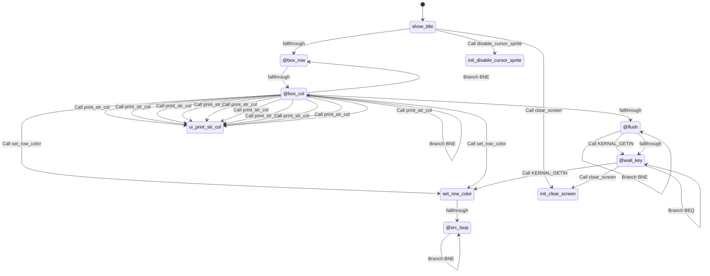

## Rendered Mermaid diagram


## State and transition documentation

### State: show_title
- Mermaid state id: `title_show_title`
- Assembly body:
```asm
jsr disable_cursor_sprite
lda #TITLE_BG_COLOR
sta split_top_bg
lda #TITLE_BORDER
sta VIC_BORDER_CLR
lda #TITLE_BG_COLOR
sta VIC_BKG_CLR0
jsr clear_screen
ldx #2
```
- Mermaid state:
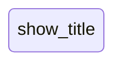
- State transitions:
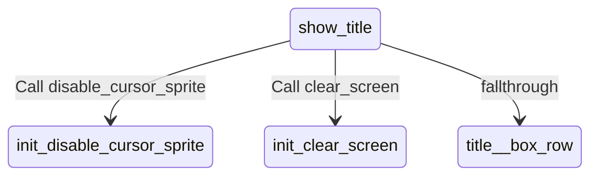

### State: @box_row
- Mermaid state id: `title__box_row`
- Assembly body:
```asm
lda mul40_lo,x
clc
adc #<COLOR_BASE
sta ptr2_lo
lda mul40_hi,x
adc #>COLOR_BASE
sta ptr2_hi
lda #COLOR_CYAN
ldy #0
```
- Mermaid state:
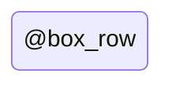
- State transitions:
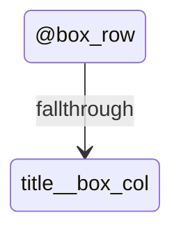

### State: @box_col
- Mermaid state id: `title__box_col`
- Assembly body:
```asm
sta (ptr2_lo),y
iny
cpy #SCREEN_COLS
bne @box_col
inx
cpx #6
bne @box_row
ldx #2
lda #0
jsr set_row_color
ldx #5
jsr set_row_color
lda #<str_title1
sta ptr_lo
lda #>str_title1
sta ptr_hi
ldx #8
ldy #3
lda #TITLE_TEXT_CLR
jsr print_str_col
lda #<str_title2
sta ptr_lo
lda #>str_title2
sta ptr_hi
ldx #7
ldy #4
lda #TITLE_SUB_CLR
jsr print_str_col
lda #<str_title3
sta ptr_lo
lda #>str_title3
sta ptr_hi
ldx #7
ldy #5
lda #COLOR_WHITE
jsr print_str_col
lda #<str_title_key
sta ptr_lo
lda #>str_title_key
sta ptr_hi
ldx #2
ldy #8
lda #TITLE_CTRL_CLR
jsr print_str_col
lda #<str_title_c1
sta ptr_lo
lda #>str_title_c1
sta ptr_hi
ldx #4
ldy #9
lda #COLOR_WHITE
jsr print_str_col
lda #<str_title_c2
sta ptr_lo
lda #>str_title_c2
sta ptr_hi
ldx #4
ldy #10
lda #COLOR_WHITE
jsr print_str_col
lda #<str_title_c3
sta ptr_lo
lda #>str_title_c3
sta ptr_hi
ldx #4
ldy #11
lda #COLOR_WHITE
jsr print_str_col
lda #<str_title_c4
sta ptr_lo
lda #>str_title_c4
sta ptr_hi
ldx #4
ldy #12
lda #COLOR_WHITE
jsr print_str_col
lda #<str_title_c5
sta ptr_lo
lda #>str_title_c5
sta ptr_hi
ldx #4
ldy #13
lda #COLOR_WHITE
jsr print_str_col
lda #<str_title4
sta ptr_lo
lda #>str_title4
sta ptr_hi
ldx #6
ldy #20
lda #COLOR_YELLOW
jsr print_str_col
```
- Mermaid state:

- State transitions:
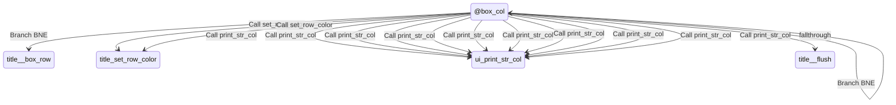

### State: @flush
- Mermaid state id: `title__flush`
- Assembly body:
```asm
jsr KERNAL_GETIN
bne @flush
```
- Mermaid state:

- State transitions:
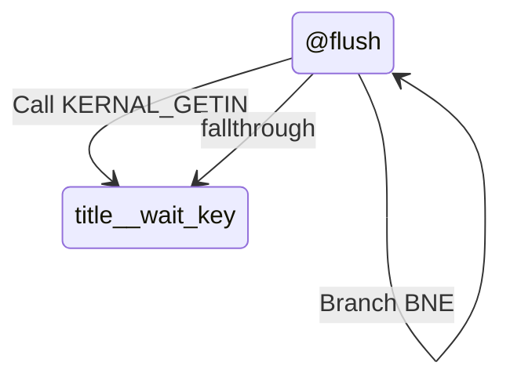

### State: @wait_key
- Mermaid state id: `title__wait_key`
- Assembly body:
```asm
jsr KERNAL_GETIN
beq @wait_key
lda #COLOR_GREEN
sta split_top_bg
lda #COLOR_BLACK
sta VIC_BORDER_CLR
lda #COLOR_GREEN
sta VIC_BKG_CLR0
jsr clear_screen
rts
```
- Mermaid state:
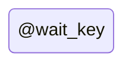
- State transitions:
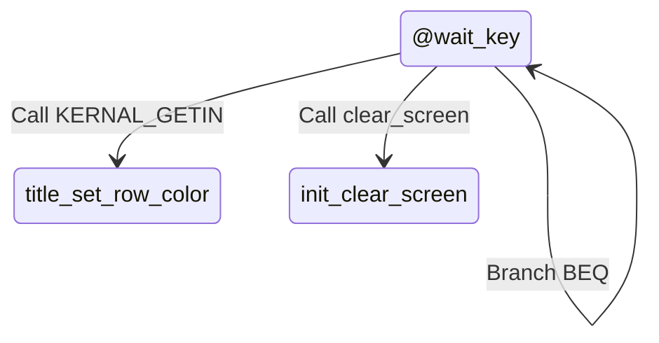

### State: set_row_color
- Mermaid state id: `title_set_row_color`
- Assembly body:
```asm
lda mul40_lo,x
clc
adc #<COLOR_BASE
sta ptr2_lo
lda mul40_hi,x
adc #>COLOR_BASE
sta ptr2_hi
lda #COLOR_BLACK
ldy #0
```
- Mermaid state:
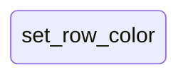
- State transitions:
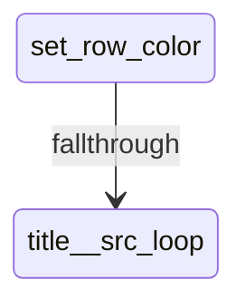

### State: @src_loop
- Mermaid state id: `title__src_loop`
- Assembly body:
```asm
sta (ptr2_lo),y
iny
cpy #SCREEN_COLS
bne @src_loop
rts
```
- Mermaid state:
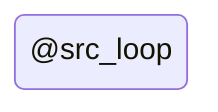
- State transitions:
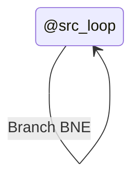

