# Assembly activity/state documentation

## Diagram
```mermaid
stateDiagram-v2
    state "print_str_col" as ui_print_str_col
    state "@psc_nc1" as ui__psc_nc1
    state "@psc_loop" as ui__psc_loop
    state "@psc_done" as ui__psc_done
    state "print_dec16" as ui_print_dec16
    state "@pd_nc1" as ui__pd_nc1
    state "@pd_loop" as ui__pd_loop
    state "@pd_sub" as ui__pd_sub
    state "@pd_do_sub" as ui__pd_do_sub
    state "@pd_emit" as ui__pd_emit
    state "fill_row_color" as ui_fill_row_color
    state "@frc_loop" as ui__frc_loop
    state "fill_row_char" as ui_fill_row_char
    state "@frch_loop" as ui__frch_loop
    state "draw_status_bar" as ui_draw_status_bar
    state "draw_mode_row" as ui_draw_mode_row
    state "@dm_demo" as ui__dm_demo
    state "@dm_print" as ui__dm_print
    state "@dm_needs" as ui__dm_needs
    state "@dm_done" as ui__dm_done
    state "draw_city_needs" as ui_draw_city_needs
    state "@dcn_jobs" as ui__dcn_jobs
    state "@dcn_housing" as ui__dcn_housing
    state "@dcn_parks" as ui__dcn_parks
    state "@dcn_safety" as ui__dcn_safety
    state "@dcn_ok" as ui__dcn_ok
    state "@dcn_done" as ui__dcn_done
    state "draw_cursor_tile_info" as ui_draw_cursor_tile_info
    state "@dcti_segment" as ui__dcti_segment
    state "@dcti_no_level" as ui__dcti_no_level
    state "@dcti_print_level" as ui__dcti_print_level
    state "get_cursor_tile_impact" as ui_get_cursor_tile_impact
    state "@gcti_road" as ui__gcti_road
    state "@gcti_house" as ui__gcti_house
    state "@gcti_factory" as ui__gcti_factory
    state "@gcti_park" as ui__gcti_park
    state "@gcti_power" as ui__gcti_power
    state "@gcti_police" as ui__gcti_police
    state "@gcti_fire" as ui__gcti_fire
    state "@gcti_zero" as ui__gcti_zero
    state "draw_cursor_tile_impact" as ui_draw_cursor_tile_impact
    state "@dcti_zero" as ui__dcti_zero
    state "@dcti_abs_ready" as ui__dcti_abs_ready
    state "@dcti_tens" as ui__dcti_tens
    state "@dcti_digits" as ui__dcti_digits
    state "@dcti_scr_ok" as ui__dcti_scr_ok
    state "@dcti_col_ok" as ui__dcti_col_ok
    state "@dcti_blank_tens" as ui__dcti_blank_tens
    state "@dcti_store_tens" as ui__dcti_store_tens
    state "menu_entry_col" as ui_menu_entry_col
    state "menu_entry_len" as ui_menu_entry_len
    state "menu_icon_col" as ui_menu_icon_col
    state "menu_icon_color" as ui_menu_icon_color
    state "color_menu_icons" as ui_color_menu_icons
    state "@cmi_loop" as ui__cmi_loop
    state "@cmi_base" as ui__cmi_base
    state "@cmi_store" as ui__cmi_store
    state "highlight_sel_building" as ui_highlight_sel_building
    state "@hsel_nc" as ui__hsel_nc
    state "@hsel_loop" as ui__hsel_loop
    state "@hsel_done" as ui__hsel_done

    [*] --> ui_print_str_col
    ui_print_str_col --> ui__psc_nc1 : Branch BCC
    ui_print_str_col --> ui__psc_nc1 : fallthrough
    ui__psc_nc1 --> ui__psc_loop : fallthrough
    ui__psc_loop --> ui__psc_done : Branch BEQ
    ui__psc_loop --> ui__psc_loop : Branch BNE
    ui__psc_loop --> ui__psc_done : fallthrough
    ui_print_dec16 --> ui__pd_nc1 : Branch BCC
    ui_print_dec16 --> ui__pd_nc1 : fallthrough
    ui__pd_nc1 --> ui__pd_loop : fallthrough
    ui__pd_loop --> ui__pd_sub : fallthrough
    ui__pd_sub --> ui__pd_emit : Branch BCC
    ui__pd_sub --> ui__pd_do_sub : Branch BNE
    ui__pd_sub --> ui__pd_emit : Branch BCC
    ui__pd_sub --> ui__pd_do_sub : fallthrough
    ui__pd_do_sub --> ui__pd_sub : Branch BNE
    ui__pd_do_sub --> ui__pd_emit : fallthrough
    ui__pd_emit --> ui__pd_loop : Branch BNE
    ui_fill_row_color --> ui__frc_loop : fallthrough
    ui__frc_loop --> ui__frc_loop : Branch BNE
    ui_fill_row_char --> ui__frch_loop : fallthrough
    ui__frch_loop --> ui__frch_loop : Branch BNE
    ui_draw_status_bar --> ui_fill_row_char : Call fill_row_char
    ui_draw_status_bar --> ui_fill_row_color : Call fill_row_color
    ui_draw_status_bar --> ui_print_str_col : Call print_str_col
    ui_draw_status_bar --> ui_highlight_sel_building : Call highlight_sel_building
    ui_draw_status_bar --> ui_color_menu_icons : Call color_menu_icons
    ui_draw_status_bar --> ui_fill_row_char : Call fill_row_char
    ui_draw_status_bar --> ui_fill_row_color : Call fill_row_color
    ui_draw_status_bar --> ui_print_str_col : Call print_str_col
    ui_draw_status_bar --> ui_print_dec16 : Call print_dec16
    ui_draw_status_bar --> ui_print_str_col : Call print_str_col
    ui_draw_status_bar --> ui_print_dec16 : Call print_dec16
    ui_draw_status_bar --> ui_print_str_col : Call print_str_col
    ui_draw_status_bar --> ui_print_dec16 : Call print_dec16
    ui_draw_status_bar --> ui_print_str_col : Call print_str_col
    ui_draw_status_bar --> ui_print_dec16 : Call print_dec16
    ui_draw_status_bar --> ui_fill_row_char : Call fill_row_char
    ui_draw_status_bar --> ui_fill_row_color : Call fill_row_color
    ui_draw_status_bar --> ui_print_str_col : Call print_str_col
    ui_draw_status_bar --> ui_print_dec16 : Call print_dec16
    ui_draw_status_bar --> ui_print_str_col : Call print_str_col
    ui_draw_status_bar --> ui_print_dec16 : Call print_dec16
    ui_draw_status_bar --> ui_print_str_col : Call print_str_col
    ui_draw_status_bar --> ui_print_dec16 : Call print_dec16
    ui_draw_status_bar --> ui_draw_cursor_tile_info : Call draw_cursor_tile_info
    ui_draw_status_bar --> ui_draw_mode_row : Call draw_mode_row
    ui_draw_status_bar --> ui_print_str_col : Call print_str_col
    ui_draw_mode_row --> ui__dm_demo : Branch BNE
    ui_draw_mode_row --> ui__dm_print : Branch BNE
    ui_draw_mode_row --> ui__dm_demo : fallthrough
    ui__dm_demo --> ui__dm_print : fallthrough
    ui__dm_print --> ui_print_str_col : Call print_str_col
    ui__dm_print --> ui__dm_needs : Branch BEQ
    ui__dm_print --> ui__dm_done : Branch BNE
    ui__dm_print --> ui__dm_needs : fallthrough
    ui__dm_needs --> ui_draw_city_needs : Call draw_city_needs
    ui__dm_needs --> ui__dm_done : fallthrough
    ui_draw_city_needs --> ui_print_str_col : Call print_str_col
    ui_draw_city_needs --> ui_print_str_col : Call print_str_col
    ui_draw_city_needs --> ui__dcn_jobs : Branch BCS
    ui_draw_city_needs --> ui_print_str_col : Call print_str_col
    ui_draw_city_needs --> ui__dcn_jobs : fallthrough
    ui__dcn_jobs --> ui__dcn_housing : Branch BEQ
    ui__dcn_jobs --> ui_print_str_col : Call print_str_col
    ui__dcn_jobs --> ui__dcn_housing : fallthrough
    ui__dcn_housing --> ui__dcn_parks : Branch BEQ
    ui__dcn_housing --> simulation_mul_by_10 : Call mul_by_10
    ui__dcn_housing --> ui__dcn_parks : Branch BCC
    ui__dcn_housing --> ui_print_str_col : Call print_str_col
    ui__dcn_housing --> ui__dcn_parks : fallthrough
    ui__dcn_parks --> ui__dcn_safety : Branch BCS
    ui__dcn_parks --> ui_print_str_col : Call print_str_col
    ui__dcn_parks --> ui__dcn_safety : fallthrough
    ui__dcn_safety --> ui__dcn_ok : Branch BCC
    ui__dcn_safety --> ui_print_str_col : Call print_str_col
    ui__dcn_safety --> ui__dcn_ok : fallthrough
    ui__dcn_ok --> ui__dcn_done : Branch BNE
    ui__dcn_ok --> ui_print_str_col : Call print_str_col
    ui__dcn_ok --> ui__dcn_done : fallthrough
    ui_draw_cursor_tile_info --> map_get_tile : Call get_tile
    ui_draw_cursor_tile_info --> ui_print_str_col : Call print_str_col
    ui_draw_cursor_tile_info --> ui__dcti_segment : Branch BEQ
    ui_draw_cursor_tile_info --> ui__dcti_segment : Branch BEQ
    ui_draw_cursor_tile_info --> ui__dcti_no_level : Branch BCC
    ui_draw_cursor_tile_info --> ui__dcti_no_level : Branch BCS
    ui_draw_cursor_tile_info --> ui__dcti_print_level : Branch BNE
    ui_draw_cursor_tile_info --> ui__dcti_segment : fallthrough
    ui__dcti_segment --> simulation_load_metric_at : Call load_metric_at
    ui__dcti_segment --> ui__dcti_print_level : Branch BNE
    ui__dcti_segment --> ui__dcti_no_level : fallthrough
    ui__dcti_no_level --> ui__dcti_print_level : fallthrough
    ui__dcti_print_level --> ui_print_str_col : Call print_str_col
    ui__dcti_print_level --> ui_get_cursor_tile_impact : Call get_cursor_tile_impact
    ui__dcti_print_level --> ui_draw_cursor_tile_impact : Call draw_cursor_tile_impact
    ui_get_cursor_tile_impact --> ui__gcti_road : Branch BEQ
    ui_get_cursor_tile_impact --> ui__gcti_house : Branch BNE
    ui_get_cursor_tile_impact --> ui__gcti_road : fallthrough
    ui__gcti_road --> buildings_get_tile_density_units : Call get_tile_density_units
    ui__gcti_house --> ui__gcti_factory : Branch BNE
    ui__gcti_house --> buildings_get_tile_density_units : Call get_tile_density_units
    ui__gcti_factory --> ui__gcti_park : Branch BNE
    ui__gcti_factory --> buildings_get_tile_density_units : Call get_tile_density_units
    ui__gcti_factory --> simulation_mul_by_10 : Call mul_by_10
    ui__gcti_factory --> simulation_mul_by_5 : Call mul_by_5
    ui__gcti_park --> ui__gcti_power : Branch BNE
    ui__gcti_park --> buildings_get_tile_density_units : Call get_tile_density_units
    ui__gcti_park --> simulation_mul_by_5 : Call mul_by_5
    ui__gcti_power --> ui__gcti_police : Branch BNE
    ui__gcti_power --> buildings_get_tile_density_units : Call get_tile_density_units
    ui__gcti_power --> simulation_mul_by_20 : Call mul_by_20
    ui__gcti_police --> ui__gcti_fire : Branch BNE
    ui__gcti_police --> buildings_get_tile_density_units : Call get_tile_density_units
    ui__gcti_police --> simulation_mul_by_10 : Call mul_by_10
    ui__gcti_fire --> ui__gcti_zero : Branch BNE
    ui__gcti_fire --> buildings_get_tile_density_units : Call get_tile_density_units
    ui__gcti_fire --> simulation_mul_by_10 : Call mul_by_10
    ui_draw_cursor_tile_impact --> ui__dcti_zero : Branch BEQ
    ui_draw_cursor_tile_impact --> ui__dcti_abs_ready : Branch BPL
    ui_draw_cursor_tile_impact --> ui__dcti_abs_ready : Branch BNE
    ui_draw_cursor_tile_impact --> ui__dcti_zero : fallthrough
    ui__dcti_zero --> ui__dcti_abs_ready : fallthrough
    ui__dcti_abs_ready --> ui__dcti_tens : fallthrough
    ui__dcti_tens --> ui__dcti_digits : Branch BCC
    ui__dcti_tens --> ui__dcti_tens : Branch BNE
    ui__dcti_tens --> ui__dcti_digits : fallthrough
    ui__dcti_digits --> ui__dcti_scr_ok : Branch BCC
    ui__dcti_digits --> ui__dcti_scr_ok : fallthrough
    ui__dcti_scr_ok --> ui__dcti_col_ok : Branch BCC
    ui__dcti_scr_ok --> ui__dcti_col_ok : fallthrough
    ui__dcti_col_ok --> ui__dcti_blank_tens : Branch BEQ
    ui__dcti_col_ok --> ui__dcti_store_tens : Branch BNE
    ui__dcti_col_ok --> ui__dcti_blank_tens : fallthrough
    ui__dcti_blank_tens --> ui__dcti_store_tens : fallthrough
    ui_menu_entry_col --> ui_menu_entry_len : fallthrough
    ui_menu_entry_len --> ui_menu_icon_col : fallthrough
    ui_menu_icon_col --> ui_menu_icon_color : fallthrough
    ui_menu_icon_color --> ui_color_menu_icons : fallthrough
    ui_color_menu_icons --> ui__cmi_loop : fallthrough
    ui__cmi_loop --> ui__cmi_base : Branch BNE
    ui__cmi_loop --> ui__cmi_store : Branch BNE
    ui__cmi_loop --> ui__cmi_base : fallthrough
    ui__cmi_base --> ui__cmi_store : fallthrough
    ui__cmi_store --> ui__cmi_loop : Branch BNE
    ui_highlight_sel_building --> ui__hsel_done : Branch BEQ
    ui_highlight_sel_building --> ui__hsel_done : Branch BCS
    ui_highlight_sel_building --> ui__hsel_nc : Branch BCC
    ui_highlight_sel_building --> ui__hsel_nc : fallthrough
    ui__hsel_nc --> ui__hsel_loop : fallthrough
    ui__hsel_loop --> ui__hsel_loop : Branch BNE
    ui__hsel_loop --> ui__hsel_done : fallthrough
```

## Rendered Mermaid diagram


## State and transition documentation

### State: print_str_col
- Mermaid state id: `ui_print_str_col`
- Assembly body:
```asm
stx tmp1
sty tmp2
and #$07
sta tmp3
ldx tmp2
lda mul40_lo,x
clc
adc #<SCREEN_BASE
sta ptr2_lo
lda mul40_hi,x
adc #>SCREEN_BASE
sta ptr2_hi
lda tmp1
clc
adc ptr2_lo
sta ptr2_lo
bcc @psc_nc1
inc ptr2_hi
```
- Mermaid state:
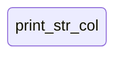
- State transitions:
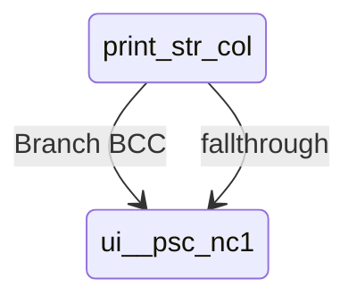

### State: @psc_nc1
- Mermaid state id: `ui__psc_nc1`
- Assembly body:
```asm
ldy #0
```
- Mermaid state:
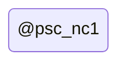
- State transitions:
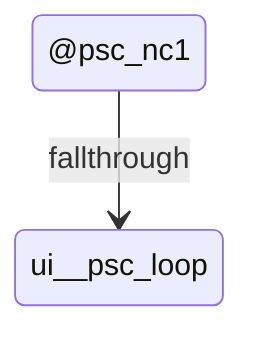

### State: @psc_loop
- Mermaid state id: `ui__psc_loop`
- Assembly body:
```asm
lda (ptr_lo),y
beq @psc_done
sta (ptr2_lo),y
lda ptr_lo
sta np_div_lo
lda ptr_hi
sta np_div_hi
lda ptr2_lo
sta ptr_lo
lda ptr2_hi
clc
adc #($D8 - $44)
sta ptr_hi
lda tmp3
sta (ptr_lo),y
lda np_div_lo
sta ptr_lo
lda np_div_hi
sta ptr_hi
iny
bne @psc_loop
```
- Mermaid state:

- State transitions:
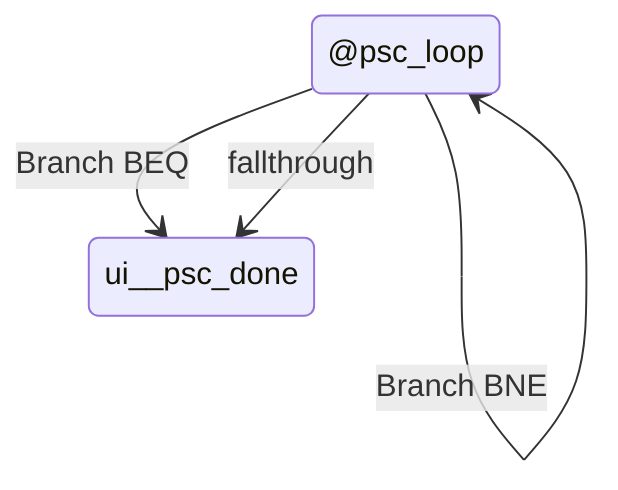

### State: @psc_done
- Mermaid state id: `ui__psc_done`
- Assembly body:
```asm
rts
```
- Mermaid state:

- State transitions:


### State: print_dec16
- Mermaid state id: `ui_print_dec16`
- Assembly body:
```asm
stx tmp1
sty tmp2
lda np_val_lo
sta np_div_lo
lda np_val_hi
sta np_div_hi
ldx tmp2
lda mul40_lo,x
clc
adc #<SCREEN_BASE
sta ptr2_lo
lda mul40_hi,x
adc #>SCREEN_BASE
sta ptr2_hi
lda tmp1
clc
adc ptr2_lo
sta ptr2_lo
bcc @pd_nc1
inc ptr2_hi
```
- Mermaid state:
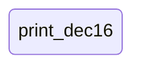
- State transitions:
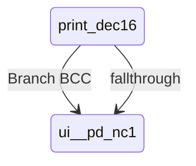

### State: @pd_nc1
- Mermaid state id: `ui__pd_nc1`
- Assembly body:
```asm
ldx #0
ldy #0
```
- Mermaid state:
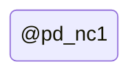
- State transitions:
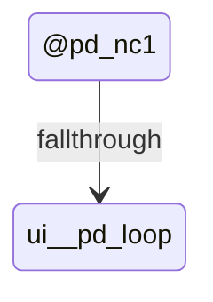

### State: @pd_loop
- Mermaid state id: `ui__pd_loop`
- Assembly body:
```asm
lda pow10_lo,x
sta tmp1
lda pow10_hi,x
sta tmp2
lda #0
sta tmp3
```
- Mermaid state:
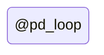
- State transitions:
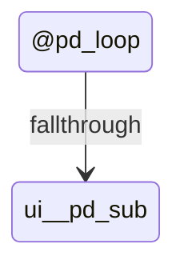

### State: @pd_sub
- Mermaid state id: `ui__pd_sub`
- Assembly body:
```asm
lda np_div_hi
cmp tmp2
bcc @pd_emit
bne @pd_do_sub
lda np_div_lo
cmp tmp1
bcc @pd_emit
```
- Mermaid state:
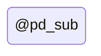
- State transitions:
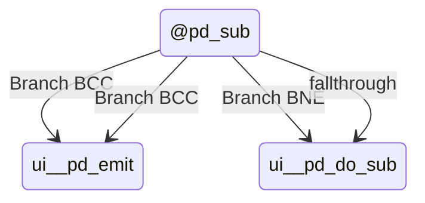

### State: @pd_do_sub
- Mermaid state id: `ui__pd_do_sub`
- Assembly body:
```asm
lda np_div_lo
sec
sbc tmp1
sta np_div_lo
lda np_div_hi
sbc tmp2
sta np_div_hi
inc tmp3
bne @pd_sub
```
- Mermaid state:
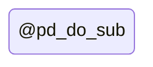
- State transitions:
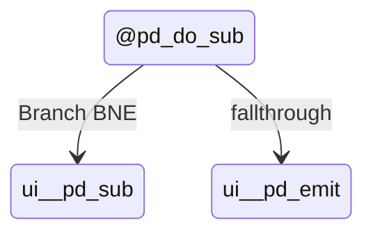

### State: @pd_emit
- Mermaid state id: `ui__pd_emit`
- Assembly body:
```asm
lda tmp3
ora #$30
sta (ptr2_lo),y
lda ptr2_hi
sta tmp4
lda ptr2_hi
clc
adc #($D8 - $44)
sta ptr2_hi
lda #COLOR_WHITE
sta (ptr2_lo),y
lda tmp4
sta ptr2_hi
iny
inx
cpx #5
bne @pd_loop
rts
```
- Mermaid state:
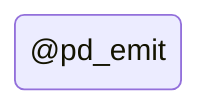
- State transitions:
```mermaid
stateDiagram-v2
    state "@pd_emit" as ui__pd_emit
    ui__pd_emit --> ui__pd_loop : Branch BNE
```

### State: fill_row_color
- Mermaid state id: `ui_fill_row_color`
- Assembly body:
```asm
sta tmp3
lda mul40_lo,x
clc
adc #<COLOR_BASE
sta ptr2_lo
lda mul40_hi,x
adc #>COLOR_BASE
sta ptr2_hi
lda tmp3
ldy #0
```
- Mermaid state:
```mermaid
stateDiagram-v2
state "fill_row_color" as ui_fill_row_color
```
- State transitions:
```mermaid
stateDiagram-v2
    state "fill_row_color" as ui_fill_row_color
    ui_fill_row_color --> ui__frc_loop : fallthrough
```

### State: @frc_loop
- Mermaid state id: `ui__frc_loop`
- Assembly body:
```asm
sta (ptr2_lo),y
iny
cpy #SCREEN_COLS
bne @frc_loop
rts
```
- Mermaid state:
```mermaid
stateDiagram-v2
state "@frc_loop" as ui__frc_loop
```
- State transitions:
```mermaid
stateDiagram-v2
    state "@frc_loop" as ui__frc_loop
    ui__frc_loop --> ui__frc_loop : Branch BNE
```

### State: fill_row_char
- Mermaid state id: `ui_fill_row_char`
- Assembly body:
```asm
sta tmp3
lda mul40_lo,x
clc
adc #<SCREEN_BASE
sta ptr2_lo
lda mul40_hi,x
adc #>SCREEN_BASE
sta ptr2_hi
lda tmp3
ldy #0
```
- Mermaid state:
```mermaid
stateDiagram-v2
state "fill_row_char" as ui_fill_row_char
```
- State transitions:
```mermaid
stateDiagram-v2
    state "fill_row_char" as ui_fill_row_char
    ui_fill_row_char --> ui__frch_loop : fallthrough
```

### State: @frch_loop
- Mermaid state id: `ui__frch_loop`
- Assembly body:
```asm
sta (ptr2_lo),y
iny
cpy #SCREEN_COLS
bne @frch_loop
rts
```
- Mermaid state:
```mermaid
stateDiagram-v2
state "@frch_loop" as ui__frch_loop
```
- State transitions:
```mermaid
stateDiagram-v2
    state "@frch_loop" as ui__frch_loop
    ui__frch_loop --> ui__frch_loop : Branch BNE
```

### State: draw_status_bar
- Mermaid state id: `ui_draw_status_bar`
- Assembly body:
```asm
ldx #UI_ROW_MENU
lda #32
jsr fill_row_char
ldx #UI_ROW_MENU
lda #COLOR_BLUE
jsr fill_row_color
lda #<str_menu
sta ptr_lo
lda #>str_menu
sta ptr_hi
ldx #0
ldy #UI_ROW_MENU
lda #COLOR_LTBLUE
jsr print_str_col
jsr highlight_sel_building
jsr color_menu_icons
ldx #UI_ROW_SEP
lda #32
jsr fill_row_char
ldx #UI_ROW_SEP
lda #COLOR_DKGRAY
jsr fill_row_color
lda #<str_pwr
sta ptr_lo
lda #>str_pwr
sta ptr_hi
ldx #0
ldy #UI_ROW_SEP
lda #COLOR_YELLOW
jsr print_str_col
lda power_avail
sta np_val_lo
lda #0
sta np_val_hi
ldx #2
ldy #UI_ROW_SEP
jsr print_dec16
lda #<str_job
sta ptr_lo
lda #>str_job
sta ptr_hi
ldx #10
ldy #UI_ROW_SEP
lda #COLOR_LTGREEN
jsr print_str_col
lda jobs_total
sta np_val_lo
lda #0
sta np_val_hi
ldx #12
ldy #UI_ROW_SEP
jsr print_dec16
lda #<str_hap
sta ptr_lo
lda #>str_hap
sta ptr_hi
ldx #20
ldy #UI_ROW_SEP
lda #COLOR_CYAN
jsr print_str_col
lda happiness
sta np_val_lo
lda #0
sta np_val_hi
ldx #22
ldy #UI_ROW_SEP
jsr print_dec16
lda #<str_crm
sta ptr_lo
lda #>str_crm
sta ptr_hi
ldx #30
ldy #UI_ROW_SEP
lda #COLOR_LTRED
jsr print_str_col
lda crime
sta np_val_lo
lda #0
sta np_val_hi
ldx #32
ldy #UI_ROW_SEP
jsr print_dec16
ldx #UI_ROW_STATS
lda #32
jsr fill_row_char
ldx #UI_ROW_STATS
lda #COLOR_WHITE
jsr fill_row_color
lda #<str_yr
sta ptr_lo
lda #>str_yr
sta ptr_hi
ldx #0
ldy #UI_ROW_STATS
lda #COLOR_YELLOW
jsr print_str_col
lda year_lo
sta np_val_lo
lda year_hi
sta np_val_hi
ldx #2
ldy #UI_ROW_STATS
jsr print_dec16
lda #<str_cash
sta ptr_lo
lda #>str_cash
sta ptr_hi
ldx #10
ldy #UI_ROW_STATS
lda #COLOR_YELLOW
jsr print_str_col
lda money_lo
sta np_val_lo
lda money_hi
sta np_val_hi
ldx #12
ldy #UI_ROW_STATS
jsr print_dec16
lda #<str_pop
sta ptr_lo
lda #>str_pop
sta ptr_hi
ldx #20
ldy #UI_ROW_STATS
lda #COLOR_YELLOW
jsr print_str_col
lda population
sta np_val_lo
lda #0
sta np_val_hi
ldx #22
ldy #UI_ROW_STATS
jsr print_dec16
jsr draw_cursor_tile_info
jsr draw_mode_row
lda #<str_help
sta ptr_lo
lda #>str_help
sta ptr_hi
ldx #0
ldy #UI_ROW_HELP
lda #COLOR_MDGRAY
jsr print_str_col
lda #0
sta dirty_ui
rts
```
- Mermaid state:
```mermaid
stateDiagram-v2
state "draw_status_bar" as ui_draw_status_bar
```
- State transitions:
```mermaid
stateDiagram-v2
    state "draw_status_bar" as ui_draw_status_bar
    ui_draw_status_bar --> ui_fill_row_char : Call fill_row_char
    ui_draw_status_bar --> ui_fill_row_color : Call fill_row_color
    ui_draw_status_bar --> ui_print_str_col : Call print_str_col
    ui_draw_status_bar --> ui_highlight_sel_building : Call highlight_sel_building
    ui_draw_status_bar --> ui_color_menu_icons : Call color_menu_icons
    ui_draw_status_bar --> ui_fill_row_char : Call fill_row_char
    ui_draw_status_bar --> ui_fill_row_color : Call fill_row_color
    ui_draw_status_bar --> ui_print_str_col : Call print_str_col
    ui_draw_status_bar --> ui_print_dec16 : Call print_dec16
    ui_draw_status_bar --> ui_print_str_col : Call print_str_col
    ui_draw_status_bar --> ui_print_dec16 : Call print_dec16
    ui_draw_status_bar --> ui_print_str_col : Call print_str_col
    ui_draw_status_bar --> ui_print_dec16 : Call print_dec16
    ui_draw_status_bar --> ui_print_str_col : Call print_str_col
    ui_draw_status_bar --> ui_print_dec16 : Call print_dec16
    ui_draw_status_bar --> ui_fill_row_char : Call fill_row_char
    ui_draw_status_bar --> ui_fill_row_color : Call fill_row_color
    ui_draw_status_bar --> ui_print_str_col : Call print_str_col
    ui_draw_status_bar --> ui_print_dec16 : Call print_dec16
    ui_draw_status_bar --> ui_print_str_col : Call print_str_col
    ui_draw_status_bar --> ui_print_dec16 : Call print_dec16
    ui_draw_status_bar --> ui_print_str_col : Call print_str_col
    ui_draw_status_bar --> ui_print_dec16 : Call print_dec16
    ui_draw_status_bar --> ui_draw_cursor_tile_info : Call draw_cursor_tile_info
    ui_draw_status_bar --> ui_draw_mode_row : Call draw_mode_row
    ui_draw_status_bar --> ui_print_str_col : Call print_str_col
```

### State: draw_mode_row
- Mermaid state id: `ui_draw_mode_row`
- Assembly body:
```asm
lda game_mode
bne @dm_demo
lda #<str_mode_build
sta ptr_lo
lda #>str_mode_build
sta ptr_hi
bne @dm_print
```
- Mermaid state:
```mermaid
stateDiagram-v2
state "draw_mode_row" as ui_draw_mode_row
```
- State transitions:
```mermaid
stateDiagram-v2
    state "draw_mode_row" as ui_draw_mode_row
    ui_draw_mode_row --> ui__dm_demo : Branch BNE
    ui_draw_mode_row --> ui__dm_print : Branch BNE
    ui_draw_mode_row --> ui__dm_demo : fallthrough
```

### State: @dm_demo
- Mermaid state id: `ui__dm_demo`
- Assembly body:
```asm
lda #<str_mode_demo
sta ptr_lo
lda #>str_mode_demo
sta ptr_hi
```
- Mermaid state:
```mermaid
stateDiagram-v2
state "@dm_demo" as ui__dm_demo
```
- State transitions:
```mermaid
stateDiagram-v2
    state "@dm_demo" as ui__dm_demo
    ui__dm_demo --> ui__dm_print : fallthrough
```

### State: @dm_print
- Mermaid state id: `ui__dm_print`
- Assembly body:
```asm
ldx #0
ldy #UI_ROW_MSG
lda #COLOR_CYAN
jsr print_str_col
lda msg_timer
beq @dm_needs
dec msg_timer
bne @dm_done
```
- Mermaid state:
```mermaid
stateDiagram-v2
state "@dm_print" as ui__dm_print
```
- State transitions:
```mermaid
stateDiagram-v2
    state "@dm_print" as ui__dm_print
    ui__dm_print --> ui_print_str_col : Call print_str_col
    ui__dm_print --> ui__dm_needs : Branch BEQ
    ui__dm_print --> ui__dm_done : Branch BNE
    ui__dm_print --> ui__dm_needs : fallthrough
```

### State: @dm_needs
- Mermaid state id: `ui__dm_needs`
- Assembly body:
```asm
jsr draw_city_needs
```
- Mermaid state:
```mermaid
stateDiagram-v2
state "@dm_needs" as ui__dm_needs
```
- State transitions:
```mermaid
stateDiagram-v2
    state "@dm_needs" as ui__dm_needs
    ui__dm_needs --> ui_draw_city_needs : Call draw_city_needs
    ui__dm_needs --> ui__dm_done : fallthrough
```

### State: @dm_done
- Mermaid state id: `ui__dm_done`
- Assembly body:
```asm
rts
```
- Mermaid state:
```mermaid
stateDiagram-v2
state "@dm_done" as ui__dm_done
```
- State transitions:
```mermaid
stateDiagram-v2
    state "@dm_done" as ui__dm_done
```

### State: draw_city_needs
- Mermaid state id: `ui_draw_city_needs`
- Assembly body:
```asm
lda #<str_msg_empty
sta ptr_lo
lda #>str_msg_empty
sta ptr_hi
ldx #11
ldy #UI_ROW_MSG
lda #COLOR_WHITE
jsr print_str_col
lda #<str_needs_hdr
sta ptr_lo
lda #>str_needs_hdr
sta ptr_hi
ldx #11
ldy #UI_ROW_MSG
lda #COLOR_MDGRAY
jsr print_str_col
lda #0
sta tmp1
lda power_avail
cmp power_needed
bcs @dcn_jobs
lda #<str_need_pwr
sta ptr_lo
lda #>str_need_pwr
sta ptr_hi
ldx #18
ldy #UI_ROW_MSG
lda #COLOR_ORANGE
jsr print_str_col
lda #1
sta tmp1
```
- Mermaid state:
```mermaid
stateDiagram-v2
state "draw_city_needs" as ui_draw_city_needs
```
- State transitions:
```mermaid
stateDiagram-v2
    state "draw_city_needs" as ui_draw_city_needs
    ui_draw_city_needs --> ui_print_str_col : Call print_str_col
    ui_draw_city_needs --> ui_print_str_col : Call print_str_col
    ui_draw_city_needs --> ui__dcn_jobs : Branch BCS
    ui_draw_city_needs --> ui_print_str_col : Call print_str_col
    ui_draw_city_needs --> ui__dcn_jobs : fallthrough
```

### State: @dcn_jobs
- Mermaid state id: `ui__dcn_jobs`
- Assembly body:
```asm
lda employed_pop
cmp population
beq @dcn_housing
lda #<str_need_job
sta ptr_lo
lda #>str_need_job
sta ptr_hi
ldx #22
ldy #UI_ROW_MSG
lda #COLOR_YELLOW
jsr print_str_col
lda #1
sta tmp1
```
- Mermaid state:
```mermaid
stateDiagram-v2
state "@dcn_jobs" as ui__dcn_jobs
```
- State transitions:
```mermaid
stateDiagram-v2
    state "@dcn_jobs" as ui__dcn_jobs
    ui__dcn_jobs --> ui__dcn_housing : Branch BEQ
    ui__dcn_jobs --> ui_print_str_col : Call print_str_col
    ui__dcn_jobs --> ui__dcn_housing : fallthrough
```

### State: @dcn_housing
- Mermaid state id: `ui__dcn_housing`
- Assembly body:
```asm
lda population
beq @dcn_parks
lda cnt_houses
jsr mul_by_10
sta tmp2
lda population
cmp tmp2
bcc @dcn_parks
lda #<str_need_hse
sta ptr_lo
lda #>str_need_hse
sta ptr_hi
ldx #26
ldy #UI_ROW_MSG
lda #COLOR_CYAN
jsr print_str_col
lda #1
sta tmp1
```
- Mermaid state:
```mermaid
stateDiagram-v2
state "@dcn_housing" as ui__dcn_housing
```
- State transitions:
```mermaid
stateDiagram-v2
    state "@dcn_housing" as ui__dcn_housing
    ui__dcn_housing --> ui__dcn_parks : Branch BEQ
    ui__dcn_housing --> simulation_mul_by_10 : Call mul_by_10
    ui__dcn_housing --> ui__dcn_parks : Branch BCC
    ui__dcn_housing --> ui_print_str_col : Call print_str_col
    ui__dcn_housing --> ui__dcn_parks : fallthrough
```

### State: @dcn_parks
- Mermaid state id: `ui__dcn_parks`
- Assembly body:
```asm
lda happiness
cmp #45
bcs @dcn_safety
lda #<str_need_prk
sta ptr_lo
lda #>str_need_prk
sta ptr_hi
ldx #30
ldy #UI_ROW_MSG
lda #COLOR_LTGREEN
jsr print_str_col
lda #1
sta tmp1
```
- Mermaid state:
```mermaid
stateDiagram-v2
state "@dcn_parks" as ui__dcn_parks
```
- State transitions:
```mermaid
stateDiagram-v2
    state "@dcn_parks" as ui__dcn_parks
    ui__dcn_parks --> ui__dcn_safety : Branch BCS
    ui__dcn_parks --> ui_print_str_col : Call print_str_col
    ui__dcn_parks --> ui__dcn_safety : fallthrough
```

### State: @dcn_safety
- Mermaid state id: `ui__dcn_safety`
- Assembly body:
```asm
lda crime
cmp #35
bcc @dcn_ok
lda #<str_need_saf
sta ptr_lo
lda #>str_need_saf
sta ptr_hi
ldx #34
ldy #UI_ROW_MSG
lda #COLOR_LTRED
jsr print_str_col
lda #1
sta tmp1
```
- Mermaid state:
```mermaid
stateDiagram-v2
state "@dcn_safety" as ui__dcn_safety
```
- State transitions:
```mermaid
stateDiagram-v2
    state "@dcn_safety" as ui__dcn_safety
    ui__dcn_safety --> ui__dcn_ok : Branch BCC
    ui__dcn_safety --> ui_print_str_col : Call print_str_col
    ui__dcn_safety --> ui__dcn_ok : fallthrough
```

### State: @dcn_ok
- Mermaid state id: `ui__dcn_ok`
- Assembly body:
```asm
lda tmp1
bne @dcn_done
lda #<str_need_ok
sta ptr_lo
lda #>str_need_ok
sta ptr_hi
ldx #18
ldy #UI_ROW_MSG
lda #COLOR_LTGREEN
jsr print_str_col
```
- Mermaid state:
```mermaid
stateDiagram-v2
state "@dcn_ok" as ui__dcn_ok
```
- State transitions:
```mermaid
stateDiagram-v2
    state "@dcn_ok" as ui__dcn_ok
    ui__dcn_ok --> ui__dcn_done : Branch BNE
    ui__dcn_ok --> ui_print_str_col : Call print_str_col
    ui__dcn_ok --> ui__dcn_done : fallthrough
```

### State: @dcn_done
- Mermaid state id: `ui__dcn_done`
- Assembly body:
```asm
rts
```
- Mermaid state:
```mermaid
stateDiagram-v2
state "@dcn_done" as ui__dcn_done
```
- State transitions:
```mermaid
stateDiagram-v2
    state "@dcn_done" as ui__dcn_done
```

### State: draw_cursor_tile_info
- Mermaid state id: `ui_draw_cursor_tile_info`
- Assembly body:
```asm
lda cursor_x
ldx cursor_y
jsr get_tile
sta tmp4
and #TILE_TYPE_MASK
asl
tax
lda hud_tile_names,x
sta ptr_lo
lda hud_tile_names+1,x
sta ptr_hi
ldx #29
ldy #UI_ROW_STATS
lda #COLOR_CYAN
jsr print_str_col
lda tmp4
and #TILE_TYPE_MASK
sta tmp3
cmp #TILE_ROAD
beq @dcti_segment
cmp #TILE_BRIDGE
beq @dcti_segment
lda tmp3
cmp #TILE_ROAD
bcc @dcti_no_level
cmp #TILE_BRIDGE + 1
bcs @dcti_no_level
lda tmp4
and #TILE_DENSITY_MASK
lsr
lsr
lsr
lsr
asl
tax
lda hud_level_names,x
sta ptr_lo
lda hud_level_names+1,x
sta ptr_hi
bne @dcti_print_level
```
- Mermaid state:
```mermaid
stateDiagram-v2
state "draw_cursor_tile_info" as ui_draw_cursor_tile_info
```
- State transitions:
```mermaid
stateDiagram-v2
    state "draw_cursor_tile_info" as ui_draw_cursor_tile_info
    ui_draw_cursor_tile_info --> map_get_tile : Call get_tile
    ui_draw_cursor_tile_info --> ui_print_str_col : Call print_str_col
    ui_draw_cursor_tile_info --> ui__dcti_segment : Branch BEQ
    ui_draw_cursor_tile_info --> ui__dcti_segment : Branch BEQ
    ui_draw_cursor_tile_info --> ui__dcti_no_level : Branch BCC
    ui_draw_cursor_tile_info --> ui__dcti_no_level : Branch BCS
    ui_draw_cursor_tile_info --> ui__dcti_print_level : Branch BNE
    ui_draw_cursor_tile_info --> ui__dcti_segment : fallthrough
```

### State: @dcti_segment
- Mermaid state id: `ui__dcti_segment`
- Assembly body:
```asm
lda #<road_component_map
sta ptr2_lo
lda #>road_component_map
sta ptr2_hi
lda cursor_x
sta tmp1
lda cursor_y
sta tmp2
jsr load_metric_at
asl
tax
lda hud_segment_names,x
sta ptr_lo
lda hud_segment_names+1,x
sta ptr_hi
bne @dcti_print_level
```
- Mermaid state:
```mermaid
stateDiagram-v2
state "@dcti_segment" as ui__dcti_segment
```
- State transitions:
```mermaid
stateDiagram-v2
    state "@dcti_segment" as ui__dcti_segment
    ui__dcti_segment --> simulation_load_metric_at : Call load_metric_at
    ui__dcti_segment --> ui__dcti_print_level : Branch BNE
    ui__dcti_segment --> ui__dcti_no_level : fallthrough
```

### State: @dcti_no_level
- Mermaid state id: `ui__dcti_no_level`
- Assembly body:
```asm
lda #<str_lvl_na
sta ptr_lo
lda #>str_lvl_na
sta ptr_hi
```
- Mermaid state:
```mermaid
stateDiagram-v2
state "@dcti_no_level" as ui__dcti_no_level
```
- State transitions:
```mermaid
stateDiagram-v2
    state "@dcti_no_level" as ui__dcti_no_level
    ui__dcti_no_level --> ui__dcti_print_level : fallthrough
```

### State: @dcti_print_level
- Mermaid state id: `ui__dcti_print_level`
- Assembly body:
```asm
ldx #34
ldy #UI_ROW_STATS
lda #COLOR_LTBLUE
jsr print_str_col
lda tmp4
jsr get_cursor_tile_impact
jsr draw_cursor_tile_impact
rts
```
- Mermaid state:
```mermaid
stateDiagram-v2
state "@dcti_print_level" as ui__dcti_print_level
```
- State transitions:
```mermaid
stateDiagram-v2
    state "@dcti_print_level" as ui__dcti_print_level
    ui__dcti_print_level --> ui_print_str_col : Call print_str_col
    ui__dcti_print_level --> ui_get_cursor_tile_impact : Call get_cursor_tile_impact
    ui__dcti_print_level --> ui_draw_cursor_tile_impact : Call draw_cursor_tile_impact
```

### State: get_cursor_tile_impact
- Mermaid state id: `ui_get_cursor_tile_impact`
- Assembly body:
```asm
sta tmp2
and #TILE_TYPE_MASK
tax
cpx #TILE_ROAD
beq @gcti_road
cpx #TILE_BRIDGE
bne @gcti_house
```
- Mermaid state:
```mermaid
stateDiagram-v2
state "get_cursor_tile_impact" as ui_get_cursor_tile_impact
```
- State transitions:
```mermaid
stateDiagram-v2
    state "get_cursor_tile_impact" as ui_get_cursor_tile_impact
    ui_get_cursor_tile_impact --> ui__gcti_road : Branch BEQ
    ui_get_cursor_tile_impact --> ui__gcti_house : Branch BNE
    ui_get_cursor_tile_impact --> ui__gcti_road : fallthrough
```

### State: @gcti_road
- Mermaid state id: `ui__gcti_road`
- Assembly body:
```asm
lda tmp2
jsr get_tile_density_units
eor #$FF
clc
adc #1
rts
```
- Mermaid state:
```mermaid
stateDiagram-v2
state "@gcti_road" as ui__gcti_road
```
- State transitions:
```mermaid
stateDiagram-v2
    state "@gcti_road" as ui__gcti_road
    ui__gcti_road --> buildings_get_tile_density_units : Call get_tile_density_units
```

### State: @gcti_house
- Mermaid state id: `ui__gcti_house`
- Assembly body:
```asm
cpx #TILE_HOUSE
bne @gcti_factory
lda tmp2
jsr get_tile_density_units
rts
```
- Mermaid state:
```mermaid
stateDiagram-v2
state "@gcti_house" as ui__gcti_house
```
- State transitions:
```mermaid
stateDiagram-v2
    state "@gcti_house" as ui__gcti_house
    ui__gcti_house --> ui__gcti_factory : Branch BNE
    ui__gcti_house --> buildings_get_tile_density_units : Call get_tile_density_units
```

### State: @gcti_factory
- Mermaid state id: `ui__gcti_factory`
- Assembly body:
```asm
cpx #TILE_FACTORY
bne @gcti_park
lda tmp2
jsr get_tile_density_units
sta tmp4
jsr mul_by_10
sta tmp1
lda tmp4
jsr mul_by_5
clc
adc tmp1
rts
```
- Mermaid state:
```mermaid
stateDiagram-v2
state "@gcti_factory" as ui__gcti_factory
```
- State transitions:
```mermaid
stateDiagram-v2
    state "@gcti_factory" as ui__gcti_factory
    ui__gcti_factory --> ui__gcti_park : Branch BNE
    ui__gcti_factory --> buildings_get_tile_density_units : Call get_tile_density_units
    ui__gcti_factory --> simulation_mul_by_10 : Call mul_by_10
    ui__gcti_factory --> simulation_mul_by_5 : Call mul_by_5
```

### State: @gcti_park
- Mermaid state id: `ui__gcti_park`
- Assembly body:
```asm
cpx #TILE_PARK
bne @gcti_power
lda tmp2
jsr get_tile_density_units
jsr mul_by_5
eor #$FF
clc
adc #1
rts
```
- Mermaid state:
```mermaid
stateDiagram-v2
state "@gcti_park" as ui__gcti_park
```
- State transitions:
```mermaid
stateDiagram-v2
    state "@gcti_park" as ui__gcti_park
    ui__gcti_park --> ui__gcti_power : Branch BNE
    ui__gcti_park --> buildings_get_tile_density_units : Call get_tile_density_units
    ui__gcti_park --> simulation_mul_by_5 : Call mul_by_5
```

### State: @gcti_power
- Mermaid state id: `ui__gcti_power`
- Assembly body:
```asm
cpx #TILE_POWER
bne @gcti_police
lda tmp2
jsr get_tile_density_units
jsr mul_by_20
eor #$FF
clc
adc #1
rts
```
- Mermaid state:
```mermaid
stateDiagram-v2
state "@gcti_power" as ui__gcti_power
```
- State transitions:
```mermaid
stateDiagram-v2
    state "@gcti_power" as ui__gcti_power
    ui__gcti_power --> ui__gcti_police : Branch BNE
    ui__gcti_power --> buildings_get_tile_density_units : Call get_tile_density_units
    ui__gcti_power --> simulation_mul_by_20 : Call mul_by_20
```

### State: @gcti_police
- Mermaid state id: `ui__gcti_police`
- Assembly body:
```asm
cpx #TILE_POLICE
bne @gcti_fire
lda tmp2
jsr get_tile_density_units
jsr mul_by_10
eor #$FF
clc
adc #1
rts
```
- Mermaid state:
```mermaid
stateDiagram-v2
state "@gcti_police" as ui__gcti_police
```
- State transitions:
```mermaid
stateDiagram-v2
    state "@gcti_police" as ui__gcti_police
    ui__gcti_police --> ui__gcti_fire : Branch BNE
    ui__gcti_police --> buildings_get_tile_density_units : Call get_tile_density_units
    ui__gcti_police --> simulation_mul_by_10 : Call mul_by_10
```

### State: @gcti_fire
- Mermaid state id: `ui__gcti_fire`
- Assembly body:
```asm
cpx #TILE_FIRE
bne @gcti_zero
lda tmp2
jsr get_tile_density_units
jsr mul_by_10
eor #$FF
clc
adc #1
rts
```
- Mermaid state:
```mermaid
stateDiagram-v2
state "@gcti_fire" as ui__gcti_fire
```
- State transitions:
```mermaid
stateDiagram-v2
    state "@gcti_fire" as ui__gcti_fire
    ui__gcti_fire --> ui__gcti_zero : Branch BNE
    ui__gcti_fire --> buildings_get_tile_density_units : Call get_tile_density_units
    ui__gcti_fire --> simulation_mul_by_10 : Call mul_by_10
```

### State: @gcti_zero
- Mermaid state id: `ui__gcti_zero`
- Assembly body:
```asm
lda #0
rts
```
- Mermaid state:
```mermaid
stateDiagram-v2
state "@gcti_zero" as ui__gcti_zero
```
- State transitions:
```mermaid
stateDiagram-v2
    state "@gcti_zero" as ui__gcti_zero
```

### State: draw_cursor_tile_impact
- Mermaid state id: `ui_draw_cursor_tile_impact`
- Assembly body:
```asm
sta tmp4
lda #43
sta tmp1
lda #COLOR_LTGREEN
sta tmp2
lda tmp4
beq @dcti_zero
bpl @dcti_abs_ready
lda #45
sta tmp1
lda #COLOR_LTRED
sta tmp2
lda tmp4
eor #$FF
clc
adc #1
bne @dcti_abs_ready
```
- Mermaid state:
```mermaid
stateDiagram-v2
state "draw_cursor_tile_impact" as ui_draw_cursor_tile_impact
```
- State transitions:
```mermaid
stateDiagram-v2
    state "draw_cursor_tile_impact" as ui_draw_cursor_tile_impact
    ui_draw_cursor_tile_impact --> ui__dcti_zero : Branch BEQ
    ui_draw_cursor_tile_impact --> ui__dcti_abs_ready : Branch BPL
    ui_draw_cursor_tile_impact --> ui__dcti_abs_ready : Branch BNE
    ui_draw_cursor_tile_impact --> ui__dcti_zero : fallthrough
```

### State: @dcti_zero
- Mermaid state id: `ui__dcti_zero`
- Assembly body:
```asm
lda #COLOR_WHITE
sta tmp2
lda #0
```
- Mermaid state:
```mermaid
stateDiagram-v2
state "@dcti_zero" as ui__dcti_zero
```
- State transitions:
```mermaid
stateDiagram-v2
    state "@dcti_zero" as ui__dcti_zero
    ui__dcti_zero --> ui__dcti_abs_ready : fallthrough
```

### State: @dcti_abs_ready
- Mermaid state id: `ui__dcti_abs_ready`
- Assembly body:
```asm
ldx #0
```
- Mermaid state:
```mermaid
stateDiagram-v2
state "@dcti_abs_ready" as ui__dcti_abs_ready
```
- State transitions:
```mermaid
stateDiagram-v2
    state "@dcti_abs_ready" as ui__dcti_abs_ready
    ui__dcti_abs_ready --> ui__dcti_tens : fallthrough
```

### State: @dcti_tens
- Mermaid state id: `ui__dcti_tens`
- Assembly body:
```asm
cmp #10
bcc @dcti_digits
sec
sbc #10
inx
bne @dcti_tens
```
- Mermaid state:
```mermaid
stateDiagram-v2
state "@dcti_tens" as ui__dcti_tens
```
- State transitions:
```mermaid
stateDiagram-v2
    state "@dcti_tens" as ui__dcti_tens
    ui__dcti_tens --> ui__dcti_digits : Branch BCC
    ui__dcti_tens --> ui__dcti_tens : Branch BNE
    ui__dcti_tens --> ui__dcti_digits : fallthrough
```

### State: @dcti_digits
- Mermaid state id: `ui__dcti_digits`
- Assembly body:
```asm
sta tmp3
stx np_div_lo
ldy #UI_ROW_STATS
lda mul40_lo,y
clc
adc #<SCREEN_BASE
sta ptr2_lo
lda mul40_hi,y
adc #>SCREEN_BASE
sta ptr2_hi
lda ptr2_lo
clc
adc #37
sta ptr2_lo
bcc @dcti_scr_ok
inc ptr2_hi
```
- Mermaid state:
```mermaid
stateDiagram-v2
state "@dcti_digits" as ui__dcti_digits
```
- State transitions:
```mermaid
stateDiagram-v2
    state "@dcti_digits" as ui__dcti_digits
    ui__dcti_digits --> ui__dcti_scr_ok : Branch BCC
    ui__dcti_digits --> ui__dcti_scr_ok : fallthrough
```

### State: @dcti_scr_ok
- Mermaid state id: `ui__dcti_scr_ok`
- Assembly body:
```asm
ldy #UI_ROW_STATS
lda mul40_lo,y
clc
adc #<COLOR_BASE
sta ptr_lo
lda mul40_hi,y
adc #>COLOR_BASE
sta ptr_hi
lda ptr_lo
clc
adc #37
sta ptr_lo
bcc @dcti_col_ok
inc ptr_hi
```
- Mermaid state:
```mermaid
stateDiagram-v2
state "@dcti_scr_ok" as ui__dcti_scr_ok
```
- State transitions:
```mermaid
stateDiagram-v2
    state "@dcti_scr_ok" as ui__dcti_scr_ok
    ui__dcti_scr_ok --> ui__dcti_col_ok : Branch BCC
    ui__dcti_scr_ok --> ui__dcti_col_ok : fallthrough
```

### State: @dcti_col_ok
- Mermaid state id: `ui__dcti_col_ok`
- Assembly body:
```asm
ldy #0
lda tmp1
sta (ptr2_lo),y
lda tmp2
sta (ptr_lo),y
iny
lda np_div_lo
beq @dcti_blank_tens
clc
adc #$30
bne @dcti_store_tens
```
- Mermaid state:
```mermaid
stateDiagram-v2
state "@dcti_col_ok" as ui__dcti_col_ok
```
- State transitions:
```mermaid
stateDiagram-v2
    state "@dcti_col_ok" as ui__dcti_col_ok
    ui__dcti_col_ok --> ui__dcti_blank_tens : Branch BEQ
    ui__dcti_col_ok --> ui__dcti_store_tens : Branch BNE
    ui__dcti_col_ok --> ui__dcti_blank_tens : fallthrough
```

### State: @dcti_blank_tens
- Mermaid state id: `ui__dcti_blank_tens`
- Assembly body:
```asm
lda #32
```
- Mermaid state:
```mermaid
stateDiagram-v2
state "@dcti_blank_tens" as ui__dcti_blank_tens
```
- State transitions:
```mermaid
stateDiagram-v2
    state "@dcti_blank_tens" as ui__dcti_blank_tens
    ui__dcti_blank_tens --> ui__dcti_store_tens : fallthrough
```

### State: @dcti_store_tens
- Mermaid state id: `ui__dcti_store_tens`
- Assembly body:
```asm
sta (ptr2_lo),y
lda tmp2
sta (ptr_lo),y
iny
lda tmp3
clc
adc #$30
sta (ptr2_lo),y
lda tmp2
sta (ptr_lo),y
rts
.segment "RODATA"
```
- Mermaid state:
```mermaid
stateDiagram-v2
state "@dcti_store_tens" as ui__dcti_store_tens
```
- State transitions:
```mermaid
stateDiagram-v2
    state "@dcti_store_tens" as ui__dcti_store_tens
```

### State: menu_entry_col
- Mermaid state id: `ui_menu_entry_col`
- Assembly body:
```asm
.byte 0, 5, 11, 17, 23, 29, 35
```
- Mermaid state:
```mermaid
stateDiagram-v2
state "menu_entry_col" as ui_menu_entry_col
```
- State transitions:
```mermaid
stateDiagram-v2
    state "menu_entry_col" as ui_menu_entry_col
    ui_menu_entry_col --> ui_menu_entry_len : fallthrough
```

### State: menu_entry_len
- Mermaid state id: `ui_menu_entry_len`
- Assembly body:
```asm
.byte 4, 5,  5,  5,  5,  5,  5
```
- Mermaid state:
```mermaid
stateDiagram-v2
state "menu_entry_len" as ui_menu_entry_len
```
- State transitions:
```mermaid
stateDiagram-v2
    state "menu_entry_len" as ui_menu_entry_len
    ui_menu_entry_len --> ui_menu_icon_col : fallthrough
```

### State: menu_icon_col
- Mermaid state id: `ui_menu_icon_col`
- Assembly body:
```asm
.byte 2, 7, 13, 19, 25, 31, 37
```
- Mermaid state:
```mermaid
stateDiagram-v2
state "menu_icon_col" as ui_menu_icon_col
```
- State transitions:
```mermaid
stateDiagram-v2
    state "menu_icon_col" as ui_menu_icon_col
    ui_menu_icon_col --> ui_menu_icon_color : fallthrough
```

### State: menu_icon_color
- Mermaid state id: `ui_menu_icon_color`
- Assembly body:
```asm
.byte MC_CHAR_FLAG + COLOR_WHITE
.byte MC_CHAR_FLAG + COLOR_YELLOW
.byte MC_CHAR_FLAG + COLOR_RED
.byte MC_CHAR_FLAG + COLOR_GREEN
.byte MC_CHAR_FLAG + COLOR_CYAN
.byte MC_CHAR_FLAG + COLOR_BLUE
.byte MC_CHAR_FLAG + COLOR_RED
.segment "CODE"
```
- Mermaid state:
```mermaid
stateDiagram-v2
state "menu_icon_color" as ui_menu_icon_color
```
- State transitions:
```mermaid
stateDiagram-v2
    state "menu_icon_color" as ui_menu_icon_color
    ui_menu_icon_color --> ui_color_menu_icons : fallthrough
```

### State: color_menu_icons
- Mermaid state id: `ui_color_menu_icons`
- Assembly body:
```asm
ldy #UI_ROW_MENU
lda mul40_lo,y
clc
adc #<COLOR_BASE
sta ptr2_lo
lda mul40_hi,y
adc #>COLOR_BASE
sta ptr2_hi
ldx #0
```
- Mermaid state:
```mermaid
stateDiagram-v2
state "color_menu_icons" as ui_color_menu_icons
```
- State transitions:
```mermaid
stateDiagram-v2
    state "color_menu_icons" as ui_color_menu_icons
    ui_color_menu_icons --> ui__cmi_loop : fallthrough
```

### State: @cmi_loop
- Mermaid state id: `ui__cmi_loop`
- Assembly body:
```asm
txa
clc
adc #1
cmp sel_building
bne @cmi_base
lda #(MC_CHAR_FLAG + COLOR_YELLOW)
bne @cmi_store
```
- Mermaid state:
```mermaid
stateDiagram-v2
state "@cmi_loop" as ui__cmi_loop
```
- State transitions:
```mermaid
stateDiagram-v2
    state "@cmi_loop" as ui__cmi_loop
    ui__cmi_loop --> ui__cmi_base : Branch BNE
    ui__cmi_loop --> ui__cmi_store : Branch BNE
    ui__cmi_loop --> ui__cmi_base : fallthrough
```

### State: @cmi_base
- Mermaid state id: `ui__cmi_base`
- Assembly body:
```asm
lda menu_icon_color,x
```
- Mermaid state:
```mermaid
stateDiagram-v2
state "@cmi_base" as ui__cmi_base
```
- State transitions:
```mermaid
stateDiagram-v2
    state "@cmi_base" as ui__cmi_base
    ui__cmi_base --> ui__cmi_store : fallthrough
```

### State: @cmi_store
- Mermaid state id: `ui__cmi_store`
- Assembly body:
```asm
ldy menu_icon_col,x
sta (ptr2_lo),y
inx
cpx #7
bne @cmi_loop
rts
```
- Mermaid state:
```mermaid
stateDiagram-v2
state "@cmi_store" as ui__cmi_store
```
- State transitions:
```mermaid
stateDiagram-v2
    state "@cmi_store" as ui__cmi_store
    ui__cmi_store --> ui__cmi_loop : Branch BNE
```

### State: highlight_sel_building
- Mermaid state id: `ui_highlight_sel_building`
- Assembly body:
```asm
lda sel_building
beq @hsel_done
cmp #8
bcs @hsel_done
tax
dex
lda menu_entry_col,x
sta tmp1
lda menu_entry_len,x
sta tmp2
ldy #UI_ROW_MENU
lda mul40_lo,y
clc
adc #<COLOR_BASE
sta ptr2_lo
lda mul40_hi,y
adc #>COLOR_BASE
sta ptr2_hi
lda tmp1
clc
adc ptr2_lo
sta ptr2_lo
bcc @hsel_nc
inc ptr2_hi
```
- Mermaid state:
```mermaid
stateDiagram-v2
state "highlight_sel_building" as ui_highlight_sel_building
```
- State transitions:
```mermaid
stateDiagram-v2
    state "highlight_sel_building" as ui_highlight_sel_building
    ui_highlight_sel_building --> ui__hsel_done : Branch BEQ
    ui_highlight_sel_building --> ui__hsel_done : Branch BCS
    ui_highlight_sel_building --> ui__hsel_nc : Branch BCC
    ui_highlight_sel_building --> ui__hsel_nc : fallthrough
```

### State: @hsel_nc
- Mermaid state id: `ui__hsel_nc`
- Assembly body:
```asm
ldy #0
lda tmp2
sta tmp3
lda #COLOR_YELLOW
```
- Mermaid state:
```mermaid
stateDiagram-v2
state "@hsel_nc" as ui__hsel_nc
```
- State transitions:
```mermaid
stateDiagram-v2
    state "@hsel_nc" as ui__hsel_nc
    ui__hsel_nc --> ui__hsel_loop : fallthrough
```

### State: @hsel_loop
- Mermaid state id: `ui__hsel_loop`
- Assembly body:
```asm
sta (ptr2_lo),y
iny
dec tmp3
bne @hsel_loop
```
- Mermaid state:
```mermaid
stateDiagram-v2
state "@hsel_loop" as ui__hsel_loop
```
- State transitions:
```mermaid
stateDiagram-v2
    state "@hsel_loop" as ui__hsel_loop
    ui__hsel_loop --> ui__hsel_loop : Branch BNE
    ui__hsel_loop --> ui__hsel_done : fallthrough
```

### State: @hsel_done
- Mermaid state id: `ui__hsel_done`
- Assembly body:
```asm
rts
```
- Mermaid state:
```mermaid
stateDiagram-v2
state "@hsel_done" as ui__hsel_done
```
- State transitions:
```mermaid
stateDiagram-v2
    state "@hsel_done" as ui__hsel_done
```

